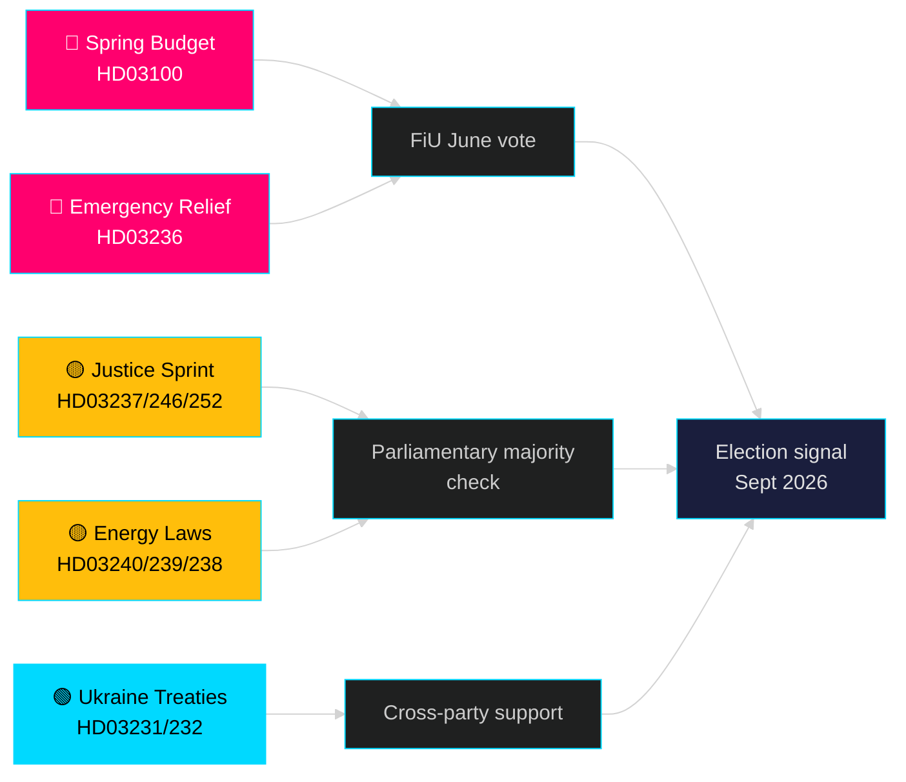

# Måneden fremover — mai 2026: Sverige ved pre-valgets vendepunkt

**Forfatter**: James Pether Sörling | **Klassifisering**: PUBLIC | **Dato**: 2026-04-25 | **Konfidensnivå**: HIGH

## 🎯 Konklusjon

Sverige trer inn i mai 2026 med Tidö-regjeringen som ruller ut sin største pre-valspakke: 2026-vårbudsjettet (HD03100) som projiserer fortsatt men langsom økonomisk bedring, en akutt pakke for reduksjon av drivstoff- og energikostnader (HD03236) og et lovgivningssprint bestående av 19 proposisjoner innen justis, energi, miljø og utenrikspolitikk. Med nøyaktig fem måneder til valget (september 2026) er den politiske risikoen bestemt sentrert rundt det økonomiske sentimentet — om husholdningenes kostnadsreduksjoner ankommer i tide til å påvirke velgerpreferanser — og om regjeringens troverdighet i rettsstatsreformer som har stått sentralt for Tidö-koalisionens mandat siden 2022.

## 🧭 3 beslutninger dette briefingen støtter

1. **Vurdering av økonomisk risiko**: Bør aktørene prissette økt politisk ustabilitetsrisiko frem mot valget i september 2026 i lys av den forlengte resesjonen og den akutte støttepakken?
2. **Sporing av lovgivningspipeline**: Hvilke av de 19 nåværende proposisjonene bærer høyest risiko for opposisjonsblokering eller utvalgsblokering før sommerferien (juni 2026)?
3. **Koalisjonsstabilitet**: Signaliserer drivstoffavgiftskuttene (HD03236) SD-press på regjeringen, og hvordan endrer det koalisjonsmatematikken inn mot valgkampen?

## 60-sekunders etterretningslesing

- 🔴 **Vårproposisjon 2026 (HD03100)** — Vårbudsjettrammeverk projiserer langsom bedring; resesjonen varer lenger enn tidligere prognose. Regjeringen sikter mot vekst, velferd, sikkerhet. FiU-gjennomgang i juni.
- 🔴 **Akutt drivstoff- og energihjelp (HD03236)** — Redusert drivstoffavgift + el-/gassprisstøtte; valgsyklusssignal på budsjettsiden. Kostnaden anslås til flere milliarder SEK.
- 🟡 **Justissprint**: Betalt politiutdanning (HD03237), strengere ungdomsregler (HD03246), forbud mot trygd for innsatte (HD03252) — M/SD-kjernemandatleveranser.
- 🟡 **Energiomstilling**: Ny lov om elsystemet (HD03240), vindkraftinntekter til kommuner (HD03239), ny miljøvurderingsmyndighet (HD03238).
- 🟢 **Ukrainas ansvarliggjøring**: Sverige slutter seg til aggresjonstribunal (HD03231) og erstatningskommisjon (HD03232) — tverrpolitisk utenrikspolitisk samhold.
- 🔵 **Skogbruksderegulering (HD03242)** — omstridt Allianse/distriktsstemming; MP/S/V-motstand.

## Viktigste fremoverpekende signal for mai

> **Utløser**: Finanskomiteens (FiU) avstemning om Vårproposisjon 2026 (HD03100) og tilleggsendret budsjett (HD03236) — forventes sent i mai / tidlig juni. En negativ komitéhenvisning eller SD-nedleggelse av veto mot skattepolitikken ville utgjøre den enkelthendelsen med størst politisk betydning før sommerferien.

## Konfidenserklæring

**HIGH** [B2] — Basert på 20 verifiserte regjeringsproposisjoner og skriv fra data.riksdagen.se, riksmöte 2025/26.

<!-- source-sha: 91eb3cb6cf35873538b354461078df4509cf0012 -->
