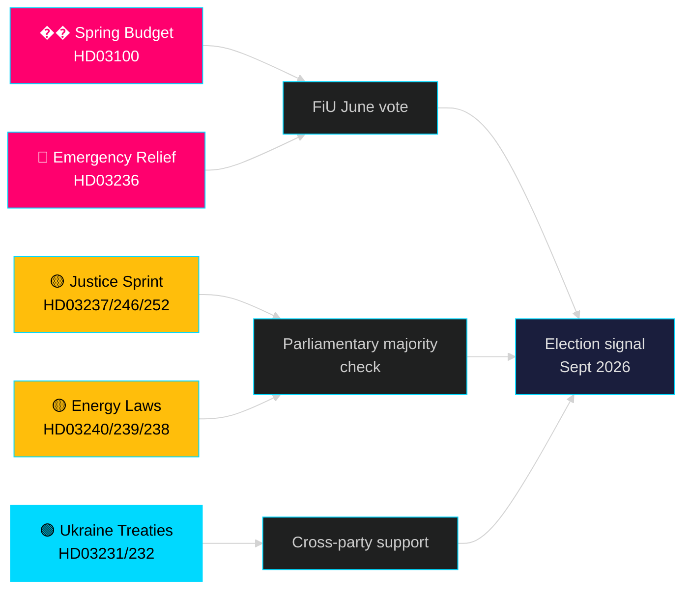

# Månaden framåt — maj 2026: Sverige vid pre-valrörets vändpunkt

**Författare**: James Pether Sörling | **Klassificering**: PUBLIC | **Datum**: 2026-04-25 | **Konfidensgrad**: HIGH

## 🎯 Slutsats

Sverige träder in i maj 2026 med Tidö-regeringen som rullar ut sitt största pre-val lagstiftningspaket: 2026 års vårbudget (HD03100) som spår fortsatt men långsam ekonomisk återhämtning, ett akut kostnadsreduceringspaket för bränsle och energi (HD03236), samt ett lagstiftningssprint av 19 propositioner inom rättsväsende, energi, miljö och utrikespolitik. Med exakt fem månader kvar till valet (september 2026) är den politiska risken bestämt centrerad kring det ekonomiska sentimentet — huruvida hushållens kostnadsreduceringar anländer i tid att påverka väljarpreferenserna — och kring regeringens trovärdighet i rättsstatliga reformer som har stått i centrum för Tidö-koalitionens mandat sedan 2022.

## 🧭 3 beslut som detta underlag stöder

1. **Ekonomisk riskbedömning**: Bör aktörer prisa in ökad politisk instabilitetesrisk inför valet i september 2026 med hänsyn till den förlängda lågkonjunkturen och det akuta stödpaketet?
2. **Spårning av lagstiftningspipelinen**: Vilka av de 19 nuvarande propositionerna löper högst risk för oppositionens fördröjning eller utskottsblockering före sommaruppehållet (juni 2026)?
3. **Koalitionsstabilitet**: Signalerar skattesänkningarna på drivmedel (HD03236) SD:s tryck på regeringen, och hur förändrar det koalitionsmatten inför valrörelsen?

## 60-sekunders underrättelseläsning

- 🔴 **Vårproposition 2026 (HD03100)** — Vårbudgetramverk projicerar långsam återhämtning; lågkonjunkturen varar längre än tidigare prognos. Regeringen siktar på tillväxt, välfärd, säkerhet. FiU:s granskning i juni.
- 🔴 **Akut bränsle- och energihjälp (HD03236)** — Sänkt skatt på drivmedel + el/gasprisstöd; valcykelsignal på budgetsidan. Kostnaden beräknas till flera miljarder SEK.
- 🟡 **Rättvisesprint**: Betald polisutbildning (HD03237), hårdare ungdomsregler (HD03246), förbud mot social försäkring för fängslade (HD03252) — M/SD:s kärnmandatleverans.
- 🟡 **Energiomställning**: Ny lag om elsystemet (HD03240), vindkraftintäkter till kommuner (HD03239), ny miljöprövningsmyndighet (HD03238).
- 🟢 **Ukrainas ansvarsutkrävning**: Sverige ansluter sig till aggressionstribunal (HD03231) och skadesståndskommission (HD03232) — utrikespolitisk sammanhållning över partier.
- 🔵 **Skogsbruksavreglering (HD03242)** — omstritt Alliansen/landsbygdsröstning; MP/S/V motståndare.

## Topp framåtsignal för maj

> **Utlösare**: Finansutskottets (FiU) omröstning om Vårproposition 2026 (HD03100) och tilläggsändringsbudget (HD03236) — förväntas i slutet av maj / tidig juni. En negativ utskottsremiss eller SD:s nedröstning i skattepolitiken skulle vara den enskilt mest betydelsefulla politiska händelsen inför sommaruppehållet.

## Konfidensutlåtande

**HIGH** [B2] — Baserat på 20 verifierade regeringspropositioner och skrivelser från data.riksdagen.se, riksmöte 2025/26.

<!-- source-sha: 91eb3cb6cf35873538b354461078df4509cf0012 -->
