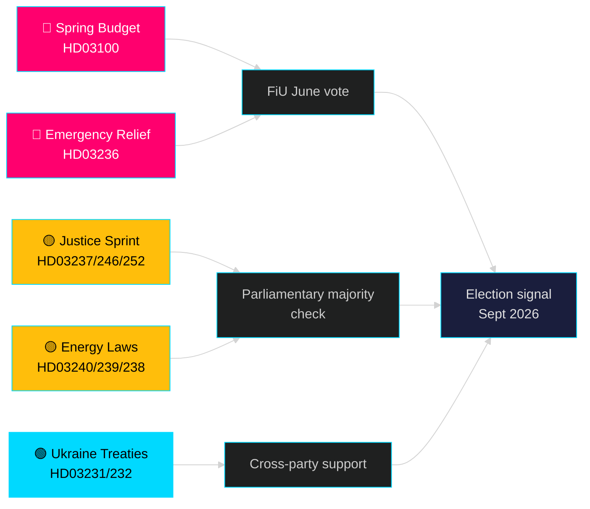

# 下个月展望 — 2026年5月：瑞典站在选前拐点

**作者**: James Pether Sörling | **分类**: 公开 | **日期**: 2026-04-25 | **置信水平**: HIGH

## 🎯 结论

瑞典进入2026年5月，Tidö政府正在推出其最大规模的选前立法套餐：2026年春季预算（HD03100）预测持续但缓慢的经济复苏，燃料和能源成本削减紧急套餐（HD03236），以及在司法、能源、环境和外交政策领域涵盖19项提案的立法冲刺。距离选举（2026年9月）还剩整整五个月，政治风险明确集中在经济情绪上——家庭成本削减能否及时到位以影响选民偏好——以及政府在法治改革中的公信力（这些改革自2022年以来一直是Tidö联合政府授权的核心）。

## 🧭 本简报支持的3项决策

1. **经济风险评估**：鉴于持续性衰退和紧急援助套餐，各方是否应在2026年9月大选前为增加的政治不稳定风险定价？
2. **立法管道追踪**：当前19项提案中，哪些在夏季休会（2026年6月）前面临最高的反对党拖延或委员会阻挠风险？
3. **联合政府稳定性**：燃料税削减（HD03236）是否表明SD对政府施压，这如何改变选举前的联合算术？

## 60秒情报速读

- 🔴 **2026年春季预算（HD03100）** — 春季预算框架预测缓慢复苏；衰退持续时间超过此前预期。政府以增长、福利、安全为目标。FiU将于6月审查。
- 🔴 **燃料和能源紧急援助（HD03236）** — 降低燃料税 + 电价/气价补贴；预算侧选举周期信号。成本估计达数十亿SEK。
- 🟡 **司法冲刺**：有薪警察培训（HD03237）、更严格的青少年规定（HD03246）、禁止向被关押者提供社会保险（HD03252）——M/SD核心授权交付。
- 🟡 **能源转型**：新电力系统法（HD03240）、风能收益归市政府（HD03239）、新环境评估机构（HD03238）。
- 🟢 **乌克兰问责**：瑞典加入侵略罪法庭（HD03231）和损害赔偿委员会（HD03232）——外交政策上的跨党派共识。
- 🔵 **林业放松管制（HD03242）** ——联盟/农村票争议；MP/S/V反对。

## 5月关键前瞻信号

> **触发事件**：财政委员会（FiU）对2026年春季预算（HD03100）和追加修正预算（HD03236）进行投票——预计5月底/6月初。委员会的负面报告或SD对税收政策的否决将是夏季休会前政治意义最为重大的单一事件。

## 置信度声明

**HIGH** [B2] — 基于data.riksdagen.se的20份经核实的政府提案和书面文件。riksmöte 2025/26。

<!-- source-sha: 91eb3cb6cf35873538b354461078df4509cf0012 -->
