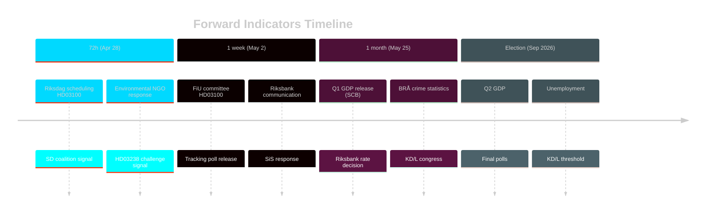

# Forward Indicators — Sweden Month Ahead: May 2026

**Date**: 2026-04-25 | **Methodology**: Indicators matrix with 4 horizons

## 72-Hour Horizon (by 2026-04-28)

| # | Indicator | Source | Significance | Trigger |
|---|---|---|---|---|
| 1 | Riksdag scheduling of HD03100 first reading | riksdagen.se/kalender | HIGH | FiU committee vote timing confirmed |
| 2 | SD leadership public comment on Vårpropositionen | SD press office | HIGH | Confirms PIR-3 (coalition signal) |
| 3 | M party spokesperson statement on economic narrative | M press office | MEDIUM | Sets framing for media cycle |
| 4 | Environmental NGO (Naturskyddsföreningen) response to HD03238 | NGO press release | MEDIUM | Early legal challenge signal |

## One-Week Horizon (by 2026-05-02)

| # | Indicator | Source | Significance | Trigger |
|---|---|---|---|---|
| 5 | FiU committee scheduling HD03100 (Vårpropositionen) | riksdagen.se | HIGH | Coalition management signal |
| 6 | Opposition (S) press conference on spring budget | S press office | HIGH | Attack line formation |
| 7 | Sifo/Novus tracking poll release | Sifo/Novus | HIGH | Electoral impact of legislative sprint |
| 8 | Riksbank advance communication pre-May meeting | riksbank.se | MEDIUM | Interest rate trajectory |
| 9 | SiS (Statens institutionsstyrelse) response to HD03246 | SiS press office | MEDIUM | Juvenile justice implementation signal |
| 10 | HD03231/232 committee scheduling (UtU) | riksdagen.se/utskott | LOW | Ukraine ratification timeline confirmed |

## One-Month Horizon (by 2026-05-25)

| # | Indicator | Source | Significance | Trigger |
|---|---|---|---|---|
| 11 | Q1 2026 GDP release (SCB) | SCB.se | VERY HIGH | Scenario A/B/C determination (PIR-1) |
| 12 | Riksbank May monetary policy meeting decision | riksbank.se | HIGH | Rate cut or hold signals fiscal space |
| 13 | BRÅ crime statistics release (if scheduled May) | bra.se | HIGH | Crime narrative validation |
| 14 | KD/L party congress statements | Party websites | HIGH | Threshold-party survival signals |
| 15 | Environmental review authority NGO court filing | Administrative court | MEDIUM | PIR-4 confirmation |
| 16 | Riksdag final vote HD03100 (Vårpropositionen) | riksdagen.se | HIGH | Coalition majority confirmed |

## Election Horizon (September 2026)

| # | Indicator | Source | Significance | Trigger |
|---|---|---|---|---|
| 17 | Q2 2026 GDP growth rate | SCB.se | VERY HIGH | Recovery narrative validation |
| 18 | Unemployment rate trajectory (Aug 2026) | SCB.se/Arbetsförmedlingen | HIGH | Economic anxiety level |
| 19 | Final Sifo pre-election poll | Sifo | VERY HIGH | Seat projection update |
| 20 | KD and L final poll numbers vs 4% threshold | Multiple pollsters | HIGH | Tidö continuation feasibility |

## Indicators Summary Chart

