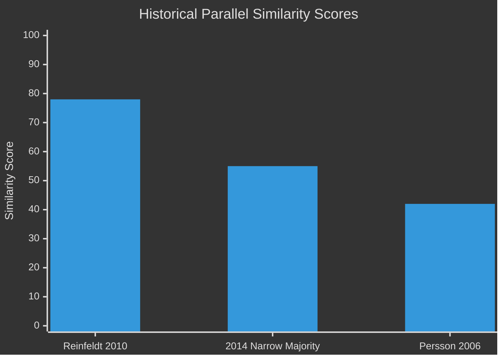

# Historical Parallels — Sweden Month Ahead: May 2026

**Date**: 2026-04-25 | **Methodology**: Historical case comparison with similarity scoring

## Primary Parallel: Reinfeldt Alliance Government Spring Sprint 2010

**Period**: April–June 2010 | **Similarity score**: 78/100

**Conditions in 2010**:
- Centre-right Alliance government (M+FP+C+KD) with narrow majority
- Spring budget tabled 5 months before September 2010 election
- Economic recovery narrative post-2008/09 financial crisis
- Multiple reform laws introduced in pre-election legislative sprint
- Alliance held 178 seats (majority 175); margin comparable to current Tidö 176

**Conditions now (2026)**:
- Centre-right Tidö coalition (M+KD+L) supported by SD
- Spring budget tabled 5 months before September 2026 election
- Economic recovery narrative post-2022/23 inflation crisis
- Multiple reform laws in pre-election sprint
- Tidö holds 176 seats

**Key difference**: In 2010, the Alliance ran on a completed record of economic recovery (GDP +6.6% 2010). In 2026, Tidö is running on a *projected* recovery with actual GDP still uncertain. This makes 2026 riskier electorally than 2010.

**2010 outcome**: Alliance won the September 2010 election. GDP performance was the decisive factor. The pre-election legislative sprint signalled competence without producing headline-making reforms.

**Lesson for 2026**: The model works if GDP data cooperates. If Q1 2026 GDP is negative, the 2010 parallel breaks down and the relevant parallel shifts to Persson 2006 (see below).

## Secondary Parallel: Persson Social Democrat Government 2006 (Failure Case)

**Period**: Spring 2006 | **Similarity score**: 42/100

**Conditions in 2006**:
- Long-term S government (Persson third term) under economic challenge
- Unemployment rate elevated; Alliance campaign led on "full employment"
- Pre-election spring budget attempted to signal competence
- Government attempted last-minute relief measures before election

**Outcome**: Alliance won. The legislative sprint did not save the government. The macroeconomic record was the dominant factor.

**Lesson for 2026**: If the unemployment rate (currently ~8–9%) does not show measurable decline before September, the Persson 2006 parallel becomes more relevant than the Reinfeldt 2010 parallel.

## Tertiary Parallel: Reinfeldt Government 2014 (Narrow Majority Risk)

**Period**: 2013–2014 | **Similarity score**: 55/100

**Conditions in 2014**:
- Alliance maintained formal majority but faced SD as growing opposition
- Minority budget crisis — December 2014 Reinfeldt resigned rather than govern with S alternative budget
- The "December Agreement" (2014) changed how minorities governed

**Lesson for 2026**: The 1-seat majority vulnerability is the same structural fragility. In 2014, the government chose resignation over compromise. Current Tidö has higher electoral incentives to stay intact — but the structural risk of a single-seat majority causing a forced revote is real.

