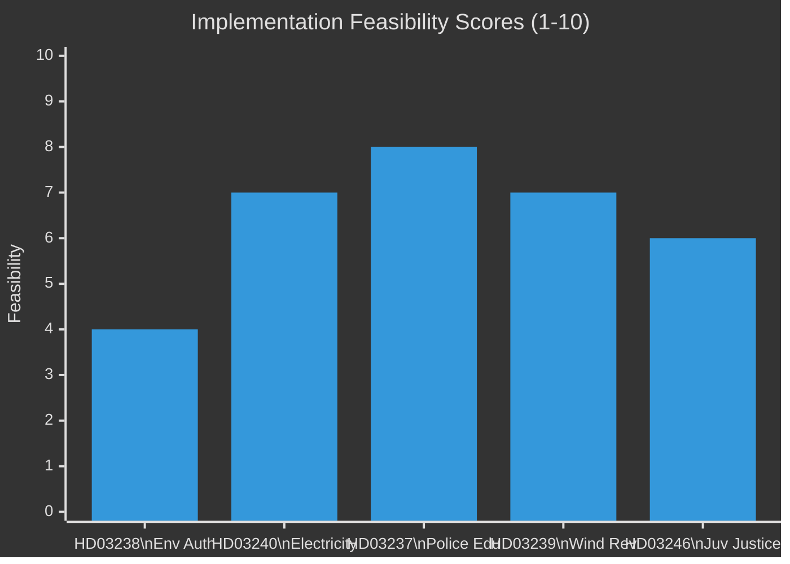

# Implementation Feasibility Analysis — Sweden Month Ahead: May 2026

**Date**: 2026-04-25 | **Methodology**: PRINCE2-aligned delivery risk assessment

## High-Priority Reform Feasibility Assessment

### 1. HD03238 — New Environmental Review Authority
**Risk rating**: HIGH delivery risk

| Factor | Assessment |
|---|---|
| Institutional capacity | Requires new Länsstyrelse coordination structure; ~200 FTE estimated |
| Timeline | Law proposed for 2026; implementation likely 2027 |
| Legal challenges | Naturskyddsföreningen court challenge expected (PIR-4) |
| Budget allocation | Not explicitly specified in HD03238 text |
| EU compatibility | Must comply with EIA Directive 2011/92/EU |

**Feasibility score**: 4/10 for 2026 delivery, 7/10 for 2027 implementation
**Key constraint**: Institution-building cannot be accelerated beyond recruitment capacity

### 2. HD03240 — Electricity System Laws
**Risk rating**: MEDIUM delivery risk

| Factor | Assessment |
|---|---|
| Regulatory authority | Svenska kraftnät has existing capacity |
| Technical complexity | Grid balancing rules require industry consultation |
| Timeline | Proposed implementation Jan 2027 |
| Legal challenges | Low — cross-party support reduces challenge probability |
| Budget allocation | Primarily regulatory framework; limited new budget |

**Feasibility score**: 7/10 for 2027 delivery
**Key constraint**: Industry stakeholder alignment (Energiföretagen, Vattenfall) required for implementation rules

### 3. HD03237 — Paid Police Education
**Risk rating**: LOW delivery risk

| Factor | Assessment |
|---|---|
| Institutional capacity | Polisutbildning already has infrastructure |
| Timeline | Proposed implementation Q1 2027 |
| Budget | HC01FiU24 includes education budget allocation |
| Legal challenges | None expected |
| Recruitment capacity | Primary constraint — Polishögskolan has limited throughput |

**Feasibility score**: 8/10 for 2027 delivery
**Key constraint**: Physical capacity of Polishögskolan campuses; may require new facility investment

### 4. HD03239 — Wind Revenue Municipality Sharing
**Risk rating**: LOW-MEDIUM delivery risk

| Factor | Assessment |
|---|---|
| Technical complexity | Revenue calculation mechanism requires SKV (Skatteverket) implementation |
| Timeline | Proposed 2027 revenue sharing from 2026 installations |
| Stakeholder buy-in | Municipal association (SKL) broadly supportive |
| Legal challenges | Low — revenue sharing models have precedent |
| Retroactivity risk | Only forward-looking; no retroactive claims |

**Feasibility score**: 7/10

### 5. HD03246 — Juvenile Justice Reform
**Risk rating**: MEDIUM delivery risk

| Factor | Assessment |
|---|---|
| Institutional capacity | SiS (Statens institutionsstyrelse) needs capacity expansion |
| Timeline | Proposed phased implementation 2026–2028 |
| EU compliance | Juvenile detention rules must comply with ECHR |
| Budget | Additional SiS budget required; not fully specified |
| Legal challenges | RFSL, BRÅ may challenge detention criteria |

**Feasibility score**: 6/10 for on-time delivery

