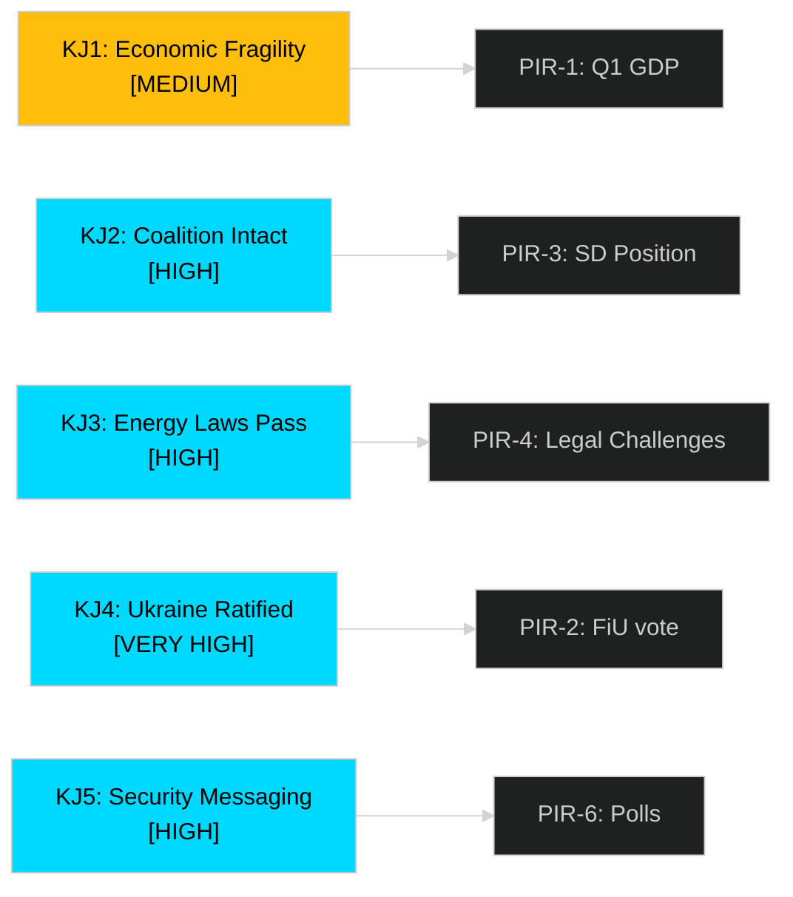

# Intelligence Assessment — Sweden Month Ahead: May 2026

**Date**: 2026-04-25 | **Author**: James Pether Sörling | **Classification**: PUBLIC

## Key Judgments

### Key Judgment 1 — Economic Recovery Remains Fragile [MEDIUM confidence]

The Tidö government's Spring Budget 2026 (HD03100 [riksdagen.se]) projects recovery, but the explicit acknowledgement in HC01FiU20 [riksdagen.se] that lågkonjunktur is "more prolonged than expected" indicates the government is managing downside scenarios rather than celebrating growth. **We assess with MEDIUM confidence that Q1 2026 GDP data will show growth between 0% and 0.5% — insufficient to validate the government's recovery narrative but not catastrophic.** The risk of negative Q1 GDP is estimated at 15–20% given external trade headwinds.

Confidence label: **MEDIUM**
PIR: PIR-1 (Q1 GDP data release date, expected May 2026)

### Key Judgment 2 — Tidö Coalition Will Remain Intact Through September Election [HIGH confidence]

Despite fiscal pressure and opposition attacks, **we assess with HIGH confidence that the Tidö coalition (M+SD+KD+L) will not fracture before the September 2026 election.** SD has a strong electoral incentive to remain associated with the government's law-and-order delivery (HD03237, HD03246 [riksdagen.se]). M/KD/L have no viable alternative coalition partner. The emergency relief budget (HD03236) is a concession designed precisely to manage SD demands. The marginal risk is SD abstention on specific votes, not a confidence crisis.

Confidence label: **HIGH**
PIR: PIR-3 (SD official position on Vårpropositionen framework)

### Key Judgment 3 — Energy Legislative Package Will Pass With Minor Amendments [HIGH confidence]

The electricity system law (HD03240 [riksdagen.se]) and wind power municipality revenue law (HD03239 [riksdagen.se]) reflect a rare area of broad cross-party support (M, SD, C, L, and conditionally MP). **We assess with HIGH confidence that both will pass the Riksdag before the summer recess**, with possible amendments requiring higher transparency on revenue distribution mechanisms. The new environmental review authority (HD03238) is more contentious and may face one-year implementation delay.

Confidence label: **HIGH**
PIR: PIR-4 (Environmental review authority legal challenges, Länsstyrelse response)

### Key Judgment 4 — Ukraine International Legal Instruments Will Achieve Near-Unanimous Ratification [VERY HIGH confidence]

Sweden's accession to the special tribunal for the crime of aggression against Ukraine (HD03231 [riksdagen.se]) and the international compensation commission (HD03232 [riksdagen.se]) enjoy support across all eight Riksdag parties. **We assess with VERY HIGH confidence that both propositions will be ratified in May 2026** with near-unanimous votes (expected <5 Nej votes from isolated exceptions).

Confidence label: **VERY HIGH**

### Key Judgment 5 — Government's Election Messaging Will Emphasise Security and Rule of Law [HIGH confidence]

The concentration of justice reform propositions (HD03237, HD03246, HD03252 [riksdagen.se]) in the final pre-election legislative sprint confirms that M/KD leads are prioritising their mandate-delivery narrative on safety and rule of law. **We assess with HIGH confidence that the government's formal election campaign will lead with the crime/justice agenda, with the economic recovery as a secondary but essential supporting theme.** This reflects internal polling awareness that the government's weakest ground is the economy.

Confidence label: **HIGH**

## Key Assumptions Check

| Assumption | Basis | Sensitivity |
|-----------|-------|-------------|
| SD remains in coalition | Electoral incentive; no viable alternative | HIGH sensitivity — assumption could fail if GDP data catastrophic |
| Q1 2026 GDP ≥ 0% | Riksbank rate cuts taking effect; base case | MEDIUM sensitivity — key risk assumption |
| FiU committee approves HD03100 | M+SD+KD majority ≥ 175 seats | LOW sensitivity — structural majority |
| Ukraine treaties: cross-party consensus | Unanimous foreign policy position since 2022 | VERY LOW sensitivity |

## PIR Handoff — Priority Intelligence Requirements

- **PIR-1**: Q1 2026 GDP release (SCB, ~May 2026) — key for Scenario A/B/C determination
- **PIR-2**: FiU committee first reading on HD03100/HD03236 — expected second week of May
- **PIR-3**: SD leadership public statement on Vårpropositionen adequacy — key coalition signal
- **PIR-4**: HD03238 NGO legal challenge filing — Naturskyddsföreningen announcement expected
- **PIR-5**: Riksbank May monetary policy meeting — rate decision and forward guidance
- **PIR-6**: First polls post-Vårpropositionen publication — electoral impact measurement
- **PIR-7**: EU Commission response to HD03242 (forestry) — formal notification risk

## Prior-Cycle PIRs (Carried Forward)

- **Carried forward from monthly-review (analysis/daily/2026-04-25/monthly-review/)**: The monthly review's PIR on coalition cohesion (post-SD budget demands) remains open; this assessment provides updated HIGH confidence on coalition stability.
- **Open PIR on Riksbank rate path** from prior cycles: now partially resolved — KPIF stabilised at 1.9% (HC01FiU24 [riksdagen.se]).

