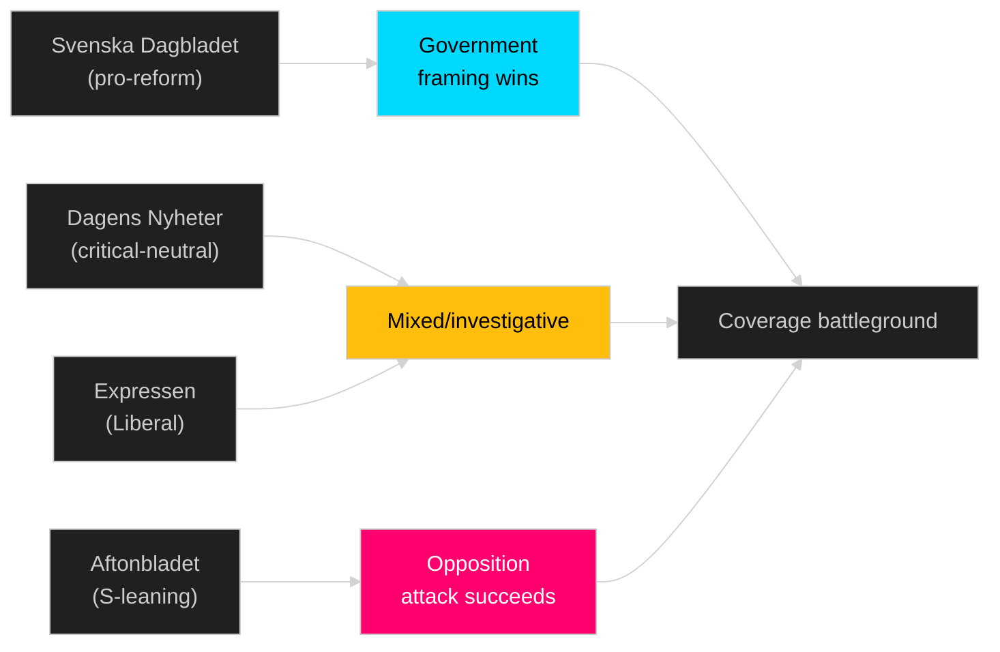

# Media Framing Analysis — Sweden Month Ahead: May 2026

**Date**: 2026-04-25 | **Note**: Qualitative assessment only — no systematic media corpus gathered in this run.

## Government/Coalition Party Framing

### Moderaterna (M)
**Predicted framing**: "Ansvar och reform — leverans på löften" (Responsibility and reform — delivery on promises)
- Will present HD03100 as proof of economic management competence
- Energy package (HD03240, HD03239) framed as "green competitiveness" not just "green transition"
- Crime laws (HD03237, HD03246) framed as "trygghet" — safety and security delivery

### Sverigedemokraterna (SD)
**Predicted framing**: "Sverige först — kostnader ned, brott upp, vi levererar" (Sweden first — costs down, crime up, we deliver)
- HD03236 (fuel tax cut) will be the primary SD-branded win
- Juvenile justice (HD03246) presented as SD's distinctive policy victory
- Will avoid taking credit for energy transition aspects (ideological tension)

### Kristdemokraterna (KD)
**Predicted framing**: "Familjer och trygghet" (Families and safety)
- KD will focus on HD03246 (juvenile justice) — crime/family values intersection
- Will present HD03237 (police education) as long-term investment in community safety

### Liberalerna (L)
**Predicted framing**: "Reformer för frihet och integration" (Reforms for freedom and integration)
- Most likely to frame energy transition as EU alignment
- Weakest position in the sprint — will struggle to differentiate from M

## Opposition Framing

### Socialdemokraterna (S)
**Predicted framing**: "För lite, för sent, för dyrt" (Too little, too late, too expensive)
- Will attack HD03236 as inadequate compared to household cost pressures
- Will present HD03100 (spring budget) as a "budget för valvinst, inte för Sverige" (budget for electoral victory, not for Sweden)
- Will attack HD03238 (env authority) as weakening environmental protection

### Vänsterpartiet (V)
**Predicted framing**: "Skattelättnad för bil, ingenting för boende" (Tax cuts for cars, nothing for housing)
- Sharpest critique will focus on housing absence from legislative sprint
- Will use HD03236 to frame Tidö as "the car lobby's government"

### Miljöpartiet (MP)
**Predicted framing**: "Klimatbrott mot framtida generationer" (Climate crime against future generations)
- Sharpest opposition to HD03242 (forestry) and potential HD03238 weakening
- Will use any implementation delays in env authority as confirmation of green regression

### Centerpartiet (C)
**Predicted framing**: Mixed — will support energy reforms (HD03239/HD03240) while attacking fiscal framework
- C is internally divided on supporting Tidö energy policies; rural wing supports HD03239

## Press Coverage Predicted Polarisation

## Longitudinal Entry (for tracking)

| Date | Event | Expected framing shift |
|---|---|---|
| May 2026 week 1 | FiU first reading HD03100 | Economic competence debate begins |
| May 2026 week 2 | Q1 GDP release | Frame shifts dramatically based on result |
| May 2026 week 3 | BRÅ crime statistics | Crime narrative frame intensifies |
| June 2026 | Riksdag summer recess | Campaign mode begins formally |
