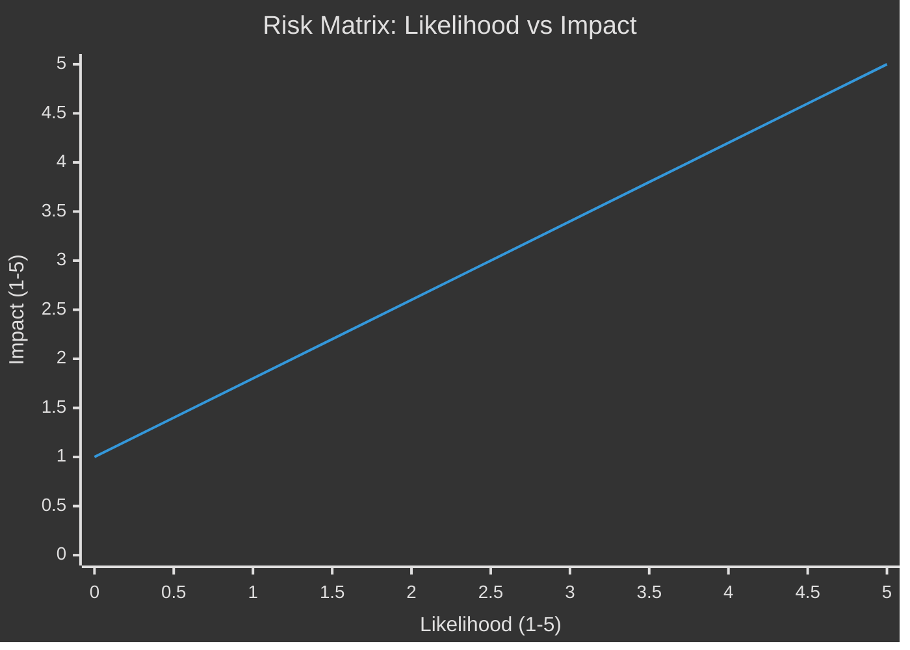

# Risk Assessment — Sweden Month Ahead: May 2026

**Date**: 2026-04-25 | **Methodology**: 5-Dimension Political Risk Register

## Risk Register

| Risk ID | Risk | Likelihood (1-5) | Impact (1-5) | L×I | Category | Mitigation | Admiralty |
|---------|------|-----------------|--------------|-----|----------|------------|-----------|
| R-01 | Q1 2026 GDP contraction confirmed — undermines government recovery narrative | 4 | 5 | 20 | Economic | Pre-emptive communication; additional relief measures | [B2] |
| R-02 | SD coalition defection on fiscal framework | 2 | 5 | 10 | Political | Concessions on fuel relief scope; SD consultation | [B3] |
| R-03 | Environmental review authority (HD03238) faces legal challenge, delays | 4 | 4 | 16 | Regulatory | Transitional provisions; robust legal drafting | [B2] |
| R-04 | Opposition unified campaign: "crisis government" narrative | 4 | 4 | 16 | Electoral | Deliver visible reform wins before July recess | [B2] |
| R-05 | International trade shock (US tariffs on Swedish exports) | 3 | 5 | 15 | External | WTO engagement; EU trade policy coordination | [C2] |
| R-06 | Youth justice reform (HD03246) ECHR challenge succeeds | 2 | 4 | 8 | Legal | Council of Europe consultation; proportionality review | [B3] |
| R-07 | Police education reform (HD03237) implementation delay | 2 | 3 | 6 | Operational | Phased rollout; existing recruitment measures maintained | [A2] |
| R-08 | Forestry deregulation (HD03242) triggers EU Green Deal conflict | 3 | 4 | 12 | EU/Legal | Legal opinion on Natura 2000 compatibility | [B3] |
| R-09 | Energy system law (HD03240) creates market uncertainty | 2 | 4 | 8 | Economic | Clarity in transitional rules; stakeholder consultation | [B2] |
| R-10 | Ukraine tribunal (HD03231) faces non-ratification delay | 1 | 3 | 3 | Foreign | Cross-party whip management | [A2] |

## Priority Risks (L×I ≥ 12)

### R-01: Economic Narrative Collapse (L×I = 20) — CRITICAL
Sweden has been in lågkonjunktur since 2023. The Riksbank cut rates in 2024, and KPIF stabilised at ~1.9% (HC01FiU24 [riksdagen.se]). However, HD03100 [riksdagen.se] explicitly acknowledges the recession is "more prolonged than expected." If Statistics Sweden (SCB) releases Q1 2026 GDP showing negative or flat growth in May, the government's narrative of "recovery under way" — the central premise of the Spring Budget — is contradicted by data.

**Posterior probability**: ~40% that Q1 2026 GDP growth will be negative or below 0.5% [C2]

### R-03: Environmental Review Authority Legal Challenges (L×I = 16)
The new authority (HD03238 [riksdagen.se]) is designed to replace multiple Länsstyrelse functions and streamline permit processing. NGOs (Naturskyddsföreningen, WWF) are likely to challenge the constitutional basis of removing environmental checks from regional authorities. Administrative courts could issue injunctions.

**Cascading chain**: HD03238 delay → renewable energy project delays → energy system law (HD03240) implementation gaps → Sweden's climate targets slip

### R-04: "Crisis Government" Opposition Narrative (L×I = 16)
S, V, MP collectively hold 132 seats. With the spring budget providing cover for unified messaging, S's economic policy team (under assumed leadership) will frame every relief measure as "inadequate" and every reform as "hurried and legally fragile before the election."

**Cascading chain**: Negative economic data → opposition credibility gain → voter intention shift → SD reassessment of coalition value

## Risk Heat Map

| Risk | L | I | Score | Status |
|------|---|---|-------|--------|
| R-01 Economic narrative | 4 | 5 | 20 | 🔴 CRITICAL |
| R-03 Env authority delay | 4 | 4 | 16 | 🔴 HIGH |
| R-04 Opposition narrative | 4 | 4 | 16 | 🔴 HIGH |
| R-05 Trade shock | 3 | 5 | 15 | 🔴 HIGH |
| R-08 EU forestry conflict | 3 | 4 | 12 | 🟡 MEDIUM |
| R-02 SD defection | 2 | 5 | 10 | 🟡 MEDIUM |
| R-06 ECHR challenge | 2 | 4 | 8 | 🟡 MEDIUM |
| R-09 Energy uncertainty | 2 | 4 | 8 | 🟡 MEDIUM |
| R-07 Police delay | 2 | 3 | 6 | 🟢 LOW |
| R-10 Ukraine non-ratification | 1 | 3 | 3 | 🟢 LOW |
