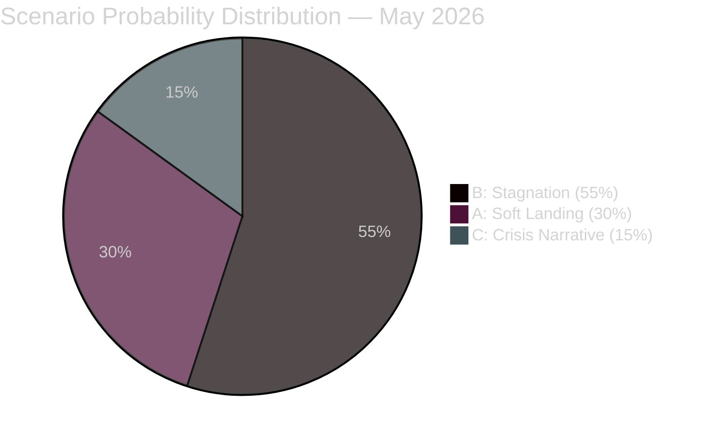

# Scenario Analysis — Sweden Month Ahead: May 2026

**Date**: 2026-04-25 | **Methodology**: Scenario Planning + WEP/Kent Scale

## Scenario Framework

Three scenarios are constructed for the May–June 2026 window (before summer Riksdag recess).

---

## Scenario A: Economic Recovery Signal — "Soft Landing" (Probability: 30%)

**Description**: Q1 2026 GDP data released in May shows modest positive growth (0.5–1.5%). Riksbanken signals a possible additional rate cut. The fuel and energy relief package (HD03236) is welcomed by households. The legislative sprint completes on schedule. The government enters summer recess with an economic credibility boost.

**Leading indicators**:
- Statistics Sweden (SCB) GDP Q1 2026 ≥ +0.5%
- Riksbank press conference: neutral-to-dovish language on rates
- Unemployment rate (April data): flat or decreasing

**Political consequences**:
- Government approval ratings stabilise or improve (M+SD combined above 45%)
- HD03100 framework passes FiU committee without blockage
- Election polls show tightening race; government retains realistic majority prospect

**WEP assessment**: *Unlikely* (20–37% probability range — Kent Scale) given accumulated recession depth

---

## Scenario B: Prolonged Stagnation — "More of the Same" (Probability: 55%)

**Description**: Q1 2026 GDP is flat (0–0.5%) or marginally positive. Recession continues but doesn't deepen significantly. The spring budget and emergency relief pass but are deemed insufficient by opposition. Legislative sprint completes for all non-contested items; forestry (HD03242) and youth justice (HD03246) face prolonged committee scrutiny. The government governs competently but without a transformative narrative.

**Leading indicators**:
- SCB GDP Q1 2026: 0% to +0.5%
- Opposition unified but unable to dominate news cycle
- No SD ultimatums; Tidö cohesion maintained

**Political consequences**:
- Election outcome remains uncertain; within polling margin of error
- Both government and opposition blocks around 43-48% combined
- FiU approves spring budget with amendments demanded by SD

**WEP assessment**: *Roughly even* (45–55% probability) — most consistent with current trajectory

---

## Scenario C: Economic Deterioration — "Crisis Narrative" (Probability: 15%)

**Description**: Q1 2026 GDP is negative (below -0.5%). US tariff escalation hits Swedish industrial exports in May. Riksbanken signals emergency rate cuts. The emergency relief package is judged too small by public opinion. SD makes public demands for a larger relief budget or threatens abstentions. The "crisis government" narrative takes hold.

**Leading indicators**:
- SCB GDP Q1 2026: ≤ -0.5%
- SIFO/Ipsos polls: government bloc below 42%
- SD leadership statements: "inadequate economic management"
- LO/TCO joint statement demanding larger relief

**Political consequences**:
- Opposition files formal demand for economic policy debate (interpellation storm)
- Possible non-confidence vote (unlikely to succeed but damaging)
- Government restructures communications around "responsible management of crisis"

**WEP assessment**: *Unlikely* (20–37%) but with higher-than-normal tail risk given the external trade environment

---

## Scenario D: Foreign Policy Escalation — "Ukraine Emergency" (Probability: <5%, monitored)

**Description**: Russia escalates hybrid warfare against Sweden following ratification of Ukraine aggression tribunal accession (HD03231). Cyberattacks on critical infrastructure; disinformation campaign; energy supply disruption. Riksdag enters emergency session.

**This scenario is a monitored low-probability/high-impact outlier.**

**WEP assessment**: *Remote* (<7%) — but would dominate all other political dynamics

---

## Scenario Probability Summary

| Scenario | Probability | WEP Term | Leading Indicator |
|----------|-------------|----------|-------------------|
| A — Soft Landing | 30% | Unlikely-Likely borderline | SCB Q1 GDP ≥ 0.5% |
| B — Stagnation | 55% | Roughly even | SCB Q1 GDP 0–0.5% |
| C — Crisis Narrative | 15% | Unlikely | SCB Q1 GDP ≤ -0.5% |
| D — Foreign Escalation | <5% | Remote | Russia hybrid attack event |

**Total**: 100%

