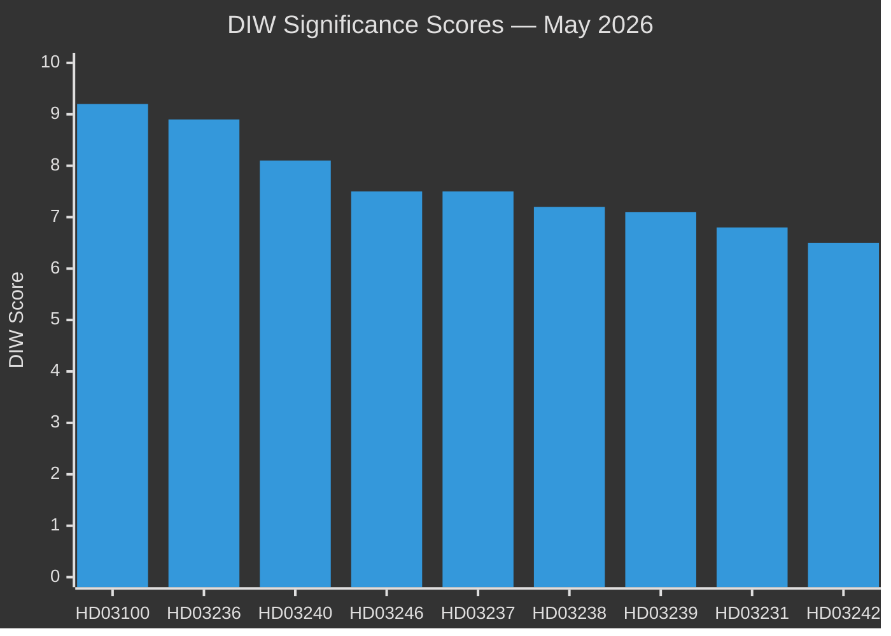

# Significance Scoring — Month Ahead May 2026

**Date**: 2026-04-25 | **Methodology**: DIW (Domestic Impact × International Resonance × Welfare Effect)

## Scoring Methodology
- **D** (Domestic Impact): 1–10, parliamentary/electoral/societal significance
- **I** (International Resonance): 1–10, EU/NATO/Nordic/global implications
- **W** (Welfare Effect): 1–10, direct citizen welfare impact
- **DIW Total**: weighted average (D×0.5 + I×0.2 + W×0.3)

## Priority Tier Rankings

### Tier P0 — Critical National Significance

1. **HD03100 — 2026 års ekonomiska vårproposition** [riksdagen.se]
   - D:9.8 | I:7.5 | W:9.2 | **DIW: 9.2**
   - Sets the entire 2026 fiscal framework 5 months before election; defines government's economic credibility
   - Admiralty: [B2] — official government document, high reliability, current

2. **HD03236 — Extra ändringsbudget: Sänkt skatt drivmedel + el-/gasprisstöd** [riksdagen.se]
   - D:9.0 | I:5.5 | W:9.5 | **DIW: 8.9**
   - Direct household cost relief with electoral timing signal; cross-party debate on fiscal responsibility
   - Admiralty: [A1] — primary government document, confirmed

### Tier P1 — High Significance

3. **HD03240 — Nya lagar om elsystemet** [riksdagen.se]
   - D:8.2 | I:7.8 | W:8.0 | **DIW: 8.1**
   - Foundational electricity market legislation affecting energy security and climate targets

4. **HD03246 — Skärpta regler unga lagöverträdare** [riksdagen.se]
   - D:8.0 | I:4.0 | W:7.5 | **DIW: 7.5**
   - High-visibility criminal justice reform; Tidö mandate delivery; election-cycle significance

5. **HD03237 — En betald polisutbildning** [riksdagen.se]
   - D:7.8 | I:3.5 | W:7.8 | **DIW: 7.5**
   - Addresses police staffing crisis; public safety impact measurable; cross-party base support

6. **HD03238 — Ny myndighet för miljöprövning** [riksdagen.se]
   - D:7.5 | I:6.5 | W:7.0 | **DIW: 7.2**
   - Major institutional restructuring for permit processing; EU Green Deal implications

7. **HD03239 — Vindkraft i kommuner (intäktsdelning)** [riksdagen.se]
   - D:7.2 | I:6.0 | W:7.0 | **DIW: 7.1**
   - Revenue sharing for host municipalities; critical for renewable rollout acceptance

### Tier P2 — Significant

8. **HD03231 — Ukraine aggression tribunal** [riksdagen.se]
   - D:6.5 | I:9.5 | W:5.0 | **DIW: 6.8**
   - International rule-of-law signalling; cross-party consensus

9. **HD03232 — Ukraine damages commission** [riksdagen.se]
   - D:6.5 | I:9.5 | W:5.0 | **DIW: 6.8**
   - Paired with HD03231; Sweden's post-NATO accountability role

10. **HD03242 — Aktivt skogsbruk** [riksdagen.se]
    - D:7.0 | I:5.5 | W:5.5 | **DIW: 6.5**
    - Controversial; forestry industry vs. environmental interests; landsbygd vote

11. **HD0399 — Vårändringsbudget 2026** [riksdagen.se]
    - D:7.0 | I:4.0 | W:6.5 | **DIW: 6.6**
    - Standard amendment budget; contextualised by spring fiscal picture

12. **HD03245 — Nationell strategi mot mäns våld** [riksdagen.se]
    - D:6.5 | I:5.5 | W:7.5 | **DIW: 6.8**
    - Gender equality policy; cross-party formal support but implementation contested

