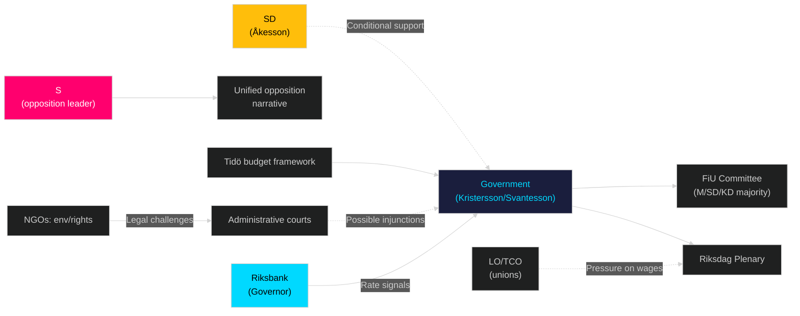

# Stakeholder Perspectives — Sweden Month Ahead: May 2026

**Date**: 2026-04-25 | **Lens**: 6-Dimension Stakeholder Matrix

## Stakeholder Influence Network

## 6-Lens Stakeholder Matrix

### Lens 1: Government (Tidö Coalition)
- **Key actors**: PM Ulf Kristersson (M), Finance Minister Elisabeth Svantesson (M), Justice Minister Gunnar Strömmer (M), Energy/Climate: Lotta Edholm/Johan Britz (KD/M)
- **Primary interest**: Deliver visible reforms before September election; maintain coalition coherence; manage economic narrative
- **Position on May 2026 package**: Strongly supportive; package is core election preparation
- **Influence**: HIGH (government controls legislative agenda via Riksdag majority)
- **Source**: HD03100, HD03237, HD03246 [riksdagen.se]

### Lens 2: Opposition (S, V, MP, C)
- **Key actors**: S party leader (parliamentary opposition), V (Nooshi Dadgostar), MP leadership, C (Muharrem Demirok)
- **Primary interest**: Maximise opposition visibility; frame government as incompetent economic manager
- **Position**: S — relief insufficient and late; V — structural inequality ignored; MP — environmental reforms rushed; C — supports some deregulation (HD03242) but criticises justice overreach
- **Influence**: MEDIUM (132 seats; cannot block with votes but strong media/committee presence)
- **Source**: HC01FiU20 opposition positions [riksdagen.se]

### Lens 3: Business/Industry
- **Key actors**: Svenskt Näringsliv, Energiföretagen Sverige, Skogsindustrierna, banking sector (EU bankpaket HD03253)
- **Primary interest**: Predictable regulatory environment; energy cost competitiveness; fast permitting (HD03238)
- **Position**: Broadly supportive of deregulation package; concerns about new environmental authority's operational readiness
- **Influence**: MEDIUM-HIGH (economic feedback loops; employer associations inform FiU)

### Lens 4: Labour/Civil Society
- **Key actors**: LO (blue-collar), TCO (white-collar), SACO (academic), BRIS, Civil Rights Defenders, Naturskyddsföreningen
- **Primary interest**: LO — real wage recovery; BRIS — juvenile justice rights; Naturskyddsföreningen — HD03238/HD03242 opposition
- **Position**: LO cautious on spring budget adequacy; BRIS opposes HD03246; Naturskyddsföreningen ready to challenge HD03238
- **Influence**: MEDIUM (civil society litigation capacity; LO's voter bloc signal to S)

### Lens 5: International/EU
- **Key actors**: European Commission (EU Banking Package HD03253, EIA Directive HD03238), CoE (ECHR HD03246), ICC/UN (Ukraine tribunals HD03231/232), NATO allies
- **Primary interest**: Swedish compliance with EU directives; rule-of-law standards; Ukraine accountability participation
- **Position**: Supportive on Ukraine; monitoring HD03238 for EIA compliance; neutral on domestic fiscal measures
- **Influence**: MEDIUM-HIGH on regulatory compliance; LOW on domestic politics

### Lens 6: Riksbank (Monetary Policy)
- **Key actors**: Governor (vacant replacement post-Thedéen term?), executive board
- **Primary interest**: KPIF stability at 2% target; ECB coordination; exchange rate stability
- **Position**: HC01FiU24 [riksdagen.se] notes KPIF ~1.9% in 2024; further rate cuts possible if recession deepens
- **Influence**: HIGH on household cost (mortgage rates); signals amplify or dampen spring budget impact
- **Evidence**: HC01FiU24 FiU evaluation of Riksbankens penningpolitik 2024 [riksdagen.se]
