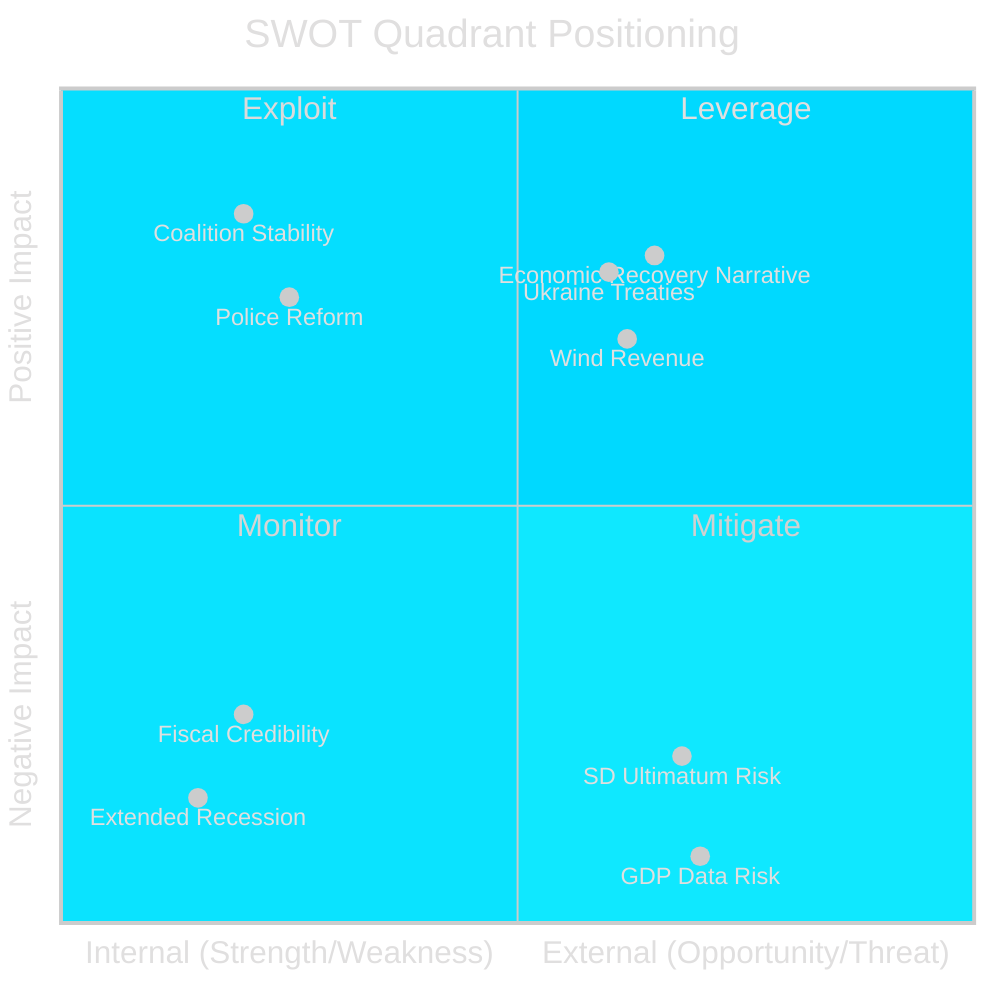

# SWOT Analysis — Swedish Political Landscape: May 2026

**Date**: 2026-04-25 | **Author**: James Pether Sörling | **Source**: 20 documents riksdagen.se rm 2025/26

## SWOT Matrix

### Strengths

| Strength | Evidence | Impact | Admiralty |
|----------|----------|--------|-----------|
| Strong legislative mandate delivery | 19+ propositions in April sprint; HD03100 [riksdagen.se], HD03237 [riksdagen.se], HD03246 [riksdagen.se] demonstrate breadth | HIGH | [A2] |
| Coalition stability maintained | SD, M, KD, L aligned on justice and fiscal package despite pre-election pressures | HIGH | [B2] |
| Energy policy coherence | Simultaneous HD03240 + HD03238 + HD03239 package shows integrated energy strategy [riksdagen.se] | MEDIUM-HIGH | [A2] |
| Ukraine solidarity (cross-party) | HD03231 + HD03232 [riksdagen.se] enjoy near-universal Riksdag support; Sweden's NATO/rule-of-law standing reinforced | HIGH | [A1] |
| Police reform credibility | HD03237 [riksdagen.se] — paid police education addresses the force's staffing crisis directly | MEDIUM-HIGH | [A1] |

### Weaknesses

| Weakness | Evidence | Impact | Admiralty |
|----------|----------|--------|-----------|
| Recession extends longer than projected | FiU betänkande HC01FiU20 [riksdagen.se]: lågkonjunktur "mer utdragen" than in Vårpropositionen | CRITICAL | [A1] |
| Fiscal credibility under pressure | Emergency relief budget (HD03236) signals ad hoc reactive policy rather than structural reform | HIGH | [A2] |
| Environmental review reform (HD03238) risks speed-quality trade-off | New authority lacks track record; Länsstyrelse competence transfer uncertain | MEDIUM | [B3] |
| Juvenile justice reform (HD03246) ECHR vulnerability | Tougher rules for under-18s may face Council of Europe scrutiny | MEDIUM | [B2] |
| Forestry deregulation (HD03242) divides Sweden's international image | Green credentials questioned by NGOs citing Natura 2000 [riksdagen.se context] | MEDIUM | [B3] |

### Opportunities

| Opportunity | Evidence | Impact | Admiralty |
|-------------|----------|--------|-----------|
| Economic recovery narrative if Q1 GDP positive | Riksbank monetary policy evaluation (HC01FiU24 [riksdagen.se]) suggests KPIF stabilised at ~2%; rate cuts possible | HIGH | [A2] |
| Wind power income gives municipalities electoral incentive | HD03239 [riksdagen.se] — local government gain from offshore/onshore wind revenue creates new rural coalition partners | MEDIUM-HIGH | [A2] |
| Ukraine leadership position builds NATO credibility | HD03231/HD03232 [riksdagen.se] — Sweden as early mover on accountability mechanisms | MEDIUM | [A1] |
| Police reform delivers visible quick wins | HD03237 [riksdagen.se] — increased police presence measurable before September election | MEDIUM-HIGH | [A2] |

### Threats

| Threat | Evidence | Impact | Admiralty |
|--------|----------|--------|-----------|
| Q1 2026 GDP contraction data (if negative) | Extended recession forecast; FiU notes revised downward prognosis in HC01FiU20 [riksdagen.se] | CRITICAL | [A1] |
| SD ultimatum risk on fuel relief scope | HD03236 [riksdagen.se] may be insufficient for SD's voter base; risk of SD demanding more | HIGH | [B2] |
| Opposition unified economic attack | S/V/MP could frame spring package as "too little, too late" given recession depth | HIGH | [B2] |
| Environmental review authority implementation failure | HD03238 [riksdagen.se] — tight timeline to establish new authority by 2027; legal challenges from NGOs likely | MEDIUM | [B3] |
| International trade risk (US tariffs) | Global trade uncertainty (WEO Apr-2026 context) affects Swedish export-dependent industries | HIGH | [C2] |

## TOWS Strategic Matrix

| | **Strengths** | **Weaknesses** |
|---|---|---|
| **Opportunities** | **SO**: Deploy Ukraine leadership to reinforce security credibility before election; use police reform delivery as election-season visible win | **WO**: Use energy package (HD03240/239) to counter recession weakness; frame environmental reform as pro-growth |
| **Threats** | **ST**: Strong legislative sprint insulates against single-issue opposition attacks; coalition breadth provides buffer against SD ultimatums | **WT**: Economic weakness + fiscal ad-hoc measures + extended recession = narrative crisis if Q1 GDP is negative |

## Cross-SWOT Theme: Election Countdown Compression

All SWOT elements are compressed by the 5-month election countdown. Strengths must translate to voter perception before September 2026. Weaknesses — especially the economic data — are existential if Q1 2026 shows no recovery. The window for corrective action closes in July (Riksdag summer recess).

