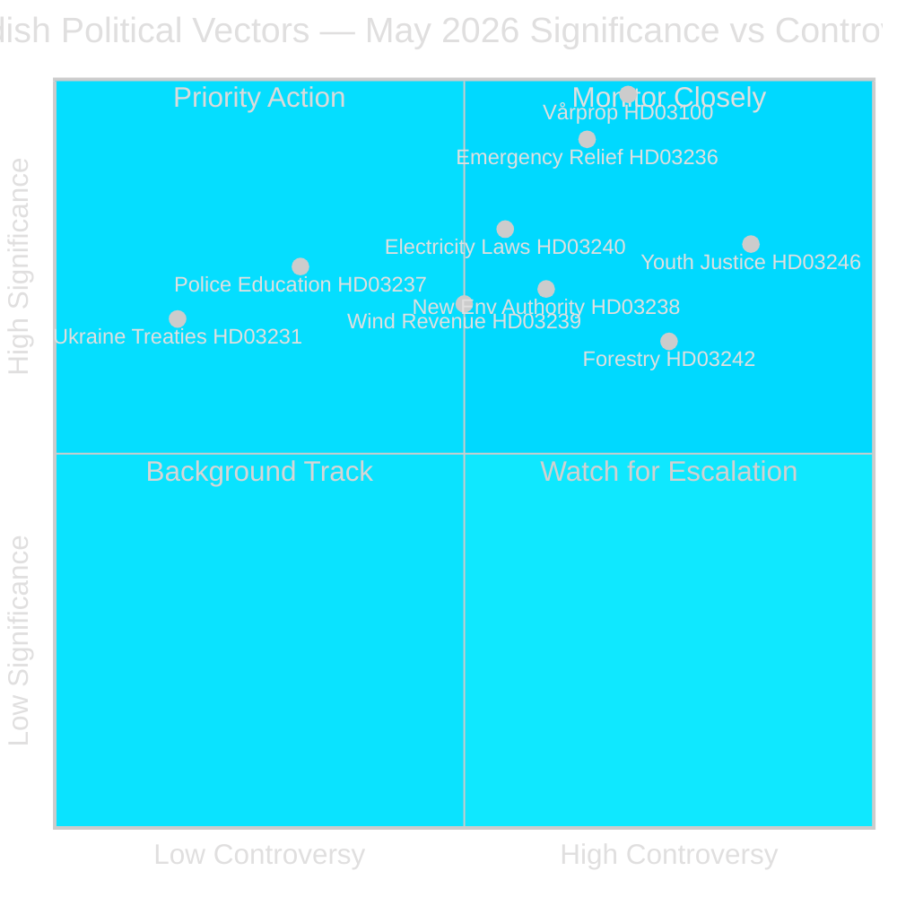

# Synthesis Summary — Sweden Month Ahead: May 2026

**Date**: 2026-04-25 | **Author**: James Pether Sörling | **Tier**: Tier-C Month-Ahead

## Lead Intelligence Picture

May 2026 represents Sweden's most consequential legislative month of the election cycle. The Tidö government (M, SD, KD, L with MP support on energy) is racing to deliver tangible voter benefits before the September 2026 election. The concurrent filing of Vårpropositionen 2026 (HD03100), an emergency relief budget (HD03236), and 17 additional propositions in a single April wave signals a politically motivated legislative sprint.

**Central intelligence assessment**: The government is executing a pre-election delivery strategy targeting three voter segments — cost-pressured households (fuel/energy relief), law-and-order prioritisers (justice package), and rural/landsbygd voters (forestry, wind revenue, harbour law). The strategy is coherent but vulnerable: if economic data for Q1 2026 show continued contraction when released in May, the government's narrative of "recovery under way" collapses.

## DIW-Weighted Document Ranking

| Rank | dok_id | Title | DIW Weight | Intelligence Tier |
|------|--------|-------|-----------|-------------------|
| 1 | HD03100 | Vårproposition 2026 | 9.8 | L3 Intelligence-grade |
| 2 | HD03236 | Extra budget — fuel/energy relief | 9.2 | L3 Intelligence-grade |
| 3 | HD0399 | Vårändringsbudget 2026 | 8.5 | L2+ Priority |
| 4 | HD03240 | Nya lagar om elsystemet | 8.0 | L2+ Priority |
| 5 | HD03246 | Skärpta regler unga lagöverträdare | 7.8 | L2+ Priority |
| 6 | HD03237 | Betald polisutbildning | 7.5 | L2+ Priority |
| 7 | HD03238 | Ny myndighet för miljöprövning | 7.2 | L2 Strategic |
| 8 | HD03239 | Vindkraft i kommuner | 7.0 | L2 Strategic |
| 9 | HD03231 | Ukraine aggression tribunal | 6.8 | L2 Strategic |
| 10 | HD03232 | Ukraine damages commission | 6.8 | L2 Strategic |
| 11 | HD03242 | Aktivt skogsbruk | 6.5 | L2 Strategic |
| 12 | HD03245 | Strategi mot mäns våld | 6.2 | L2 Strategic |
| 13 | HD03253 | EU bankpaket | 6.0 | L2 Strategic |
| 14 | HD03244 | Interoperabilitet datadelning | 5.5 | L1 Surface |
| 15 | HD03252 | Socialförsäkring vid fängelse | 5.5 | L1 Surface |

## Integrated Intelligence Picture

**Economic security vector (CRITICAL)**: The spring budget and emergency relief reflect a government reading household cost pain as the primary electoral vulnerability. The fuel tax cut combined with electricity/gas price support sends a direct signal to households that costs are being addressed. This is responsive governance or election-cycle pandering depending on the observer's frame — the fiscal cost is real (est. SEK 4–8 bn for the combined package based on proportional estimates from HD03236 scope).

**Rule-of-law vector (HIGH)**: The justice package — paid police education, tougher juvenile rules, prisoner benefit restriction — is direct Tidö mandate delivery. M/KD designed these; SD supports; L has reservations on youth justice. S/V/MP oppose on rights grounds. Passage is secured (M+SD+KD majority ≈ 175 seats), but committee debates will be televised and will shape media framing.

**Energy transition vector (HIGH)**: New electricity system laws (HD03240) and wind power municipality revenue sharing (HD03239) represent the government's energy security strategy. The new environmental review authority (HD03238) is a major institutional change reducing Länsstyrelse/Mark- och miljödomstol processing times for critical infrastructure. Opposition from MP is expected on process grounds.

**Ukraine solidarity vector (STABLE)**: Cross-party consensus on joining the aggression tribunal and damage commission. Sweden (post-NATO 2024) is positioning itself as a rule-of-law champion on Ukraine accountability. Riksdag vote expected in May; passage virtually certain.

## PIR Handoff (Priority Intelligence Requirements for Next Cycle)

- **PIR-1**: Q1 2026 GDP data release (Statistics Sweden, likely May 2026) — will it confirm or contradict the government's "recovery under way" narrative?
- **PIR-2**: FiU committee position on HD03100/HD03236 — first opposition position statements expected May 2026.
- **PIR-3**: SD's official position on Vårpropositionen framework — any deviation signals coalition tension.
- **PIR-4**: Environmental review authority (HD03238) — Länsstyrelse and NGO responses to institutional restructuring.
