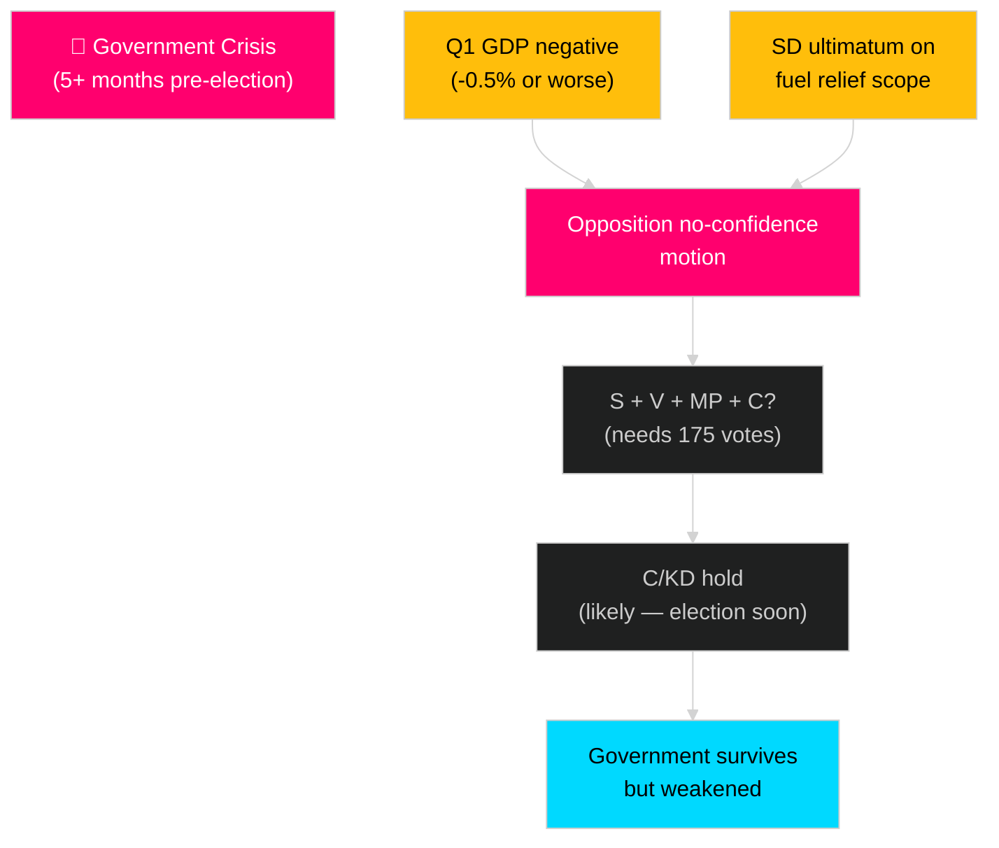

# Threat Analysis — Sweden Month Ahead: May 2026

**Date**: 2026-04-25 | **Methodology**: Political Threat Taxonomy + F3EAD Cycle

## Political Threat Taxonomy

### Category 1: Electoral Threats

**T-E01**: Opposition "crisis economy" attack campaign
- **Vector**: Unified S/V/MP messaging on economic failure
- **Capability**: S holds 94 seats [riksdagen.se ledamotsstatistik]; strong media presence; shadow finance ministers credible
- **Opportunity**: Q1 GDP data release (May 2026); extended recession confirmation
- **Intent**: Delegitimise government fiscal competence before September election
- **Severity**: CRITICAL
- **Countermeasure**: Pre-announce positive data framing; deploy minister communications plan
- Source: HD03100 extended recession acknowledgement [riksdagen.se]

**T-E02**: SD voter migration to S on economic issues
- **Vector**: Working-class SD voters defect if fuel relief (HD03236) deemed insufficient
- **Capability**: S has historically won back SD-leaning voters on welfare issues
- **Opportunity**: High cost-of-living, housing costs, fuel prices
- **Severity**: HIGH
- Source: HD03236 scope (fuel tax cut — magnitude unknown without full text) [riksdagen.se]

### Category 2: Institutional/Legal Threats

**T-L01**: Constitutional Court/Administrative Court challenge to HD03238 (Environmental Review Authority)
- **Vector**: NGO coalition (Naturskyddsföreningen, ClientEarth, WWF Sweden) seeking injunction
- **Capability**: High — European jurisprudence on environmental procedural rights (Aarhus Convention)
- **Kill Chain**: File challenge → Court grants interim measures → Authority cannot function → Industrial permits delayed
- **Severity**: HIGH
- Source: HD03238 [riksdagen.se]; Aarhus Convention (Sweden is signatory)

**T-L02**: ECHR Article 6 challenge to juvenile justice reform (HD03246)
- **Vector**: BRIS (Barnens rätt i samhället), Civil Rights Defenders
- **Capability**: Medium — ECHR enforcement is slow (5–7 years)
- **Severity**: MEDIUM (long-term)
- Source: HD03246 [riksdagen.se]

### Category 3: Economic/External Threats

**T-X01**: US tariff escalation on Swedish manufactured goods
- **Vector**: WTO-incompatible tariffs on Swedish automotive, steel, pharmaceutical exports
- **Capability**: Confirmed trajectory post-2025 US trade policy
- **Kill Chain**: Tariffs enacted → Swedish GDP hit → Unemployment rise → Recovery narrative destroyed
- **Severity**: HIGH [C2]
- MITRE-style TTP: Initial Access (economic shock) → Execution (business confidence collapse) → Impact (GDP contraction)

**T-X02**: Russia geopolitical escalation affecting Nordic-Baltic security environment
- **Vector**: Russian information operations, energy infrastructure threats
- **Capability**: Medium-high given Sweden's NATO membership and Ukraine tribunal accession (HD03231)
- **Severity**: MEDIUM-HIGH
- Source: HD03231 [riksdagen.se]; Sweden's NATO status (2024)

### Category 4: Coalition Threats

**T-C01**: SD threatens to vote against Vårproposition if fuel relief insufficient
- **Vector**: SD leadership signals insufficient cost-of-living support; demands more
- **Attack Tree**: SD dissatisfaction → SD abstention on confidence vote → Government needs L/C rescue → Coalition fracture signal
- **Capability**: SD 73 seats; Tidö requires SD implicit support
- **Severity**: HIGH (but low probability given election proximity — SD also benefits from Tidö success)
- Source: Tidö coalition structure; HD03236 [riksdagen.se]

## Attack Tree: Coalition Collapse Scenario

## Intelligence Summary

The most credible threat combination is: **economic data shock (T-X01/T-E01) + opposition narrative exploitation (T-E01)** creating a "lame duck" perception of the government in its final legislative months. This is not likely to trigger coalition collapse (SD has no electoral incentive to destabilise before September), but it could significantly damage the government's vote share and undermine mandate-continuity arguments.
