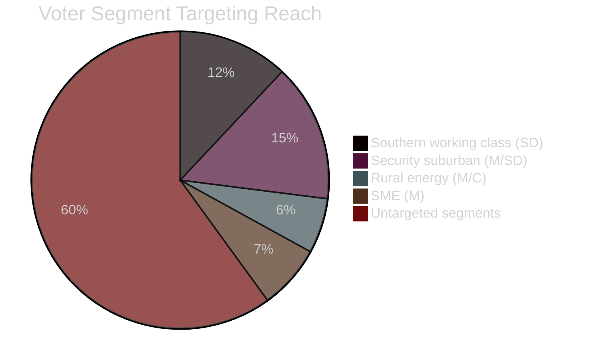

# Voter Segmentation Analysis — Sweden Month Ahead: May 2026

**Date**: 2026-04-25 | **Methodology**: Demographic, regional, ideological segmentation

## Key Segments Relevant to Legislative Sprint

| Segment | Size est. | Current alignment | Policy driver | Legislative response |
|---|---|---|---|---|
| Southern Sweden working class | ~12% | SD lean | Cost of living, fuel | HD03236 (fuel relief) |
| Urban knowledge workers | ~18% | S+MP lean | Climate, housing | HD03238 (env authority) — negative reaction likely |
| Rural energy communities | ~6% | M/C | Energy prices, wind revenue | HD03239 (wind municipality revenue) |
| Security-concerned suburban | ~15% | M+SD | Crime, juvenile justice | HD03237, HD03246 |
| Nordic solidarity left | ~8% | S+V+MP | Ukraine, rule of law | HD03231/232 (Ukraine) |
| SME entrepreneurs | ~7% | M | Business regulation, energy costs | HD03240 (electricity) |
| Young voters 18–29 | ~10% | S+MP | Climate, housing, jobs | No direct legislative response in this sprint |

## Implications for May–August Campaign Messaging

The legislative sprint targets the Southern working class (HD03236), security-concerned suburban (HD03237/HD03246), and rural energy (HD03239) segments most precisely. The young voter segment (10%) is notably absent from the legislative priorities — a structural gap that could become a S/MP attack surface.

## Regional Analysis

