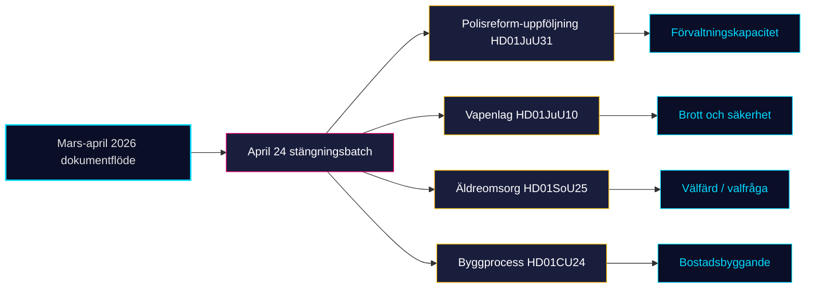

# Monthly Review — 2026-04-25

**Reporting window**: 2026-03-26 → 2026-04-25 (30 days)
**Analyst**: James Pether Sörling
**Mode**: Tier-C aggregation (period multiplier 1.5×)
**Riksmöte**: 2025/26
**Days to Election 2026**: 141 (target: September 13, 2026)
**Run ID**: 24931824129

## Lead story

The Tidö coalition (M–SD–KD–L) **closes its pre-election regulatory portfolio** on 2026-04-24 with four committee reports — firearms law (HD01JuU10), police-reform audit (HD01JuU31), elderly-care strengthening (HD01SoU25), construction-process efficiency (HD01CU24) — completing the package that began with the spring fiscal triple (HD03100/HD0399/HD03236) and the energy triptych (HD03240/HD03238/HD03239) in early April. The opposition's 16-interpellation drumbeat now centres on **disinformation, work-environment enforcement, and rights-of-the-detained** — three rhetorical wedges that map cleanly onto S/V/MP division-of-labour heading into the 18-week pre-campaign.

## File index

### Family A — Core Synthesis (9)

- [executive-brief.md](executive-brief.md) — BLUF + 3 decisions
- [synthesis-summary.md](synthesis-summary.md) — DIW-weighted lead
- [significance-scoring.md](significance-scoring.md) — DIW table + sensitivity
- [classification-results.md](classification-results.md) — 7-dim classification
- [swot-analysis.md](swot-analysis.md) — TOWS matrix
- [risk-assessment.md](risk-assessment.md) — 5-dim register
- [threat-analysis.md](threat-analysis.md) — Political Threat Taxonomy
- [stakeholder-perspectives.md](stakeholder-perspectives.md) — 6-lens stakeholder map

### Family B — Structural Metadata (2)

- [data-download-manifest.md](data-download-manifest.md)
- [cross-reference-map.md](cross-reference-map.md)

### Family C — Strategic Extensions (5)

- [scenario-analysis.md](scenario-analysis.md)
- [comparative-international.md](comparative-international.md)
- [devils-advocate.md](devils-advocate.md)
- [intelligence-assessment.md](intelligence-assessment.md)
- [methodology-reflection.md](methodology-reflection.md) ⭐

### Family D — Electoral & Domain Lenses (7)

- [election-2026-analysis.md](election-2026-analysis.md)
- [voter-segmentation.md](voter-segmentation.md)
- [coalition-mathematics.md](coalition-mathematics.md)
- [historical-parallels.md](historical-parallels.md)
- [media-framing-analysis.md](media-framing-analysis.md)
- [implementation-feasibility.md](implementation-feasibility.md)
- [forward-indicators.md](forward-indicators.md)

### Family E — Per-document files (8)

- documents/HD01CU24-analysis.md — Effektiv och säker byggprocess
- documents/HD01JuU10-analysis.md — En ny vapenlag
- documents/HD01JuU31-analysis.md — Polisreformen 2015 (RiR-uppföljning)
- documents/HD01SoU25-analysis.md — Stärkta insatser för äldre
- documents/HD10448-analysis.md — Desinformation om vindkraft
- documents/HD11747-analysis.md — Lönestöd vs farlig arbetsmiljö
- documents/HD11748-analysis.md — Christophe Sahabo (Burundi)
- documents/HD11749-analysis.md — Likvärdig utbildning i kriminalvård

