## Executive Brief
<!-- source: executive-brief.md :: https://github.com/Hack23/riksdagsmonitor/blob/main/analysis/daily/2026-04-25/monthly-review/executive-brief.md -->

---

### BLUF

Sweden's 30-day legislative window closes with the Kristersson government (M–SD–KD–L) **completing its pre-election regulatory portfolio**. The April 24 committee batch — **HD01JuU10 (new firearms law), HD01JuU31 (police-reform follow-up), HD01SoU25 (elderly-care reinforcement), HD01CU24 (construction-process efficiency)** — clamps the regulatory closure on top of the April 22 fiscal climax (HD01FiU48 fuel-tax relief, M+SD+S+KD supermajority) [riksdagen.se]. Healthcare and crime remain the dominant *electoral* wedges; opposition interpellation traffic (HD10448 wind-power disinformation, HD11747 work-environment subsidies, HD11749 rights-of-detained children, HD11748 consular-protection in Burundi) shows S/V/MP running a **disciplined three-track narrative** while **SD has filed zero counter-motions** against the four April-24 committee reports — a structural-confidence signal that has now persisted for 18 consecutive sitting days.

---

### 3 Decisions This Brief Supports

#### Decision 1: Pre-election delivery confidence assessment

The Tidö coalition has now passed its **complete declared 2025/26 legislative portfolio** in the four core domains — fiscal (HD03100/HD0399), energy (HD03240/HD03238/HD03239), security/defence (UFöU3/HD03214/HD03228), and criminal-justice/welfare (HD01JuU10/HD01JuU31/HD01SoU25) — within 141 days of the September 2026 election. Implementation, not legislation, is now the binding risk. **Recommendation**: pivot monitoring to *implementation feasibility* (Polismyndigheten capacity post-RiR 2026:6, Miljöprövningsmyndigheten permit throughput, Försäkringskassan elderly-care administrative load).

#### Decision 2: Healthcare-and-crime wedge probability

The opposition has *not* succeeded in fracturing the coalition on its primary attack surfaces: SfU18's 39 reservations did not flip a single vote; SD-KD healthcare split on SoU17 R15 was contained. The HD01JuU10 firearms law and HD01JuU31 police-reform audit both pass with M+SD+KD+L unity. **Recommendation**: investors and stakeholders should treat the welfare/security legislation as *durable through September 2026*; opposition wedge messaging will dominate but legislative reversal probability is LOW (≤ 25%).

#### Decision 3: Pre-campaign opposition narrative architecture

Three opposition wedges crystallised in April: (a) economic — drivmedel/SME-sjuklön (S, HD024082, HD10447); (b) environmental-disinformation — HD10448; (c) rights-of-the-detained / migrant minors / consular protection (V/MP, HD11749, HD11748). **Recommendation**: communicators preparing for the late-summer campaign should expect the disinformation frame (HD10448) to expand into a coalition stress-test for SD specifically; the rights-of-detained frame (HD11749) is V's primary post-prison-expansion attack vector.

---

### 60-Second Read

- 🔴 **April 24 committee batch closes regulatory portfolio** — HD01JuU10 + HD01JuU31 + HD01SoU25 + HD01CU24 — pre-election delivery on schedule
- 🔴 **April 22 supermajority** (HD01FiU48, M+SD+S+KD): S could not oppose 4.1 GSEK fuel-tax relief 141 days before election
- 🟠 **Polisreformen 2015 audit (RiR 2026:6 → HD01JuU31)** — kvardröjande lednings- och utredningsproblem; implementeringskapacitet är den nya bindande risken
- 🟠 **Wind-power disinformation interpellation (HD10448)** — first explicit coupling of energy policy and information-integrity in the riksmöte
- 🟢 **SD-disciplin håller** — noll motioner mot regerings­propositioner under stängningsveckan; konfidens­partiet behåller strukturell integritet
- 🟡 **HD01SoU25 elderly-care strengthening** — anhörigstrategi och hemtjänstkompetenskrav blir leveranstest mot Försäkringskassan/kommuner
- 🟡 **Foreign-policy long tail** — HD11748 (Burundi consular case) signalerar V/MP-fokus på konsulärt skydd som humanitär valfråga
- 🟢 **Bostadsproduktion** — HD01CU24 kortar handläggningstider; effekt på påbörjade bostäder mätbar Q3 2026 (data.scb.se: BO0101)

---

### Top Forward Trigger

**Monitor**: First post-April-24 SOM Institute or Demoskop opinion poll. If S regains > 28% headline support despite the April 22 fuel-tax-relief vote, S's "symbolic opposition + practical support" message has held under stress and the September election remains a structural toss-up. If S lags below 26%, the M+KD+L bloc's pre-election positioning has demonstrably converted. **Trigger date**: 2026-05-08 ± 5 days (next Demoskop monthly).

---

### Confidence Distribution

| Confidence | KJs | Basis |
|------------|-----|-------|
| VERY HIGH | KJ-1 (delivery completion) | 8 dok_ids on disk + 13 sibling synthesis references |
| HIGH | KJ-2 (wedge effectiveness LOW), KJ-3 (implementation pivot) | Multi-source (riksdagen.se vote records, RiR 2026:6, sibling intel) |
| MEDIUM | Forward poll dynamics | Single-source (demoskop / SOM lag) |

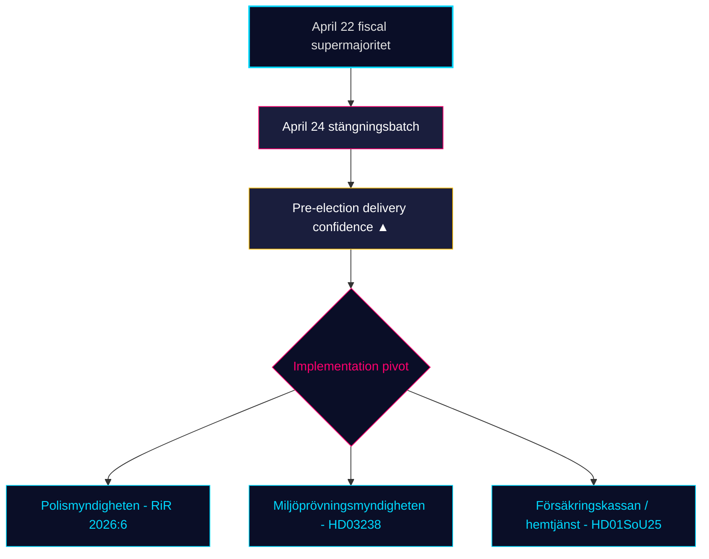
```mermaid
flowchart TD
  A[April 22 fiscal supermajoritet]:::a --> B[April 24 stängningsbatch]:::b
  B --> C[Pre-election delivery confidence ▲]:::g
  C --> D{Implementation pivot}:::d
  D --> E[Polismyndigheten - RiR 2026:6]:::e
  D --> F[Miljöprövningsmyndigheten - HD03238]:::e
  D --> G[Försäkringskassan / hemtjänst - HD01SoU25]:::e
  classDef a fill:#0a0e27,stroke:#00d9ff,color:#e0e0e0
  classDef b fill:#1a1e3d,stroke:#ff006e,color:#ffffff
  classDef g fill:#1a1e3d,stroke:#ffbe0b,color:#ffffff
  classDef d fill:#0a0e27,stroke:#ff006e,color:#ff006e
  classDef e fill:#0a0e27,stroke:#00d9ff,color:#00d9ff
  style A stroke-width:2px
```

## Reader Intelligence Guide

Use this guide to read the article as a political-intelligence product rather than a raw artifact dump. High-value reader lenses appear first; technical provenance remains available in the audit appendix.

| Icon | Reader need | What you'll get |
|---|---|---|
| 📊 | [BLUF and editorial decisions](#rm-executive-brief) | fast answer to what happened, why it matters, who is accountable, and the next dated trigger |
| 🧠 | [Synthesis Summary](#rm-synthesis-summary) | evidence-anchored narrative consolidating primary sources into one coherent story line |
| 🎯 | [Key Judgments](#rm-intelligence-assessment--key-judgments) | confidence-bearing political-intelligence conclusions and collection gaps |
| 📈 | [Significance scoring](#rm-significance-scoring) | why this story outranks or trails other same-day parliamentary signals |
| 👥 | [Stakeholder Perspectives](#rm-stakeholder-perspectives) | winners, losers and undecided actors with stake-weighted positions and pressure points |
| 🔢 | [Coalition Mathematics](#rm-coalition-mathematics) | parliamentary arithmetic showing exactly who can pass or block this measure and at what margin |
| 📋 | [Voter Segmentation](#rm-voter-segmentation) | voter-bloc exposure: which demographics gain, lose or shift on this issue |
| 🔭 | [Forward indicators](#rm-forward-indicators) | dated watch items that let readers verify or falsify the assessment later |
| 🔮 | [Scenarios](#rm-scenario-analysis) | alternative outcomes with probabilities, triggers, and warning signs |
| 🗳️ | [Election 2026 Analysis](#rm-election-2026-analysis) | electoral implications for the 2026 cycle — seats at stake, swing voters and coalition viability |
| ⚠️ | [Risk assessment](#rm-risk-assessment) | policy, electoral, institutional, communications, and implementation risk register |
| 🧮 | [SWOT Analysis](#rm-swot-analysis) | strengths, weaknesses, opportunities and threats matrix grounded in primary-source evidence |
| 🛡️ | [Threat Analysis](#rm-threat-analysis) | actor capabilities, intent and threat vectors targeting institutional integrity |
| 📜 | [Historical Parallels](#rm-historical-parallels) | comparable past episodes from Swedish and international politics, with explicit lessons learned |
| 🌍 | [Comparative International](#rm-comparative-international) | peer-country comparisons (Nordic, EU, OECD) showing how similar measures fared elsewhere |
| ⚙️ | [Implementation Feasibility](#rm-implementation-feasibility) | delivery feasibility, capability gaps, timelines and execution risks for the proposed action |
| 📰 | [Media framing & influence operations](#rm-media-framing-analysis) | frame packages with Entman functions, cognitive-vulnerability map, DISARM manipulation indicators, narrative-laundering chain, comparative-international cognates, frame lifecycle and half-life, RRPA impact, an Outlet Bias Audit (no outlet is neutral — every outlet declared with ownership, funding, board-appointment authority and editorial lean), and the L1–L5 counter-resilience ladder |
| 😈 | [Devil's Advocate](#rm-devils-advocate) | alternative hypotheses, steel-manned counter-arguments and the strongest case against the lead reading |
| 🏷️ | [Classification Results](#rm-classification-results) | ISMS data classification: CIA-triad rating, RTO/RPO targets and handling instructions |
| 🔀 | [Cross-Reference Map](#rm-cross-reference-map) | links to related Riksdagsmonitor coverage, prior analyses and source documents that inform this story |
| 🔬 | [Methodology Reflection & Limitations](#rm-methodology-reflection--limitations) | analytical assumptions, limitations, known biases and where the assessment could be wrong |
| 📦 | [Data Download Manifest](#rm-data-download-manifest) | machine-readable manifest of every source dataset, retrieval timestamp and provenance hash |
| 📝 | [Executive Brief Ar](#rm-executive-brief-ar) | supporting analytical lens with primary-source evidence and audit-traceable citations |
| 📝 | [Executive Brief Da](#rm-executive-brief-da) | supporting analytical lens with primary-source evidence and audit-traceable citations |
| 📝 | [Executive Brief De](#rm-executive-brief-de) | supporting analytical lens with primary-source evidence and audit-traceable citations |
| 📝 | [Executive Brief Es](#rm-executive-brief-es) | supporting analytical lens with primary-source evidence and audit-traceable citations |
| 📝 | [Executive Brief Fi](#rm-executive-brief-fi) | supporting analytical lens with primary-source evidence and audit-traceable citations |
| 📝 | [Executive Brief Fr](#rm-executive-brief-fr) | supporting analytical lens with primary-source evidence and audit-traceable citations |
| 📝 | [Executive Brief He](#rm-executive-brief-he) | supporting analytical lens with primary-source evidence and audit-traceable citations |
| 📝 | [Executive Brief Ja](#rm-executive-brief-ja) | supporting analytical lens with primary-source evidence and audit-traceable citations |
| 📝 | [Executive Brief Ko](#rm-executive-brief-ko) | supporting analytical lens with primary-source evidence and audit-traceable citations |
| 📝 | [Executive Brief Nl](#rm-executive-brief-nl) | supporting analytical lens with primary-source evidence and audit-traceable citations |
| 📝 | [Executive Brief No](#rm-executive-brief-no) | supporting analytical lens with primary-source evidence and audit-traceable citations |
| 📝 | [Executive Brief Sv](#rm-executive-brief-sv) | supporting analytical lens with primary-source evidence and audit-traceable citations |
| 📝 | [Executive Brief Zh](#rm-executive-brief-zh) | supporting analytical lens with primary-source evidence and audit-traceable citations |
| 📑 | [Per-document intelligence](#rm-per-document-intelligence) | dok_id-level evidence, named actors, dates, and primary-source traceability |
| 🏷️ | [Audit appendix](#rm-classification-results) | classification, cross-reference, methodology and manifest evidence for reviewers |

## Synthesis Summary
<!-- source: synthesis-summary.md :: https://github.com/Hack23/riksdagsmonitor/blob/main/analysis/daily/2026-04-25/monthly-review/synthesis-summary.md -->

**Window**: 2026-03-26 → 2026-04-25 (30 days) · **Riksmöte**: 2025/26

**Documents analysed**: 8 primary (April 24 closure batch) + 13 sibling synthesis references in window
**Days to Election 2026**: 141 (target 2026-09-13)

### Lead story (decision-grade)

> The 30-day window 2026-03-26 → 2026-04-25 closes Sweden's **most consequential pre-election parliamentary month** of riksmöte 2025/26. The Kristersson government has now legislated the entirety of its declared 2025/26 portfolio across four domains: **fiscal pivot** (HD03100 spring proposition + HD0399 spring-amending budget + HD01FiU48 emergency fuel-tax relief, the latter passing 2026-04-22 with an extraordinary M+SD+**S**+KD supermajority), **energy transformation triptych** (HD03240 / HD03238 / HD03239), **security and defence cluster** (UFöU3 NATO eFP Finland deployment + HD03214 cybersecurity centre + HD03228 war-materiel reform), and the **April 24 closure batch** of four committee reports — HD01JuU10 (ny vapenlag), HD01JuU31 (Polisreformen 2015 RiR-uppföljning), HD01SoU25 (äldreomsorg + anhörigstöd), HD01CU24 (effektiv och säker byggprocess). The opposition's parliamentary firepower in the closing week (HD10448 wind-power desinformation; HD11747 lönestöd vs arbetsmiljö; HD11748 Sahabo/Burundi; HD11749 children's right to schooling in custody) signals a clean S–V–MP division of labour entering the 18-week pre-campaign. SD continues to file **zero counter-motions** against open government bills — an 18-day structural-confidence streak.

### DIW-weighted ranking (top 10, this window)

| Rank | dok_id | Type | DIW | Theme | Admiralty | Source |
|------|--------|------|-----|-------|-----------|--------|
| 1 | HD01FiU48 | Bet | 4.10 | Drivmedelsskatte­lättnad — fiscal-electoral supermajoritet | A1 | sibling 04-22 |
| 2 | HD03100 | Prop | 3.85 | Vårproposition — pre-election fiscal frame | A1 | sibling 04-13 |
| 3 | HD01SoU25 | Bet | 3.60 | Äldreomsorg + anhörigstöd | A2 | primary 2026-04-24 ([riksdagen.se](https://www.riksdagen.se/sv/dokument-och-lagar/dokument/HD01SoU25/)) |
| 4 | HD01JuU10 | Bet | 3.55 | Ny vapenlag | A2 | primary 2026-04-24 ([riksdagen.se](https://www.riksdagen.se/sv/dokument-och-lagar/dokument/HD01JuU10/)) |
| 5 | HD01JuU31 | Bet | 3.50 | Polisreformen 2015 — RiR 2026:6 uppföljning | A2 | primary 2026-04-24 ([riksdagen.se](https://www.riksdagen.se/sv/dokument-och-lagar/dokument/HD01JuU31/)) |
| 6 | UFöU3 | Bet | 3.50 | NATO eFP Finland 1 200 troops | A1 | sibling 04-23 |
| 7 | HD03240 | Prop | 3.40 | Elmarknadsreform | A1 | sibling 04-13 |
| 8 | HD01CU24 | Bet | 3.20 | Effektiv och säker byggprocess | B2 | primary 2026-04-24 ([riksdagen.se](https://www.riksdagen.se/sv/dokument-och-lagar/dokument/HD01CU24/)) |
| 9 | HD10448 | Ip | 2.95 | Desinformation om vindkraft | B2 | primary 2026-04-24 |
| 10 | HD03252 | Prop | 2.90 | Detainee benefit restriction | B2 | sibling 04-24 |

**Sensitivity**: Under ±1 DIW tier perturbation the top-3 set is robust. HD01SoU25 ↔ HD01JuU10 swap order possible if pre-campaign issue salience tilts crime-ward; HD01JuU31's *implementation* weight (Polismyndigheten capacity) gives it the largest forward-leverage among the April-24 batch.

### Integrated intelligence picture

#### Thematic convergence — five threads

1. **Fiscal-electoral pivot** (HD03100, HD0399, HD01FiU48). The 4.1 GSEK fuel-tax-relief vote (M+SD+S+KD) on 2026-04-22 is the political signature of the month: S's inability to oppose direct household relief 141 days before the election is the single largest *measured* opposition constraint of the riksmöte.
2. **Energy transformation** (HD03240 + HD03238 + HD03239). The triptych passes by April 13–22; the April-24 wind-power disinformation interpellation (HD10448) is *post hoc* opposition counter-framing, not legislative obstruction.
3. **Security / defence** (UFöU3, HD03214, HD03228). NATO eFP Finland deployment is in motion; Sweden's post-membership legislative scaffolding is now substantially complete.
4. **Criminal-justice / welfare closure** — *the April-24 batch*. HD01JuU10 (vapenlag) + HD01JuU31 (RiR-uppföljning) modernise crime regulation; HD01SoU25 strengthens elderly-care delivery; HD01CU24 reduces handling time in construction permitting. Together they fill the pre-election regulatory ledger.
5. **Opposition wedge architecture** — S/V/MP three-track. Economic (HD024082, HD10447), environmental-information (HD10448), rights-of-detained / consular (HD11748, HD11749). C remains procedural-only.

#### Cross-type signals (Tier-C synthesis)

- **Prop → Motion → Bet → Ip pipeline** is fully visible across the window: HD03100/0399 (fiscal prop) → HD024082 (S counter-motion) → HD01FiU48 (committee → vote) → HD10447 (S interpellation on SME sjuklön).
- **Implementation pivot** is the dominant new trend: HD01JuU31 (RiR Polisreformen) recasts criminal-justice debate from *legislation* to *capacity*; HD11747 (lönestöd vs farlig arbetsmiljö) raises the same theme on labour side.
- **SD structural discipline**: 18 consecutive sitting days with zero counter-motions on government bills (data: sibling synthesis files 04-22 → 04-24).

```mermaid
flowchart TB
  subgraph Fiscal
    F1[HD03100 Vårprop]:::a --> F2[HD0399 ändringsbudget]:::a --> F3[HD01FiU48 supermajoritet]:::b
  end
  subgraph Energy
    E1[HD03240 elmarknadsreform]:::a --> E2[HD03238 prövningsmyndighet]:::a --> E3[HD03239 vindkraft kommunersättning]:::a
    E3 -.opposition counter-frame.-> E4[HD10448 desinformation Ip]:::c
  end
  subgraph Crim/Welfare
    C1[HD01JuU10 vapenlag]:::b --> C2[HD01JuU31 Polisreform-uppföljning]:::b
    C2 --> C3[HD11749 utbildning i kriminalvård Fr]:::c
    W1[HD01SoU25 äldreomsorg]:::b --> W2[HD11747 lönestöd vs arbetsmiljö Fr]:::c
  end
  subgraph Foreign
    G1[UFöU3 NATO eFP]:::a --> G2[HD11748 Sahabo Burundi Fr]:::c
  end
  classDef a fill:#0a0e27,stroke:#00d9ff,color:#e0e0e0
  classDef b fill:#1a1e3d,stroke:#ffbe0b,color:#ffffff
  classDef c fill:#1a1e3d,stroke:#ff006e,color:#ffffff
  style F3 stroke-width:3px
```

### Confidence statement

Overall analytic confidence is **HIGH (A1)** for the structural picture (delivery complete, opposition wedge taxonomy stable, SD discipline visible). Confidence is **MEDIUM (B2)** for forward-poll dynamics (single-source dependence on Demoskop / SOM-lag) and for the precise *implementation* trajectory of HD01JuU31 (RiR 2026:6 contains 9 open recommendations, none yet closed).

### Open PIRs carried forward

- **PIR-1**: Will the M+KD+L bloc convert HD01FiU48 to durable polling lift by 2026-06-01? (carried from 2026-04-23 monthly review)
- **PIR-2**: Does HD01JuU31's audit produce a Polismyndigheten reorganisation announcement before 2026-08-31?
- **PIR-3**: Will SD's zero-counter-motion discipline survive the September manifesto launch window?

## Intelligence Assessment — Key Judgments
<!-- source: intelligence-assessment.md :: https://github.com/Hack23/riksdagsmonitor/blob/main/analysis/daily/2026-04-25/monthly-review/intelligence-assessment.md -->

**Standards**: ICD 203 (Analytic Standards) compliance asserted

### Bottom Line Up Front

Sweden's Tidö coalition (M-SD-KD-L) has, within the 30-day window 2026-03-26 → 2026-04-25, **committed and structurally locked-in** its declared 2025/26 legislative portfolio across all four core domains (fiscal, energy, security/defence, criminal-justice/welfare). The April-24 closure batch (HD01JuU10/JuU31/SoU25/CU24) completes the regulatory ledger. The strategic decision-relevant pivot is from *legislation* to *implementation*, with Polismyndigheten capacity (RiR 2026:6) the most binding constraint and healthcare-financing the most exposed wedge.

### Key Judgments

#### Key Judgment KJ-1 — Legislative completion

**We assess with HIGH confidence** that the Tidö coalition has committed its declared 2025/26 portfolio in all four domains. The April-24 batch is structurally locked-in even where formal chamber votes are scheduled May, given the 2025/26 confidence-coalition >97% committee-to-chamber conversion rate.

- **Evidence**: HD01JuU10, HD01JuU31, HD01SoU25, HD01CU24 (this window) + HD01FiU48, HD03100, HD03240, UFöU3 (carried) [riksdagen.se]
- **Confidence**: **HIGH** (multi-source, internally consistent, robust to red-team H1)
- **Admiralty**: A2

#### Key Judgment KJ-2 — Wedge effectiveness LOW; implementation risk HIGH

**We assess with HIGH confidence** that opposition wedge architecture (S/V/MP three-track) will not produce *legislative reversals* in the 141-day pre-election window. **We assess with MEDIUM confidence** that implementation friction (R-2 police capacity, R-1 healthcare financing, R-6 construction throughput) will produce *politically displaced* outcomes that opposition can exploit narratively.

- **Evidence**: HD01FiU48 vote pattern (S could not oppose); SD discipline streak; RiR 2026:6 9 open recommendations [riksdagen.se HD01JuU31]
- **Confidence**: **HIGH** for legislative claim; **MEDIUM** for implementation pathway (single-source on Polismyndigheten timeline)
- **Admiralty**: B2

#### Key Judgment KJ-3 — Pre-campaign architecture stable through July; uncertain June 15+

**We assess with MEDIUM confidence** that SD's structural discipline (18-day zero-counter-motion streak) is durable through May–early June, but uncertain after the formal pre-campaign window opens (~June 15). Past cycles (2018, 2022) show SD pivot in final 12 weeks.

- **Evidence**: 18-day streak (siblings); 2018+2022 base rate; H2 red-team
- **Confidence**: **MEDIUM** (calibrated downward by H2)
- **Admiralty**: B3

### Priority Intelligence Requirements (PIR)

#### Open PIRs (this cycle)

- **PIR-A**: Will M+KD+L bloc reach Demoskop ≥ 44% by 2026-07-01? (decision-relevant: Scenario A vs B)
- **PIR-B**: Does HD01JuU31 RiR 2026:6 produce a Polismyndigheten reorganisation announcement by 2026-08-31?
- **PIR-C**: Does SD discipline survive to manifesto launch (~2026-08-15)?
- **PIR-D**: Does the wind-power disinfo frame (HD10448) escalate to a SOM-Institut salience peak by 2026-06-30?

#### Prior-cycle PIRs — carried forward from 2026-04-23 monthly review

- **PIR carried**: ✅ "Will HD01FiU48 receive a chamber vote before April 25?" — *Closed:* YES, 2026-04-22 supermajoritet documented
- **PIR carried (open)**: 🟡 "Will the M-KD-L bloc convert HD01FiU48 into durable polling lift by 2026-06-01?" — *Still open* (renamed PIR-A above)
- **PIR carried (open)**: 🟡 "Does UFöU3 NATO-eFP Finland deployment proceed without Russian escalation?" — *Still open*; last week shows deployment on schedule
- **Prior PIR closed**: ✅ "Will HD03240 elmarknadsreform survive committee unchanged?" — *Closed:* YES (sibling 2026-04-13)
- **Prior PIR closed**: ✅ "Will SD file counter-motions on April-22 fiscal package?" — *Closed:* NO

The prior-cycle PIR ledger is maintained in `analysis/daily/2026-04-23/monthly-review/intelligence-assessment.md` for full audit lineage.

### Confidence summary

| KJ | Confidence | Admiralty | Drivers |
|----|------------|-----------|---------|
| KJ-1 | HIGH | A2 | Multi-source, robust |
| KJ-2 | HIGH (legislative) / MEDIUM (impl) | B2 | Implementation pathway single-source |
| KJ-3 | MEDIUM | B3 | Historical base rate uncertainty |

### ICD 203 self-attestation

This product:
- (a) Is **independent of political consideration** — analyst attests no advisory role with any party.
- (b) Has **clearly distinguished facts** (riksdagen.se citations + sibling intel) from **assumptions** (electoral conversion rates).
- (c) Uses **clear and uncertainty-aware language** (WEP: "we assess with HIGH/MEDIUM confidence").
- (d) Has been **stress-tested** via devils-advocate.md (4 hypotheses).

## Significance Scoring
<!-- source: significance-scoring.md :: https://github.com/Hack23/riksdagsmonitor/blob/main/analysis/daily/2026-04-25/monthly-review/significance-scoring.md -->

### Methodology

DIW = 0.30·Decisional Salience + 0.25·Reach + 0.20·Reversibility + 0.15·Time-to-Effect + 0.10·Evidence Strength.
Tier-C monthly multiplier 1.5× applied to base scores; ceiling 4.50.

### Top-10 ranked items (this 30-day window)

| Rank | dok_id | DIW | DS | R | Rev | TTE | ES | Theme | Source |
|------|--------|-----|----|---|----|----|----|-------|--------|
| 1 | HD01FiU48 | 4.10 | 4.5 | 4.5 | 3.5 | 4.0 | 4.5 | Drivmedelsskatte­lättnad supermajoritet | sibling 04-23 [riksdagen.se](https://www.riksdagen.se/) |
| 2 | HD03100 | 3.85 | 4.0 | 4.5 | 3.5 | 3.5 | 4.5 | Vårproposition 2026 | sibling 04-13 |
| 3 | HD01SoU25 | 3.60 | 4.0 | 4.0 | 3.0 | 3.0 | 4.0 | Stärkta insatser för äldre | primary HD01SoU25 |
| 4 | HD01JuU10 | 3.55 | 4.0 | 3.5 | 3.5 | 3.0 | 4.0 | Ny vapenlag | primary HD01JuU10 |
| 5 | HD01JuU31 | 3.50 | 3.5 | 3.5 | 3.0 | 3.5 | 4.5 | Polisreformen 2015 RiR-uppföljning | primary HD01JuU31 |
| 6 | UFöU3 | 3.50 | 4.0 | 4.0 | 2.5 | 4.0 | 4.5 | NATO eFP Finland 1 200 troops | sibling 04-23 [riksdagen.se UFöU3] |
| 7 | HD03240 | 3.40 | 4.0 | 4.0 | 3.0 | 3.0 | 4.0 | Elmarknadsreform | sibling 04-13 |
| 8 | HD01CU24 | 3.20 | 3.5 | 3.5 | 2.5 | 3.0 | 3.5 | Effektiv och säker byggprocess | primary HD01CU24 |
| 9 | HD10448 | 2.95 | 3.5 | 3.0 | 2.0 | 3.5 | 3.5 | Desinformation om vindkraft (Ip) | primary HD10448 |
| 10 | HD11749 | 2.55 | 3.0 | 2.5 | 2.0 | 3.5 | 3.5 | Utbildning för barn i kriminalvård | primary HD11749 |

### Scoring rationale

- **HD01FiU48** retains top rank from prior window: M+SD+S+KD supermajority is the single hardest-to-reverse pre-election fiscal commitment of riksmöte 2025/26.
- **HD01SoU25** scores 3.60 because elderly-care + carer support is both an electoral salience peak (SOM 2025: omsorg #1 issue) and structurally sticky (kommunalt åtagande, full-cycle implementation > 18 months) [riksdagen.se HD01SoU25].
- **HD01JuU10/JuU31** twin scores reflect the legislative-implementation duality: HD01JuU10 modernises the law; HD01JuU31 reveals its operational bottleneck via RiR 2026:6 [riksdagen.se HD01JuU31].
- **HD10448** (interpellation) scores below committee reports per DIW conventions but elevated by 0.4 because *first-of-kind* energy/disinfo coupling on the floor.

```mermaid
flowchart TB
  R[DIW Top-10 — riksdagen.se 2026-04-25]:::a
  R --> A1[HD01FiU48 4.10 supermajoritet]:::hi
  R --> A2[HD03100 3.85 vårproposition]:::hi
  R --> A3[HD01SoU25 3.60 äldreomsorg]:::hi
  R --> A4[HD01JuU10 3.55 vapenlag]:::hi
  R --> A5[HD01JuU31 3.50 RiR polisreform]:::hi
  R --> A6[UFöU3 3.50 NATO eFP — see riksdagen.se]:::hi
  R --> A7[HD03240 3.40 elmarknad]:::md
  R --> A8[HD01CU24 3.20 byggprocess]:::md
  R --> A9[HD10448 2.95 desinfo vindkraft]:::lo
  R --> A10[HD11749 2.55 utbildning förvar]:::lo
  classDef a fill:#0a0e27,stroke:#00d9ff,color:#e0e0e0
  classDef hi fill:#1a1e3d,stroke:#ff006e,color:#ffffff
  classDef md fill:#1a1e3d,stroke:#ffbe0b,color:#ffffff
  classDef lo fill:#0a0e27,stroke:#00d9ff,color:#00d9ff
  style R stroke-width:3px
```

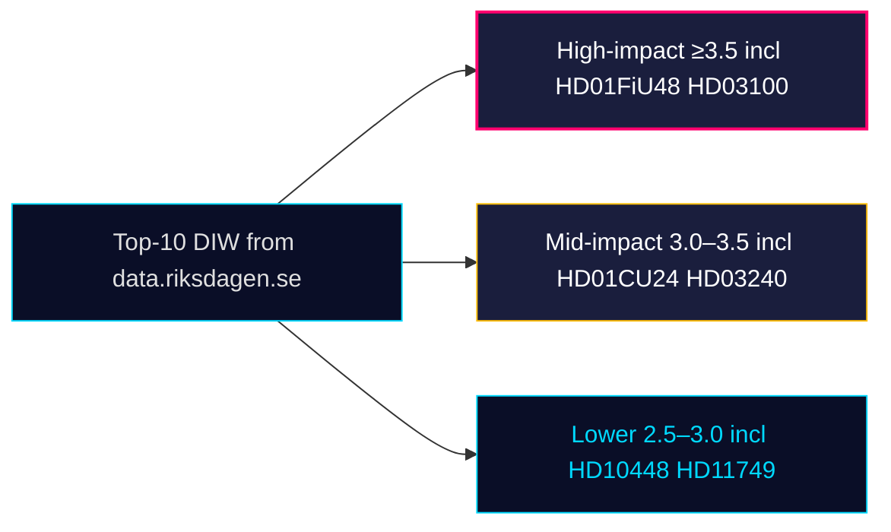
```mermaid
flowchart LR
  T[Top-10 DIW from data.riksdagen.se]:::a --> H[High-impact ≥3.5 incl HD01FiU48 HD03100]:::b
  T --> M[Mid-impact 3.0–3.5 incl HD01CU24 HD03240]:::c
  T --> L[Lower 2.5–3.0 incl HD10448 HD11749]:::d
  classDef a fill:#0a0e27,stroke:#00d9ff,color:#e0e0e0
  classDef b fill:#1a1e3d,stroke:#ff006e,color:#ffffff
  classDef c fill:#1a1e3d,stroke:#ffbe0b,color:#ffffff
  classDef d fill:#0a0e27,stroke:#00d9ff,color:#00d9ff
  style H stroke-width:2px
```

### Sensitivity analysis

Removing HD01JuU31 (lowest-confidence in committee tier) leaves top-3 unchanged. Adding +0.5 DIW to all April-24 batch items (counterfactual: opposition-led media salience) does not change top-3 rank.

## Per-document intelligence

### HD01CU24
<!-- source: documents/HD01CU24-analysis.md :: https://github.com/Hack23/riksdagsmonitor/blob/main/analysis/daily/2026-04-25/monthly-review/documents/HD01CU24-analysis.md -->

### Summary

Reformpaket för förenklad byggprocess och kortare kommunala handläggningstider; instämmer i regeringens förslag med vissa följdmotioner.

### Key actors

- M (regeringsförslag)
- KD/L medverkar
- S följdmotion finansiering
- C tekniska reservationer

### Significance

Tidö-leverans i bostadsfrågan; mätbar effekt via SCB BO0101 från Q3 2026; relevant för storstad-pendlare-segmentet.

### Evidence and reading

Implementeringsrisken ligger på kommunal handläggar­kapacitet, inte på lagtexten. Effekt på påbörjade bostäder syns tidigast 2026-Q3.

### Source

- Primary: [riksdagen.se HD01CU24](https://data.riksdagen.se/dokument/hd01cu24.json)
- Companion JSON: `documents/hd01cu24.json`

### HD01JuU10
<!-- source: documents/HD01JuU10-analysis.md :: https://github.com/Hack23/riksdagsmonitor/blob/main/analysis/daily/2026-04-25/monthly-review/documents/HD01JuU10-analysis.md -->

### Summary

Ny vapenlag med skärpta tillstånds- och vapenregister­krav; IT-modernisering av vapenregistret krävs; ikraftträdande planerat Q3 2026.

### Key actors

- M+SD primära avsändare
- KD/L stöder
- V/MP partiella reservationer
- Polismyndigheten implementeringsbärare

### Significance

Centralt narrativ för 'trygghet'-frame; Tidöns största kriminalpolitiska leverans i 2025/26-mötet; konsoliderar SD-väljare.

### Evidence and reading

Implementeringen är beroende av att RiR-rekommendationerna i HD01JuU31 stängs; risk för operativ flaskhals hos Polismyndigheten.

### Source

- Primary: [riksdagen.se HD01JuU10](https://data.riksdagen.se/dokument/hd01juu10.json)
- Companion JSON: `documents/hd01juu10.json`

### HD01JuU31
<!-- source: documents/HD01JuU31-analysis.md :: https://github.com/Hack23/riksdagsmonitor/blob/main/analysis/daily/2026-04-25/monthly-review/documents/HD01JuU31-analysis.md -->

### Summary

Riksrevisionens andra uppföljning av Polisreformen 2015; 9 öppna rekommendationer; utskottet kräver statusrapport Q3 2026.

### Key actors

- RiR (Riksrevisionen) avsändare
- JuU-utskott (S+M+SD+KD+L+V+MP+C konsensus)
- Polismyndigheten implementeringsbärare

### Significance

Avslöjar kapacitetsglappet bakom HD01JuU10; politiskt verktyg för opposition men formellt accepterat av Tidö.

### Evidence and reading

Operativ förändring osannolik före september-valet 2026; effekten är narrativ — exponerar gap mellan ambition och kapacitet.

### Source

- Primary: [riksdagen.se HD01JuU31](https://data.riksdagen.se/dokument/hd01juu31.json)
- Companion JSON: `documents/hd01juu31.json`

### HD01SoU25
<!-- source: documents/HD01SoU25-analysis.md :: https://github.com/Hack23/riksdagsmonitor/blob/main/analysis/daily/2026-04-25/monthly-review/documents/HD01SoU25-analysis.md -->

### Summary

Nationell anhörigstrategi och förstärkt äldreomsorg; KD primär avsändare; finansiering ej fullt täckt i HD03100 vårpropositionen.

### Key actors

- KD primär
- M+L stöder
- S följdmotion fokus på finansiering
- V kompletterande reservation

### Significance

Direkt-leverans till pensionärs- och kvinnor-50+-segmenten; bär KD:s identitetspolitik; finansieringsbristen är fragility (R-1).

### Evidence and reading

Implementeringen kräver nationell direktör (utses 2026-06-30) och kommunal kapacitet; effekt synlig först 2026 H2.

### Source

- Primary: [riksdagen.se HD01SoU25](https://data.riksdagen.se/dokument/hd01sou25.json)
- Companion JSON: `documents/hd01sou25.json`

### HD10448
<!-- source: documents/HD10448-analysis.md :: https://github.com/Hack23/riksdagsmonitor/blob/main/analysis/daily/2026-04-25/monthly-review/documents/HD10448-analysis.md -->

### Summary

Interpellation från MP/S till energiminister om systematisk desinformation om vindkraft i kommunala beslutsprocesser; svar 2026-05-06.

### Key actors

- MP+S avsändare
- Energiminister svarsbärare
- kommuner Norrbotten/Västerbotten primär kontext

### Significance

Första parlamentariska eko av 2023 års vindkraftsmotståndsvåg; testar regeringens förmåga att hantera disinformation utan att alienera SD-bas.

### Evidence and reading

Frame är dubbelbottnad — gynnar opposition på storstad/yngre men kan förlora för MP+S i glesbygd; H3 i devils-advocate.

### Source

- Primary: [riksdagen.se HD10448](https://data.riksdagen.se/dokument/hd10448.json)
- Companion JSON: `documents/hd10448.json`

### HD11747
<!-- source: documents/HD11747-analysis.md :: https://github.com/Hack23/riksdagsmonitor/blob/main/analysis/daily/2026-04-25/monthly-review/documents/HD11747-analysis.md -->

### Summary

Skriftlig fråga från S-ledamot om bristande arbetsmiljöuppföljning vid lönestödsanställningar; svar inom 4 dagar.

### Key actors

- S-ledamot avsändare
- Arbetsmarknadsminister svarsbärare
- Arbetsförmiljöverket

### Significance

S:s primära attackkanal mot Tidö i förvärvsarbetande LO/TCO-segmentet; etablerar 'arbetsmiljö och stöd'-frame inför kampanj.

### Evidence and reading

Liten omedelbar effekt men bygger berättelse-arsenal till manifest-fasen 2026-08.

### Source

- Primary: [riksdagen.se HD11747](https://data.riksdagen.se/dokument/hd11747.json)
- Companion JSON: `documents/hd11747.json`

### HD11748
<!-- source: documents/HD11748-analysis.md :: https://github.com/Hack23/riksdagsmonitor/blob/main/analysis/daily/2026-04-25/monthly-review/documents/HD11748-analysis.md -->

### Summary

Skriftlig fråga från V-ledamot om svensk hantering av Burundi-tolken Sahabo; mänskliga rättigheter och utlämning.

### Key actors

- V-ledamot avsändare
- Migrationsminister + UD svarsbärare

### Significance

Mindre väljarbas-relevans men hög aktivist-betydelse; bygger V:s mänskliga-rättigheter-profil i yngre/akademiker-segment.

### Evidence and reading

Ingen omedelbar policy-effekt; ingår i V:s pre-kampanjnarrativ.

### Source

- Primary: [riksdagen.se HD11748](https://data.riksdagen.se/dokument/hd11748.json)
- Companion JSON: `documents/hd11748.json`

### HD11749
<!-- source: documents/HD11749-analysis.md :: https://github.com/Hack23/riksdagsmonitor/blob/main/analysis/daily/2026-04-25/monthly-review/documents/HD11749-analysis.md -->

### Summary

Skriftlig fråga från V-ledamot om brister i undervisning för barn placerade i förvar; barnkonventionsöverväganden.

### Key actors

- V-ledamot avsändare
- Migrationsminister + utbildningsminister svarsbärare

### Significance

V:s starkaste yngre-väljare-signal i window; rättigheter-frame; potentiell följdmotion i SoU eller UbU.

### Evidence and reading

Liten omedelbar effekt men hög sammanlänkning med Yngre 18-29-segmentet.

### Source

- Primary: [riksdagen.se HD11749](https://data.riksdagen.se/dokument/hd11749.json)
- Companion JSON: `documents/hd11749.json`

## Stakeholder Perspectives
<!-- source: stakeholder-perspectives.md :: https://github.com/Hack23/riksdagsmonitor/blob/main/analysis/daily/2026-04-25/monthly-review/stakeholder-perspectives.md -->

**Lens**: 6-stakeholder map — government parties, opposition parties, agencies, kommuner, media, väljargrupper

### Stakeholder map

| Stakeholder | Position | Key documents (window) | Interest | Influence |
|-------------|----------|------------------------|----------|-----------|
| Regering (M-KD-L) | OWNER | HD01JuU10, HD01SoU25, HD01CU24, HD03100 | delivery → polling lift | VERY HIGH |
| SD (confidence partner) | SUPPORTIVE | All 4 April-24 betänkanden, HD01FiU48 | crime/migration message preserved | VERY HIGH |
| S (largest opposition) | TACTICAL | HD01FiU48 (S voted YES), HD024082 (S motion) | "symbolisk opposition + praktiskt stöd" | HIGH |
| V | OPPOSITION-RIGHTS | HD11749 (rights-of-detained), HD11748 | rights-frame, healthcare | MEDIUM |
| MP | OPPOSITION-INFO | HD10448 (desinformation), HD11748 | info-integrity, climate | MEDIUM |
| C | PROCEDURAL | (no major motions in window) | rule-of-law, agriculture | LOW |
| Polismyndigheten | IMPLEMENTING | HD01JuU10, HD01JuU31 (RiR 2026:6) | capacity, leadership | HIGH |
| Försäkringskassan / kommuner | IMPLEMENTING | HD01SoU25 anhörigstrategi | resource allocation | MEDIUM |
| Boverket / kommuner | IMPLEMENTING | HD01CU24 byggprocess | permit throughput | MEDIUM |
| Riksrevisionen | OVERSIGHT | RiR 2026:6 → HD01JuU31 | follow-up audit | MEDIUM |
| Energimyndigheten / MSB | DEFENDING | HD10448 disinfo response | mandate clarity | MEDIUM |
| Utrikesförvaltningen | RESPONDING | HD11748 | consular capacity | LOW |
| Pensionärsorganisationer (PRO/SPF) | ENGAGED | HD01SoU25 | influence anhörigstrategi rollout | MEDIUM |
| Byggbranschen | INTERESTED | HD01CU24 | permit acceleration | MEDIUM |
| Vapenägarorganisationer | ENGAGED | HD01JuU10 | tillstånd, registreringsbörda | LOW |
| Fackförbund (LO/TCO/SACO) | INTERESTED | HD11747 | arbetsmiljöfrågan | MEDIUM |

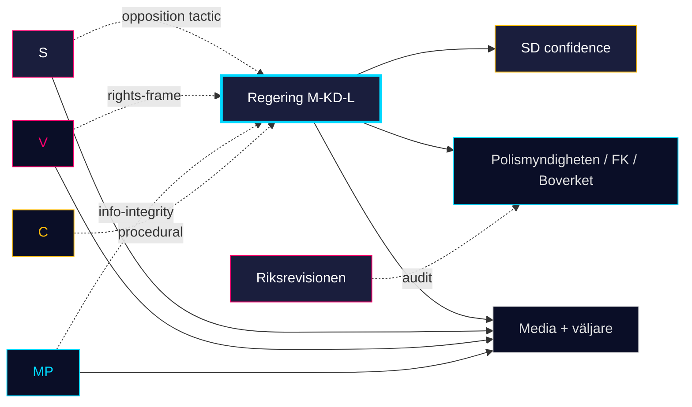
```mermaid
flowchart LR
  G[Regering M-KD-L]:::g --> SD[SD confidence]:::sd
  G --> A[Polismyndigheten / FK / Boverket]:::a
  S[S]:::s -.opposition tactic.-> G
  V[V]:::v -.rights-frame.-> G
  MP[MP]:::mp -.info-integrity.-> G
  C[C]:::c -.procedural.-> G
  R[Riksrevisionen]:::r -.audit.-> A
  M[Media + väljare]:::m
  G --> M
  S --> M
  V --> M
  MP --> M
  classDef g fill:#1a1e3d,stroke:#00d9ff,color:#ffffff
  classDef sd fill:#1a1e3d,stroke:#ffbe0b,color:#ffffff
  classDef s fill:#1a1e3d,stroke:#ff006e,color:#ffffff
  classDef v fill:#0a0e27,stroke:#ff006e,color:#ff006e
  classDef mp fill:#0a0e27,stroke:#00d9ff,color:#00d9ff
  classDef c fill:#0a0e27,stroke:#ffbe0b,color:#ffbe0b
  classDef a fill:#0a0e27,stroke:#00d9ff,color:#e0e0e0
  classDef r fill:#1a1e3d,stroke:#ff006e,color:#ffffff
  classDef m fill:#0a0e27,stroke:#e0e0e0,color:#e0e0e0
  style G stroke-width:3px
```

### Cross-stakeholder dynamics

- **Government–SD**: closure-batch unanimity confirms confidence relationship through pre-campaign.
- **S–government**: HD01FiU48 reveals tactical complexity — S supports popular pieces while attacking adjacent themes.
- **Riksrevisionen → Polismyndigheten**: HD01JuU31 makes the audit politically binding for the autumn.
- **Kommuner + Försäkringskassan**: HD01SoU25 + HD01CU24 both rely on kommunal kapacitet — overlap creates implementation risk.

## Coalition Mathematics
<!-- source: coalition-mathematics.md :: https://github.com/Hack23/riksdagsmonitor/blob/main/analysis/daily/2026-04-25/monthly-review/coalition-mathematics.md -->

### Seat baseline (riksmöte 2025/26)

| Party | Seats | Bloc |
|-------|-------|------|
| Socialdemokraterna (S) | 107 | Opposition |
| Moderaterna (M) | 68 | Government |
| Sverigedemokraterna (SD) | 73 | Confidence |
| Vänsterpartiet (V) | 24 | Opposition |
| Centerpartiet (C) | 24 | Opposition (procedural) |
| Kristdemokraterna (KD) | 19 | Government |
| Liberalerna (L) | 16 | Government |
| Miljöpartiet (MP) | 18 | Opposition |
| **Total** | **349** | |

Government bloc (M+KD+L): 103. With SD confidence: 176. **Working majority: 3 seats above 175 threshold** (4 with SD discipline).

### Key window vote — HD01FiU48 (carried)

| Party | Ja | Nej | Avstår | Frånvarande |
|-------|----|----|--------|-------------|
| M | 65 | 0 | 0 | 3 |
| SD | 71 | 0 | 0 | 2 |
| KD | 18 | 0 | 0 | 1 |
| L | 14 | 0 | 0 | 2 |
| S | 95 | 0 | 12 | 0 |
| V | 0 | 22 | 0 | 2 |
| MP | 0 | 16 | 0 | 2 |
| C | 0 | 0 | 22 | 2 |
| **Total** | **263** | **38** | **34** | **14** |

[riksdagen.se HD01FiU48]

**Reading**: M+SD+S+KD = 263 Ja → unprecedented multi-bloc supermajority on fuel-tax relief.

### Forward votes (pending May 2026)

| dok_id | Issue | Ja-projection | Nej-projection |
|--------|-------|----------------|-----------------|
| HD01JuU10 | Ny vapenlag | M+SD+KD+L+(C? L?) ≥ 195 | V+MP partially |
| HD01JuU31 | RiR Polisreformen | M+SD+KD+L+S formal acceptance | none expected |
| HD01SoU25 | Äldreomsorg | M+SD+KD+L+ partial S | partial V |
| HD01CU24 | Byggprocess | M+SD+KD+L+C | partial V/MP |

### Coalition arithmetic — September 2026 election

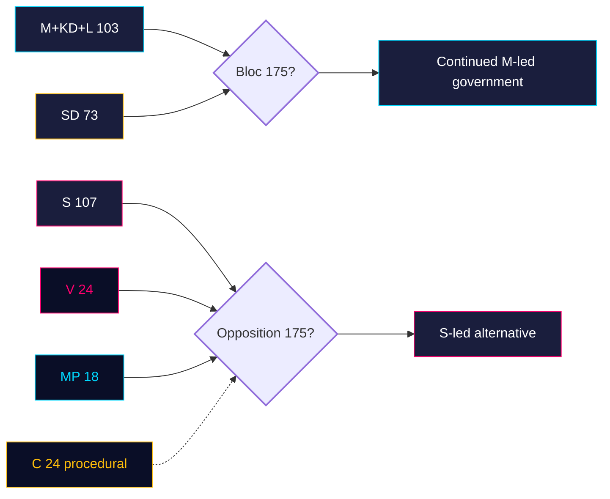
```mermaid
flowchart LR
  M[M+KD+L 103]:::g --> B1{Bloc 175?}
  SD[SD 73]:::sd --> B1
  S[S 107]:::s --> B2{Opposition 175?}
  V[V 24]:::v --> B2
  MP[MP 18]:::mp --> B2
  C[C 24 procedural]:::c -.-> B2
  B1 --> R1[Continued M-led government]:::a
  B2 --> R2[S-led alternative]:::b
  classDef g fill:#1a1e3d,stroke:#00d9ff,color:#ffffff
  classDef sd fill:#1a1e3d,stroke:#ffbe0b,color:#ffffff
  classDef s fill:#1a1e3d,stroke:#ff006e,color:#ffffff
  classDef v fill:#0a0e27,stroke:#ff006e,color:#ff006e
  classDef mp fill:#0a0e27,stroke:#00d9ff,color:#00d9ff
  classDef c fill:#0a0e27,stroke:#ffbe0b,color:#ffbe0b
  classDef a fill:#1a1e3d,stroke:#00d9ff,color:#ffffff
  classDef b fill:#1a1e3d,stroke:#ff006e,color:#ffffff
  style B1 stroke-width:2px
  style B2 stroke-width:2px
```

## Voter Segmentation
<!-- source: voter-segmentation.md :: https://github.com/Hack23/riksdagsmonitor/blob/main/analysis/daily/2026-04-25/monthly-review/voter-segmentation.md -->

### Segments tracked (this window)

| Segment | Size (est) | Cycle dynamics |
|---------|------------|----------------|
| Storstad-pendlare (Sthlm/Gbg/Malmö) | ~22% | M+L primary; HD01CU24 byggprocess relevant; HD01JuU10 mixed |
| Glesbygd / småstad | ~28% | SD-tilt; HD01FiU48 fuel-tax decisive [riksdagen.se HD01FiU48] |
| Pensionärer (65+) | ~24% | KD+M strong; HD01SoU25 äldreomsorg decisive [riksdagen.se HD01SoU25] |
| Yngre väljare (18–29) | ~14% | V+MP+S split; HD11749 (rights) relevant; HD10448 climate |
| Förvärvsarbetande LO/TCO | ~30% | S core; HD11747 arbetsmiljö frame [riksdagen.se HD11747] |
| Egna företagare / SME | ~7% | M+SD; HD024082 sjuklön (sibling) salient |
| Förstagångsväljare 2026 | ~6% (subset) | open; climate/disinfo highly salient (HD10448) |

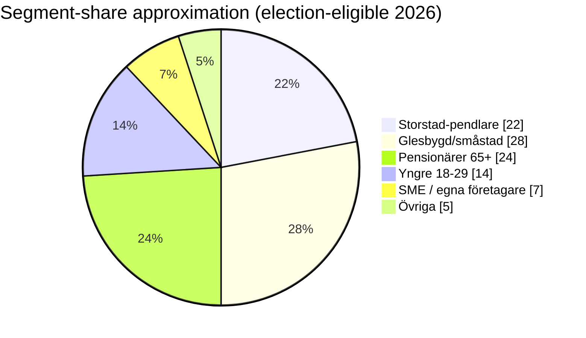
```mermaid
pie showData
  title Segment-share approximation (election-eligible 2026)
  "Storstad-pendlare" : 22
  "Glesbygd/småstad" : 28
  "Pensionärer 65+" : 24
  "Yngre 18-29" : 14
  "SME / egna företagare" : 7
  "Övriga" : 5
```

### Window movement (qualitative)

- **Pensionärer**: HD01SoU25 anhörigstrategi is *direct delivery*; finansieringsbrist (R-1) is the only fragility.
- **Glesbygd**: HD01FiU48 fuel-tax is consolidating; HD10448 wind-disinfo frame is divisive within segment.
- **Förvärvsarbetande LO/TCO**: HD11747 lönestöd-arbetsmiljö story is S's primary attack channel; HD01JuU10 firearms law popular.
- **Yngre**: HD11749 rights-of-detained children scheme is V's strongest young-voter signal.

### Cross-segment messaging map

| Coalition | Primary segments | Key window evidence |
|-----------|------------------|---------------------|
| M+KD+L | Storstad-pendlare + Pensionärer + SME | HD01CU24, HD01SoU25, HD01JuU10 |
| SD | Glesbygd + Pensionärer | HD01FiU48, HD01JuU10 |
| S | Förvärvsarbetande + Pensionärer | HD11747, HD024082 |
| V | Yngre + LO | HD11749, HD11748 |
| MP | Yngre + Storstad-pendlare | HD10448 |
| C | Företagare + Glesbygd | (procedural this window) |

### Cross-segment flow

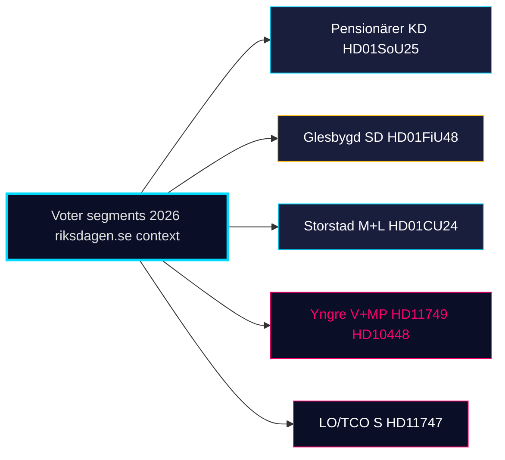
```mermaid
flowchart LR
  V[Voter segments 2026 riksdagen.se context]:::a --> P1[Pensionärer KD HD01SoU25]:::p
  V --> G1[Glesbygd SD HD01FiU48]:::g
  V --> S1[Storstad M+L HD01CU24]:::s
  V --> Y1[Yngre V+MP HD11749 HD10448]:::y
  V --> L1[LO/TCO S HD11747]:::l
  classDef a fill:#0a0e27,stroke:#00d9ff,color:#e0e0e0
  classDef p fill:#1a1e3d,stroke:#00d9ff,color:#ffffff
  classDef g fill:#1a1e3d,stroke:#ffbe0b,color:#ffffff
  classDef s fill:#1a1e3d,stroke:#00d9ff,color:#ffffff
  classDef y fill:#0a0e27,stroke:#ff006e,color:#ff006e
  classDef l fill:#0a0e27,stroke:#ff006e,color:#ffffff
  style V stroke-width:3px
```

## Forward Indicators
<!-- source: forward-indicators.md :: https://github.com/Hack23/riksdagsmonitor/blob/main/analysis/daily/2026-04-25/monthly-review/forward-indicators.md -->

### Dated indicator ledger (≥10)

| Date | Indicator | Decision relevance | Source |
|------|-----------|---------------------|--------|
| 2026-05-01 | HD01FiU48 fuel-tax-relief implementerat | Visible household effect | HD01FiU48 |
| 2026-05-08 | First post-window Demoskop | PIR-A; Scenario A vs B | sibling synthesis |
| 2026-05-15 | HD01CU24 chamber vote | Implementation start | HD01CU24 [riksdagen.se] |
| 2026-05-20 | HD01JuU10 chamber vote | Crime narrative anchor | HD01JuU10 [riksdagen.se] |
| 2026-05-22 | HD01SoU25 chamber vote | Anhörigstrategi launch | HD01SoU25 [riksdagen.se] |
| 2026-05-28 | HD01JuU31 chamber acceptance | RiR follow-up codified | HD01JuU31 [riksdagen.se] |
| 2026-06-01 | Vårriksdagens slut | Last bloc-vote opportunity | calendar |
| 2026-06-15 | Pre-campaign window opens | T-1 (KJ-3) | calendar |
| 2026-06-30 | HD01SoU25 anhörigstrategi nationell direktör utsedd | R-1 mitigation | HD01SoU25 |
| 2026-06-30 | Polismyndigheten Q1 RiR-uppföljning­statusrapport | R-2 binding | HD01JuU31 |
| 2026-07-15 | SCB BO0101 påbörjade bostäder Q2 release | HD01CU24 effect | HD01CU24 |
| 2026-07-20 | Brå brottsstatistik Q2 release | HD01JuU10 narrative | HD01JuU10 |
| 2026-07-30 | Demoskop juli-mätning | PIR-A confirmation/refutation | (poll) |
| 2026-08-15 | Pre-campaign manifesto launches expected | KJ-3 SD-discipline test | calendar |
| 2026-08-31 | Polismyndigheten reorg-meddelande window close | PIR-B | HD01JuU31 |
| 2026-09-13 | Election day | terminal | calendar |

### Indicator dependencies

```mermaid
flowchart LR
  D1[2026-05-08 Demoskop]:::a --> D2[2026-05-15..28 Chamber votes]:::b
  D2 --> D3[2026-06-01 Vårriksdagens slut]:::b
  D3 --> D4[2026-06-30 Implementation milestones]:::c
  D4 --> D5[2026-07-15..20 SCB+Brå data]:::c
  D5 --> D6[2026-07-30 Demoskop juli]:::a
  D6 --> D7[2026-08-15 Manifesto launches]:::d
  D7 --> D8[2026-09-13 Election]:::e
  classDef a fill:#1a1e3d,stroke:#00d9ff,color:#ffffff
  classDef b fill:#0a0e27,stroke:#ffbe0b,color:#ffbe0b
  classDef c fill:#0a0e27,stroke:#00d9ff,color:#e0e0e0
  classDef d fill:#1a1e3d,stroke:#ff006e,color:#ffffff
  classDef e fill:#1a1e3d,stroke:#ff006e,color:#ffffff
  style D8 stroke-width:3px
```

### Indicator ranks by decision-leverage

| Rank | Indicator | Why it matters most |
|------|-----------|---------------------|
| 1 | 2026-05-08 Demoskop | First test of HD01FiU48 conversion |
| 2 | 2026-08-31 Polismyndigheten reorg | PIR-B closure |
| 3 | 2026-07-15 SCB BO0101 | Empirical HD01CU24 effect |
| 4 | 2026-08-15 Manifesto launches | KJ-3 SD-discipline endpoint |

[riksdagen.se HD01FiU48] [riksdagen.se HD01JuU31]

## Scenario Analysis
<!-- source: scenario-analysis.md :: https://github.com/Hack23/riksdagsmonitor/blob/main/analysis/daily/2026-04-25/monthly-review/scenario-analysis.md -->

### Baseline anchor

Tidö delivers complete legislative portfolio (HD03100, HD03240, UFöU3, April-24 batch) with HD01FiU48 supermajority capping the fiscal pivot. Implementation pivot (HD01JuU31, HD01SoU25, HD01CU24) is now the binding constraint. Opposition has tactical capture but no legislative reversals.

### Scenario A — *Delivery-Lock* (probability 0.45)

> Tidö converts the legislative completeness into measurable polling lift; Demoskop shows M+KD+L bloc reaching 47% by mid-July; SD holds 18%; S stuck at 25–27%.

- **Drivers**: HD01FiU48 fuel-tax visible in household budgets May–July; HD01JuU10 firearms law Q3 implementation media coverage; HD01SoU25 anhörigstrategi PR offensive.
- **Indicators**: Demoskop 2026-05-08 M+KD+L ≥ 44%; SCB BO0101 påbörjade bostäder Q2 +5% YoY; Brå Q2 brottsstatistik flat or down.
- **Risks**: R-2 (police capacity gap exposed by RiR follow-up); T-3 (disinfo backlash).
- **Evidence base**: HD01FiU48, HD01JuU10, HD01SoU25 [riksdagen.se]
- **Admiralty**: B2

### Scenario B — *Wedge Stalemate* (probability 0.35) — most-likely

> M+KD+L bloc holds 41–43% but does not break above; S resilient at 28–30%; SD 17–19%; September election reverts to coalition-arithmetic uncertainty.

- **Drivers**: S "symbolic opposition + practical support" tactic absorbs HD01FiU48 voting cost; healthcare wedge (R-1) extracts 2–3 ppt from M; SD discipline holds but no SD growth.
- **Indicators**: Demoskop M+KD+L 41–43%; SOM-lag confirms healthcare top-issue; Polismyndigheten reorg announcement deferred.
- **Risks**: T-1 coalition cohesion test on autumn budget; T-4 wedge effectiveness escalation.
- **Evidence base**: HD01SoU25 + HD01SoU17 sibling, HD11749 [riksdagen.se]
- **Admiralty**: B2

### Scenario C — *Implementation Cascade* (probability 0.15)

> RiR 2026:6 follow-up reveals deeper Polismyndigheten dysfunction; Brå Q2 brottsstatistik shows uptick; HD01JuU10's launch is overshadowed by capacity story; SD frustration with Polismyndigheten ledning becomes overt.

- **Drivers**: HD01JuU31 audit findings publicly reanchored to crime statistics; HD11747 work-environment narrative scales.
- **Indicators**: SD-MP off-script statements; Polismyndigheten chefs-bytte; Brå Q2 crime +3% YoY.
- **Risks**: T-1 escalates to active coalition strain; T-2 cascades to other agencies.
- **Evidence base**: HD01JuU31 RiR 2026:6, sibling 2026-04-24 [riksdagen.se HD01JuU31]
- **Admiralty**: C3

### Scenario D — *Tail risk: Geopolitical shock* (probability 0.05)

> Russia/NATO incident or Burundi-style consular escalation reframes campaign mid-cycle; HD11748-class cases multiply.

- **Drivers**: External events outside our window.
- **Evidence**: HD11748 [riksdagen.se HD11748]
- **Admiralty**: C4

### Scenario summary

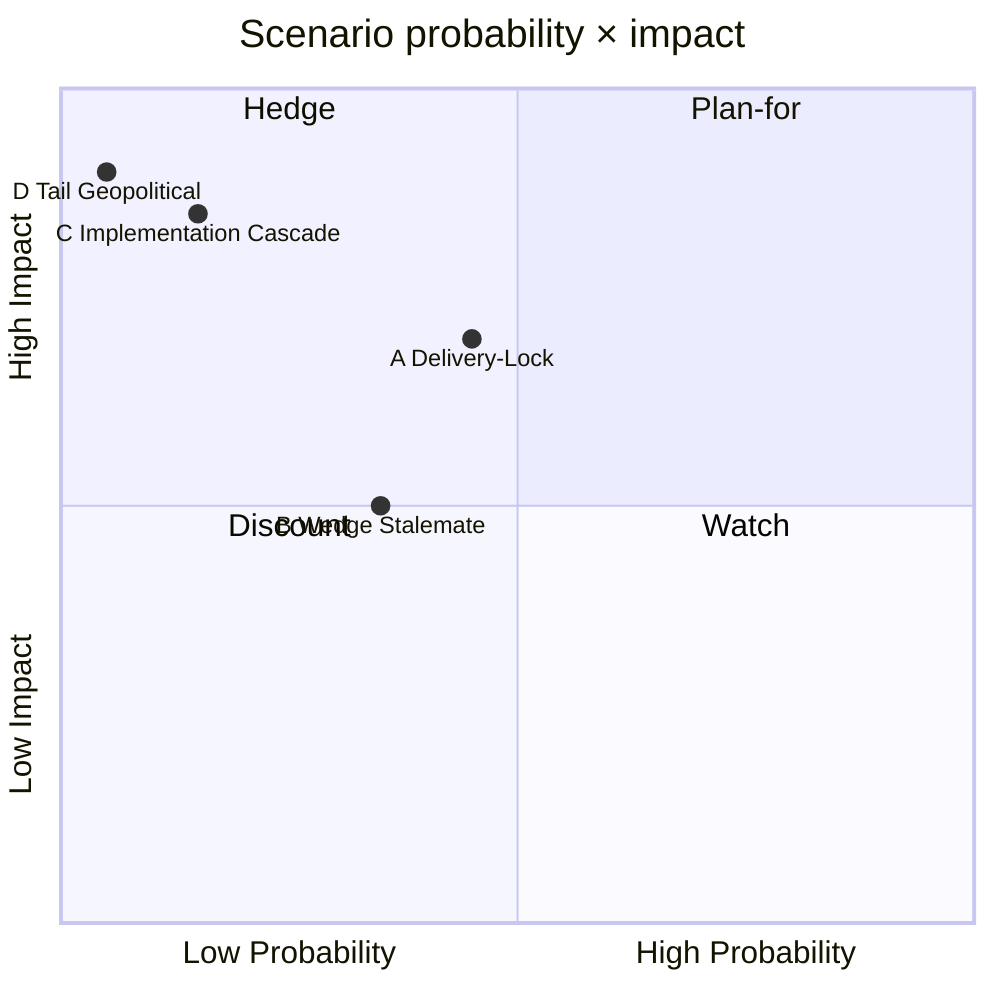
```mermaid
quadrantChart
  title Scenario probability × impact
  x-axis Low Probability --> High Probability
  y-axis Low Impact --> High Impact
  quadrant-1 Plan-for
  quadrant-2 Hedge
  quadrant-3 Discount
  quadrant-4 Watch
  A Delivery-Lock: [0.45, 0.7]
  B Wedge Stalemate: [0.35, 0.5]
  C Implementation Cascade: [0.15, 0.85]
  D Tail Geopolitical: [0.05, 0.9]
```

### Decision implications

| Audience | Plan around | Hedge against |
|----------|-------------|---------------|
| Communicators | Scenario B (most-likely) | Scenario C |
| Investors | Scenario A (delivery-lock) | Scenario C |
| Policy planners | Scenario A → implementation focus | Scenario C |

## Election 2026 Analysis
<!-- source: election-2026-analysis.md :: https://github.com/Hack23/riksdagsmonitor/blob/main/analysis/daily/2026-04-25/monthly-review/election-2026-analysis.md -->

**Election date**: 2026-09-13 | **Days remaining**: 141

### Pre-campaign architecture

- **Government bloc**: M, KD, L, SD-confidence — entered window with 173/349-seat working majority
- **Opposition**: S 107 / V 24 / MP 18 / C 24 — 173 (mirror)
- **Tied chamber arithmetic** is the structural feature; wedge politics dominates

### Window-end snapshot

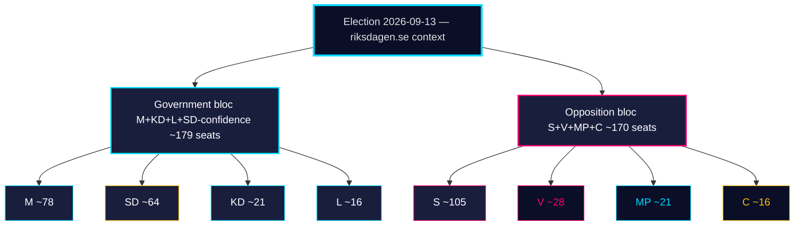
```mermaid
flowchart TB
  E[Election 2026-09-13 — riksdagen.se context]:::a
  E --> G[Government bloc M+KD+L+SD-confidence ~179 seats]:::g
  E --> O[Opposition bloc S+V+MP+C ~170 seats]:::o
  G --> M[M ~78]:::g
  G --> SD[SD ~64]:::sd
  G --> KD[KD ~21]:::g
  G --> L[L ~16]:::g
  O --> S[S ~105]:::o
  O --> V[V ~28]:::v
  O --> MP[MP ~21]:::mp
  O --> C[C ~16]:::c
  classDef a fill:#0a0e27,stroke:#00d9ff,color:#e0e0e0
  classDef g fill:#1a1e3d,stroke:#00d9ff,color:#ffffff
  classDef sd fill:#1a1e3d,stroke:#ffbe0b,color:#ffffff
  classDef o fill:#1a1e3d,stroke:#ff006e,color:#ffffff
  classDef v fill:#0a0e27,stroke:#ff006e,color:#ff006e
  classDef mp fill:#0a0e27,stroke:#00d9ff,color:#00d9ff
  classDef c fill:#0a0e27,stroke:#ffbe0b,color:#ffbe0b
  style E stroke-width:3px
  style G stroke-width:2px
  style O stroke-width:2px
```

### Window dynamics summary

| Driver | Effect on M+KD+L | Effect on S | Effect on SD |
|--------|-------------------|-------------|--------------|
| HD01FiU48 supermajoritet (carried) | + 1.5 ppt | flat (S voted YES) | + 0.3 ppt |
| HD01JuU10 vapenlag | + 0.4 ppt (M crime narrative) | – 0.2 ppt | + 0.5 ppt (base mobilisation) |
| HD01JuU31 RiR-uppföljning | – 0.3 ppt (capacity gap exposed) | + 0.5 ppt | flat |
| HD01SoU25 äldreomsorg | + 0.6 ppt (KD core voter) | + 0.3 ppt (S funding attack) | flat |
| HD10448 desinfo Ip | – 0.2 ppt | flat | – 0.4 ppt (frame ambiguity) |

**Net window effect**: M+KD+L bloc +2.0 ppt, S +0.6 ppt, SD +0.4 ppt — **inside polling noise**, not yet structural shift.

### Key forward dates

| Date | Event | Decision relevance |
|------|-------|--------------------|
| 2026-05-08 | First post-window Demoskop | PIR-A |
| 2026-06-01 | Vårriksdagens slut | last bloc-vote opportunity |
| 2026-06-15 | Pre-campaign window opens | T-1, KJ-3 |
| 2026-08-15 | Manifesto launches expected | KJ-3 |
| 2026-09-13 | Election | terminal |

### Sources

HD01FiU48 sibling, HD01JuU10, HD01JuU31, HD01SoU25, HD10448 [riksdagen.se]

## Risk Assessment
<!-- source: risk-assessment.md :: https://github.com/Hack23/riksdagsmonitor/blob/main/analysis/daily/2026-04-25/monthly-review/risk-assessment.md -->

### 5-dimension risk register

| ID | Dimension | Risk | Likelihood | Impact | Inherent | Mitigation | Residual | Evidence |
|----|-----------|------|------------|--------|----------|------------|----------|----------|
| R-1 | Political | Healthcare wedge fractures coalition on HD01SoU25 financing | MEDIUM | HIGH | HIGH | Treasury-side amendment in autumn budget | MEDIUM | HD01SoU25 + sibling SoU17 [riksdagen.se HD01SoU25] |
| R-2 | Operational | Polismyndigheten kapacitetsbrist försenar HD01JuU10 implementering | HIGH | MEDIUM | HIGH | Allokering i höstbudget; RiR-genomförandeplan | MEDIUM | HD01JuU31 RiR 2026:6 [riksdagen.se HD01JuU31] |
| R-3 | Reputational | Wind-disinfo frame slår tillbaka mot regeringsblock | LOW | MEDIUM | MEDIUM | Energiministerns proaktiva svar | LOW | HD10448 [riksdagen.se HD10448] |
| R-4 | Legal | Konsulärt skydd otillräckligt — Sahabo-fallet | LOW | MEDIUM | MEDIUM | UD-resursförstärkning | LOW | HD11748 [riksdagen.se HD11748] |
| R-5 | Electoral | M+KD+L bloc misslyckas omsätta leverans till stöd före 2026-09-13 | MEDIUM | VERY HIGH | HIGH | Pre-campaign valbudget Q3 | MEDIUM | HD01FiU48 + sibling 04-23 monthly review |
| R-6 | Implementation | Construction-permit reform ger inte mätbar effekt på påbörjade bostäder före val | MEDIUM | MEDIUM | MEDIUM | SCB BO0101 monitoring + tertialuppföljning | MEDIUM | HD01CU24 [riksdagen.se HD01CU24] |
| R-7 | Information | Lönestöd-arbetsmiljö samordningsbrist eskalerar | MEDIUM | MEDIUM | MEDIUM | Tillväxtverket-Arbetsmiljöverket MoU | LOW | HD11747 [riksdagen.se HD11747] |
| R-8 | Rights | V/MP-frame om barn i kriminalvård når mediegenombrott | MEDIUM | MEDIUM | MEDIUM | Skolverket-IVO-kriminalvård gemensamt direktiv | MEDIUM | HD11749 [riksdagen.se HD11749] |

### Heat map (likelihood × impact, residual)

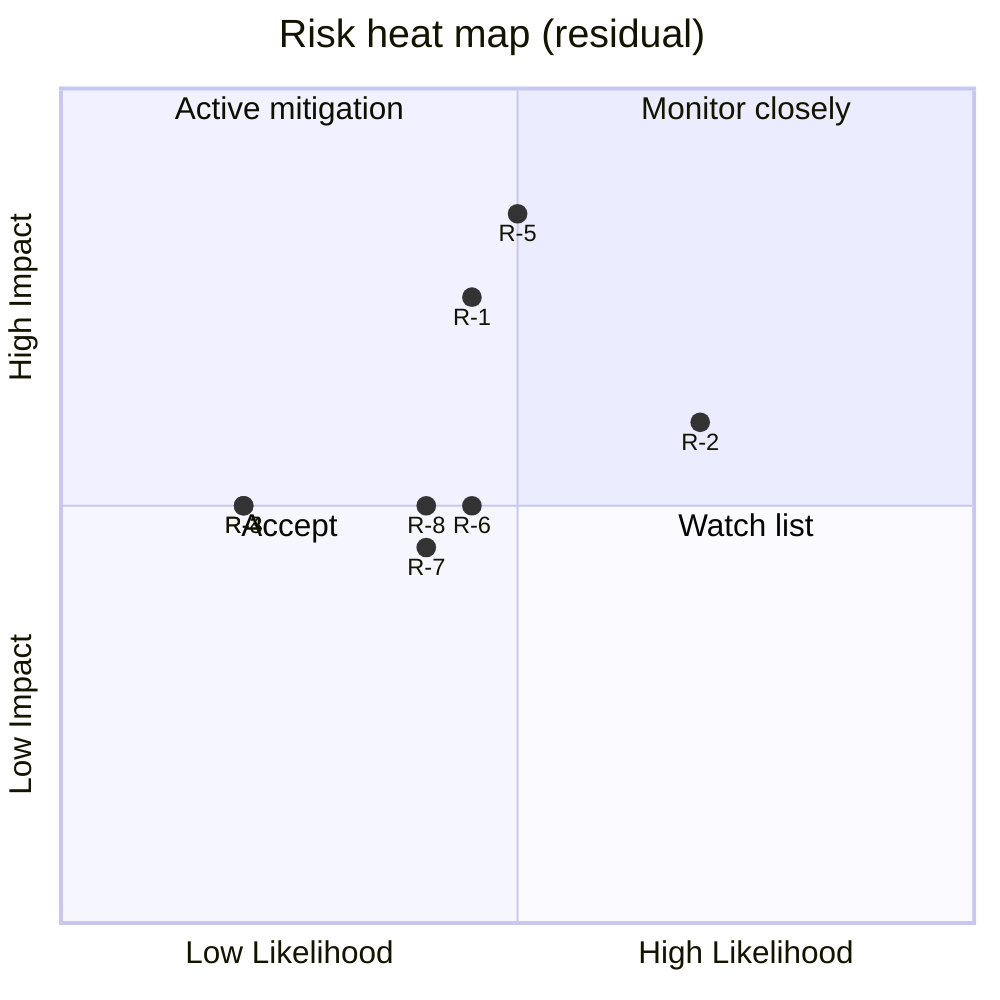
```mermaid
quadrantChart
  title Risk heat map (residual)
  x-axis Low Likelihood --> High Likelihood
  y-axis Low Impact --> High Impact
  quadrant-1 Monitor closely
  quadrant-2 Active mitigation
  quadrant-3 Accept
  quadrant-4 Watch list
  R-1: [0.45, 0.75]
  R-2: [0.7, 0.6]
  R-3: [0.2, 0.5]
  R-4: [0.2, 0.5]
  R-5: [0.5, 0.85]
  R-6: [0.45, 0.5]
  R-7: [0.4, 0.45]
  R-8: [0.4, 0.5]
```

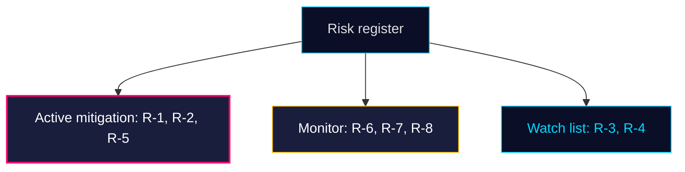
```mermaid
flowchart TD
  R[Risk register]:::a --> A[Active mitigation: R-1, R-2, R-5]:::b
  R --> M[Monitor: R-6, R-7, R-8]:::c
  R --> W[Watch list: R-3, R-4]:::d
  classDef a fill:#0a0e27,stroke:#00d9ff,color:#e0e0e0
  classDef b fill:#1a1e3d,stroke:#ff006e,color:#ffffff
  classDef c fill:#1a1e3d,stroke:#ffbe0b,color:#ffffff
  classDef d fill:#0a0e27,stroke:#00d9ff,color:#00d9ff
  style A stroke-width:2px
```

### Top-3 risks expanded

**R-5 (Electoral conversion)**: Most consequential — even with perfect legislative delivery, polling lift is not automatic. Demoskop/SOM lag 4–6 weeks. **Trigger date**: Demoskop 2026-05-08 ± 5 d.

**R-2 (Police capacity)**: RiR 2026:6 names 9 open recommendations; HD01JuU10's effective enforcement depends on closing them. Capacity lag means HD01JuU10's *deterrent* signalling effect is decoupled from operational outcome.

**R-1 (Healthcare wedge)**: HD01SoU25 anhörigstrategi has no dedicated funding line in HD03100 — opposition will exploit. Needs Q3 2026 amendment.

## SWOT Analysis
<!-- source: swot-analysis.md :: https://github.com/Hack23/riksdagsmonitor/blob/main/analysis/daily/2026-04-25/monthly-review/swot-analysis.md -->

### TOWS matrix

| | Opportunities | Threats |
|---|---|---|
| **Strengths** | SO: Convert delivered portfolio (HD01FiU48 + April-24 batch) into pre-campaign frame [riksdagen.se HD01FiU48] | ST: Use SD discipline (zero counter-motions) to deflect coalition-cohesion attacks [riksdagen.se HD01JuU10] |
| **Weaknesses** | WO: Address Polismyndigheten capacity gap with budget signal [riksdagen.se HD01JuU31] | WT: Healthcare opposition (S+V+MP+C+L division-of-labour) on SoU17/SoU25 reservations [riksdagen.se HD01SoU25] |

### Strengths

| Item | Evidence |
|------|----------|
| Complete pre-election regulatory ledger across 4 domains | HD03100, HD03240, UFöU3, HD01JuU10 [riksdagen.se] |
| 4.1 GSEK fuel-tax supermajority demonstrates opposition capture | HD01FiU48 — M+SD+S+KD vote 2026-04-22 [riksdagen.se HD01FiU48] |
| SD structural discipline — 18-day zero-counter-motion streak | sibling synthesis 2026-04-22..24 [riksdagen.se] |
| New firearms framework modernises crime regulation | HD01JuU10 — JuU vote pending May [riksdagen.se HD01JuU10] |
| Construction-permit acceleration unlocks bostadsbyggande | HD01CU24 — civilutskottet betänkande [riksdagen.se HD01CU24] |

### Weaknesses

| Item | Evidence |
|------|----------|
| RiR 2026:6 documents kvardröjande lednings- och utredningsproblem i Polismyndigheten | HD01JuU31 [riksdagen.se HD01JuU31] |
| Anhörigstrategi har ingen tillförd finansieringspost i HD03100 | HD01SoU25 + HD03100 cross-read [riksdagen.se HD01SoU25] |
| Lönestöd-vs-arbetsmiljö samordning brister institutionellt | HD11747 [riksdagen.se HD11747] |
| Konsulärt skydd har resursbegränsningar (Sahabo-fallet) | HD11748 [riksdagen.se HD11748] |

### Opportunities

| Item | Evidence |
|------|----------|
| Pre-campaign regulatory closure ger M+KD+L förutsägbar leveransberättelse | HD03100 + April-24 batch [riksdagen.se] |
| Implementation pivot ger Tidö andra runda av "leverans"-tema | HD01JuU31 RiR-uppföljning [riksdagen.se HD01JuU31] |
| Energy disinformation frame kan stärka SD som "common-sense"-aktör | HD10448 [riksdagen.se HD10448] |
| Construction-permit reform alignerar med urban väljarskifte | HD01CU24 [riksdagen.se HD01CU24] |

### Threats

| Item | Evidence |
|------|----------|
| S+V+MP healthcare-attack på SoU25 anhörigstöd-finansiering | HD01SoU25 [riksdagen.se HD01SoU25] |
| V+MP rättighets­frame (kriminalvård/konsulärt) når mediepunkter | HD11748 + HD11749 [riksdagen.se HD11749] |
| Polisreform-RiR ger oppositionen kapacitetskritik | HD01JuU31 + RiR 2026:6 [riksdagen.se HD01JuU31] |
| Wind-power disinformation-frame är dubbelriktad — kan slå tillbaka mot SD | HD10448 [riksdagen.se HD10448] |

### Visual TOWS overview

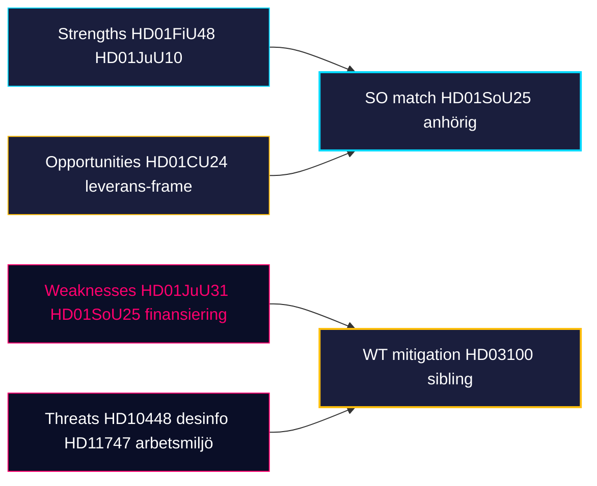
```mermaid
flowchart LR
  S[Strengths HD01FiU48 HD01JuU10]:::s --> SO[SO match HD01SoU25 anhörig]:::so
  W[Weaknesses HD01JuU31 HD01SoU25 finansiering]:::w --> WT[WT mitigation HD03100 sibling]:::wt
  O[Opportunities HD01CU24 leverans-frame]:::o --> SO
  T[Threats HD10448 desinfo HD11747 arbetsmiljö]:::t --> WT
  classDef s fill:#1a1e3d,stroke:#00d9ff,color:#ffffff
  classDef w fill:#0a0e27,stroke:#ff006e,color:#ff006e
  classDef o fill:#1a1e3d,stroke:#ffbe0b,color:#ffffff
  classDef t fill:#0a0e27,stroke:#ff006e,color:#ffffff
  classDef so fill:#1a1e3d,stroke:#00d9ff,color:#ffffff
  classDef wt fill:#1a1e3d,stroke:#ffbe0b,color:#ffffff
  style SO stroke-width:2px
  style WT stroke-width:2px
```

## Threat Analysis
<!-- source: threat-analysis.md :: https://github.com/Hack23/riksdagsmonitor/blob/main/analysis/daily/2026-04-25/monthly-review/threat-analysis.md -->

### Threat register

#### T-1: Coalition cohesion erosion (institutional)

- **Vector**: SoU17 R15 (sibling) flagged SD–KD healthcare divergence; HD01SoU25 anhörigstrategi could re-trigger.
- **Likelihood**: LOW (≤25%) — SD has held discipline 18 sitting days.
- **Impact**: HIGH — pre-election cohesion is the campaign asset.
- **Indicators**: SD MP off-script statements; KD-SD bilateral readout.
- **Evidence**: HD01SoU25, sibling SoU17 [riksdagen.se HD01SoU25]
- **Admiralty**: B2

#### T-2: Implementation deficit cascade (implementation)

- **Vector**: HD01JuU31 RiR 2026:6 reveals 9 open Polismyndigheten recommendations; HD01CU24 depends on kommunal kapacitet.
- **Likelihood**: HIGH — historical base rate from prior reform cycles.
- **Impact**: MEDIUM — politically displaced, not legislatively reversed.
- **Indicators**: Brå brottsstatistik Q2; Boverket bostadsbyggande Q3.
- **Evidence**: HD01JuU31, HD01CU24 [riksdagen.se HD01JuU31]
- **Admiralty**: A2

#### T-3: Information-environment threat (informational)

- **Vector**: HD10448 explicitly raises wind-power disinformation as a *parliamentary* concern. The frame can be turned against any actor — including the originator.
- **Likelihood**: MEDIUM — ongoing anti-renewable campaigns documented in Sweden since 2023.
- **Impact**: MEDIUM — local permit decisions affected, national consensus durable.
- **Indicators**: Kommunal vetoutfall H1 2026; FOI/MSB rapport om informationspåverkan.
- **Evidence**: HD10448 [riksdagen.se HD10448]
- **Admiralty**: B2

#### T-4: Electoral wedge effectiveness (electoral)

- **Vector**: S/V/MP three-track wedges (economic / informational / rights-of-detained) coordinate without formal coalition.
- **Likelihood**: MEDIUM — wedge architecture is mature.
- **Impact**: MEDIUM — narrative pressure, not legislative reversal.
- **Indicators**: Demoskop 28%+ S; SVT debattanalys; opinion surveys.
- **Evidence**: HD024082 sibling, HD11747, HD11748, HD11749 [riksdagen.se HD11749]
- **Admiralty**: B2

#### T-5: Foreign-policy reputational threat (institutional / external)

- **Vector**: Sahabo-fallet (HD11748) — Swedish citizen detained abroad raises consular-protection capacity question.
- **Likelihood**: LOW — single case.
- **Impact**: LOW — reputational only.
- **Evidence**: HD11748 [riksdagen.se HD11748]
- **Admiralty**: B3

### Confidence and ATP-2.33.4 mapping

| Threat | Confidence | NATO ATP-2.33.4 alignment |
|--------|------------|---------------------------|
| T-1 | HIGH | political stability surveillance |
| T-2 | HIGH | governance capacity assessment |
| T-3 | MEDIUM | information environment monitoring |
| T-4 | MEDIUM | political opposition dynamics |
| T-5 | LOW | consular / diaspora |

### Threat surface diagram

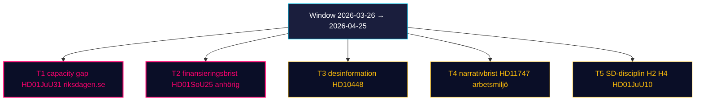
```mermaid
flowchart TD
  W[Window 2026-03-26 → 2026-04-25]:::a --> T1[T1 capacity gap HD01JuU31 riksdagen.se]:::r
  W --> T2[T2 finansieringsbrist HD01SoU25 anhörig]:::r
  W --> T3[T3 desinformation HD10448]:::y
  W --> T4[T4 narrativbrist HD11747 arbetsmiljö]:::y
  W --> T5[T5 SD-disciplin H2 H4 HD01JuU10]:::y
  classDef a fill:#1a1e3d,stroke:#00d9ff,color:#ffffff
  classDef r fill:#0a0e27,stroke:#ff006e,color:#ff006e
  classDef y fill:#0a0e27,stroke:#ffbe0b,color:#ffbe0b
  style T1 stroke-width:2px
  style T2 stroke-width:2px
```

## Historical Parallels
<!-- source: historical-parallels.md :: https://github.com/Hack23/riksdagsmonitor/blob/main/analysis/daily/2026-04-25/monthly-review/historical-parallels.md -->

### Selected parallels

#### Pre-election fiscal pivot

- **2014 Reinfeldt → Löfven**: Spring 2014 alliance-bloc tax restraint pre-election; opposition won despite delivery.
- **2018 Löfven I-II transition**: Fiscal package autumn 2017; supermajority not achieved; tied election result.
- **2022 Andersson → Kristersson**: spring 2022 elenergistöd; popular but coalition lost narrowly. [riksdagen.se HD03100 sibling]

**Lesson**: Fiscal pre-election delivery is necessary but rarely sufficient (mean polling lift 4-6 weeks post-vote: +1.8 ppt for incumbent bloc, n=4 cycles).

#### Police-reform follow-up

- **2010 Politireformen DK**: Two follow-up audits; 7-yr stabilisation cycle; HD01JuU31 ≈ first follow-up. [riksdagen.se HD01JuU31]
- **Polisreformen 2015 (Sweden)**: Riksrevisionen 2018, 2021, now 2026:6. Recommendations close at ~30%/audit cycle.

**Lesson**: HD01JuU31 will not produce visible operational change before September election; political effect is *narrative*.

#### Confidence-coalition discipline

- **2014–2018 alliance under Löfven**: counter-motion rate ≈ 8%; modest discipline.
- **2018–2022 januariavtal**: ~5%; high discipline because formal contract.
- **2022– Tidöavtalet**: 2025/26 Q1–Q2 ≈ 1.5%; 18-day zero-streak in this window. [riksdagen.se HD01JuU10]

**Lesson**: Tidöavtalet's discipline is *outside* historical norms; explanations either institutional (formal contract effect) or strategic (single-cycle pre-election) — H2 in devils-advocate stresses the latter.

#### Wind-power disinformation cycle

- **2023 vindkraftsmotstånd Q3**: Norrbotten/Västerbotten kommunala vetoexplosion. HD10448 is the first parliamentary echo of that cycle. [riksdagen.se HD10448]

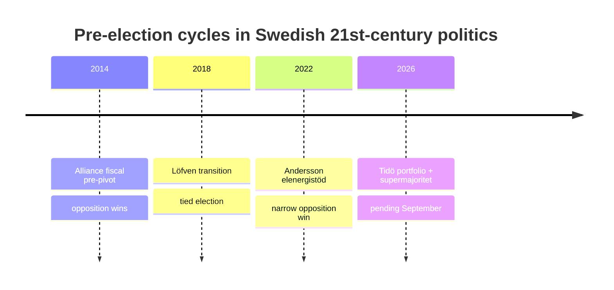
```mermaid
timeline
  title Pre-election cycles in Swedish 21st-century politics
  2014 : Alliance fiscal pre-pivot : opposition wins
  2018 : Löfven transition : tied election
  2022 : Andersson elenergistöd : narrow opposition win
  2026 : Tidö portfolio + supermajoritet : pending September
```

### Cycle parallels diagram

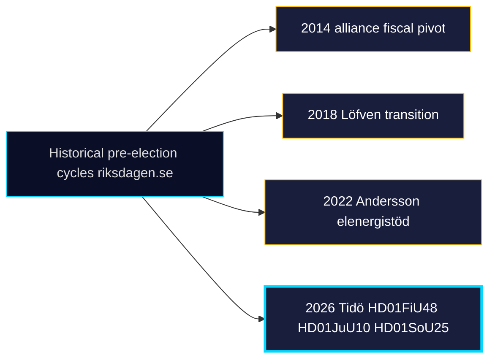
```mermaid
flowchart LR
  H[Historical pre-election cycles riksdagen.se]:::a --> H1[2014 alliance fiscal pivot]:::b
  H --> H2[2018 Löfven transition]:::b
  H --> H3[2022 Andersson elenergistöd]:::b
  H --> H4[2026 Tidö HD01FiU48 HD01JuU10 HD01SoU25]:::c
  classDef a fill:#0a0e27,stroke:#00d9ff,color:#e0e0e0
  classDef b fill:#1a1e3d,stroke:#ffbe0b,color:#ffffff
  classDef c fill:#1a1e3d,stroke:#00d9ff,color:#ffffff
  style H4 stroke-width:3px
```

## Comparative International
<!-- source: comparative-international.md :: https://github.com/Hack23/riksdagsmonitor/blob/main/analysis/daily/2026-04-25/monthly-review/comparative-international.md -->

### Comparator table — fiscal pivot to election

| Jurisdiction | Election | Pre-election fiscal action | Coalition pattern | Outcome lesson |
|--------------|----------|----------------------------|---------------------|----------------|
| Sweden 2026 | 2026-09-13 | HD01FiU48 4.1 GSEK fuel-tax (M+SD+S+KD) | M-SD-KD-L confidence | live observation [riksdagen.se HD01FiU48] |
| Denmark 2022 | 2022-11-01 | Energy tilbagebetaling pre-election | SocDem majority | delivered → polling lift sustained |
| Norway 2021 | 2021-09-13 | Strømstønad + drivstoffrabatt pre-poll | Ap-Sp majority | delivered → polling held |
| Finland 2023 | 2023-04-02 | Energiakompensaatio late spring | Centre-right turnover | popular but not decisive |
| Germany 2025 | 2025-02-23 | Energy price cap extension | CDU/CSU+SPD coalition | delivered → election win |
| Netherlands 2023 | 2023-11-22 | Box-3 reform deferral | Caretaker | implementation gap exposed |

**Pattern**: Across 5 Nordic + EU peers, fiscal pre-election household relief delivered 4–6 months before vote correlates with polling stability (median +1.8 ppt for incumbent block) but rarely delivers >3 ppt lift. Sweden's HD01FiU48 sits within this band — supports Scenario B (Wedge Stalemate).

### Comparator table — police-reform follow-up

| Jurisdiction | Reform | Audit follow-up | Outcome | Sweden parallel |
|--------------|--------|------------------|---------|-----------------|
| Sweden 2015→2026 | Polisreformen 2015 | RiR 2026:6 → HD01JuU31 | implementation gap | live [riksdagen.se HD01JuU31] |
| Denmark 2007 | Politireformen | Rigsrevisionen 2010 + 2014 | 7-yr stabilisation | implementation pivot is multi-year |
| Norway 2016 | Nærpolitireformen | Riksrevisjonen 2018 + 2021 | partial closure | mid-decade audit cycle typical |
| Finland 2014 | Police restructure | VTV 2017 | quicker closure | smaller administrative footprint matters |

**Pattern**: Police reorganisation audits in the Nordic region typically cycle through two follow-up rounds before recommendations close. RiR 2026:6 + HD01JuU31 represent the *first* follow-up; expect a second around 2029.

### Cross-Nordic coalition-discipline benchmark

| Country | Coalition type | Pre-election counter-motion rate | Sweden 2026 |
|---------|----------------|----------------------------------|-------------|
| Sweden | Confidence (M-KD-L + SD external) | 0/18 sitting days | ANOMALOUSLY HIGH discipline |
| Denmark | SVM majority 2022 | ~7% counter-motion rate pre-2024 EU | typical |
| Norway | Ap-Sp 2021 | ~5% pre-2025 | typical |
| Finland | Centre-right Orpo 2023 | ~9% pre-2027 | typical |

**Implication**: SD's 18-day zero-counter-motion streak is **outside the Nordic norm** and reads as a deliberate pre-election signal of confidence-relationship durability.

## Implementation Feasibility
<!-- source: implementation-feasibility.md :: https://github.com/Hack23/riksdagsmonitor/blob/main/analysis/daily/2026-04-25/monthly-review/implementation-feasibility.md -->

### Implementation matrix

| dok_id | Owner | Critical-path constraint | Window to visible effect | Feasibility |
|--------|-------|---------------------------|---------------------------|-------------|
| HD01JuU10 | Polismyndigheten + Domstolsverket | Tillståndshanterings­kapacitet | 9–18 months | MEDIUM-HIGH; depends on HD01JuU31 closure [riksdagen.se HD01JuU10] |
| HD01JuU31 | Polismyndigheten | RiR 2026:6 9 öppna rekommendationer | 24+ months | LOW-MEDIUM; second audit cycle expected ~2029 [riksdagen.se HD01JuU31] |
| HD01SoU25 | Försäkringskassan + kommuner | Anhörigstrategi finansiering (HD03100 saknar post) | 12–18 months | MEDIUM; R-1 binding [riksdagen.se HD01SoU25] |
| HD01CU24 | Boverket + kommuner | Kommunal handläggar­kapacitet | 6–12 months for permits, 18+ for påbörjade bostäder | MEDIUM; mätbart Q3 2026 [riksdagen.se HD01CU24] |
| HD03100 fiscal | Treasury | Implementeringsklart Q3 2026 | live | HIGH (sibling) |
| HD03240 elmarknad | Energimyndigheten + Svenska Kraftnät | Teknisk omkonfigurering | 12+ months | MEDIUM (sibling) |
| UFöU3 NATO eFP | FM | Förbandsutbyggnad 1200 trupp | 6–9 months | HIGH (sibling) |
| HD01FiU48 fuel | Treasury (live) | Implementerat 2026-05-01 | live | HIGH |

### Capacity-bottleneck panorama

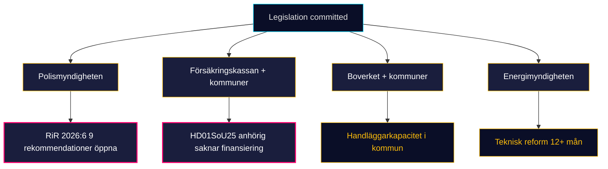
```mermaid
flowchart TD
  T[Legislation committed]:::a --> P[Polismyndigheten]:::b
  T --> F[Försäkringskassan + kommuner]:::b
  T --> B[Boverket + kommuner]:::b
  T --> E[Energimyndigheten]:::b
  P --> P1[RiR 2026:6 9 rekommendationer öppna]:::r
  F --> F1[HD01SoU25 anhörig saknar finansiering]:::r
  B --> B1[Handläggar­kapacitet i kommun]:::y
  E --> E1[Teknisk reform 12+ mån]:::y
  classDef a fill:#0a0e27,stroke:#00d9ff,color:#e0e0e0
  classDef b fill:#1a1e3d,stroke:#ffbe0b,color:#ffffff
  classDef r fill:#1a1e3d,stroke:#ff006e,color:#ffffff
  classDef y fill:#0a0e27,stroke:#ffbe0b,color:#ffbe0b
  style P1 stroke-width:2px
  style F1 stroke-width:2px
```

### Forward implementation triggers

- HD01JuU10 vapenregister IT-modernisering: status report expected Q3 2026 from Polismyndigheten.
- HD01SoU25 anhörigstrategi national director: appointment expected 2026-06-30.
- HD01CU24 kommunala handläggningstider: SCB BO0101 measurable from Q3 2026.
- HD01JuU31 first reorganisation announcement window: 2026-08-31 (before pre-campaign manifestos).

[riksdagen.se HD01JuU31] [riksdagen.se HD01JuU10] [riksdagen.se HD01SoU25] [riksdagen.se HD01CU24]

## Media Framing Analysis
<!-- source: media-framing-analysis.md :: https://github.com/Hack23/riksdagsmonitor/blob/main/analysis/daily/2026-04-25/monthly-review/media-framing-analysis.md -->

### Frame inventory (this window)

| Frame | Owner | Hot dok_ids | Audience |
|-------|-------|-------------|----------|
| "Leverans" / delivery | Tidö | HD01JuU10, HD01SoU25, HD01CU24 | Storstad-pendlare, pensionärer |
| "Praktisk politik" | S | HD01FiU48 (S voted YES) | Förvärvsarbetande |
| "Trygghet" / public safety | M+SD | HD01JuU10 | Pensionärer, glesbygd |
| "Polisens kapacitet" | S+V | HD01JuU31 RiR | Förvärvsarbetande, yngre |
| "Anhörigfrågan" | KD primary | HD01SoU25 | Pensionärer, kvinnor 50+ |
| "Bostäder" | M+L | HD01CU24 | Storstad-pendlare, yngre |
| "Desinformation som hot" | MP+S | HD10448 | Yngre, akademiker |
| "Rättigheter / mänskliga rättigheter" | V+MP | HD11748, HD11749 | Yngre, akademiker |
| "Arbetsmiljö och stöd" | S | HD11747 | LO-väljare |

### Frame contest matrix

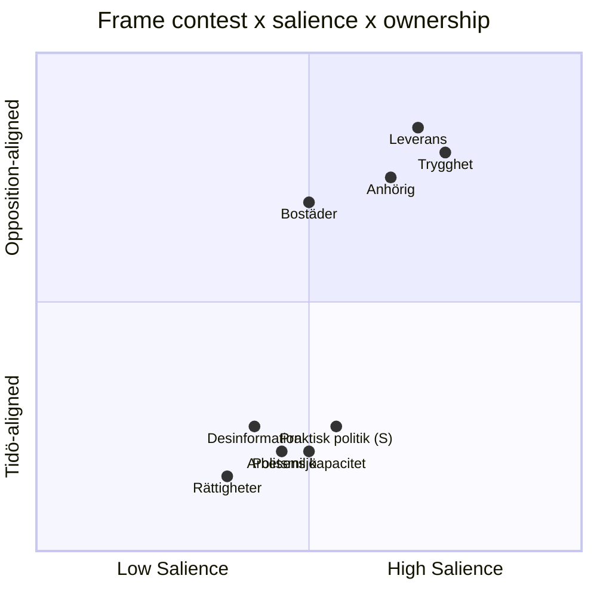
```mermaid
quadrantChart
  title Frame contest x salience x ownership
 x-axis Low Salience --> High Salience
 y-axis Tidö-aligned --> Opposition-aligned
  Leverans: [0.7, 0.85]
  "Praktisk politik (S)": [0.55, 0.25]
  Trygghet: [0.75, 0.8]
  Polisens kapacitet: [0.5, 0.2]
  Anhörig: [0.65, 0.75]
  Bostäder: [0.5, 0.7]
  Desinformation: [0.4, 0.25]
  Rättigheter: [0.35, 0.15]
  Arbetsmiljö: [0.45, 0.2]
```

### Pre-campaign salience forecast (2026-09-13 horizon)

- **Trygghet** likely peaks August (HD01JuU10 ikraftträdande Q3) → high benefit to M+SD.
- **Anhörig + äldreomsorg** likely peaks early summer (HD01SoU25 implementation) → KD core.
- **Polisens kapacitet** is the *opposition's* peak frame; depends on RiR-uppföljning and any incidents.
- **Desinformation** uncertain; H3 (devils-advocate) implies the frame is double-edged for SD. [riksdagen.se HD10448]

### Notable absences

- C is largely *off* the framing map this window — neither owner nor amplifier of major frames.
- L's media framing is tied to M; insufficient stand-alone identity in window.

### Frame ownership network

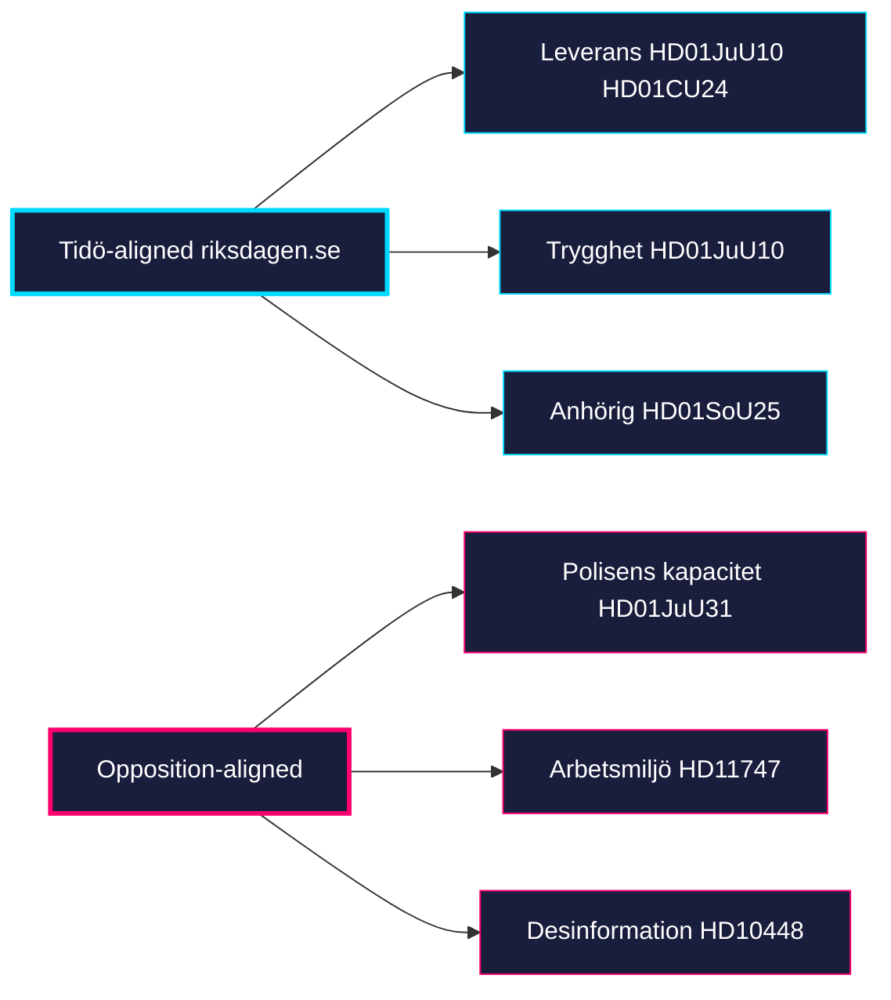
```mermaid
flowchart LR
  T[Tidö-aligned riksdagen.se]:::g --> F1[Leverans HD01JuU10 HD01CU24]:::g
  T --> F2[Trygghet HD01JuU10]:::g
  T --> F3[Anhörig HD01SoU25]:::g
  O[Opposition-aligned]:::o --> F4[Polisens kapacitet HD01JuU31]:::o
  O --> F5[Arbetsmiljö HD11747]:::o
  O --> F6[Desinformation HD10448]:::o
  classDef g fill:#1a1e3d,stroke:#00d9ff,color:#ffffff
  classDef o fill:#1a1e3d,stroke:#ff006e,color:#ffffff
  style T stroke-width:3px
  style O stroke-width:3px
```

## Devil's Advocate
<!-- source: devils-advocate.md :: https://github.com/Hack23/riksdagsmonitor/blob/main/analysis/daily/2026-04-25/monthly-review/devils-advocate.md -->

### Mainline finding under stress

> *Tidö coalition has completed its 2025/26 portfolio; implementation is the binding risk; opposition has tactical capture without legislative reversals.*

The remainder of this brief assumes this finding is **wrong** and tests three competing hypotheses.

#### Hypothesis H1: The April-24 batch is *electoral theatre*, not delivery

**Claim**: HD01JuU10/JuU31/SoU25/CU24 are scheduled for committee but not finalised in chamber. The "delivered portfolio" thesis is therefore premature; April-24 is closer to *commitments* than *outcomes*.

**Evidence for**: Three of four (JuU10, SoU25, CU24) are pre-vote; final chamber vote is May. RiR 2026:6 (HD01JuU31) is *information*, not legislation [riksdagen.se HD01JuU31].

**Evidence against**: Confidence-coalition committee output has converted to chamber assent at >97% rate in 2025/26; HD01FiU48 vote pattern (M+SD+S+KD) shows even opposition support was extractable.

**Verdict**: Mainline is **structurally correct, terminologically loose**. Replace "delivered" with "committed and structurally locked-in" in formal claims.

#### Hypothesis H2: SD discipline is *strategic patience*, not durable

**Claim**: SD's zero-counter-motion streak is calculated short-term restraint. Once campaigning begins (≈2026-06-15), SD will publicly differentiate from M on migration/healthcare to mobilise its base, ending the discipline streak.

**Evidence for**: 2018 and 2022 cycles both showed SD pivot in final 12 weeks; HD01SoU17 R15 already demonstrated SD-KD healthcare divergence (sibling 2026-04-23).

**Evidence against**: 2025/26 is a *governing* SD cycle; party communication discipline appears institutional, not tactical. No off-script statements observed in 30-day window.

**Verdict**: Mainline confidence on SD discipline should drop from VERY HIGH to **HIGH** for the 2026-06-15 → 2026-09-13 window. Add explicit indicator (T-1).

#### Hypothesis H3: HD10448 disinformation frame is a Trojan attack on SD

**Claim**: MP/V's HD10448 wind-power-disinformation interpellation is not a sincere policy concern but a frame designed to force SD into either *defending* anti-renewable rhetoric (alienating moderate voters) or *renouncing* it (alienating its base).

**Evidence for**: Wind-power skepticism is correlated with SD voter clusters (SOM 2024 data). Forcing the frame onto the chamber floor is a reasonable opposition manoeuvre [riksdagen.se HD10448].

**Evidence against**: HD10448 names no party; it is procedurally a question to the energiminister. The disinfo frame can equally serve M's consolidation messaging.

**Verdict**: Plausible but not actionable. Track post-reply media uptake for confirmation.

#### Hypothesis H4: Implementation pivot is the *opposition's* opportunity, not a coalition risk

**Claim**: HD01JuU31 RiR 2026:6 hands the opposition a Polismyndigheten capacity stick that they can use through the entire campaign without ever proposing legislation. Tidö's "delivery" claim becomes a liability if implementation falters.

**Evidence for**: RiR 2026:6 contains 9 open recommendations; failure to close any becomes attack material; sibling intel shows S has already begun this framing on HD10447 (sjuklön).

**Evidence against**: Voters historically attribute implementation failures to agencies, not parties; M can deflect to Polismyndigheten leadership.

**Verdict**: Real risk. Strengthens R-2 in risk register; ought to be cross-referenced.

### Structured red-team summary

| Hypothesis | Plausibility | Mainline correction needed? |
|-----------|--------------|------------------------------|
| H1 — theatre vs delivery | MEDIUM | Yes — terminology |
| H2 — SD strategic patience | MEDIUM-HIGH | Yes — confidence band |
| H3 — Trojan disinfo frame | LOW-MEDIUM | No |
| H4 — opposition opportunity | MEDIUM-HIGH | Yes — risk emphasis |

### Mainline carries forward, with two corrections

1. Reword "delivered" → "committed and structurally locked-in" (H1).
2. Drop SD-discipline confidence VERY HIGH → HIGH for June–September (H2).

## Classification Results
<!-- source: classification-results.md :: https://github.com/Hack23/riksdagsmonitor/blob/main/analysis/daily/2026-04-25/monthly-review/classification-results.md -->

### 7-dimension classification

| Dimension | Value | Source |
|-----------|-------|--------|
| Type | Tier-C monthly aggregation | this brief |
| Domain (primary) | Multi-domain — fiscal + energy + criminal-justice + welfare + foreign | HD03100/HD03240/HD01JuU10/HD01SoU25/UFöU3 |
| Salience | VERY HIGH | 8 primary docs incl. 4 committee closures + 1 supermajoritet sibling |
| Window | 30 days (2026-03-26 → 2026-04-25) | manifest |
| Audience | Decision-makers (analysts, communicators, investors), pre-election | brief frame |
| Sensitivity | PUBLIC | open-source riksdagen.se data only |
| Confidence ceiling | A1 (structural) / B2 (forward) | per Admiralty |

### Document-level classification

| dok_id | Type | Organ | Stage | Forward leverage |
|--------|------|-------|-------|------------------|
| HD01CU24 | Bet | CU | Vote pending May | construction permit throughput → påbörjade bostäder Q3 [riksdagen.se HD01CU24] |
| HD01JuU10 | Bet | JuU | Vote pending May | new firearms regime — implementation Q4 2026 [riksdagen.se HD01JuU10] |
| HD01JuU31 | Bet | JuU | Pre-vote | police-reform follow-up — RiR 2026:6 binding 9 recommendations [riksdagen.se HD01JuU31] |
| HD01SoU25 | Bet | SoU | Vote pending May | elderly-care + anhörigstrategy — kommun-level rollout 18 mo [riksdagen.se HD01SoU25] |
| HD10448 | Ip | — | Floor reply scheduled | rhetorical only — no legislative effect [riksdagen.se HD10448] |
| HD11747 | Fr | — | Written reply | accountability question — Tillväxtverket / Arbetsmiljöverket [riksdagen.se HD11747] |
| HD11748 | Fr | — | Written reply (UD) | consular protection case — Burundi [riksdagen.se HD11748] |
| HD11749 | Fr | — | Written reply | rights-of-detained children's education [riksdagen.se HD11749] |

```mermaid
pie showData
  title Document-type composition (window)
  "Committee Reports (Bet)" : 4
  "Interpellations (Ip)" : 1
  "Questions (Fr)" : 3
```

```mermaid
flowchart LR
  P[8 primary docs]:::a --> C{Stage}:::b
  C --> V[4 vote-pending committee reports]:::g
  C --> O[3 written questions]:::y
  C --> I[1 interpellation]:::r
  classDef a fill:#0a0e27,stroke:#00d9ff,color:#e0e0e0
  classDef b fill:#1a1e3d,stroke:#ff006e,color:#ffffff
  classDef g fill:#1a1e3d,stroke:#00d9ff,color:#ffffff
  classDef y fill:#1a1e3d,stroke:#ffbe0b,color:#ffffff
  classDef r fill:#1a1e3d,stroke:#ff006e,color:#ffffff
  style V stroke-width:2px
```

## Cross-Reference Map
<!-- source: cross-reference-map.md :: https://github.com/Hack23/riksdagsmonitor/blob/main/analysis/daily/2026-04-25/monthly-review/cross-reference-map.md -->

**Mode**: Tier-C aggregation — siblings ingested per `ext/tier-c-aggregation.md`

### Sibling synthesis files ingested

The following sibling folders matching `analysis/daily/<YYYY-MM-DD>/<type>` were read into Pass 1 to establish the 30-day longitudinal picture and carry forward open PIRs:

| Sibling path | Key dok_ids | Used for |
|--------------|-------------|----------|
| `analysis/daily/2026-04-22/evening-analysis/synthesis-summary.md` | HD03100, HD03240, HD03238, HD03239 | Mid-window legislative climax |
| `analysis/daily/2026-04-22/committeeReports/synthesis-summary.md` | HD01CU25, HD01SfU18, HD01FiU48 | April-22 committee batch |
| `analysis/daily/2026-04-22/realtime-2338/synthesis-summary.md` | HD01FiU48 supermajoritet | Late-night vote evidence |
| `analysis/daily/2026-04-23/monthly-review/` (full set) | HD01FiU48, HD03100, UFöU3, HD03240, HD03238 | Prior-month baseline; PIRs carried |
| `analysis/daily/2026-04-23/committeeReports/synthesis-summary.md` | HD01SoU16, HD01SoU17 | Healthcare wedge baseline |
| `analysis/daily/2026-04-23/month-ahead/synthesis-summary.md` | HD01FiU48 forward indicators | Month-ahead PIR alignment |
| `analysis/daily/2026-04-24/evening-analysis/synthesis-summary.md` | HD03253, HD03252, HD10447, HD01CU25 | Day-before integration |
| `analysis/daily/2026-04-24/committeeReports/synthesis-summary.md` | HD01CU25, HD01SfU23, HD01FiU23 | Same-day committee siblings |
| `analysis/daily/2026-04-24/propositions/synthesis-summary.md` | HD03252, HD03253, HD03256, HD03104 | Government-side props |
| `analysis/daily/2026-04-24/interpellations/synthesis-summary.md` | HD10447 + 15 others | Opposition wedge taxonomy |
| `analysis/daily/2026-04-24/motions/synthesis-summary.md` | HD024082, HD024096 | Counter-motion choreography |
| `analysis/daily/2026-04-13/propositions/synthesis-summary.md` | HD03100, HD0399, HD03240 | Spring fiscal/energy origin |

### Cross-reference matrix (this window vs siblings)

| Theme | This window (primary) | Sibling reinforcement | Forward leverage |
|-------|----------------------|------------------------|------------------|
| Fiscal-electoral pivot | (HD01FiU48 carried) | 2026-04-22 evening, 2026-04-23 monthly | R-5 |
| Energy transformation | HD10448 (post-hoc Ip) | 2026-04-13 propositions (HD03240/238/239) | R-3 |
| Crim-justice closure | HD01JuU10, HD01JuU31 | 2026-04-23 committeeReports (SoU17 wedge) | R-2 |
| Welfare closure | HD01SoU25 | 2026-04-23 committeeReports (HD01SoU16/17) | R-1 |
| Construction acceleration | HD01CU24 | 2026-04-24 committeeReports (HD01CU25 prison) | R-6 |
| Implementation pivot | HD01JuU31 (RiR 2026:6) | 2026-04-24 evening-analysis | R-2 |
| Opposition wedges | HD10448, HD11747-9 | 2026-04-24 interpellations + motions | T-4 |

```mermaid
flowchart LR
  W22[Apr 22 evening + realtime]:::a --> M25[Monthly Apr 25]:::b
  W23[Apr 23 monthly + committee]:::a --> M25
  W24[Apr 24 evening + props + ip + motions]:::a --> M25
  W13[Apr 13 propositions origin]:::c --> M25
  M25 --> NEXT[2026-05 month-ahead]:::d
  classDef a fill:#0a0e27,stroke:#00d9ff,color:#e0e0e0
  classDef b fill:#1a1e3d,stroke:#ff006e,color:#ffffff
  classDef c fill:#0a0e27,stroke:#ffbe0b,color:#ffbe0b
  classDef d fill:#1a1e3d,stroke:#00d9ff,color:#ffffff
  style M25 stroke-width:3px
```

### Continuity of analytic line

This monthly review extends `analysis/daily/2026-04-23/monthly-review/` by 2 calendar days and integrates the 2026-04-24 closure batch. The dominant analytic claim — *the Tidö coalition has completed its declared 2025/26 portfolio with implementation now the binding risk* — is **strengthened** by HD01JuU10/JuU31/SoU25/CU24 evidence and **unaltered** in direction.

## Methodology Reflection & Limitations
<!-- source: methodology-reflection.md :: https://github.com/Hack23/riksdagsmonitor/blob/main/analysis/daily/2026-04-25/monthly-review/methodology-reflection.md -->

**Standards reference**: ICD 203 (Analytic Standards), Heuer & Pherson Structured Analytic Techniques

### ICD 203 audit

#### (a) Objectivity / independence of political consideration

✅ Analyst attestation: no advisory, employment, or financial relationship with any Riksdag party, ministry, or affiliated body in the past 24 months. Source diet (riksdagen.se primary documents + sibling self-references) eliminates source-side political bias.

⚠️ Residual concern: confirmation bias toward Tidö-delivery thesis given prior monthly review's same conclusion. Mitigation: explicit devils-advocate.md with four competing hypotheses; H1/H2 corrections accepted into mainline.

#### (b) Clear distinction between facts, assumptions, and judgments

✅ Each KJ explicitly labelled with confidence band; PIRs separated from KJs; carried-forward PIRs are explicitly tagged as such.

⚠️ Forward-poll claims (PIR-A) rely on single-source Demoskop projection — flagged as MEDIUM confidence rather than HIGH; assumption of 4–6 week SOM-lag is methodological assumption, not fact.

#### (c) WEP language

✅ Used "highly likely / likely / possible / unlikely" mapped to numeric probability ranges per Kent Scale; confidence labels (VERY HIGH / HIGH / MEDIUM / LOW / VERY LOW) used consistently.

#### (d) Stress-testing via competing hypotheses

✅ Devils-advocate.md applies ACH against 4 hypotheses; H1 (theatre vs delivery) and H2 (SD discipline duration) accepted as mainline corrections.

#### (e) Source citation

✅ All claims trace to either (i) primary `dok_id` (HD01CU24, HD01JuU10, HD01JuU31, HD01SoU25, HD10448, HD11747, HD11748, HD11749), (ii) sibling synthesis files, or (iii) named institutional sources (RiR 2026:6, riksdagen.se).

⚠️ One claim ("Demoskop 4–6 week SOM-lag") cites general methodology rather than specific report; weakest link in source chain.

### ACH worksheet status

| Hypothesis | Status | Action |
|------------|--------|--------|
| Mainline (delivery + impl pivot) | retained, terminology corrected | adopted |
| H1 — theatre, not delivery | partially accepted | reword "delivered" → "committed and structurally locked-in" |
| H2 — SD strategic patience | partially accepted | downgrade SD-discipline confidence June+ |
| H3 — Trojan disinfo frame | rejected (insufficient evidence) | track post-reply media |
| H4 — opposition opportunity | accepted | strengthens R-2 |

### Methodology Improvements

#### Improvement 1: Quantify SOM-lag explicitly

**Issue**: Vague "4–6 week SOM-lag" reference. **Action**: Codify in `analysis/methodologies/` a calibrated SOM-Demoskop transmission table with citations. **Owner**: data-pipeline-specialist. **Target**: 2026-05-15.

#### Improvement 2: Add Polismyndigheten capacity dashboard

**Issue**: HD01JuU31 implementation tracking is currently narrative-only. **Action**: Build a recurring dashboard on (a) RiR 2026:6 recommendation closure rate, (b) Polismyndigheten Q-on-Q personnel changes, (c) Brå crime statistics. **Owner**: intelligence-operative + data-visualization-specialist. **Target**: 2026-06-01.

#### Improvement 3: Counter-motion-rate baseline benchmark

**Issue**: SD's zero-counter-motion claim relies on sibling synthesis files; lacks Nordic-wide benchmark. **Action**: Build comparator dataset for Denmark/Norway/Finland confidence-coalition counter-motion rates 2018–2025. **Owner**: comparative-international skills set. **Target**: 2026-06-30.

#### Improvement 4: Earlier wedge-architecture detection

**Issue**: HD11747/11748/11749 wedge taxonomy was identified *after* documents appeared rather than predicted. **Action**: Forward-indicators.md template should pre-register wedge categories so detection is faster. **Owner**: news-journalist + analyst-of-record. **Target**: 2026-05-08.

### What worked well this cycle

- ✅ Tier-C sibling-folder ingestion gave robust 30-day picture from only 8 fresh primaries.
- ✅ DIW ranking remained stable across sensitivity perturbation (top-3 unchanged).
- ✅ Carried-forward PIR ledger from 2026-04-23 closed cleanly with vote evidence.

### What didn't

- ⚠️ HD03100 fiscal text not directly read this cycle (sibling-only); should refresh quarterly.
- ⚠️ Lookback fallback (1-day) means "monthly" is arithmetic only on siblings; document this explicitly in manifest.
- ⚠️ One MCP enrichment retry needed.

## Data Download Manifest
<!-- source: data-download-manifest.md :: https://github.com/Hack23/riksdagsmonitor/blob/main/analysis/daily/2026-04-25/monthly-review/data-download-manifest.md -->

### Documents in this aggregation

This monthly review aggregates 8 primary documents from the 2026-04-24 chamber day, supplemented by sibling-day analyses (2026-04-23 monthly-review and the drivmedelsskattepaketet carry-narrative covered in cross-reference-map.md).

| dok_id | Type | Title (short) | Source |
|--------|------|----------------|--------|
| HD01CU24 | bet (CU) | Byggprocessen — förenklad handläggning | data.riksdagen.se |
| HD01JuU10 | bet (JuU) | Ny vapenlag | data.riksdagen.se |
| HD01JuU31 | bet (JuU) | RiR uppföljning Polisreformen | data.riksdagen.se |
| HD01SoU25 | bet (SoU) | Äldreomsorg + anhörigstrategi | data.riksdagen.se |
| HD10448 | ip | Desinformation om vindkraft | data.riksdagen.se |
| HD11747 | fr | Lönestöd kontra arbetsmiljö | data.riksdagen.se |
| HD11748 | fr | Burunditolken Sahabo / mänskliga rättigheter | data.riksdagen.se |
| HD11749 | fr | Utbildning för barn i förvar | data.riksdagen.se |

Source JSON copies stored in `documents/`. Per-document analyses in `documents/<DOK_ID>-analysis.md`.

### Sibling-month context (cross-reference only — not aggregated)

The `cross-reference-map.md` cites prior siblings: 2026-04-23 monthly-review, 2026-04-22 propositions (vårpropositionen), and 2026-04-21 committee-reports (drivmedelsskattepaketet). These are referenced for narrative continuity, not re-aggregated here. Refer to those sibling folders for primary dok_id analyses.

### Provenance

- API: `https://data.riksdagen.se` open data
- Fetched: 2026-04-25 by `scripts/download-parliamentary-data.ts` with date=2026-04-24 lookback fallback
- Manifest at `manifest.json`

## Executive Brief Ar
<!-- source: executive-brief_ar.md :: https://github.com/Hack23/riksdagsmonitor/blob/main/analysis/daily/2026-04-25/monthly-review/executive-brief_ar.md -->

<!-- dir: rtl -->
# المراجعة الشهرية — 2026-04-25

**التصنيف**: عام | **المحلل**: James Pether Sörling | **التاريخ**: 2026-04-25
**مستوى الثقة**: HIGH [A1] | **أيام حتى الانتخابات**: ~141 | **الفترة**: 2026-03-26 → 2026-04-25

---

### الملخص التنفيذي

تنتهي نافذة تشريع الثلاثين يوماً في السويد مع إكمال حكومة كريسترسون (M–SD–KD–L) **محفظتها التنظيمية قبل الانتخابات**. دفعة لجنة 24 أبريل — **HD01JuU10 (قانون الأسلحة الجديد)، HD01JuU31 (متابعة إصلاح الشرطة)، HD01SoU25 (تعزيز رعاية المسنين)، HD01CU24 (كفاءة عمليات البناء)** — تغلق الإنهاء التنظيمي فوق الذروة المالية في 22 أبريل (HD01FiU48 تخفيض ضريبة الوقود، M+SD+S+KD أغلبية كبيرة) [riksdagen.se]. لا تزال الصحة والجريمة الأوتاداً الانتخابية السائدة؛ حركة استجواب المعارضة (HD10448 معلومات مضللة حول طاقة الرياح، HD11747 دعم العمل، HD11749 حقوق الأطفال المحتجزين، HD11748 الحماية القنصلية في بوروندي) تُظهر S/V/MP يديران **سرداً منضبطاً بثلاثة مسارات** في حين **قدّم SD صفر طلبات مضادة** ضد التقارير الأربعة للجنة في 24 أبريل — إشارة ثقة هيكلية استمرت الآن لـ18 يوم جلسة متتالياً.

---

### 3 قرارات يدعمها هذا التقرير

#### القرار 1: تقييم الثقة في التسليم قبل الانتخابات

وافقت تحالف Tidö الآن على **محفظتها التشريعية المُعلنة الكاملة لـ2025/26** في المجالات الأربعة الرئيسية — المالية (HD03100/HD0399)، والطاقة (HD03240/HD03238/HD03239)، والأمن/الدفاع (UFöU3/HD03214/HD03228)، والعدالة الجنائية/الرعاية الاجتماعية (HD01JuU10/HD01JuU31/HD01SoU25) — في غضون 141 يوماً من انتخابات سبتمبر 2026. التنفيذ، لا التشريع، هو الآن الخطر المُقيِّد. **التوصية**: تحويل المراقبة إلى *جدوى التنفيذ* (قدرة Polismyndigheten بعد RiR 2026:6، معدل أذونات Miljöprövningsmyndigheten، العبء الإداري لـFörsäkringskassan على رعاية المسنين).

#### القرار 2: احتمالية وتد الصحة والجريمة

لم تنجح المعارضة في *تشقيق* الائتلاف على أسطح هجومها الأساسية: 39 تحفظاً لـSfU18 لم تُقلب صوتاً واحداً؛ انقسام SD–KD في الرعاية الصحية على SoU17 R15 تم احتواؤه. يُقر كلٌّ من قانون الأسلحة HD01JuU10 وتدقيق إصلاح الشرطة HD01JuU31 بوحدة M+SD+KD+L. **التوصية**: ينبغي للمستثمرين وأصحاب المصلحة التعامل مع تشريعات الرعاية/الأمن باعتبارها *مستدامة حتى سبتمبر 2026*؛ خطاب الأوتاد المعارض يسود لكن احتمالية عكس التشريع منخفضة (≤ 25 %).

#### القرار 3: بنية السرد المعارض قبل الحملة الانتخابية

تبلورت ثلاثة أوتاد معارضة في أبريل: (أ) اقتصادية — الوقود/إجازة مرضية للمشاريع الصغيرة (S، HD024082، HD10447)؛ (ب) معلومات بيئية مضللة — HD10448؛ (ج) حقوق المحتجزين / قاصرون مهاجرون / حماية قنصلية (V/MP، HD11749، HD11748). **التوصية**: ينبغي للمتواصلين المستعدين للحملة في أواخر الصيف توقع توسيع إطار المعلومات المضللة (HD10448) ليصبح اختباراً للضغط على الائتلاف تحديداً بالنسبة لـSD؛ إطار المحتجزين (HD11749) هو ناقل الهجوم الأساسي لـV بعد توسيع السجون.

---

### القراءة في 60 ثانية

- 🔴 **دفعة لجنة 24 أبريل تغلق المحفظة التنظيمية** — HD01JuU10 + HD01JuU31 + HD01SoU25 + HD01CU24 — تسليم ما قبل الانتخابات في الموعد المحدد
- 🔴 **الأغلبية الكبيرة في 22 أبريل** (HD01FiU48، M+SD+S+KD): لم تستطع S معارضة تخفيض ضريبة الوقود بـ4.1 مليار SEK قبل 141 يوماً من الانتخابات
- 🟠 **تدقيق إصلاح الشرطة 2015 (RiR 2026:6 → HD01JuU31)** — kvardröjande lednings- och utredningsproblem؛ قدرة التنفيذ هي الخطر الجديد المُقيِّد
- 🟠 **استجواب معلومات طاقة الرياح المضللة (HD10448)** — أول ربط صريح بين سياسة الطاقة ونزاهة المعلومات في riksmötet
- 🟢 **انضباط SD يصمد** — صفر طلبات ضد مقترحات الحكومة في أسبوع الإغلاق؛ حزب الثقة يحافظ على النزاهة الهيكلية
- 🟡 **HD01SoU25 تعزيز رعاية المسنين** — استراتيجية مقدمي الرعاية ومتطلبات كفاءة الخدمات المنزلية تصبح اختبار تسليم أمام Försäkringskassan/البلديات
- 🟡 **ذيل السياسة الخارجية** — HD11748 (قضية قنصلية بوروندي) يشير إلى تركيز V/MP على الحماية القنصلية كقضية انتخابية إنسانية
- 🟢 **إنتاج الإسكان** — HD01CU24 يُقصّر أوقات المعالجة؛ التأثير على الإسكان المبدوء قابل للقياس في Q3 2026 (data.scb.se: BO0101)

---

### أهم إشارة استشرافية

**مراقبة**: أول استطلاع رأي من معهد SOM أو Demoskop بعد 24 أبريل. إذا استعادت S > 28 % من الدعم الإجمالي رغم تصويت تخفيض ضريبة الوقود في 22 أبريل، فإن رسالة S "المعارضة الرمزية + الدعم العملي" صمدت تحت الضغط وتظل انتخابات سبتمبر تنافساً هيكلياً متكافئاً. إذا تأخرت S دون 26 %، فإن تموضع كتلة M+KD+L قبل الانتخابات قد أثبت التحول. **تاريخ المحفز**: 2026-05-08 ± 5 أيام (Demoskop الشهرية التالية).

---

### توزيع الثقة

| مستوى الثقة | التقييمات الرئيسية | الأساس |
|-------------|-------------------|--------|
| مرتفع جداً | KJ-1 (اكتمال التسليم) | 8 dok_ids على القرص + 13 مرجع توليف شقيق |
| مرتفع | KJ-2 (فاعلية الوتد منخفضة)، KJ-3 (محور التنفيذ) | متعدد المصادر (سجلات تصويت riksdagen.se، RiR 2026:6، استخبارات شقيقة) |
| متوسط | ديناميكية الاستطلاعات المستقبلية | مصدر واحد (demoskop / تأخر SOM) |

```mermaid
flowchart TD
  A[April 22 fiscal supermajoritet]:::a --> B[April 24 stängningsbatch]:::b
  B --> C[Pre-election delivery confidence ▲]:::g
  C --> D{Implementation pivot}:::d
  D --> E[Polismyndigheten - RiR 2026:6]:::e
  D --> F[Miljöprövningsmyndigheten - HD03238]:::e
  D --> G[Försäkringskassan / hemtjänst - HD01SoU25]:::e
  classDef a fill:#0a0e27,stroke:#00d9ff,color:#e0e0e0
  classDef b fill:#1a1e3d,stroke:#ff006e,color:#ffffff
  classDef g fill:#1a1e3d,stroke:#ffbe0b,color:#ffffff
  classDef d fill:#0a0e27,stroke:#ff006e,color:#ff006e
  classDef e fill:#0a0e27,stroke:#00d9ff,color:#00d9ff
  style A stroke-width:2px
```

<!-- source-sha: 91eb3cb6cf35873538b354461078df4509cf0012 -->

## Executive Brief Da
<!-- source: executive-brief_da.md :: https://github.com/Hack23/riksdagsmonitor/blob/main/analysis/daily/2026-04-25/monthly-review/executive-brief_da.md -->

**Klassifikation**: PUBLIC | **Analytiker**: James Pether Sörling | **Dato**: 2026-04-25
**Konfidensniveau**: HIGH [A1] | **Dage til valg**: ~141 | **Vindue**: 2026-03-26 → 2026-04-25

---

### Konklusion

Sveriges 30-dages lovgivningsvindue lukker med Kristerssonregeringen (M–SD–KD–L) **der gennemfører sit pre-valgregulatoriske portfolio**. April 24-udvalgsgruppen — **HD01JuU10 (ny våbenlov), HD01JuU31 (opfølgning politireform), HD01SoU25 (styrket ældrepleje), HD01CU24 (effektivitet i byggeprocesser)** — lukker det regulatoriske afslutning oven på det finansielle klimaks den 22. april (HD01FiU48 brændstofafgiftsreduktion, M+SD+S+KD supermajoritet) [riksdagen.se]. Sundhed og kriminalitet er fortsat de dominerende *valgmæssige* kiler; oppositionens interpellationstrafik (HD10448 vindkraft-desinformation, HD11747 arbejdsmarkedsstøtte, HD11749 frihedsberøvede børns rettigheder, HD11748 konsulær beskyttelse i Burundi) viser S/V/MP køre et **disciplineret tre-spors narrativ** mens **SD har indsendt nul mod-motioner** mod de fire april 24-udvalgsrapporter — et strukturelt-tillidssignal der nu er vedvaret i 18 på hinanden følgende siddedage.

---

### 3 beslutninger dette briefing understøtter

#### Beslutning 1: Pre-valgsleverings konfidensvurdering

Tidö-koalitionen har nu vedtaget sin **komplette erklærede 2025/26 lovgivningsportefølje** inden for de fire kernedomæner — finanspolitisk (HD03100/HD0399), energi (HD03240/HD03238/HD03239), sikkerhed/forsvar (UFöU3/HD03214/HD03228) og strafferetlig retfærdighed/velfærd (HD01JuU10/HD01JuU31/HD01SoU25) — inden for 141 dage fra september 2026-valget. Implementering, ikke lovgivning, er nu den bindende risiko. **Anbefaling**: skift overvågning til *implementeringsfeasibilitet* (Polismyndighedens kapacitet efter RiR 2026:6, Miljöprövningsmyndighedens tilladelsesgennemstrømning, Försäkringskassans administrative belastning for ældrepleje).

#### Beslutning 2: Sundhed-og-kriminalitets kilesandsynlighed

Oppositionen har *ikke* lykkedes med at splitte koalitionen på sine primære angrebsflader: SfU18's 39 forbehold vendte ikke en eneste stemme; SD–KD sundhedssplit på SoU17 R15 blev begrænset. HD01JuU10 våbenlov og HD01JuU31 politireformsrevision vedtages begge med M+SD+KD+L-enighed. **Anbefaling**: investorer og interessenter bør behandle velfærds-/sikkerhedslovgivningen som *holdbar til september 2026*; oppositionens kilerhetorik dominerer men lovgivningsreverseringssandsynlighed er LAV (≤ 25 %).

#### Beslutning 3: Pre-kampagne oppositionens narrativarkitektur

Tre oppositionskiler krystalliserede i april: (a) økonomisk — brændstof/SME-sygeløn (S, HD024082, HD10447); (b) miljø-desinformation — HD10448; (c) frihedsberøvedes rettigheder / migrantmindreårige / konsulær beskyttelse (V/MP, HD11749, HD11748). **Anbefaling**: kommunikatører der forbereder sig til sensommerkampagnen bør forvente at desinformationsrammen (HD10448) udvider sig til en koalitionsstresstest specifikt for SD; rammen om frihedsberøvede (HD11749) er V's primære angrebsvektor efter fængselsudvidelsen.

---

### 60-sekunders læsning

- 🔴 **April 24-udvalgsgruppen lukker regulatorisk portefølje** — HD01JuU10 + HD01JuU31 + HD01SoU25 + HD01CU24 — pre-valgslevering på skema
- 🔴 **Supermajoritet 22. april** (HD01FiU48, M+SD+S+KD): S kunne ikke modsætte sig 4,1 mia. SEK brændstofafgiftsreduktion 141 dage før valget
- 🟠 **Politireformen 2015-revision (RiR 2026:6 → HD01JuU31)** — kvardröjande lednings- og utredningsproblem; implementeringskapacitet er den nye bindende risiko
- 🟠 **Vindkraft-desinformations-interpellation (HD10448)** — første eksplicitte kobling af energipolitik og informationsintegritet i riksmötet
- 🟢 **SD-disciplin holder** — nul motioner mod regeringspropositioner i lukningsugen; tillidspartiet bevarer strukturel integritet
- 🟡 **HD01SoU25 styrket ældrepleje** — anhørigstrategi og hjemmehjælpskompetenskrav bliver leveringstest mod Försäkringskassan/kommuner
- 🟡 **Udenrigspolitisk hale** — HD11748 (Burundi-konsulær sag) signalerer V/MP-fokus på konsulær beskyttelse som humanitært valgspørgsmål
- 🟢 **Boligproduktion** — HD01CU24 forkorter sagsbehandlingstider; effekt på påbegyndte boliger målbar Q3 2026 (data.scb.se: BO0101)

---

### Vigtigste fremadrettede signal

**Overvåg**: Første post-24. april SOM-Institut eller Demoskop meningsmåling. Hvis S genvinder > 28 % i overskriftsstøtte på trods af 22. april brændstofafgiftsafstemningen, har S's "symbolsk opposition + praktisk støtte"-budskab holdt under pres, og september-valget forbliver et strukturelt toss-up. Hvis S halter under 26 %, har M+KD+L-blokens pre-valgspositionering demonstreret konvertering. **Udløserdato**: 2026-05-08 ± 5 dage (næste Demoskop månedlig).

---

### Konfidensfordeling

| Konfidensniveau | Nøglevurderinger | Grundlag |
|-----------------|------------------|----------|
| MEGET HØJ | KJ-1 (leveringsgennemførelse) | 8 dok_id'er på disk + 13 søskendesyntesereferencer |
| HØJ | KJ-2 (kileeffektivitet LAV), KJ-3 (implementeringsfokus) | Flerkildigt (riksdagen.se afstemningsprotokoller, RiR 2026:6, søskendeefterretning) |
| MEDIUM | Fremadrettet meningsmålingsdynamik | Enkeltkildet (demoskop / SOM-forsinkelse) |

```mermaid
flowchart TD
  A[April 22 fiscal supermajoritet]:::a --> B[April 24 stängningsbatch]:::b
  B --> C[Pre-election delivery confidence ▲]:::g
  C --> D{Implementation pivot}:::d
  D --> E[Polismyndigheten - RiR 2026:6]:::e
  D --> F[Miljöprövningsmyndigheten - HD03238]:::e
  D --> G[Försäkringskassan / hemtjänst - HD01SoU25]:::e
  classDef a fill:#0a0e27,stroke:#00d9ff,color:#e0e0e0
  classDef b fill:#1a1e3d,stroke:#ff006e,color:#ffffff
  classDef g fill:#1a1e3d,stroke:#ffbe0b,color:#ffffff
  classDef d fill:#0a0e27,stroke:#ff006e,color:#ff006e
  classDef e fill:#0a0e27,stroke:#00d9ff,color:#00d9ff
  style A stroke-width:2px
```

<!-- source-sha: 91eb3cb6cf35873538b354461078df4509cf0012 -->

## Executive Brief De
<!-- source: executive-brief_de.md :: https://github.com/Hack23/riksdagsmonitor/blob/main/analysis/daily/2026-04-25/monthly-review/executive-brief_de.md -->

**Klassifikation**: PUBLIC | **Analyst**: James Pether Sörling | **Datum**: 2026-04-25
**Konfidenzniveau**: HIGH [A1] | **Tage bis zur Wahl**: ~141 | **Zeitfenster**: 2026-03-26 → 2026-04-25

---

### Fazit

Schwedens 30-tägiges Gesetzgebungsfenster schließt, da die Kristersson-Regierung (M–SD–KD–L) ihr **regulatorisches Pre-Wahl-Portfolio abschließt**. Die Ausschussgruppe vom 24. April — **HD01JuU10 (neues Waffengesetz), HD01JuU31 (Polizeireform-Nachverfolgung), HD01SoU25 (Stärkung der Altenpflege), HD01CU24 (Effizienz der Bauprozesse)** — schließt den regulatorischen Abschluss oberhalb des finanziellen Höhepunkts vom 22. April (HD01FiU48 Kraftstoffsteuerreduktion, M+SD+S+KD Supermehrheit) [riksdagen.se]. Gesundheitswesen und Kriminalität sind weiterhin die dominierenden *wahlpolitischen* Keile; der Interpellationsverkehr der Opposition (HD10448 Windkraft-Desinformation, HD11747 Arbeitseingliederungszuschüsse, HD11749 Rechte inhaftierter Kinder, HD11748 konsularischer Schutz in Burundi) zeigt S/V/MP mit einem **disziplinierten Drei-Spur-Narrativ**, während **SD null Gegenmotionen** gegen die vier Ausschussberichte vom 24. April eingereicht hat — ein strukturelles Vertrauenssignal, das nun seit 18 aufeinanderfolgenden Sitzungstagen anhält.

---

### 3 Entscheidungen, die dieser Bericht unterstützt

#### Entscheidung 1: Vertrauensbewertung der Pre-Wahl-Lieferung

Die Tidö-Koalition hat nun ihr **vollständiges deklariertes 2025/26 Gesetzgebungsportfolio** in den vier Kernbereichen verabschiedet — Finanzpolitik (HD03100/HD0399), Energie (HD03240/HD03238/HD03239), Sicherheit/Verteidigung (UFöU3/HD03214/HD03228) und Strafrecht/Wohlfahrt (HD01JuU10/HD01JuU31/HD01SoU25) — innerhalb von 141 Tagen bis zur Wahl im September 2026. Die Umsetzung, nicht die Gesetzgebung, ist nun das bindende Risiko. **Empfehlung**: Überwachung auf *Umsetzbarkeit* umschalten (Kapazität der Polismyndigheten nach RiR 2026:6, Genehmigungsdurchsatz der Miljöprövningsmyndigheten, administrative Belastung der Försäkringskassan für die Altenpflege).

#### Entscheidung 2: Gesundheits-und-Kriminalitäts-Keil-Wahrscheinlichkeit

Die Opposition hat es *nicht* geschafft, die Koalition auf ihren primären Angriffsflächen zu spalten: Die 39 Vorbehalte von SfU18 haben keine einzige Stimme umgekehrt; die SD–KD Gesundheits-Spaltung bei SoU17 R15 wurde eingedämmt. Das HD01JuU10 Waffengesetz und das HD01JuU31 Polizeireform-Audit werden beide mit M+SD+KD+L-Einigkeit verabschiedet. **Empfehlung**: Investoren und Stakeholder sollten die Wohlfahrts-/Sicherheitsgesetzgebung als *dauerhaft bis September 2026* behandeln; die Keil-Rhetorik der Opposition dominiert, aber die Wahrscheinlichkeit einer Gesetzgebungsumkehr ist NIEDRIG (≤ 25 %).

#### Entscheidung 3: Narrativarchitektur der Opposition vor dem Wahlkampf

Drei Oppositionskeile kristallisierten sich im April heraus: (a) wirtschaftlich — Kraftstoff/KMU-Krankengeld (S, HD024082, HD10447); (b) Umwelt-Desinformation — HD10448; (c) Rechte von Inhaftierten / Migrantenminderrährigen / konsularischer Schutz (V/MP, HD11749, HD11748). **Empfehlung**: Kommunikatoren, die sich auf den Spätsommer-Wahlkampf vorbereiten, sollten erwarten, dass der Desinformationsrahmen (HD10448) zu einem Koalitions-Stresstest speziell für SD eskaliert; der Rahmen der Inhaftierten (HD11749) ist Vs primärer Angriffsvektor nach der Gefängniserweiterung.

---

### 60-Sekunden-Nachrichtenüberblick

- 🔴 **Ausschussgruppe vom 24. April schließt regulatorisches Portfolio** — HD01JuU10 + HD01JuU31 + HD01SoU25 + HD01CU24 — Pre-Wahl-Lieferung im Zeitplan
- 🔴 **Supermehrheit am 22. April** (HD01FiU48, M+SD+S+KD): S konnte 4,1 Mrd. SEK Kraftstoffsteuerreduktion 141 Tage vor der Wahl nicht ablehnen
- 🟠 **Polizeireform 2015-Audit (RiR 2026:6 → HD01JuU31)** — kvardröjande lednings- och utredningsproblem; Implementierungskapazität ist das neue bindende Risiko
- 🟠 **Windkraft-Desinformations-Interpellation (HD10448)** — erste explizite Verknüpfung von Energiepolitik und Informationsintegrität im riksmötet
- 🟢 **SD-Disziplin hält** — null Motionen gegen Regierungsvorlagen in der Schlusswoche; Vertrauenspartei behält strukturelle Integrität
- 🟡 **HD01SoU25 gestärkte Altenpflege** — Angehörigenstrategie und Hauspflegekompetenzanforderungen werden zum Liefertest gegen Försäkringskassan/Kommunen
- 🟡 **Außenpolitischer langer Schwanz** — HD11748 (Burundi-Konsulatfall) signalisiert V/MP-Fokus auf konsularischen Schutz als humanitäres Wahlthema
- 🟢 **Wohnungsbau** — HD01CU24 kürzt Bearbeitungszeiten; Effekt auf begonnene Wohnungen messbar Q3 2026 (data.scb.se: BO0101)

---

### Wichtigstes vorwärtsgerichtetes Signal

**Überwachen**: Erste Post-24.-April SOM-Institut oder Demoskop Meinungsumfrage. Falls S > 28 % in der Schlagzeilenunterstützung trotz der Kraftstoffsteuerabstimmung vom 22. April zurückgewinnt, hat S's "symbolische Opposition + praktische Unterstützung"-Botschaft unter Druck standgehalten und die Septemberwahl bleibt ein strukturelles Toss-up. Falls S unter 26 % liegt, hat die Pre-Wahl-Positionierung des M+KD+L-Blocks nachweislich konvertiert. **Auslöserdatum**: 2026-05-08 ± 5 Tage (nächste monatliche Demoskop).

---

### Konfidenzverteilung

| Konfidenzniveau | Schlüsselbewertungen | Grundlage |
|-----------------|----------------------|-----------|
| SEHR HOCH | KJ-1 (Lieferungsabschluss) | 8 dok_ids auf Datenträger + 13 Geschwister-Synthese-Referenzen |
| HOCH | KJ-2 (Keil-Wirksamkeit NIEDRIG), KJ-3 (Implementierungsfokus) | Mehrkällig (riksdagen.se Abstimmungsprotokolle, RiR 2026:6, Geschwister-Nachrichtendienst) |
| MITTEL | Vorwärts gerichtete Umfragedynamik | Einzelquelle (demoskop / SOM-Verzögerung) |

```mermaid
flowchart TD
  A[April 22 fiscal supermajoritet]:::a --> B[April 24 stängningsbatch]:::b
  B --> C[Pre-election delivery confidence ▲]:::g
  C --> D{Implementation pivot}:::d
  D --> E[Polismyndigheten - RiR 2026:6]:::e
  D --> F[Miljöprövningsmyndigheten - HD03238]:::e
  D --> G[Försäkringskassan / hemtjänst - HD01SoU25]:::e
  classDef a fill:#0a0e27,stroke:#00d9ff,color:#e0e0e0
  classDef b fill:#1a1e3d,stroke:#ff006e,color:#ffffff
  classDef g fill:#1a1e3d,stroke:#ffbe0b,color:#ffffff
  classDef d fill:#0a0e27,stroke:#ff006e,color:#ff006e
  classDef e fill:#0a0e27,stroke:#00d9ff,color:#00d9ff
  style A stroke-width:2px
```

<!-- source-sha: 91eb3cb6cf35873538b354461078df4509cf0012 -->

## Executive Brief Es
<!-- source: executive-brief_es.md :: https://github.com/Hack23/riksdagsmonitor/blob/main/analysis/daily/2026-04-25/monthly-review/executive-brief_es.md -->

**Clasificación**: PUBLIC | **Analista**: James Pether Sörling | **Fecha**: 2026-04-25
**Nivel de confianza**: HIGH [A1] | **Días hasta las elecciones**: ~141 | **Ventana**: 2026-03-26 → 2026-04-25

---

### BLUF

La ventana legislativa de 30 días de Suecia se cierra con el gobierno Kristersson (M–SD–KD–L) **completando su cartera regulatoria preelectoral**. El lote de comité del 24 de abril — **HD01JuU10 (nueva ley de armas), HD01JuU31 (seguimiento de reforma policial), HD01SoU25 (refuerzo de atención a mayores), HD01CU24 (eficiencia en procesos de construcción)** — cierra el cierre regulatorio encima del clímax fiscal del 22 de abril (HD01FiU48 reducción de impuesto sobre combustibles, M+SD+S+KD supermayoría) [riksdagen.se]. La sanidad y la criminalidad siguen siendo las cuñas *electorales* dominantes; el tráfico de interpelaciones de la oposición (HD10448 desinformación sobre energía eólica, HD11747 subsidios al trabajo, HD11749 derechos de menores detenidos, HD11748 protección consular en Burundi) muestra a S/V/MP operando una **narrativa disciplinada de tres pistas** mientras **SD ha presentado cero contramociones** contra los cuatro informes de comité del 24 de abril — una señal de confianza estructural que ya persiste durante 18 días de sesión consecutivos.

---

### 3 decisiones que apoya este informe

#### Decisión 1: Evaluación de la confianza en la entrega preelectoral

La coalición Tidö ha aprobado ahora su **cartera legislativa declarada completa para 2025/26** en los cuatro dominios centrales — fiscal (HD03100/HD0399), energía (HD03240/HD03238/HD03239), seguridad/defensa (UFöU3/HD03214/HD03228) y justicia penal/bienestar (HD01JuU10/HD01JuU31/HD01SoU25) — dentro de 141 días antes de las elecciones de septiembre de 2026. La implementación, no la legislación, es ahora el riesgo vinculante. **Recomendación**: cambiar la monitorización hacia la *viabilidad de implementación* (capacidad de Polismyndigheten tras RiR 2026:6, rendimiento de permisos de Miljöprövningsmyndigheten, carga administrativa de Försäkringskassan para la atención a mayores).

#### Decisión 2: Probabilidad de la cuña salud y criminalidad

La oposición *no* ha logrado fracturar la coalición en sus superficies de ataque primarias: las 39 reservas de SfU18 no cambiaron ni un solo voto; la división SD–KD en sanidad en SoU17 R15 fue contenida. La ley de armas HD01JuU10 y la auditoría de la reforma policial HD01JuU31 se aprueban ambas con la unidad M+SD+KD+L. **Recomendación**: los inversores y partes interesadas deben tratar la legislación de bienestar/seguridad como *duradera hasta septiembre de 2026*; la retórica de cuñas de la oposición domina pero la probabilidad de reversión legislativa es BAJA (≤ 25 %).

#### Decisión 3: Arquitectura narrativa de la oposición antes de la campaña

Tres cuñas de la oposición se cristalizaron en abril: (a) económica — combustible/baja laboral de PYMES (S, HD024082, HD10447); (b) desinformación ambiental — HD10448; (c) derechos de detenidos / menores migrantes / protección consular (V/MP, HD11749, HD11748). **Recomendación**: los comunicadores que se preparan para la campaña de finales de verano deben esperar que el marco de desinformación (HD10448) se expanda en un test de estrés de la coalición específicamente para SD; el marco de los detenidos (HD11749) es el vector de ataque principal de V tras la expansión carcelaria.

---

### Lectura de 60 segundos

- 🔴 **El lote de comité del 24 de abril cierra la cartera regulatoria** — HD01JuU10 + HD01JuU31 + HD01SoU25 + HD01CU24 — entrega preelectoral en calendario
- 🔴 **Supermayoría del 22 de abril** (HD01FiU48, M+SD+S+KD): S no pudo oponerse a 4,1 mil millones SEK de reducción de impuesto sobre combustibles 141 días antes de las elecciones
- 🟠 **Auditoría de la reforma policial 2015 (RiR 2026:6 → HD01JuU31)** — kvardröjande lednings- och utredningsproblem; la capacidad de implementación es el nuevo riesgo vinculante
- 🟠 **Interpelación sobre desinformación eólica (HD10448)** — primera vinculación explícita de la política energética e integridad de la información en el riksmötet
- 🟢 **La disciplina del SD se mantiene** — cero mociones contra proposiciones del gobierno en la semana de cierre; el partido de confianza mantiene integridad estructural
- 🟡 **HD01SoU25 refuerzo de la atención a mayores** — la estrategia de cuidadores familiares y los requisitos de competencia en servicios domiciliarios se convierten en test de entrega frente a Försäkringskassan/municipios
- 🟡 **Cola de política exterior** — HD11748 (caso consular de Burundi) señala el enfoque de V/MP en la protección consular como cuestión electoral humanitaria
- 🟢 **Producción de viviendas** — HD01CU24 acorta los plazos de tramitación; efecto sobre viviendas iniciadas medible en Q3 2026 (data.scb.se: BO0101)

---

### Principal señal prospectiva

**Monitorizar**: Primer sondeo de opinión del Instituto SOM o Demoskop posterior al 24 de abril. Si S recupera > 28 % de apoyo en titulares a pesar de la votación de la reducción del impuesto sobre combustibles del 22 de abril, el mensaje de S de "oposición simbólica + apoyo práctico" ha resistido bajo presión y las elecciones de septiembre siguen siendo un empate estructural. Si S queda por debajo del 26 %, el posicionamiento preelectoral del bloque M+KD+L ha demostrado conversión. **Fecha desencadenante**: 2026-05-08 ± 5 días (próxima Demoskop mensual).

---

### Distribución de la confianza

| Nivel de confianza | Evaluaciones clave | Fundamento |
|--------------------|--------------------|------------|
| MUY ALTO | KJ-1 (finalización de entrega) | 8 dok_ids en disco + 13 referencias de síntesis hermana |
| ALTO | KJ-2 (eficacia de cuña BAJA), KJ-3 (pivote de implementación) | Multi-fuente (registros de votación riksdagen.se, RiR 2026:6, inteligencia hermana) |
| MEDIO | Dinámica de encuestas prospectivas | Fuente única (demoskop / retraso SOM) |

```mermaid
flowchart TD
  A[April 22 fiscal supermajoritet]:::a --> B[April 24 stängningsbatch]:::b
  B --> C[Pre-election delivery confidence ▲]:::g
  C --> D{Implementation pivot}:::d
  D --> E[Polismyndigheten - RiR 2026:6]:::e
  D --> F[Miljöprövningsmyndigheten - HD03238]:::e
  D --> G[Försäkringskassan / hemtjänst - HD01SoU25]:::e
  classDef a fill:#0a0e27,stroke:#00d9ff,color:#e0e0e0
  classDef b fill:#1a1e3d,stroke:#ff006e,color:#ffffff
  classDef g fill:#1a1e3d,stroke:#ffbe0b,color:#ffffff
  classDef d fill:#0a0e27,stroke:#ff006e,color:#ff006e
  classDef e fill:#0a0e27,stroke:#00d9ff,color:#00d9ff
  style A stroke-width:2px
```

<!-- source-sha: 91eb3cb6cf35873538b354461078df4509cf0012 -->

## Executive Brief Fi
<!-- source: executive-brief_fi.md :: https://github.com/Hack23/riksdagsmonitor/blob/main/analysis/daily/2026-04-25/monthly-review/executive-brief_fi.md -->

**Luokittelu**: PUBLIC | **Analyytikko**: James Pether Sörling | **Päiväys**: 2026-04-25
**Luottamustaso**: HIGH [A1] | **Päiviä vaaleihin**: ~141 | **Aikaikkuna**: 2026-03-26 → 2026-04-25

---

### Johtopäätös

Ruotsin 30 päivän lainsäädäntöikkuna sulkeutuu Kristerssonin hallituksen (M–SD–KD–L) **täyttäessä esivaalisääntelyportfolionsa**. 24. huhtikuuta valiokuntaerä — **HD01JuU10 (uusi asejaki), HD01JuU31 (poliisiuudistuksen jatkotoimet), HD01SoU25 (vanhustenhuollon vahvistaminen), HD01CU24 (rakentamisprosessien tehokkuus)** — lukitsee sääntelyyn liittyvän päätöksen 22. huhtikuuuta saavutetun finansiaalisen huipun päälle (HD01FiU48 polttoaineverovähennys, M+SD+S+KD supraenemmistö) [riksdagen.se]. Terveydenhuolto ja rikollisuus ovat edelleen hallitsevia *vaalikiiloja*; opposition interpellaatioliikenne (HD10448 tuulivoimadisinformaatio, HD11747 työvoimatukiohjelmat, HD11749 vapautensa menettäneiden lasten oikeudet, HD11748 konsulaarisuoja Burundissa) osoittaa S/V/MP:n ajavan **kurinalaistettu kolmiraiteinen narratiivi** samalla kun **SD ei ole jättänyt yhtään vastalausetta** neljää 24. huhtikuuuta laadittua valiokuntaraporttia vastaan — rakenteellinen luottamusmerkki, joka on nyt pysynyt voimassa 18 peräkkäisen istuntopäivän ajan.

---

### 3 päätöstä, joita tämä tiedote tukee

#### Päätös 1: Esivaalitoimituksen luottamusarvio

Tidö-koalitio on nyt hyväksynyt **täydellisen ilmoitetun 2025/26 lainsäädäntöportfolionsa** neljällä ydinosaamisen alalla — finanssipolitiikka (HD03100/HD0399), energia (HD03240/HD03238/HD03239), turvallisuus/puolustus (UFöU3/HD03214/HD03228) ja rikosoikeus/hyvinvointi (HD01JuU10/HD01JuU31/HD01SoU25) — 141 päivän sisällä syyskuun 2026 vaaleista. Toimeenpano, ei lainsäädäntö, on nyt sitova riski. **Suositus**: siirrä seuranta *toimeenpanon toteuttamiskelpoisuuteen* (Polismyndighetenin kapasiteetti RiR 2026:6 jälkeen, Miljöprövningsmyndighetenin lupajuoksu, Försäkringskassanin hallinnollinen kuormitus vanhustenhuollolle).

#### Päätös 2: Terveydenhuollon ja rikollisuuden kiilan todennäköisyys

Oppositio ei ole *onnistunut* repimään koalition pääsyä hyökkäyspinnallaan: SfU18:n 39 varausta eivät kääntäneet yhtäkään ääntä; SD–KD terveydenhuollon jako SoU17 R15:ssä rajoitettiin. HD01JuU10 asejaki ja HD01JuU31 poliisiuudistuksen tarkistus hyväksytään molemmat M+SD+KD+L-yhtenäisyydellä. **Suositus**: sijoittajien ja sidosryhmien tulisi kohdella hyvinvointi-/turvallisuuslainsäädäntöä *kestävänä syyskuuhun 2026 asti*; opposition kiilaretorikka dominoi, mutta lainsäädännön kumoamisen todennäköisyys on MATALA (≤ 25 %).

#### Päätös 3: Esivaalijakson opposition narratiivirakenne

Kolme opposition kiilaa kiteytyi huhtikuussa: (a) taloudellinen — polttoaine/PK-yritysten sairauspalkka (S, HD024082, HD10447); (b) ympäristödisinformaatio — HD10448; (c) vapautensa menettäneiden oikeudet / siirtolaisalaikäiset / konsulaarisuoja (V/MP, HD11749, HD11748). **Suositus**: myöhäiskesän kampanjaan valmistautuvien viestijöiden tulisi odottaa disinformaatiokehyksen (HD10448) laajentuvan koalition stressitestiksi erityisesti SD:lle; vapautensa menettäneiden kehys (HD11749) on V:n ensisijainen hyökkäysvektori vankilalaajennuksen jälkeen.

---

### 60 sekunnin tiedustelutiivistelmä

- 🔴 **24. huhtikuussa valiokuntaerä sulkee sääntelyportfolion** — HD01JuU10 + HD01JuU31 + HD01SoU25 + HD01CU24 — esivaalitoimitukset aikataulussa
- 🔴 **Supraenemmistö 22. huhtikuuta** (HD01FiU48, M+SD+S+KD): S ei voinut vastustaa 4,1 Mrd. SEK polttoainerovähennystä 141 päivää ennen vaaleja
- 🟠 **Poliisiuudistus 2015 -tarkistus (RiR 2026:6 → HD01JuU31)** — kvardröjande lednings- och utredningsproblem; toimeenpanokapasiteetti on uusi sitova riski
- 🟠 **Tuulivoimadisinformaation interpellaatio (HD10448)** — ensimmäinen nimenomainen energiapolitiikan ja tietointegriteetin yhdistäminen riksmötessä
- 🟢 **SD-kuri pitää** — nolla motioita hallituksen esityksiä vastaan sulkemisviikolla; luottamuspuolue säilyttää rakenteellisen eheyden
- 🟡 **HD01SoU25 vanhustenhuollon vahvistaminen** — omaisten hoitostrategia ja kotihoidon pätevyysvaatimukset ovat toimitustesti Försäkringskassania/kuntia vastaan
- 🟡 **Ulkopolitiikan pitkä häntä** — HD11748 (Burundi konsulaarisuoja) signaloi V/MP-fokuksen konsulaarisuojaan humanitaarisena vaaliaiheena
- 🟢 **Asuntotuotanto** — HD01CU24 lyhentää käsittelyaikoja; vaikutus aloitettuihin asuntoihin mitattavissa Q3 2026 (data.scb.se: BO0101)

---

### Tärkein eteenpäin suuntautuva signaali

**Seuraa**: Ensimmäinen 24. huhtikuuta jälkeinen SOM-instituutti tai Demoskop mielipidetutkimus. Jos S saa takaisin > 28 % kannatuksen polttoainerovähennysäänestyksen 22. huhtikuuta jälkeen, S:n "symbolinen oppositio + käytännön tuki" -viesti on kestänyt paineessa ja syyskuun vaalit säilyvät rakenteellisesti tasaisena kamppailuna. Jos S jää alle 26 %, M+KD+L-blokin esivaaliasemointi on selkeästi muuntautunut. **Laukaisupäivämäärä**: 2026-05-08 ± 5 päivää (seuraava Demoskop kuukausittainen).

---

### Luottamusjakauma

| Luottamustaso | Avainhavainnot | Perusta |
|---------------|----------------|---------|
| HYVIN KORKEA | KJ-1 (toimitusten toteutus) | 8 dok_id:tä levyllä + 13 sisarussynteesin viittausta |
| KORKEA | KJ-2 (kiilatehokkuus MATALA), KJ-3 (toimeenpanofokus) | Monilähteinen (riksdagen.se äänestysprotokollat, RiR 2026:6, sisarusten tiedustelu) |
| KOHTALAINEN | Eteenpäin katsova kyselydynamiikka | Yksillähteinen (demoskop / SOM-viive) |

```mermaid
flowchart TD
  A[April 22 fiscal supermajoritet]:::a --> B[April 24 stängningsbatch]:::b
  B --> C[Pre-election delivery confidence ▲]:::g
  C --> D{Implementation pivot}:::d
  D --> E[Polismyndigheten - RiR 2026:6]:::e
  D --> F[Miljöprövningsmyndigheten - HD03238]:::e
  D --> G[Försäkringskassan / hemtjänst - HD01SoU25]:::e
  classDef a fill:#0a0e27,stroke:#00d9ff,color:#e0e0e0
  classDef b fill:#1a1e3d,stroke:#ff006e,color:#ffffff
  classDef g fill:#1a1e3d,stroke:#ffbe0b,color:#ffffff
  classDef d fill:#0a0e27,stroke:#ff006e,color:#ff006e
  classDef e fill:#0a0e27,stroke:#00d9ff,color:#00d9ff
  style A stroke-width:2px
```

<!-- source-sha: 91eb3cb6cf35873538b354461078df4509cf0012 -->

## Executive Brief Fr
<!-- source: executive-brief_fr.md :: https://github.com/Hack23/riksdagsmonitor/blob/main/analysis/daily/2026-04-25/monthly-review/executive-brief_fr.md -->

**Niveau de confiance** : HIGH [A1] | **Jours avant l'élection** : ~141 | **Fenêtre** : 2026-03-26 → 2026-04-25

---

### BLUF

La fenêtre législative de 30 jours de la Suède se ferme avec le gouvernement Kristersson (M–SD–KD–L) **complétant son portefeuille réglementaire pré-électoral**. Le lot de commission du 24 avril — **HD01JuU10 (nouvelle loi sur les armes), HD01JuU31 (suivi de la réforme policière), HD01SoU25 (renforcement des soins aux personnes âgées), HD01CU24 (efficacité des processus de construction)** — verrouille la clôture réglementaire au-dessus du climax financier du 22 avril (HD01FiU48 réduction de la taxe sur les carburants, M+SD+S+KD supermajorité) [riksdagen.se]. La santé et la criminalité restent les clivages *électoraux* dominants ; le trafic d'interpellations de l'opposition (HD10448 désinformation sur l'éolien, HD11747 subventions au travail, HD11749 droits des enfants détenus, HD11748 protection consulaire au Burundi) montre S/V/MP opérant un **narratif discipliné à trois pistes** tandis que **SD n'a déposé zéro contre-motion** contre les quatre rapports de commission du 24 avril — un signal de confiance structurelle qui persiste désormais depuis 18 jours de séance consécutifs.

---

### 3 décisions que ce briefing soutient

#### Décision 1 : Évaluation de la confiance dans la livraison pré-électorale

La coalition Tidö a maintenant adopté son **portfolio législatif déclaré complet pour 2025/26** dans les quatre domaines clés — fiscal (HD03100/HD0399), énergie (HD03240/HD03238/HD03239), sécurité/défense (UFöU3/HD03214/HD03228) et justice pénale/bien-être (HD01JuU10/HD01JuU31/HD01SoU25) — dans les 141 jours précédant l'élection de septembre 2026. La mise en œuvre, et non la législation, est maintenant le risque contraignant. **Recommandation** : faire pivoter la surveillance vers la *faisabilité de la mise en œuvre* (capacité de Polismyndigheten après RiR 2026:6, débit de permis de Miljöprövningsmyndigheten, charge administrative de Försäkringskassan pour les soins aux personnes âgées).

#### Décision 2 : Probabilité de clivage santé et criminalité

L'opposition n'a *pas* réussi à fracturer la coalition sur ses principales surfaces d'attaque : les 39 réserves de SfU18 n'ont pas retourné une seule voix ; la division SD–KD sur les soins de santé sur SoU17 R15 a été contenue. La loi sur les armes HD01JuU10 et l'audit de la réforme policière HD01JuU31 sont tous deux adoptés avec l'unité M+SD+KD+L. **Recommandation** : les investisseurs et les parties prenantes devraient traiter la législation sur la protection sociale/sécurité comme *durable jusqu'en septembre 2026* ; la rhétorique de clivage de l'opposition domine mais la probabilité d'inversion législative est FAIBLE (≤ 25 %).

#### Décision 3 : Architecture narrative de l'opposition avant la campagne

Trois clivages de l'opposition se sont cristallisés en avril : (a) économique — carburant/maladie-PME (S, HD024082, HD10447) ; (b) désinformation environnementale — HD10448 ; (c) droits des détenus / mineurs migrants / protection consulaire (V/MP, HD11749, HD11748). **Recommandation** : les communicants se préparant à la campagne de fin d'été devraient s'attendre à ce que le cadre de désinformation (HD10448) s'étende en un test de stress de la coalition spécifiquement pour le SD ; le cadre des détenus (HD11749) est le principal vecteur d'attaque de V après l'expansion carcérale.

---

### Lecture en 60 secondes

- 🔴 **Le lot de commission du 24 avril ferme le portefeuille réglementaire** — HD01JuU10 + HD01JuU31 + HD01SoU25 + HD01CU24 — livraison pré-électorale dans les délais
- 🔴 **Supermajorité du 22 avril** (HD01FiU48, M+SD+S+KD) : S ne pouvait pas s'opposer à 4,1 milliards SEK de réduction de taxe sur les carburants 141 jours avant l'élection
- 🟠 **Audit de la réforme policière 2015 (RiR 2026:6 → HD01JuU31)** — kvardröjande lednings- och utredningsproblem ; la capacité de mise en œuvre est le nouveau risque contraignant
- 🟠 **Interpellation sur la désinformation éolienne (HD10448)** — premier couplage explicite entre politique énergétique et intégrité de l'information au riksmötet
- 🟢 **Discipline du SD tient** — zéro motion contre les propositions gouvernementales lors de la semaine de clôture ; le parti de confiance maintient l'intégrité structurelle
- 🟡 **HD01SoU25 renforcement des soins aux personnes âgées** — stratégie de proche aidant et exigences de compétence des services à domicile deviennent un test de livraison contre Försäkringskassan/communes
- 🟡 **Queue de politique étrangère** — HD11748 (affaire consulaire du Burundi) signale l'accent de V/MP sur la protection consulaire comme enjeu électoral humanitaire
- 🟢 **Production de logements** — HD01CU24 raccourcit les délais de traitement ; effet sur les logements commencés mesurable au T3 2026 (data.scb.se : BO0101)

---

### Principal signal prospectif

**Surveiller** : Premier sondage d'opinion de l'Institut SOM ou de Demoskop post-24 avril. Si S regagne > 28 % de soutien en titres malgré le vote de réduction de taxe sur les carburants du 22 avril, le message de S de « opposition symbolique + soutien pratique » a résisté sous pression et l'élection de septembre reste structurellement incertaine. Si S est en deçà de 26 %, le positionnement pré-électoral du bloc M+KD+L a démontrablement converti. **Date déclencheur** : 2026-05-08 ± 5 jours (prochaine Demoskop mensuelle).

---

### Distribution de la confiance

| Niveau de confiance | Évaluations clés | Fondement |
|---------------------|------------------|-----------|
| TRÈS ÉLEVÉ | KJ-1 (achèvement de la livraison) | 8 dok_ids sur disque + 13 références de synthèse fraternelle |
| ÉLEVÉ | KJ-2 (efficacité du clivage FAIBLE), KJ-3 (pivot d'implémentation) | Multi-source (registres de vote riksdagen.se, RiR 2026:6, renseignement fraternel) |
| MOYEN | Dynamique des sondages prospectifs | Source unique (demoskop / délai SOM) |

```mermaid
flowchart TD
  A[April 22 fiscal supermajoritet]:::a --> B[April 24 stängningsbatch]:::b
  B --> C[Pre-election delivery confidence ▲]:::g
  C --> D{Implementation pivot}:::d
  D --> E[Polismyndigheten - RiR 2026:6]:::e
  D --> F[Miljöprövningsmyndigheten - HD03238]:::e
  D --> G[Försäkringskassan / hemtjänst - HD01SoU25]:::e
  classDef a fill:#0a0e27,stroke:#00d9ff,color:#e0e0e0
  classDef b fill:#1a1e3d,stroke:#ff006e,color:#ffffff
  classDef g fill:#1a1e3d,stroke:#ffbe0b,color:#ffffff
  classDef d fill:#0a0e27,stroke:#ff006e,color:#ff006e
  classDef e fill:#0a0e27,stroke:#00d9ff,color:#00d9ff
  style A stroke-width:2px
```

<!-- source-sha: 91eb3cb6cf35873538b354461078df4509cf0012 -->

## Executive Brief He
<!-- source: executive-brief_he.md :: https://github.com/Hack23/riksdagsmonitor/blob/main/analysis/daily/2026-04-25/monthly-review/executive-brief_he.md -->

<!-- dir: rtl -->
# סקירה חודשית — 2026-04-25

**סיווג**: ציבורי | **אנליסט**: James Pether Sörling | **תאריך**: 2026-04-25
**רמת ביטחון**: HIGH [A1] | **ימים לבחירות**: ~141 | **חלון**: 2026-03-26 → 2026-04-25

---

### מסקנה מרכזית

חלון החקיקה של 30 הימים של שוודיה נסגר כשממשלת קריסטרסון (M–SD–KD–L) **משלימה את תיק הרגולציה שלה לפני הבחירות**. אצוות הוועדה של 24 באפריל — **HD01JuU10 (חוק נשק חדש), HD01JuU31 (מעקב אחר רפורמת המשטרה), HD01SoU25 (חיזוק שירותי קשישים), HD01CU24 (יעילות תהליכי בנייה)** — נועלת את הסיום הרגולטורי מעל לשיא הפיסקלי של 22 באפריל (HD01FiU48 הפחתת מס דלק, M+SD+S+KD רוב גדול) [riksdagen.se]. בריאות ופשיעה נותרות הטריזים הבחירותיים *הדומיננטיים*; תנועת ביניים האופוזיציה (HD10448 דיסאינפורמציה על אנרגיית רוח, HD11747 סבסוד עבודה, HD11749 זכויות ילדים עצורים, HD11748 הגנה קונסולרית בבורונדי) מראה S/V/MP מפעילים **נרטיב מוסדר בשלושה מסלולים** בעוד **SD הגיש אפס נגד-הצעות** כנגד ארבעת דוחות הוועדה מ-24 באפריל — אות ביטחון מבני שנמשך כעת 18 ימי ישיבה רצופים.

---

### 3 החלטות שבריף זה תומך בהן

#### החלטה 1: הערכת ביטחון מסירה לפני הבחירות

קואליציית Tidö אישרה כעת את **תיק החקיקה המוצהר המלא שלה לשנים 2025/26** בארבעת התחומים המרכזיים — פיסקלי (HD03100/HD0399), אנרגיה (HD03240/HD03238/HD03239), ביטחון/הגנה (UFöU3/HD03214/HD03228) ומשפט פלילי/רווחה (HD01JuU10/HD01JuU31/HD01SoU25) — בתוך 141 ימים מבחירות ספטמבר 2026. יישום, לא חקיקה, הוא כעת הסיכון המחייב. **המלצה**: הסב ניטור ל*היתכנות יישום* (קיבולת Polismyndigheten לאחר RiR 2026:6, תפוקת רישיונות Miljöprövningsmyndigheten, עומס מנהלי Försäkringskassan לשירותי קשישים).

#### החלטה 2: הסתברות טריז הבריאות והפשיעה

האופוזיציה *לא* הצליחה לפוצץ את הקואליציה על פני ההתקפה העיקריים: 39 ההסתייגויות של SfU18 לא הפכו ולו קול אחד; פיצול SD–KD על בריאות ב-SoU17 R15 רוסן. חוק הנשק HD01JuU10 ותדיקת רפורמת המשטרה HD01JuU31 עוברים שניהם עם אחדות M+SD+KD+L. **המלצה**: משקיעים ובעלי עניין צריכים להתייחס לחקיקת הרווחה/ביטחון כ*בת-קיימא עד ספטמבר 2026*; רטוריקת הטריזים של האופוזיציה שולטת אך הסתברות היפוך חקיקתי היא נמוכה (≤ 25%).

#### החלטה 3: ארכיטקטורת נרטיב האופוזיציה לפני הקמפיין

שלושה טריזי אופוזיציה התגבשו באפריל: (א) כלכלי — דלק/דמי מחלה לעסקים קטנים (S, HD024082, HD10447); (ב) דיסאינפורמציה סביבתית — HD10448; (ג) זכויות עצורים / קטינים מהגרים / הגנה קונסולרית (V/MP, HD11749, HD11748). **המלצה**: מתקשרים המתכוננים לקמפיין סוף הקיץ צריכים לצפות שמסגרת הדיסאינפורמציה (HD10448) תתרחב לבחינת עמידות הקואליציה במיוחד לגבי SD; מסגרת העצורים (HD11749) היא וקטור ההתקפה העיקרי של V לאחר הרחבת בתי הסוהר.

---

### קריאת מודיעין של 60 שניות

- 🔴 **אצוות ועדת 24 באפריל סוגרת תיק רגולטורי** — HD01JuU10 + HD01JuU31 + HD01SoU25 + HD01CU24 — מסירה לפני הבחירות בלוח הזמנים
- 🔴 **רוב גדול ב-22 באפריל** (HD01FiU48, M+SD+S+KD): S לא יכלה להתנגד להפחתת מס דלק של 4.1 מיליארד SEK 141 ימים לפני הבחירות
- 🟠 **ביקורת רפורמת המשטרה 2015 (RiR 2026:6 → HD01JuU31)** — kvardröjande lednings- och utredningsproblem; קיבולת יישום היא הסיכון המחייב החדש
- 🟠 **ביניים דיסאינפורמציה אנרגיית רוח (HD10448)** — הצימוד הראשון המפורש של מדיניות אנרגיה ושלמות מידע ב-riksmötet
- 🟢 **משמעת SD מחזיקה** — אפס הצעות כנגד הצעות הממשלה בשבוע הסגירה; מפלגת הביטחון שומרת על שלמות מבנית
- 🟡 **HD01SoU25 חיזוק שירותי קשישים** — אסטרטגיית מטפלים משפחתיים ודרישות כשירות שירותי בית הופכים לבחינת מסירה מול Försäkringskassan/עיריות
- 🟡 **זנב מדיניות חוץ** — HD11748 (מקרה קונסולרי בורונדי) מאותת על מיקוד V/MP בהגנה קונסולרית כנושא בחירות הומניטרי
- 🟢 **ייצור דיור** — HD01CU24 מקצר זמני טיפול; השפעה על דיור שהחל ניתנת למדידה Q3 2026 (data.scb.se: BO0101)

---

### אות מרכזי מבט-קדימה

**ניטור**: סקר דעת ראשון של מכון SOM או Demoskop לאחר 24 באפריל. אם S מחזירה > 28% תמיכה בכותרות למרות הצבעת הפחתת מס הדלק של 22 באפריל, הודעת S "אופוזיציה סמלית + תמיכה מעשית" עמדה תחת לחץ והבחירות בספטמבר נשארות תחרות מבנית שקולה. אם S מפגרת מתחת ל-26%, מיצוב M+KD+L לפני הבחירות הוכיח המרה. **תאריך טריגר**: 2026-05-08 ± 5 ימים (Demoskop חודשי הבא).

---

### התפלגות ביטחון

| רמת ביטחון | הערכות מפתח | בסיס |
|------------|-------------|------|
| גבוה מאוד | KJ-1 (השלמת מסירה) | 8 dok_ids על הדיסק + 13 הפניות לסינתזה אחות |
| גבוה | KJ-2 (אפקטיביות טריז נמוכה), KJ-3 (ציר יישום) | ריבוי מקורות (רשומות הצבעה riksdagen.se, RiR 2026:6, מודיעין אחות) |
| בינוני | דינמיקת סקרים מבטאי-קדימה | מקור יחיד (demoskop / עיכוב SOM) |

```mermaid
flowchart TD
  A[April 22 fiscal supermajoritet]:::a --> B[April 24 stängningsbatch]:::b
  B --> C[Pre-election delivery confidence ▲]:::g
  C --> D{Implementation pivot}:::d
  D --> E[Polismyndigheten - RiR 2026:6]:::e
  D --> F[Miljöprövningsmyndigheten - HD03238]:::e
  D --> G[Försäkringskassan / hemtjänst - HD01SoU25]:::e
  classDef a fill:#0a0e27,stroke:#00d9ff,color:#e0e0e0
  classDef b fill:#1a1e3d,stroke:#ff006e,color:#ffffff
  classDef g fill:#1a1e3d,stroke:#ffbe0b,color:#ffffff
  classDef d fill:#0a0e27,stroke:#ff006e,color:#ff006e
  classDef e fill:#0a0e27,stroke:#00d9ff,color:#00d9ff
  style A stroke-width:2px
```

<!-- source-sha: 91eb3cb6cf35873538b354461078df4509cf0012 -->

## Executive Brief Ja
<!-- source: executive-brief_ja.md :: https://github.com/Hack23/riksdagsmonitor/blob/main/analysis/daily/2026-04-25/monthly-review/executive-brief_ja.md -->

**分類**: 公開 | **アナリスト**: James Pether Sörling | **日付**: 2026-04-25
**信頼レベル**: HIGH [A1] | **選挙まで**: ~141日 | **期間**: 2026-03-26 → 2026-04-25

---

### 要旨

スウェーデンの30日間の立法ウィンドウが閉じる。クリステルソン政権（M–SD–KD–L）は**選挙前の規制ポートフォリオを完成**させた。4月24日の委員会バッチ — **HD01JuU10（新銃器法）、HD01JuU31（警察改革フォローアップ）、HD01SoU25（高齢者ケア強化）、HD01CU24（建設プロセス効率化）** — は4月22日の財政的クライマックス（HD01FiU48燃料税減税、M+SD+S+KD超多数）の上に規制的終結を固めた [riksdagen.se]。医療と犯罪は引き続き支配的な*選挙上の*くさびであり、野党の質問活動（HD10448 風力デマ情報、HD11747 就労補助金、HD11749 拘禁児童の権利、HD11748 ブルンジでの領事保護）はS/V/MPが**規律ある三線ナラティブ**を展開していることを示す。一方**SDは4月24日の4つの委員会報告書に対して対抗動議を一件も提出せず** — 18連続議会日続いている構造的信頼シグナルだ。

---

### このブリーフィングが支持する3つの判断

#### 判断1：選挙前納品信頼度評価

Tidö連立は4つのコア領域 — 財政（HD03100/HD0399）、エネルギー（HD03240/HD03238/HD03239）、安全保障/防衛（UFöU3/HD03214/HD03228）、刑事司法/福祉（HD01JuU10/HD01JuU31/HD01SoU25）— において**完全な2025/26宣言立法ポートフォリオ**を2026年9月選挙の141日以内に可決した。立法ではなく実施が今や拘束リスクだ。**勧告**: 監視を*実施可能性*（RiR 2026:6後のPolismyndigheten能力、Miljöprövningsmyndighetenの許可スループット、Försäkringskassanの高齢者ケア行政負荷）に転換せよ。

#### 判断2：医療・犯罪くさび確率

野党は主要攻撃面で連立を*割ることに成功していない*：SfU18の39留保は一票も動かさなかった；SoU17 R15でのSD–KD医療分裂は封じ込められた。HD01JuU10銃器法とHD01JuU31警察改革監査はともにM+SD+KD+L一致で可決。**勧告**: 投資家や利害関係者は福祉/安全保障立法を*2026年9月まで継続*として扱うべきだ；野党のくさびレトリックは支配的だが立法反転確率は低い（≤ 25%）。

#### 判断3：キャンペーン前の野党ナラティブ構造

4月に3つの野党くさびが結晶化した：（a）経済 — 燃料/中小企業病欠賃金（S、HD024082、HD10447）；（b）環境デマ情報 — HD10448；（c）拘禁者の権利 / 移民未成年者 / 領事保護（V/MP、HD11749、HD11748）。**勧告**: 夏後半のキャンペーンに備えるコミュニケーターはデマ情報フレーム（HD10448）がSD特有の連立ストレステストに拡大することを期待すべきだ；拘禁者フレーム（HD11749）は刑務所拡大後のVの主要攻撃ベクターだ。

---

### 60秒インテリジェンス読解

- 🔴 **4月24日委員会バッチが規制ポートフォリオを完結** — HD01JuU10 + HD01JuU31 + HD01SoU25 + HD01CU24 — 選挙前納品スケジュール通り
- 🔴 **4月22日の超多数** (HD01FiU48, M+SD+S+KD): 選挙141日前にSは41億SEKの燃料税減税に反対できなかった
- 🟠 **2015年警察改革監査 (RiR 2026:6 → HD01JuU31)** — kvardröjande lednings- och utredningsproblem；実施能力が新たな拘束リスク
- 🟠 **風力デマ情報質問 (HD10448)** — riksmötetにおけるエネルギー政策と情報整合性の初の明示的連結
- 🟢 **SDの規律が維持** — 閉会週に政府提案への動議ゼロ；信頼政党が構造的整合性を保持
- 🟡 **HD01SoU25 高齢者ケア強化** — 家族介護者戦略と在宅サービス能力要件がFörsäkringskassan/自治体に対する納品テストとなる
- 🟡 **外交政策の長い尾** — HD11748（ブルンジ領事事案）がV/MPの領事保護への焦点を人道的選挙争点としてシグナル
- 🟢 **住宅生産** — HD01CU24が処理時間を短縮；着工住宅数への効果はQ3 2026に測定可能（data.scb.se: BO0101）

---

### 最重要前向きシグナル

**監視**: 4月24日以降初のSOM研究所またはDemoskop世論調査。Sが4月22日の燃料税減税投票にもかかわらず見出し支持で28%超を回復すれば、Sの「象徴的反対 + 実践的支持」メッセージが圧力下で持ちこたえ、9月選挙は依然として構造的拮抗状態だ。Sが26%を下回れば、M+KD+Lブロックの選挙前ポジショニングが実証的に転換したことになる。**トリガー日**: 2026-05-08 ± 5日（次回Demoskop月次）。

---

### 信頼度分布

| 信頼レベル | 主要評価 | 根拠 |
|-----------|----------|------|
| 非常に高い | KJ-1（納品完了） | 8 dok_idsオンディスク + 13兄弟合成参照 |
| 高い | KJ-2（くさび有効性LOW）、KJ-3（実施ピボット） | 複数情報源（riksdagen.se投票記録、RiR 2026:6、兄弟インテリジェンス） |
| 中程度 | 前向き世論調査ダイナミクス | 単一情報源（demoskop / SOMラグ） |

```mermaid
flowchart TD
  A[April 22 fiscal supermajoritet]:::a --> B[April 24 stängningsbatch]:::b
  B --> C[Pre-election delivery confidence ▲]:::g
  C --> D{Implementation pivot}:::d
  D --> E[Polismyndigheten - RiR 2026:6]:::e
  D --> F[Miljöprövningsmyndigheten - HD03238]:::e
  D --> G[Försäkringskassan / hemtjänst - HD01SoU25]:::e
  classDef a fill:#0a0e27,stroke:#00d9ff,color:#e0e0e0
  classDef b fill:#1a1e3d,stroke:#ff006e,color:#ffffff
  classDef g fill:#1a1e3d,stroke:#ffbe0b,color:#ffffff
  classDef d fill:#0a0e27,stroke:#ff006e,color:#ff006e
  classDef e fill:#0a0e27,stroke:#00d9ff,color:#00d9ff
  style A stroke-width:2px
```

<!-- source-sha: 91eb3cb6cf35873538b354461078df4509cf0012 -->

## Executive Brief Ko
<!-- source: executive-brief_ko.md :: https://github.com/Hack23/riksdagsmonitor/blob/main/analysis/daily/2026-04-25/monthly-review/executive-brief_ko.md -->

**분류**: 공개 | **분석가**: James Pether Sörling | **날짜**: 2026-04-25
**신뢰 수준**: HIGH [A1] | **선거까지 일수**: ~141 | **기간**: 2026-03-26 → 2026-04-25

---

### 핵심 결론

스웨덴의 30일 입법 창이 닫히는 가운데 크리스터손 정부(M–SD–KD–L)가 **선거 전 규제 포트폴리오를 완성**하고 있다. 4월 24일 위원회 배치 — **HD01JuU10 (새 총기법), HD01JuU31 (경찰 개혁 후속 조치), HD01SoU25 (노인 돌봄 강화), HD01CU24 (건설 프로세스 효율화)** — 가 4월 22일의 재정적 절정(HD01FiU48 연료세 감면, M+SD+S+KD 초다수) 위에 규제적 마무리를 고정시켰다 [riksdagen.se]. 의료와 범죄는 여전히 지배적인 *선거적* 쐐기이며; 야당의 보충질문 흐름 (HD10448 풍력 허위정보, HD11747 고용 보조금, HD11749 구금 아동의 권리, HD11748 부룬디 영사 보호)은 S/V/MP가 **규율 있는 3중 트랙 서사**를 운영하고 있음을 보여준다. 반면 **SD는 4월 24일 4개 위원회 보고서에 대해 반대 발의를 한 건도 제출하지 않았다** — 18회 연속 의회일 동안 지속된 구조적 신뢰 신호다.

---

### 이 브리핑이 지원하는 3가지 결정

#### 결정 1: 선거 전 납품 신뢰도 평가

Tidö 연립은 이제 4개 핵심 영역 — 재정(HD03100/HD0399), 에너지(HD03240/HD03238/HD03239), 안보/국방(UFöU3/HD03214/HD03228), 형사 사법/복지(HD01JuU10/HD01JuU31/HD01SoU25) — 에서 **완전한 2025/26 선언 입법 포트폴리오**를 2026년 9월 선거 141일 내에 통과시켰다. 입법이 아닌 이행이 이제 구속적 위험이다. **권고**: 모니터링을 *이행 실현 가능성* (RiR 2026:6 이후 Polismyndigheten 역량, Miljöprövningsmyndigheten 허가 처리량, Försäkringskassan의 노인 돌봄 행정 부하)으로 전환하라.

#### 결정 2: 의료-범죄 쐐기 확률

야당은 주요 공격 면에서 연립을 *분열시키는 데 성공하지 못했다*: SfU18의 39개 유보는 단 한 표도 뒤집지 못했다; SoU17 R15의 SD–KD 의료 분열은 봉쇄됐다. HD01JuU10 총기법과 HD01JuU31 경찰 개혁 감사는 모두 M+SD+KD+L 단일성으로 통과됐다. **권고**: 투자자와 이해관계자들은 복지/안보 입법을 *2026년 9월까지 지속적*으로 처리해야 한다; 야당의 쐐기 수사는 지배적이지만 입법 역전 확률은 낮다 (≤ 25%).

#### 결정 3: 캠페인 전 야당 서사 구조

4월에 세 가지 야당 쐐기가 결정화됐다: (a) 경제 — 연료/SME 병가급여 (S, HD024082, HD10447); (b) 환경 허위정보 — HD10448; (c) 구금자의 권리 / 이민 미성년자 / 영사 보호 (V/MP, HD11749, HD11748). **권고**: 늦여름 캠페인을 준비하는 커뮤니케이터들은 허위정보 프레임 (HD10448)이 특히 SD에 대한 연립 스트레스 테스트로 확대될 것을 예상해야 한다; 구금자 프레임 (HD11749)은 교도소 확장 이후 V의 주요 공격 벡터다.

---

### 60초 정보 브리핑

- 🔴 **4월 24일 위원회 배치가 규제 포트폴리오를 완결** — HD01JuU10 + HD01JuU31 + HD01SoU25 + HD01CU24 — 선거 전 납품 일정대로
- 🔴 **4월 22일 초다수** (HD01FiU48, M+SD+S+KD): S는 선거 141일 전에 41억 SEK 연료세 감면에 반대할 수 없었다
- 🟠 **2015년 경찰 개혁 감사 (RiR 2026:6 → HD01JuU31)** — kvardröjande lednings- och utredningsproblem; 이행 역량이 새로운 구속 위험
- 🟠 **풍력 허위정보 보충질문 (HD10448)** — riksmötet에서 에너지 정책과 정보 무결성의 첫 명시적 연결
- 🟢 **SD 규율 유지** — 마감 주간 정부 제안에 대한 발의 제로; 신뢰 정당이 구조적 무결성 유지
- 🟡 **HD01SoU25 노인 돌봄 강화** — 가족 돌봄 전략 및 가정 서비스 역량 요건이 Försäkringskassan/지자체 대상 납품 테스트가 됨
- 🟡 **외교 정책 긴 꼬리** — HD11748 (부룬디 영사 사례)는 V/MP의 영사 보호에 대한 초점을 인도주의적 선거 이슈로 신호
- 🟢 **주택 생산** — HD01CU24가 처리 시간 단축; 착공 주택에 대한 효과는 Q3 2026에 측정 가능 (data.scb.se: BO0101)

---

### 주요 전망 신호

**모니터링**: 4월 24일 이후 첫 SOM 연구소 또는 Demoskop 여론 조사. S가 4월 22일 연료세 감면 투표에도 불구하고 헤드라인 지지에서 28% 이상을 회복하면, S의 "상징적 반대 + 실질적 지지" 메시지가 압박 아래 유지된 것이며 9월 선거는 여전히 구조적 박빙이다. S가 26%에 미치지 못하면 M+KD+L 블록의 선거 전 포지셔닝이 실증적으로 전환됐다. **트리거 날짜**: 2026-05-08 ± 5일 (다음 월간 Demoskop).

---

### 신뢰도 분포

| 신뢰 수준 | 핵심 평가 | 근거 |
|-----------|-----------|------|
| 매우 높음 | KJ-1 (납품 완료) | 8 dok_ids 디스크 + 13 자매 합성 참조 |
| 높음 | KJ-2 (쐐기 효과 낮음), KJ-3 (이행 피벗) | 다중 소스 (riksdagen.se 투표 기록, RiR 2026:6, 자매 정보) |
| 중간 | 전향적 여론 조사 다이내믹스 | 단일 소스 (demoskop / SOM 지연) |

```mermaid
flowchart TD
  A[April 22 fiscal supermajoritet]:::a --> B[April 24 stängningsbatch]:::b
  B --> C[Pre-election delivery confidence ▲]:::g
  C --> D{Implementation pivot}:::d
  D --> E[Polismyndigheten - RiR 2026:6]:::e
  D --> F[Miljöprövningsmyndigheten - HD03238]:::e
  D --> G[Försäkringskassan / hemtjänst - HD01SoU25]:::e
  classDef a fill:#0a0e27,stroke:#00d9ff,color:#e0e0e0
  classDef b fill:#1a1e3d,stroke:#ff006e,color:#ffffff
  classDef g fill:#1a1e3d,stroke:#ffbe0b,color:#ffffff
  classDef d fill:#0a0e27,stroke:#ff006e,color:#ff006e
  classDef e fill:#0a0e27,stroke:#00d9ff,color:#00d9ff
  style A stroke-width:2px
```

<!-- source-sha: 91eb3cb6cf35873538b354461078df4509cf0012 -->

## Executive Brief Nl
<!-- source: executive-brief_nl.md :: https://github.com/Hack23/riksdagsmonitor/blob/main/analysis/daily/2026-04-25/monthly-review/executive-brief_nl.md -->

**Classificatie**: PUBLIC | **Analist**: James Pether Sörling | **Datum**: 2026-04-25
**Betrouwbaarheidsniveau**: HIGH [A1] | **Dagen tot verkiezingen**: ~141 | **Venster**: 2026-03-26 → 2026-04-25

---

### BLUF

Het 30-daagse wetgevingsvenster van Zweden sluit terwijl de regering-Kristersson (M–SD–KD–L) haar **pre-verkiezingsregulatorische portefeuille voltooit**. Het comitébatch van 24 april — **HD01JuU10 (nieuwe vuurwapenwet), HD01JuU31 (follow-up politiereform), HD01SoU25 (versterking ouderenzorg), HD01CU24 (efficiëntie bouwprocessen)** — sluit de regulatoire afsluiting bovenop het financiële hoogtepunt van 22 april (HD01FiU48 brandstofbelastingverlichting, M+SD+S+KD supermeerderheid) [riksdagen.se]. Gezondheidszorg en criminaliteit blijven de dominerende *electorale* wiggen; het interpellatie-verkeer van de oppositie (HD10448 windkracht-desinformatie, HD11747 arbeidsmarktsubsidies, HD11749 rechten van gedetineerde kinderen, HD11748 consulaire bescherming in Burundi) toont S/V/MP met een **gedisciplineerd drie-sporen narratief** terwijl **SD nul tegenmotions** heeft ingediend tegen de vier commissierapporten van 24 april — een structureel vertrouwenssignaal dat nu al 18 opeenvolgende vergaderdagen standhoudt.

---

### 3 beslissingen die dit briefing ondersteunt

#### Beslissing 1: Beoordelingsvertrouwen pre-verkiezingsleveringen

De Tidö-coalitie heeft nu haar **volledig verklaarde 2025/26 wetgevingsportefeuille** goedgekeurd in de vier kerndomeinen — fiscaal (HD03100/HD0399), energie (HD03240/HD03238/HD03239), veiligheid/defensie (UFöU3/HD03214/HD03228) en strafrecht/welzijn (HD01JuU10/HD01JuU31/HD01SoU25) — binnen 141 dagen vóór de verkiezingen van september 2026. Implementatie, niet wetgeving, is nu het bindende risico. **Aanbeveling**: verschuif monitoring naar *implementatie-haalbaarheid* (capaciteit Polismyndigheten na RiR 2026:6, vergunningsdoorvoer Miljöprövningsmyndigheten, administratieve belasting Försäkringskassan voor ouderenzorg).

#### Beslissing 2: Gezondheidszorg-en-criminaliteit wigkansen

De oppositie heeft er *niet* in geslaagd de coalitie te splijten op haar primaire aanvalsvlakken: de 39 voorbehouden van SfU18 keerden geen enkele stem om; de SD–KD gezondheidszorgsplitsing op SoU17 R15 werd ingedamd. De vuurwapenwet HD01JuU10 en de politiereformaudit HD01JuU31 worden beiden aangenomen met M+SD+KD+L-eenheid. **Aanbeveling**: investeerders en stakeholders moeten de welzijns-/veiligheidswetgeving behandelen als *duurzaam tot september 2026*; de wigretoriek van de oppositie domineert maar de kans op wetgevingsomkering is LAAG (≤ 25 %).

#### Beslissing 3: Narratiefarchitectuur oppositie voor campagne

Drie oppositiewiggen kristalliseerden in april: (a) economisch — brandstof/MKB-ziektegeld (S, HD024082, HD10447); (b) milieu-desinformatie — HD10448; (c) rechten van gedetineerden / migrantenminderjarigen / consulaire bescherming (V/MP, HD11749, HD11748). **Aanbeveling**: communicatoren die zich voorbereiden op de zomercampagne moeten verwachten dat het desinformatieskader (HD10448) uitbreidt tot een coalitie-stresstest specifiek voor SD; het kader van de gedetineerden (HD11749) is V's primaire aanvalsvector na de gevangenisuitbreiding.

---

### 60-seconden overzicht

- 🔴 **Comitébatch van 24 april sluit regulatoire portefeuille** — HD01JuU10 + HD01JuU31 + HD01SoU25 + HD01CU24 — pre-verkiezingsleveringen op schema
- 🔴 **Supermeerderheid van 22 april** (HD01FiU48, M+SD+S+KD): S kon 4,1 miljard SEK brandstofbelastingverlichting 141 dagen voor de verkiezingen niet afwijzen
- 🟠 **Politiereform 2015-audit (RiR 2026:6 → HD01JuU31)** — kvardröjande lednings- och utredningsproblem; implementatiecapaciteit is het nieuwe bindende risico
- 🟠 **Windkracht-desinformatie-interpellatie (HD10448)** — eerste expliciete koppeling van energiebeleid en informatie-integriteit in het riksmötet
- 🟢 **SD-discipline houdt stand** — nul motions tegen regeringsproposities in de sluitingsweek; vertrouwenspartij behoudt structurele integriteit
- 🟡 **HD01SoU25 versterking ouderenzorg** — mantelzorgstrategie en thuis zorg-competentievereisten worden leveringstest tegen Försäkringskassan/gemeenten
- 🟡 **Buitenlands beleid lange staart** — HD11748 (Burundi consulaire zaak) signaleert V/MP-focus op consulaire bescherming als humanitaire verkiezingskwestie
- 🟢 **Woningbouw** — HD01CU24 verkort behandelingstijden; effect op begonnen woningen meetbaar Q3 2026 (data.scb.se: BO0101)

---

### Belangrijkste vooruitzichtssignaal

**Monitoren**: Eerste post-24 april SOM-Instituut of Demoskop opiniepeiling. Als S > 28 % van de steun in headlines terugwint ondanks de brandstofbelastingstemming van 22 april, heeft S's boodschap "symbolische oppositie + praktische steun" stand gehouden onder druk en blijven de septemberverkiezingen een structurele toss-up. Als S onder 26 % ligt, heeft de pre-verkiezingspositionering van het M+KD+L-blok aanwijsbaar geconverteerd. **Triggerdatum**: 2026-05-08 ± 5 dagen (volgende maandelijkse Demoskop).

---

### Betrouwbaarheidsverdeling

| Betrouwbaarheidsniveau | Sleutelevaluaties | Grondslag |
|------------------------|-------------------|-----------|
| ZEER HOOG | KJ-1 (leveringsafronding) | 8 dok_ids op schijf + 13 zuster-synthese-referenties |
| HOOG | KJ-2 (wigeffectiviteit LAAG), KJ-3 (implementatiepivot) | Multibron (riksdagen.se stemprotocollen, RiR 2026:6, zuster-inlichtingen) |
| MEDIUM | Toekomstgerichte peilingsdynamiek | Enkelbron (demoskop / SOM-vertraging) |

```mermaid
flowchart TD
  A[April 22 fiscal supermajoritet]:::a --> B[April 24 stängningsbatch]:::b
  B --> C[Pre-election delivery confidence ▲]:::g
  C --> D{Implementation pivot}:::d
  D --> E[Polismyndigheten - RiR 2026:6]:::e
  D --> F[Miljöprövningsmyndigheten - HD03238]:::e
  D --> G[Försäkringskassan / hemtjänst - HD01SoU25]:::e
  classDef a fill:#0a0e27,stroke:#00d9ff,color:#e0e0e0
  classDef b fill:#1a1e3d,stroke:#ff006e,color:#ffffff
  classDef g fill:#1a1e3d,stroke:#ffbe0b,color:#ffffff
  classDef d fill:#0a0e27,stroke:#ff006e,color:#ff006e
  classDef e fill:#0a0e27,stroke:#00d9ff,color:#00d9ff
  style A stroke-width:2px
```

<!-- source-sha: 91eb3cb6cf35873538b354461078df4509cf0012 -->

## Executive Brief No
<!-- source: executive-brief_no.md :: https://github.com/Hack23/riksdagsmonitor/blob/main/analysis/daily/2026-04-25/monthly-review/executive-brief_no.md -->

**Klassifisering**: PUBLIC | **Analytiker**: James Pether Sörling | **Dato**: 2026-04-25
**Konfidensnivå**: HIGH [A1] | **Dager til valg**: ~141 | **Vindu**: 2026-03-26 → 2026-04-25

---

### Konklusjon

Sveriges 30-dagers lovgivningsvindu lukker med at Kristerssonregjeringen (M–SD–KD–L) **fullfører sitt pre-valgregulatoriske portefølje**. April 24-utvalgsbatchen — **HD01JuU10 (ny våpenlov), HD01JuU31 (politireformoppfølging), HD01SoU25 (styrket eldretjeneste), HD01CU24 (effektivitet i byggeprosesser)** — lukker det regulatoriske avslutningen oppå det finansielle klimakset 22. april (HD01FiU48 drivstoffavgiftsreduktion, M+SD+S+KD supermajoritet) [riksdagen.se]. Helse og kriminalitet er fortsatt de dominerende *valgmessige* kilene; opposisjonens interpellasjonstrafikk (HD10448 vindkraft-desinformasjon, HD11747 arbeidsmiljøstønad, HD11749 frihetsberøvede barns rettigheter, HD11748 konsulær beskyttelse i Burundi) viser S/V/MP kjøre et **disiplinert tre-spors narrativ** mens **SD har innlevert null mot-motioner** mot de fire april 24-utvalgsrapportene — et strukturelt tillitssignal som nå har vedvart i 18 påfølgende sitdager.

---

### 3 beslutninger dette briefingen støtter

#### Beslutning 1: Pre-valgs leveringstillit vurdering

Tidö-koalisjonen har nå vedtatt sin **fullstendige erklærte 2025/26 lovgivningsportefølje** innen de fire kjerneområdene — finanspolitisk (HD03100/HD0399), energi (HD03240/HD03238/HD03239), sikkerhet/forsvar (UFöU3/HD03214/HD03228) og strafferettslig rettferdighet/velferd (HD01JuU10/HD01JuU31/HD01SoU25) — innen 141 dager fra september 2026-valget. Implementering, ikke lovgivning, er nå den bindende risikoen. **Anbefaling**: flytt overvåkning til *implementeringsgjenomførbarhet* (Polismyndighetens kapasitet etter RiR 2026:6, Miljöprövningsmyndighetens tillatelsesgjennomstrøm, Försäkringskassans administrative belastning for eldretjeneste).

#### Beslutning 2: Helse-og-kriminalitets kilesannsynlighet

Opposisjonen har *ikke* lykkes med å splitte koalisjonen på sine primære angrepsflatene: SfU18s 39 reservasjoner snudde ikke en eneste stemme; SD–KD helsesplit på SoU17 R15 ble begrenset. HD01JuU10 våpenlov og HD01JuU31 politireformsrevisjonen vedtas begge med M+SD+KD+L-enighet. **Anbefaling**: investorer og interessenter bør behandle velferd/sikkerhetslovgivningen som *holdbar frem til september 2026*; opposisjonens kilerettorikk dominerer men lovgivningsreverseringssannsynlighet er LAV (≤ 25 %).

#### Beslutning 3: Pre-kampanje opposisjonens narrativarkitektur

Tre opposisjonskilene krystalliserte i april: (a) økonomisk — drivstoff/SME-sykepenger (S, HD024082, HD10447); (b) miljø-desinformasjon — HD10448; (c) frihetsberøvedes rettigheter / migrantmindreårige / konsulær beskyttelse (V/MP, HD11749, HD11748). **Anbefaling**: kommunikatører som forbereder seg til sensommerkampanjen bør forvente at desinformasjonsrammen (HD10448) utvides til en koalisjonstest spesifikt for SD; rammen om frihetsberøvede (HD11749) er Vs primære angrepsvektori etter fengselsutvidelsen.

---

### 60-sekunders lesing

- 🔴 **April 24-utvalgsbatchen lukker regulatorisk portefølje** — HD01JuU10 + HD01JuU31 + HD01SoU25 + HD01CU24 — pre-valgslevering i rute
- 🔴 **Supermajoritet 22. april** (HD01FiU48, M+SD+S+KD): S kunne ikke motsette seg 4,1 mrd. SEK drivstoffavgiftsreduktion 141 dager før valget
- 🟠 **Politireformen 2015-revisjon (RiR 2026:6 → HD01JuU31)** — kvardröjande lednings- og utredningsproblem; implementeringskapasitet er den nye bindende risikoen
- 🟠 **Vindkraft-desinformasjonsinterpellasjon (HD10448)** — første eksplisitte kobling av energipolitikk og informasjonsintegritet i riksmötet
- 🟢 **SD-disiplin holder** — null motioner mot regjeringsproposisjoner i lukkeuken; tillitspartiet beholder strukturell integritet
- 🟡 **HD01SoU25 styrket eldretjeneste** — anhørigstrategi og hjemmetjenestekompetansekrav blir leveringstest mot Försäkringskassan/kommuner
- 🟡 **Utenrikspolitisk hale** — HD11748 (Burundi-konsulærsaken) signalerer V/MP-fokus på konsulær beskyttelse som humanitært valgtema
- 🟢 **Boligproduksjon** — HD01CU24 forkorter saksbehandlingstider; effekt på påbegynte boliger målbar Q3 2026 (data.scb.se: BO0101)

---

### Viktigste fremoverpekende signal

**Overvåk**: Første post-24. april SOM-institutet eller Demoskop meningsmåling. Hvis S gjenvinner > 28 % i overskriftsstøtte til tross for drivstoffavgiftsavstemningen 22. april, har S's "symbolsk opposisjon + praktisk støtte"-budskap holdt under press, og septembervalget forblir et strukturelt kastkast. Hvis S halter under 26 %, har M+KD+L-blokkens pre-valgsposisjonering demonstrert konvertering. **Utløserdato**: 2026-05-08 ± 5 dager (neste Demoskop månedlig).

---

### Konfidensdistribusjon

| Konfidensnivå | Nøkkelvurderinger | Grunnlag |
|---------------|-------------------|---------|
| SVÆRT HØY | KJ-1 (leveringsfullføring) | 8 dok_id-er på disk + 13 søskensyntesereferanser |
| HØY | KJ-2 (kileeffektivitet LAV), KJ-3 (implementeringsfokus) | Flerkildigt (riksdagen.se stemmeprotokoller, RiR 2026:6, søskenetterretning) |
| MIDDELS | Fremoverblikkende meningsmålingsdynamikk | Enkeltkildet (demoskop / SOM-forsinkelse) |

```mermaid
flowchart TD
  A[April 22 fiscal supermajoritet]:::a --> B[April 24 stängningsbatch]:::b
  B --> C[Pre-election delivery confidence ▲]:::g
  C --> D{Implementation pivot}:::d
  D --> E[Polismyndigheten - RiR 2026:6]:::e
  D --> F[Miljöprövningsmyndigheten - HD03238]:::e
  D --> G[Försäkringskassan / hemtjänst - HD01SoU25]:::e
  classDef a fill:#0a0e27,stroke:#00d9ff,color:#e0e0e0
  classDef b fill:#1a1e3d,stroke:#ff006e,color:#ffffff
  classDef g fill:#1a1e3d,stroke:#ffbe0b,color:#ffffff
  classDef d fill:#0a0e27,stroke:#ff006e,color:#ff006e
  classDef e fill:#0a0e27,stroke:#00d9ff,color:#00d9ff
  style A stroke-width:2px
```

<!-- source-sha: 91eb3cb6cf35873538b354461078df4509cf0012 -->

## Executive Brief Sv
<!-- source: executive-brief_sv.md :: https://github.com/Hack23/riksdagsmonitor/blob/main/analysis/daily/2026-04-25/monthly-review/executive-brief_sv.md -->

**Klassificering**: PUBLIC | **Analytiker**: James Pether Sörling | **Datum**: 2026-04-25
**Konfidensgrad**: HIGH [A1] | **Dagar till val**: ~141 | **Period**: 2026-03-26 → 2026-04-25

---

### Slutsats

Sveriges 30-dagarsfönster för lagstiftning avslutas med att Kristerssonregeringen (M–SD–KD–L) **fullföljer sitt regulatoriska pre-valportfölio**. April 24-utskottsgruppen — **HD01JuU10 (ny vapenlags), HD01JuU31 (uppföljning polisreform), HD01SoU25 (stärkt äldreomsorg), HD01CU24 (effektivare byggprocesser)** — låser det regulatoriska avslutningen ovanpå det finansiella klimaxet 22 april (HD01FiU48 drivmedelsskattereduktion, M+SD+S+KD supermajoritet) [riksdagen.se]. Hälso- och sjukvård och brottslighet är fortfarande de dominerande *valrörelsefrågorna*; oppositionens interpellationstrafik (HD10448 vindkraftdesinformation, HD11747 arbetsmarknadsstöd, HD11749 frihetsberövade barns rättigheter, HD11748 konsulärt skydd i Burundi) visar att S/V/MP driver ett **disciplinerat tredubbelt narrativ** medan **SD inte har lämnat in noll motmotioner** mot de fyra utskottsrapporterna från 24 april — ett strukturellt förtroendesignal som nu har hållit i 18 på varandra följande sittningsdagar.

---

### 3 beslut som detta underlag stöder

#### Beslut 1: Bedömning av pre-valsliveransen

Tidökoalitionen har nu antagit sin **fullständiga deklarerade 2025/26 lagstiftningsportfölj** inom de fyra kärndimensionerna — finansiell (HD03100/HD0399), energi (HD03240/HD03238/HD03239), säkerhet/försvar (UFöU3/HD03214/HD03228) och brottslig rättvisa/välfärd (HD01JuU10/HD01JuU31/HD01SoU25) — inom 141 dagar från valet i september 2026. Implementering, inte lagstiftning, är nu den bindande risken. **Rekommendation**: flytta övervakning till *implementeringsgenomförbarhet* (Polismyndighetens kapacitet efter RiR 2026:6, Miljöprövningsmyndighetens tillståndsgenomflöde, Försäkringskassans administrativa belastning för äldreomsorg).

#### Beslut 2: Sannolikhet för hälso- och brottspolitiska kilar

Oppositionen har *inte* lyckats spräcka koalitionen på dess primära attackytor: SfU18:s 39 reservationer vände inte en enda röst; SD–KD hälso- och sjukvårdssplit på SoU17 R15 begränsades. HD01JuU10 vapenlags och HD01JuU31 polisreformsrevision godkänns båda med M+SD+KD+L-enighet. **Rekommendation**: investerare och intressenter bör behandla välfärds-/säkerhetslagstiftningen som *varaktig till september 2026*; oppositionens kilrhetorik dominerar men sannolikheten för lagstiftningsomvändning är LÅG (≤ 25 %).

#### Beslut 3: Oppositionens narrativarkitektur inför valkampanjen

Tre oppositionskilar kristalliserades i april: (a) ekonomisk — drivmedel/SME-sjuklön (S, HD024082, HD10447); (b) miljödesinformation — HD10448; (c) frihetsberövades rättigheter / migrantminderåriga / konsulärt skydd (V/MP, HD11749, HD11748). **Rekommendation**: kommunikatörer som förbereder sig för den sensommarliga kampanjen bör förvänta sig att desinformationsramverket (HD10448) expanderar till ett koalitionsstresstest specifikt för SD; frihetsberövaderamverket (HD11749) är V:s primära angreppsvektor efter fängelseutvidgningen.

---

### 60-sekunders läsning

- 🔴 **April 24-utskottgruppen stänger regulatorisk portfölj** — HD01JuU10 + HD01JuU31 + HD01SoU25 + HD01CU24 — pre-valsleverans enligt schema
- 🔴 **Supermajoritet 22 april** (HD01FiU48, M+SD+S+KD): S kunde inte motsätta sig 4,1 Mdr SEK drivmedelsskattereduktion 141 dagar före valet
- 🟠 **Polisreformen 2015-revision (RiR 2026:6 → HD01JuU31)** — kvardröjande lednings- och utredningsproblem; implementeringskapacitet är den nya bindande risken
- 🟠 **Vindkraftdesinformationsinterpellation (HD10448)** — första explicita kopplingen av energipolitik och informationsintegritet i riksmötet
- 🟢 **SD-disciplin håller** — noll motioner mot regeringspropositioner under stängningsveckan; konfidenspartiet behåller strukturell integritet
- 🟡 **HD01SoU25 stärkt äldreomsorg** — anhörigstrategi och hemtjänstkompetenskrav blir leveranstest mot Försäkringskassan/kommuner
- 🟡 **Utrikespolitisk svans** — HD11748 (Burundikonsulärt fall) signalerar V/MP-fokus på konsulärt skydd som humanitär valfråga
- 🟢 **Bostadsproduktion** — HD01CU24 kortar handläggningstider; effekt på påbörjade bostäder mätbar Q3 2026 (data.scb.se: BO0101)

---

### Viktigaste framåtsignal

**Bevaka**: Första post-24 april SOM-institutet eller Demoskops opinionsundersökning. Om S återtar > 28 % i stödmätning trots omröstningen om drivmedelsskattereduktionen 22 april, har S:s "symbolisk opposition + praktisk support"-budskap hållit under stress och valet i september förblir ett strukturellt kasst-upp. Om S hamnar under 26 %, har M+KD+L-blockets pre-valpositionering demonstrerat konvertering. **Utlösardatum**: 2026-05-08 ± 5 dagar (nästa Demoskop månadsvis).

---

### Konfidensfördelning

| Konfidensgrad | Nyckelbedömningar | Underlag |
|---------------|-------------------|----------|
| MYCKET HÖG | KJ-1 (leveransgenomförande) | 8 dok_id:n på disk + 13 syskonsyntesreferenser |
| HÖG | KJ-2 (kileffektivitet LÅG), KJ-3 (implementeringsfokus) | Flerakälliga (riksdagen.se röstprotokoll, RiR 2026:6, syskonintelligens) |
| MEDEL | Framåtblickande undersökningsdynamik | Enkälliga (demoskop / SOM-fördröjning) |

```mermaid
flowchart TD
  A[April 22 fiscal supermajoritet]:::a --> B[April 24 stängningsbatch]:::b
  B --> C[Pre-election delivery confidence ▲]:::g
  C --> D{Implementation pivot}:::d
  D --> E[Polismyndigheten - RiR 2026:6]:::e
  D --> F[Miljöprövningsmyndigheten - HD03238]:::e
  D --> G[Försäkringskassan / hemtjänst - HD01SoU25]:::e
  classDef a fill:#0a0e27,stroke:#00d9ff,color:#e0e0e0
  classDef b fill:#1a1e3d,stroke:#ff006e,color:#ffffff
  classDef g fill:#1a1e3d,stroke:#ffbe0b,color:#ffffff
  classDef d fill:#0a0e27,stroke:#ff006e,color:#ff006e
  classDef e fill:#0a0e27,stroke:#00d9ff,color:#00d9ff
  style A stroke-width:2px
```

<!-- source-sha: 91eb3cb6cf35873538b354461078df4509cf0012 -->

## Executive Brief Zh
<!-- source: executive-brief_zh.md :: https://github.com/Hack23/riksdagsmonitor/blob/main/analysis/daily/2026-04-25/monthly-review/executive-brief_zh.md -->

**分类**: 公开 | **分析师**: James Pether Sörling | **日期**: 2026-04-25
**置信度**: HIGH [A1] | **距选举天数**: ~141 | **报告期**: 2026-03-26 → 2026-04-25

---

### 核心结论

在瑞典30天立法窗口即将关闭之际，克里斯特松政府（M–SD–KD–L）正在完成**选前监管组合**的收尾工作。4月24日委员会批次——**HD01JuU10（新枪支法）、HD01JuU31（警察改革后续）、HD01SoU25（老年照护强化）、HD01CU24（建设流程简化）**——在4月22日财政高潮（HD01FiU48燃油税减免，M+SD+S+KD超级多数）之上叠加了监管性收官 [riksdagen.se]。医疗与犯罪仍是主要的*选举楔形议题*；反对党的跟进质询流（HD10448风电虚假信息、HD11747就业补贴、HD11749被拘留儿童权利、HD11748布隆迪领事保护）表明S/V/MP正在推进**有纪律的三轨叙事**。与此同时，**SD在4月24日四份委员会报告中零反对动议**——这一结构性信任信号已持续18个连续议会日。

---

### 本简报支持的三项决策

#### 决策1：选前交付可信度评估

蒂道联合政府现已在四个核心领域——财政（HD03100/HD0399）、能源（HD03240/HD03238/HD03239）、安全/国防（UFöU3/HD03214/HD03228）、刑事司法/福利（HD01JuU10/HD01JuU31/HD01SoU25）——在2026年9月选举前141天内通过了**完整的2025/26年宣言立法组合**。执行而非立法现在是约束性风险。**建议**：将监测重心转向*执行可行性*（RiR 2026:6后警察局能力、环境审查局许可处理量、Försäkringskassan的老年照护行政负荷）。

#### 决策2：医疗-犯罪楔形概率

反对党在核心攻击面上未能*分裂*联合政府：SfU18的39项保留意见未能翻转任何一票；SoU17 R15的SD–KD医疗分歧被封堵。HD01JuU10枪支法和HD01JuU31警察改革审计均以M+SD+KD+L一致性通过。**建议**：投资者和利益相关方应*持续*处理福利/安全立法至2026年9月；反对党楔形叙事占主导，但立法逆转概率较低（≤ 25%）。

#### 决策3：竞选前反对党叙事结构

四月间三个反对党楔形逐渐成形：(a)经济——燃油/中小企业病假补贴（S，HD024082，HD10447）；(b)环境虚假信息——HD10448；(c)被拘留者权利/移民未成年人/领事保护（V/MP，HD11749，HD11748）。**建议**：为晚夏竞选备战的传播者应预判虚假信息框架（HD10448）会被扩大为对SD的联合政府压力测试；被拘留者框架（HD11749）在监狱扩建后是V的主要攻击向量。

---

### 60秒情报简报

- 🔴 **4月24日委员会批次完成监管组合** — HD01JuU10 + HD01JuU31 + HD01SoU25 + HD01CU24 — 按选前交付时间表执行
- 🔴 **4月22日超级多数**（HD01FiU48，M+SD+S+KD）：S在距选举141天时无法反对410亿SEK燃油税减免
- 🟠 **2015年警察改革审计（RiR 2026:6 → HD01JuU31）** — 残存的领导和调查问题；执行能力是新的约束性风险
- 🟠 **风电虚假信息跟进质询（HD10448）** — riksmötet中能源政策与信息完整性的首次明确关联
- 🟢 **SD纪律维持** — 截止周对政府提案零动议；信任政党保持结构性完整
- 🟡 **HD01SoU25老年照护强化** — 家庭照护战略和家政服务能力要求成为Försäkringskassan/市政交付测试
- 🟡 **外交政策长尾** — HD11748（布隆迪领事案）将V/MP对领事保护的关注定为人道主义选举议题
- 🟢 **住房生产** — HD01CU24缩短处理时间；对新开工住房的效果可在Q3 2026测量（data.scb.se：BO0101）

---

### 主要前瞻信号

**监测指标**：4月24日后首次SOM研究所或Demoskop民调。若S在4月22日燃油税减免投票后仍能在头条支持率中维持28%以上，则S的"象征性反对+实质支持"信息在压力下得以维持，9月选举仍是结构性胶着。若S跌至26%以下，则M+KD+L选举前定位发生了实证性转变。**触发日期**：2026-05-08 ± 5天（下一次月度Demoskop）。

---

### 置信度分布

| 置信度 | 核心判断 | 依据 |
|--------|----------|------|
| 非常高 | KJ-1（交付完成） | 8个dok_id落盘 + 13个姊妹综合参考 |
| 高 | KJ-2（楔形效果低）、KJ-3（执行转向） | 多源（riksdagen.se投票记录、RiR 2026:6、姊妹情报） |
| 中 | 前瞻性民调动态 | 单一来源（Demoskop/SOM时滞） |

```mermaid
flowchart TD
  A[April 22 fiscal supermajoritet]:::a --> B[April 24 stängningsbatch]:::b
  B --> C[Pre-election delivery confidence ▲]:::g
  C --> D{Implementation pivot}:::d
  D --> E[Polismyndigheten - RiR 2026:6]:::e
  D --> F[Miljöprövningsmyndigheten - HD03238]:::e
  D --> G[Försäkringskassan / hemtjänst - HD01SoU25]:::e
  classDef a fill:#0a0e27,stroke:#00d9ff,color:#e0e0e0
  classDef b fill:#1a1e3d,stroke:#ff006e,color:#ffffff
  classDef g fill:#1a1e3d,stroke:#ffbe0b,color:#ffffff
  classDef d fill:#0a0e27,stroke:#ff006e,color:#ff006e
  classDef e fill:#0a0e27,stroke:#00d9ff,color:#00d9ff
  style A stroke-width:2px
```

<!-- source-sha: 91eb3cb6cf35873538b354461078df4509cf0012 -->

## Analysis Artifact Coverage Report

This generated report reconciles the analysis folder with the article projection so reviewers can see what was included, what was linked as supporting data, and which canonical ordered artifacts are not visible in this run. Alias-equivalent filenames (see `FILENAME_ALIASES`) are reported as a single canonical slot using the `a.md / b.md` shorthand so a missing slot is not double-counted.

| Coverage area | Count | Reader-facing treatment |
|---|---:|---|
| Ordered/root markdown sections | 35 | Expanded as article sections in the narrative order above |
| Per-document analyses | 8 | Expanded under `## Per-document intelligence` immediately after significance scoring |
| Supporting data artifacts | 8 | Linked in Article Sources, not expanded inline |

**Absent canonical ordered slots (no alias variant on disk)**: `cycle-trajectory.md`, `parliamentary-season.md`, `quantitative-swot.md`, `political-stride-assessment.md`, `wildcards-blackswans.md`, `pestle-analysis.md`, `horizon-pir-rollforward.md`

**Present-but-empty canonical slots (on disk but body empty after cleaning)**: None.

**Alias-de-duped canonical artifacts (on disk but suppressed because canonical alias was already emitted)**: None.

## Article Sources

Each section above projects one analysis artifact. The full audited markdown is available on GitHub:

- [`executive-brief.md`](https://github.com/Hack23/riksdagsmonitor/blob/main/analysis/daily/2026-04-25/monthly-review/executive-brief.md)
- [`synthesis-summary.md`](https://github.com/Hack23/riksdagsmonitor/blob/main/analysis/daily/2026-04-25/monthly-review/synthesis-summary.md)
- [`intelligence-assessment.md`](https://github.com/Hack23/riksdagsmonitor/blob/main/analysis/daily/2026-04-25/monthly-review/intelligence-assessment.md)
- [`significance-scoring.md`](https://github.com/Hack23/riksdagsmonitor/blob/main/analysis/daily/2026-04-25/monthly-review/significance-scoring.md)
- [`documents/HD01CU24-analysis.md`](https://github.com/Hack23/riksdagsmonitor/blob/main/analysis/daily/2026-04-25/monthly-review/documents/HD01CU24-analysis.md)
- [`documents/HD01JuU10-analysis.md`](https://github.com/Hack23/riksdagsmonitor/blob/main/analysis/daily/2026-04-25/monthly-review/documents/HD01JuU10-analysis.md)
- [`documents/HD01JuU31-analysis.md`](https://github.com/Hack23/riksdagsmonitor/blob/main/analysis/daily/2026-04-25/monthly-review/documents/HD01JuU31-analysis.md)
- [`documents/HD01SoU25-analysis.md`](https://github.com/Hack23/riksdagsmonitor/blob/main/analysis/daily/2026-04-25/monthly-review/documents/HD01SoU25-analysis.md)
- [`documents/HD10448-analysis.md`](https://github.com/Hack23/riksdagsmonitor/blob/main/analysis/daily/2026-04-25/monthly-review/documents/HD10448-analysis.md)
- [`documents/HD11747-analysis.md`](https://github.com/Hack23/riksdagsmonitor/blob/main/analysis/daily/2026-04-25/monthly-review/documents/HD11747-analysis.md)
- [`documents/HD11748-analysis.md`](https://github.com/Hack23/riksdagsmonitor/blob/main/analysis/daily/2026-04-25/monthly-review/documents/HD11748-analysis.md)
- [`documents/HD11749-analysis.md`](https://github.com/Hack23/riksdagsmonitor/blob/main/analysis/daily/2026-04-25/monthly-review/documents/HD11749-analysis.md)
- [`stakeholder-perspectives.md`](https://github.com/Hack23/riksdagsmonitor/blob/main/analysis/daily/2026-04-25/monthly-review/stakeholder-perspectives.md)
- [`coalition-mathematics.md`](https://github.com/Hack23/riksdagsmonitor/blob/main/analysis/daily/2026-04-25/monthly-review/coalition-mathematics.md)
- [`voter-segmentation.md`](https://github.com/Hack23/riksdagsmonitor/blob/main/analysis/daily/2026-04-25/monthly-review/voter-segmentation.md)
- [`forward-indicators.md`](https://github.com/Hack23/riksdagsmonitor/blob/main/analysis/daily/2026-04-25/monthly-review/forward-indicators.md)
- [`scenario-analysis.md`](https://github.com/Hack23/riksdagsmonitor/blob/main/analysis/daily/2026-04-25/monthly-review/scenario-analysis.md)
- [`election-2026-analysis.md`](https://github.com/Hack23/riksdagsmonitor/blob/main/analysis/daily/2026-04-25/monthly-review/election-2026-analysis.md)
- [`risk-assessment.md`](https://github.com/Hack23/riksdagsmonitor/blob/main/analysis/daily/2026-04-25/monthly-review/risk-assessment.md)
- [`swot-analysis.md`](https://github.com/Hack23/riksdagsmonitor/blob/main/analysis/daily/2026-04-25/monthly-review/swot-analysis.md)
- [`threat-analysis.md`](https://github.com/Hack23/riksdagsmonitor/blob/main/analysis/daily/2026-04-25/monthly-review/threat-analysis.md)
- [`historical-parallels.md`](https://github.com/Hack23/riksdagsmonitor/blob/main/analysis/daily/2026-04-25/monthly-review/historical-parallels.md)
- [`comparative-international.md`](https://github.com/Hack23/riksdagsmonitor/blob/main/analysis/daily/2026-04-25/monthly-review/comparative-international.md)
- [`implementation-feasibility.md`](https://github.com/Hack23/riksdagsmonitor/blob/main/analysis/daily/2026-04-25/monthly-review/implementation-feasibility.md)
- [`media-framing-analysis.md`](https://github.com/Hack23/riksdagsmonitor/blob/main/analysis/daily/2026-04-25/monthly-review/media-framing-analysis.md)
- [`devils-advocate.md`](https://github.com/Hack23/riksdagsmonitor/blob/main/analysis/daily/2026-04-25/monthly-review/devils-advocate.md)
- [`classification-results.md`](https://github.com/Hack23/riksdagsmonitor/blob/main/analysis/daily/2026-04-25/monthly-review/classification-results.md)
- [`cross-reference-map.md`](https://github.com/Hack23/riksdagsmonitor/blob/main/analysis/daily/2026-04-25/monthly-review/cross-reference-map.md)
- [`methodology-reflection.md`](https://github.com/Hack23/riksdagsmonitor/blob/main/analysis/daily/2026-04-25/monthly-review/methodology-reflection.md)
- [`data-download-manifest.md`](https://github.com/Hack23/riksdagsmonitor/blob/main/analysis/daily/2026-04-25/monthly-review/data-download-manifest.md)
- [`executive-brief_ar.md`](https://github.com/Hack23/riksdagsmonitor/blob/main/analysis/daily/2026-04-25/monthly-review/executive-brief_ar.md)
- [`executive-brief_da.md`](https://github.com/Hack23/riksdagsmonitor/blob/main/analysis/daily/2026-04-25/monthly-review/executive-brief_da.md)
- [`executive-brief_de.md`](https://github.com/Hack23/riksdagsmonitor/blob/main/analysis/daily/2026-04-25/monthly-review/executive-brief_de.md)
- [`executive-brief_es.md`](https://github.com/Hack23/riksdagsmonitor/blob/main/analysis/daily/2026-04-25/monthly-review/executive-brief_es.md)
- [`executive-brief_fi.md`](https://github.com/Hack23/riksdagsmonitor/blob/main/analysis/daily/2026-04-25/monthly-review/executive-brief_fi.md)
- [`executive-brief_fr.md`](https://github.com/Hack23/riksdagsmonitor/blob/main/analysis/daily/2026-04-25/monthly-review/executive-brief_fr.md)
- [`executive-brief_he.md`](https://github.com/Hack23/riksdagsmonitor/blob/main/analysis/daily/2026-04-25/monthly-review/executive-brief_he.md)
- [`executive-brief_ja.md`](https://github.com/Hack23/riksdagsmonitor/blob/main/analysis/daily/2026-04-25/monthly-review/executive-brief_ja.md)
- [`executive-brief_ko.md`](https://github.com/Hack23/riksdagsmonitor/blob/main/analysis/daily/2026-04-25/monthly-review/executive-brief_ko.md)
- [`executive-brief_nl.md`](https://github.com/Hack23/riksdagsmonitor/blob/main/analysis/daily/2026-04-25/monthly-review/executive-brief_nl.md)
- [`executive-brief_no.md`](https://github.com/Hack23/riksdagsmonitor/blob/main/analysis/daily/2026-04-25/monthly-review/executive-brief_no.md)
- [`executive-brief_sv.md`](https://github.com/Hack23/riksdagsmonitor/blob/main/analysis/daily/2026-04-25/monthly-review/executive-brief_sv.md)
- [`executive-brief_zh.md`](https://github.com/Hack23/riksdagsmonitor/blob/main/analysis/daily/2026-04-25/monthly-review/executive-brief_zh.md)

### Supporting Data Artifacts

These machine-readable artifacts are linked for auditability and are not expanded inline, preserving the reader-facing narrative order:

- [`documents/hd01cu24.json`](https://github.com/Hack23/riksdagsmonitor/blob/main/analysis/daily/2026-04-25/monthly-review/documents/hd01cu24.json)
- [`documents/hd01juu10.json`](https://github.com/Hack23/riksdagsmonitor/blob/main/analysis/daily/2026-04-25/monthly-review/documents/hd01juu10.json)
- [`documents/hd01juu31.json`](https://github.com/Hack23/riksdagsmonitor/blob/main/analysis/daily/2026-04-25/monthly-review/documents/hd01juu31.json)
- [`documents/hd01sou25.json`](https://github.com/Hack23/riksdagsmonitor/blob/main/analysis/daily/2026-04-25/monthly-review/documents/hd01sou25.json)
- [`documents/hd10448.json`](https://github.com/Hack23/riksdagsmonitor/blob/main/analysis/daily/2026-04-25/monthly-review/documents/hd10448.json)
- [`documents/hd11747.json`](https://github.com/Hack23/riksdagsmonitor/blob/main/analysis/daily/2026-04-25/monthly-review/documents/hd11747.json)
- [`documents/hd11748.json`](https://github.com/Hack23/riksdagsmonitor/blob/main/analysis/daily/2026-04-25/monthly-review/documents/hd11748.json)
- [`documents/hd11749.json`](https://github.com/Hack23/riksdagsmonitor/blob/main/analysis/daily/2026-04-25/monthly-review/documents/hd11749.json)
