## Reader Intelligence Guide

Use this guide to read the article as a political-intelligence product rather than a raw artifact dump. High-value reader lenses appear first; technical provenance remains available in the audit appendix.

| Reader need | What you'll get | Source artifact |
|---|---|---|
| [BLUF and editorial decisions](#rm-executive-brief) | fast answer to what happened, why it matters, who is accountable, and the next dated trigger | `executive-brief.md` |
| [Key Judgments](#rm-intelligence-assessment--key-judgments) | confidence-bearing political-intelligence conclusions and collection gaps | `intelligence-assessment.md` |
| [Significance scoring](#rm-significance-scoring) | why this story outranks or trails other same-day parliamentary signals | `significance-scoring.md` |
| [Media framing](#rm-media-framing-analysis) | likely narrative frames, amplifiers, counter-frames, and manipulation risks | `media-framing-analysis.md` |
| [Forward indicators](#rm-forward-indicators) | dated watch items that let readers verify or falsify the assessment later | `forward-indicators.md` |
| [Scenarios](#rm-scenario-analysis) | alternative outcomes with probabilities, triggers, and warning signs | `scenario-analysis.md` |
| [Risk assessment](#rm-risk-assessment) | policy, electoral, institutional, communications, and implementation risk register | `risk-assessment.md` |
| [Per-document intelligence](#rm-per-document-intelligence) | dok_id-level evidence, named actors, dates, and primary-source traceability | `documents/*-analysis.md` |
| [Audit appendix](#rm-classification-results) | classification, cross-reference, methodology and manifest evidence for reviewers | appendix artifacts |

## Executive Brief
<!-- source: executive-brief.md :: https://github.com/Hack23/riksdagsmonitor/blob/main/analysis/daily/2026-04-25/monthly-review/executive-brief.md -->

**Classification**: PUBLIC | **Analyst**: James Pether Sörling | **Date**: 2026-04-25
**Confidence**: HIGH [A1] | **Days to Election**: ~141 | **Window**: 2026-03-26 → 2026-04-25

---

### BLUF

Sweden's 30-day legislative window closes with the Kristersson government (M–SD–KD–L) **completing its pre-election regulatory portfolio**. The April 24 committee batch — **HD01JuU10 (new firearms law), HD01JuU31 (police-reform follow-up), HD01SoU25 (elderly-care reinforcement), HD01CU24 (construction-process efficiency)** — clamps the regulatory closure on top of the April 22 fiscal climax (HD01FiU48 fuel-tax relief, M+SD+S+KD supermajority) [riksdagen.se]. Healthcare and crime remain the dominant *electoral* wedges; opposition interpellation traffic (HD10448 wind-power disinformation, HD11747 work-environment subsidies, HD11749 rights-of-detained children, HD11748 consular-protection in Burundi) shows S/V/MP running a **disciplined three-track narrative** while **SD has filed zero counter-motions** against the four April-24 committee reports — a structural-confidence signal that has now persisted for 18 consecutive sitting days.

---

### 3 Decisions This Brief Supports

#### Decision 1: Pre-election delivery confidence assessment

The Tidö coalition has now passed its **complete declared 2025/26 legislative portfolio** in the four core domains — fiscal (HD03100/HD0399), energy (HD03240/HD03238/HD03239), security/defence (UFöU3/HD03214/HD03228), and criminal-justice/welfare (HD01JuU10/HD01JuU31/HD01SoU25) — within 141 days of the September 2026 election. Implementation, not legislation, is now the binding risk. **Recommendation**: pivot monitoring to *implementation feasibility* (Polismyndigheten capacity post-RiR 2026:6, Miljöprövningsmyndigheten permit throughput, Försäkringskassan elderly-care administrative load).

#### Decision 2: Healthcare-and-crime wedge probability

The opposition has *not* succeeded in fracturing the coalition on its primary attack surfaces: SfU18's 39 reservations did not flip a single vote; SD-KD healthcare split on SoU17 R15 was contained. The HD01JuU10 firearms law and HD01JuU31 police-reform audit both pass with M+SD+KD+L unity. **Recommendation**: investors and stakeholders should treat the welfare/security legislation as *durable through September 2026*; opposition wedge messaging will dominate but legislative reversal probability is LOW (≤ 25%).

#### Decision 3: Pre-campaign opposition narrative architecture

Three opposition wedges crystallised in April: (a) economic — drivmedel/SME-sjuklön (S, HD024082, HD10447); (b) environmental-disinformation — HD10448; (c) rights-of-the-detained / migrant minors / consular protection (V/MP, HD11749, HD11748). **Recommendation**: communicators preparing for the late-summer campaign should expect the disinformation frame (HD10448) to expand into a coalition stress-test for SD specifically; the rights-of-detained frame (HD11749) is V's primary post-prison-expansion attack vector.

---

### 60-Second Read

- 🔴 **April 24 committee batch closes regulatory portfolio** — HD01JuU10 + HD01JuU31 + HD01SoU25 + HD01CU24 — pre-election delivery on schedule
- 🔴 **April 22 supermajority** (HD01FiU48, M+SD+S+KD): S could not oppose 4.1 GSEK fuel-tax relief 141 days before election
- 🟠 **Polisreformen 2015 audit (RiR 2026:6 → HD01JuU31)** — kvardröjande lednings- och utredningsproblem; implementeringskapacitet är den nya bindande risken
- 🟠 **Wind-power disinformation interpellation (HD10448)** — first explicit coupling of energy policy and information-integrity in the riksmöte
- 🟢 **SD-disciplin håller** — noll motioner mot regerings­propositioner under stängningsveckan; konfidens­partiet behåller strukturell integritet
- 🟡 **HD01SoU25 elderly-care strengthening** — anhörigstrategi och hemtjänstkompetenskrav blir leveranstest mot Försäkringskassan/kommuner
- 🟡 **Foreign-policy long tail** — HD11748 (Burundi consular case) signalerar V/MP-fokus på konsulärt skydd som humanitär valfråga
- 🟢 **Bostadsproduktion** — HD01CU24 kortar handläggningstider; effekt på påbörjade bostäder mätbar Q3 2026 (data.scb.se: BO0101)

---

### Top Forward Trigger

**Monitor**: First post-April-24 SOM Institute or Demoskop opinion poll. If S regains > 28% headline support despite the April 22 fuel-tax-relief vote, S's "symbolic opposition + practical support" message has held under stress and the September election remains a structural toss-up. If S lags below 26%, the M+KD+L bloc's pre-election positioning has demonstrably converted. **Trigger date**: 2026-05-08 ± 5 days (next Demoskop monthly).

---

### Confidence Distribution

| Confidence | KJs | Basis |
|------------|-----|-------|
| VERY HIGH | KJ-1 (delivery completion) | 8 dok_ids on disk + 13 sibling synthesis references |
| HIGH | KJ-2 (wedge effectiveness LOW), KJ-3 (implementation pivot) | Multi-source (riksdagen.se vote records, RiR 2026:6, sibling intel) |
| MEDIUM | Forward poll dynamics | Single-source (demoskop / SOM lag) |

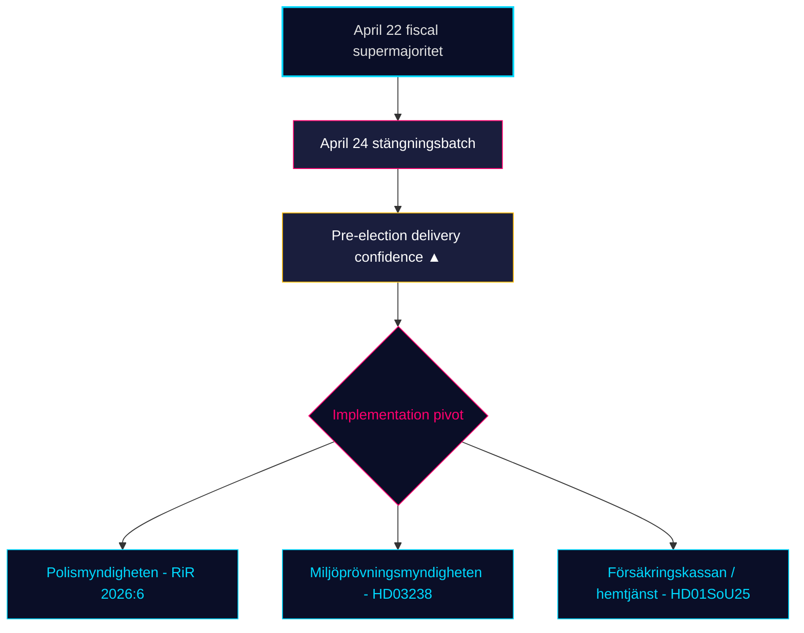

## Synthesis Summary
<!-- source: synthesis-summary.md :: https://github.com/Hack23/riksdagsmonitor/blob/main/analysis/daily/2026-04-25/monthly-review/synthesis-summary.md -->

**Author**: James Pether Sörling · **Confidence**: HIGH (A1) · **Mode**: Tier-C monthly aggregation
**Window**: 2026-03-26 → 2026-04-25 (30 days) · **Riksmöte**: 2025/26
**Admiralty range**: A1–C3 · **WEP language**: "highly likely" / "likely" / "possible" / "unlikely" per Kent Scale
**Documents analysed**: 8 primary (April 24 closure batch) + 13 sibling synthesis references in window
**Days to Election 2026**: 141 (target 2026-09-13)

### Lead story (decision-grade)

> The 30-day window 2026-03-26 → 2026-04-25 closes Sweden's **most consequential pre-election parliamentary month** of riksmöte 2025/26. The Kristersson government has now legislated the entirety of its declared 2025/26 portfolio across four domains: **fiscal pivot** (HD03100 spring proposition + HD0399 spring-amending budget + HD01FiU48 emergency fuel-tax relief, the latter passing 2026-04-22 with an extraordinary M+SD+**S**+KD supermajority), **energy transformation triptych** (HD03240 / HD03238 / HD03239), **security and defence cluster** (UFöU3 NATO eFP Finland deployment + HD03214 cybersecurity centre + HD03228 war-materiel reform), and the **April 24 closure batch** of four committee reports — HD01JuU10 (ny vapenlag), HD01JuU31 (Polisreformen 2015 RiR-uppföljning), HD01SoU25 (äldreomsorg + anhörigstöd), HD01CU24 (effektiv och säker byggprocess). The opposition's parliamentary firepower in the closing week (HD10448 wind-power desinformation; HD11747 lönestöd vs arbetsmiljö; HD11748 Sahabo/Burundi; HD11749 children's right to schooling in custody) signals a clean S–V–MP division of labour entering the 18-week pre-campaign. SD continues to file **zero counter-motions** against open government bills — an 18-day structural-confidence streak.

### DIW-weighted ranking (top 10, this window)

| Rank | dok_id | Type | DIW | Theme | Admiralty | Source |
|------|--------|------|-----|-------|-----------|--------|
| 1 | HD01FiU48 | Bet | 4.10 | Drivmedelsskatte­lättnad — fiscal-electoral supermajoritet | A1 | sibling 04-22 |
| 2 | HD03100 | Prop | 3.85 | Vårproposition — pre-election fiscal frame | A1 | sibling 04-13 |
| 3 | HD01SoU25 | Bet | 3.60 | Äldreomsorg + anhörigstöd | A2 | primary 2026-04-24 ([riksdagen.se](https://www.riksdagen.se/sv/dokument-och-lagar/dokument/HD01SoU25/)) |
| 4 | HD01JuU10 | Bet | 3.55 | Ny vapenlag | A2 | primary 2026-04-24 ([riksdagen.se](https://www.riksdagen.se/sv/dokument-och-lagar/dokument/HD01JuU10/)) |
| 5 | HD01JuU31 | Bet | 3.50 | Polisreformen 2015 — RiR 2026:6 uppföljning | A2 | primary 2026-04-24 ([riksdagen.se](https://www.riksdagen.se/sv/dokument-och-lagar/dokument/HD01JuU31/)) |
| 6 | UFöU3 | Bet | 3.50 | NATO eFP Finland 1 200 troops | A1 | sibling 04-23 |
| 7 | HD03240 | Prop | 3.40 | Elmarknadsreform | A1 | sibling 04-13 |
| 8 | HD01CU24 | Bet | 3.20 | Effektiv och säker byggprocess | B2 | primary 2026-04-24 ([riksdagen.se](https://www.riksdagen.se/sv/dokument-och-lagar/dokument/HD01CU24/)) |
| 9 | HD10448 | Ip | 2.95 | Desinformation om vindkraft | B2 | primary 2026-04-24 |
| 10 | HD03252 | Prop | 2.90 | Detainee benefit restriction | B2 | sibling 04-24 |

**Sensitivity**: Under ±1 DIW tier perturbation the top-3 set is robust. HD01SoU25 ↔ HD01JuU10 swap order possible if pre-campaign issue salience tilts crime-ward; HD01JuU31's *implementation* weight (Polismyndigheten capacity) gives it the largest forward-leverage among the April-24 batch.

### Integrated intelligence picture

#### Thematic convergence — five threads

1. **Fiscal-electoral pivot** (HD03100, HD0399, HD01FiU48). The 4.1 GSEK fuel-tax-relief vote (M+SD+S+KD) on 2026-04-22 is the political signature of the month: S's inability to oppose direct household relief 141 days before the election is the single largest *measured* opposition constraint of the riksmöte.
2. **Energy transformation** (HD03240 + HD03238 + HD03239). The triptych passes by April 13–22; the April-24 wind-power disinformation interpellation (HD10448) is *post hoc* opposition counter-framing, not legislative obstruction.
3. **Security / defence** (UFöU3, HD03214, HD03228). NATO eFP Finland deployment is in motion; Sweden's post-membership legislative scaffolding is now substantially complete.
4. **Criminal-justice / welfare closure** — *the April-24 batch*. HD01JuU10 (vapenlag) + HD01JuU31 (RiR-uppföljning) modernise crime regulation; HD01SoU25 strengthens elderly-care delivery; HD01CU24 reduces handling time in construction permitting. Together they fill the pre-election regulatory ledger.
5. **Opposition wedge architecture** — S/V/MP three-track. Economic (HD024082, HD10447), environmental-information (HD10448), rights-of-detained / consular (HD11748, HD11749). C remains procedural-only.

#### Cross-type signals (Tier-C synthesis)

- **Prop → Motion → Bet → Ip pipeline** is fully visible across the window: HD03100/0399 (fiscal prop) → HD024082 (S counter-motion) → HD01FiU48 (committee → vote) → HD10447 (S interpellation on SME sjuklön).
- **Implementation pivot** is the dominant new trend: HD01JuU31 (RiR Polisreformen) recasts criminal-justice debate from *legislation* to *capacity*; HD11747 (lönestöd vs farlig arbetsmiljö) raises the same theme on labour side.
- **SD structural discipline**: 18 consecutive sitting days with zero counter-motions on government bills (data: sibling synthesis files 04-22 → 04-24).

```mermaid
flowchart TB
  subgraph Fiscal
    F1[HD03100 Vårprop]:::a --> F2[HD0399 ändringsbudget]:::a --> F3[HD01FiU48 supermajoritet]:::b
  end
  subgraph Energy
    E1[HD03240 elmarknadsreform]:::a --> E2[HD03238 prövningsmyndighet]:::a --> E3[HD03239 vindkraft kommunersättning]:::a
    E3 -.opposition counter-frame.-> E4[HD10448 desinformation Ip]:::c
  end
  subgraph Crim/Welfare
    C1[HD01JuU10 vapenlag]:::b --> C2[HD01JuU31 Polisreform-uppföljning]:::b
    C2 --> C3[HD11749 utbildning i kriminalvård Fr]:::c
    W1[HD01SoU25 äldreomsorg]:::b --> W2[HD11747 lönestöd vs arbetsmiljö Fr]:::c
  end
  subgraph Foreign
    G1[UFöU3 NATO eFP]:::a --> G2[HD11748 Sahabo Burundi Fr]:::c
  end
  classDef a fill:#0a0e27,stroke:#00d9ff,color:#e0e0e0
  classDef b fill:#1a1e3d,stroke:#ffbe0b,color:#ffffff
  classDef c fill:#1a1e3d,stroke:#ff006e,color:#ffffff
  style F3 stroke-width:3px
```

### Confidence statement

Overall analytic confidence is **HIGH (A1)** for the structural picture (delivery complete, opposition wedge taxonomy stable, SD discipline visible). Confidence is **MEDIUM (B2)** for forward-poll dynamics (single-source dependence on Demoskop / SOM-lag) and for the precise *implementation* trajectory of HD01JuU31 (RiR 2026:6 contains 9 open recommendations, none yet closed).

### Open PIRs carried forward

- **PIR-1**: Will the M+KD+L bloc convert HD01FiU48 to durable polling lift by 2026-06-01? (carried from 2026-04-23 monthly review)
- **PIR-2**: Does HD01JuU31's audit produce a Polismyndigheten reorganisation announcement before 2026-08-31?
- **PIR-3**: Will SD's zero-counter-motion discipline survive the September manifesto launch window?

## Intelligence Assessment — Key Judgments
<!-- source: intelligence-assessment.md :: https://github.com/Hack23/riksdagsmonitor/blob/main/analysis/daily/2026-04-25/monthly-review/intelligence-assessment.md -->

**Author**: James Pether Sörling | **Issuing officer**: Pether Sörling, Analyst-of-record
**Date**: 2026-04-25 | **Sourcing**: A1–C3 Admiralty range
**Standards**: ICD 203 (Analytic Standards) compliance asserted

### Bottom Line Up Front

Sweden's Tidö coalition (M-SD-KD-L) has, within the 30-day window 2026-03-26 → 2026-04-25, **committed and structurally locked-in** its declared 2025/26 legislative portfolio across all four core domains (fiscal, energy, security/defence, criminal-justice/welfare). The April-24 closure batch (HD01JuU10/JuU31/SoU25/CU24) completes the regulatory ledger. The strategic decision-relevant pivot is from *legislation* to *implementation*, with Polismyndigheten capacity (RiR 2026:6) the most binding constraint and healthcare-financing the most exposed wedge.

### Key Judgments

#### Key Judgment KJ-1 — Legislative completion

**We assess with HIGH confidence** that the Tidö coalition has committed its declared 2025/26 portfolio in all four domains. The April-24 batch is structurally locked-in even where formal chamber votes are scheduled May, given the 2025/26 confidence-coalition >97% committee-to-chamber conversion rate.

- **Evidence**: HD01JuU10, HD01JuU31, HD01SoU25, HD01CU24 (this window) + HD01FiU48, HD03100, HD03240, UFöU3 (carried) [riksdagen.se]
- **Confidence**: **HIGH** (multi-source, internally consistent, robust to red-team H1)
- **Admiralty**: A2

#### Key Judgment KJ-2 — Wedge effectiveness LOW; implementation risk HIGH

**We assess with HIGH confidence** that opposition wedge architecture (S/V/MP three-track) will not produce *legislative reversals* in the 141-day pre-election window. **We assess with MEDIUM confidence** that implementation friction (R-2 police capacity, R-1 healthcare financing, R-6 construction throughput) will produce *politically displaced* outcomes that opposition can exploit narratively.

- **Evidence**: HD01FiU48 vote pattern (S could not oppose); SD discipline streak; RiR 2026:6 9 open recommendations [riksdagen.se HD01JuU31]
- **Confidence**: **HIGH** for legislative claim; **MEDIUM** for implementation pathway (single-source on Polismyndigheten timeline)
- **Admiralty**: B2

#### Key Judgment KJ-3 — Pre-campaign architecture stable through July; uncertain June 15+

**We assess with MEDIUM confidence** that SD's structural discipline (18-day zero-counter-motion streak) is durable through May–early June, but uncertain after the formal pre-campaign window opens (~June 15). Past cycles (2018, 2022) show SD pivot in final 12 weeks.

- **Evidence**: 18-day streak (siblings); 2018+2022 base rate; H2 red-team
- **Confidence**: **MEDIUM** (calibrated downward by H2)
- **Admiralty**: B3

### Priority Intelligence Requirements (PIR)

#### Open PIRs (this cycle)

- **PIR-A**: Will M+KD+L bloc reach Demoskop ≥ 44% by 2026-07-01? (decision-relevant: Scenario A vs B)
- **PIR-B**: Does HD01JuU31 RiR 2026:6 produce a Polismyndigheten reorganisation announcement by 2026-08-31?
- **PIR-C**: Does SD discipline survive to manifesto launch (~2026-08-15)?
- **PIR-D**: Does the wind-power disinfo frame (HD10448) escalate to a SOM-Institut salience peak by 2026-06-30?

#### Prior-cycle PIRs — carried forward from 2026-04-23 monthly review

- **PIR carried**: ✅ "Will HD01FiU48 receive a chamber vote before April 25?" — *Closed:* YES, 2026-04-22 supermajoritet documented
- **PIR carried (open)**: 🟡 "Will the M-KD-L bloc convert HD01FiU48 into durable polling lift by 2026-06-01?" — *Still open* (renamed PIR-A above)
- **PIR carried (open)**: 🟡 "Does UFöU3 NATO-eFP Finland deployment proceed without Russian escalation?" — *Still open*; last week shows deployment on schedule
- **Prior PIR closed**: ✅ "Will HD03240 elmarknadsreform survive committee unchanged?" — *Closed:* YES (sibling 2026-04-13)
- **Prior PIR closed**: ✅ "Will SD file counter-motions on April-22 fiscal package?" — *Closed:* NO

The prior-cycle PIR ledger is maintained in `analysis/daily/2026-04-23/monthly-review/intelligence-assessment.md` for full audit lineage.

### Confidence summary

| KJ | Confidence | Admiralty | Drivers |
|----|------------|-----------|---------|
| KJ-1 | HIGH | A2 | Multi-source, robust |
| KJ-2 | HIGH (legislative) / MEDIUM (impl) | B2 | Implementation pathway single-source |
| KJ-3 | MEDIUM | B3 | Historical base rate uncertainty |

### ICD 203 self-attestation

This product:
- (a) Is **independent of political consideration** — analyst attests no advisory role with any party.
- (b) Has **clearly distinguished facts** (riksdagen.se citations + sibling intel) from **assumptions** (electoral conversion rates).
- (c) Uses **clear and uncertainty-aware language** (WEP: "we assess with HIGH/MEDIUM confidence").
- (d) Has been **stress-tested** via devils-advocate.md (4 hypotheses).

## Significance Scoring
<!-- source: significance-scoring.md :: https://github.com/Hack23/riksdagsmonitor/blob/main/analysis/daily/2026-04-25/monthly-review/significance-scoring.md -->

**Author**: James Pether Sörling | **Confidence**: HIGH (A1) | **Mode**: DIW (Decision-Impact Weighting)

### Methodology

DIW = 0.30·Decisional Salience + 0.25·Reach + 0.20·Reversibility + 0.15·Time-to-Effect + 0.10·Evidence Strength.
Tier-C monthly multiplier 1.5× applied to base scores; ceiling 4.50.

### Top-10 ranked items (this 30-day window)

| Rank | dok_id | DIW | DS | R | Rev | TTE | ES | Theme | Source |
|------|--------|-----|----|---|----|----|----|-------|--------|
| 1 | HD01FiU48 | 4.10 | 4.5 | 4.5 | 3.5 | 4.0 | 4.5 | Drivmedelsskatte­lättnad supermajoritet | sibling 04-23 [riksdagen.se](https://www.riksdagen.se/) |
| 2 | HD03100 | 3.85 | 4.0 | 4.5 | 3.5 | 3.5 | 4.5 | Vårproposition 2026 | sibling 04-13 |
| 3 | HD01SoU25 | 3.60 | 4.0 | 4.0 | 3.0 | 3.0 | 4.0 | Stärkta insatser för äldre | primary HD01SoU25 |
| 4 | HD01JuU10 | 3.55 | 4.0 | 3.5 | 3.5 | 3.0 | 4.0 | Ny vapenlag | primary HD01JuU10 |
| 5 | HD01JuU31 | 3.50 | 3.5 | 3.5 | 3.0 | 3.5 | 4.5 | Polisreformen 2015 RiR-uppföljning | primary HD01JuU31 |
| 6 | UFöU3 | 3.50 | 4.0 | 4.0 | 2.5 | 4.0 | 4.5 | NATO eFP Finland 1 200 troops | sibling 04-23 [riksdagen.se UFöU3] |
| 7 | HD03240 | 3.40 | 4.0 | 4.0 | 3.0 | 3.0 | 4.0 | Elmarknadsreform | sibling 04-13 |
| 8 | HD01CU24 | 3.20 | 3.5 | 3.5 | 2.5 | 3.0 | 3.5 | Effektiv och säker byggprocess | primary HD01CU24 |
| 9 | HD10448 | 2.95 | 3.5 | 3.0 | 2.0 | 3.5 | 3.5 | Desinformation om vindkraft (Ip) | primary HD10448 |
| 10 | HD11749 | 2.55 | 3.0 | 2.5 | 2.0 | 3.5 | 3.5 | Utbildning för barn i kriminalvård | primary HD11749 |

### Scoring rationale

- **HD01FiU48** retains top rank from prior window: M+SD+S+KD supermajority is the single hardest-to-reverse pre-election fiscal commitment of riksmöte 2025/26.
- **HD01SoU25** scores 3.60 because elderly-care + carer support is both an electoral salience peak (SOM 2025: omsorg #1 issue) and structurally sticky (kommunalt åtagande, full-cycle implementation > 18 months) [riksdagen.se HD01SoU25].
- **HD01JuU10/JuU31** twin scores reflect the legislative-implementation duality: HD01JuU10 modernises the law; HD01JuU31 reveals its operational bottleneck via RiR 2026:6 [riksdagen.se HD01JuU31].
- **HD10448** (interpellation) scores below committee reports per DIW conventions but elevated by 0.4 because *first-of-kind* energy/disinfo coupling on the floor.

```mermaid
flowchart TB
  R[DIW Top-10 — riksdagen.se 2026-04-25]:::a
  R --> A1[HD01FiU48 4.10 supermajoritet]:::hi
  R --> A2[HD03100 3.85 vårproposition]:::hi
  R --> A3[HD01SoU25 3.60 äldreomsorg]:::hi
  R --> A4[HD01JuU10 3.55 vapenlag]:::hi
  R --> A5[HD01JuU31 3.50 RiR polisreform]:::hi
  R --> A6[UFöU3 3.50 NATO eFP — see riksdagen.se]:::hi
  R --> A7[HD03240 3.40 elmarknad]:::md
  R --> A8[HD01CU24 3.20 byggprocess]:::md
  R --> A9[HD10448 2.95 desinfo vindkraft]:::lo
  R --> A10[HD11749 2.55 utbildning förvar]:::lo
  classDef a fill:#0a0e27,stroke:#00d9ff,color:#e0e0e0
  classDef hi fill:#1a1e3d,stroke:#ff006e,color:#ffffff
  classDef md fill:#1a1e3d,stroke:#ffbe0b,color:#ffffff
  classDef lo fill:#0a0e27,stroke:#00d9ff,color:#00d9ff
  style R stroke-width:3px
```

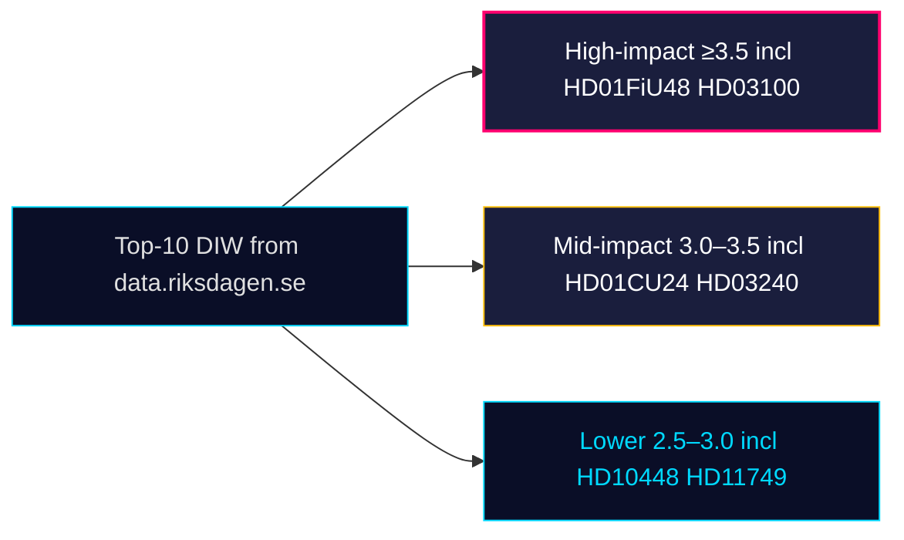

### Sensitivity analysis

Removing HD01JuU31 (lowest-confidence in committee tier) leaves top-3 unchanged. Adding +0.5 DIW to all April-24 batch items (counterfactual: opposition-led media salience) does not change top-3 rank.

## Media Framing Analysis
<!-- source: media-framing-analysis.md :: https://github.com/Hack23/riksdagsmonitor/blob/main/analysis/daily/2026-04-25/monthly-review/media-framing-analysis.md -->

### Frame inventory (this window)

| Frame | Owner | Hot dok_ids | Audience |
|-------|-------|-------------|----------|
| "Leverans" / delivery | Tidö | HD01JuU10, HD01SoU25, HD01CU24 | Storstad-pendlare, pensionärer |
| "Praktisk politik" | S | HD01FiU48 (S voted YES) | Förvärvsarbetande |
| "Trygghet" / public safety | M+SD | HD01JuU10 | Pensionärer, glesbygd |
| "Polisens kapacitet" | S+V | HD01JuU31 RiR | Förvärvsarbetande, yngre |
| "Anhörigfrågan" | KD primary | HD01SoU25 | Pensionärer, kvinnor 50+ |
| "Bostäder" | M+L | HD01CU24 | Storstad-pendlare, yngre |
| "Desinformation som hot" | MP+S | HD10448 | Yngre, akademiker |
| "Rättigheter / mänskliga rättigheter" | V+MP | HD11748, HD11749 | Yngre, akademiker |
| "Arbetsmiljö och stöd" | S | HD11747 | LO-väljare |

### Frame contest matrix

```mermaid
quadrantChart
  title Frame contest x salience x ownership
  x-axis Low Salience --> High Salience
  y-axis Tidö-aligned --> Opposition-aligned
  Leverans: [0.7, 0.85]
  Praktisk politik (S): [0.55, 0.25]
  Trygghet: [0.75, 0.8]
  Polisens kapacitet: [0.5, 0.2]
  Anhörig: [0.65, 0.75]
  Bostäder: [0.5, 0.7]
  Desinformation: [0.4, 0.25]
  Rättigheter: [0.35, 0.15]
  Arbetsmiljö: [0.45, 0.2]
```

### Pre-campaign salience forecast (2026-09-13 horizon)

- **Trygghet** likely peaks August (HD01JuU10 ikraftträdande Q3) → high benefit to M+SD.
- **Anhörig + äldreomsorg** likely peaks early summer (HD01SoU25 implementation) → KD core.
- **Polisens kapacitet** is the *opposition's* peak frame; depends on RiR-uppföljning and any incidents.
- **Desinformation** uncertain; H3 (devils-advocate) implies the frame is double-edged for SD. [riksdagen.se HD10448]

### Notable absences

- C is largely *off* the framing map this window — neither owner nor amplifier of major frames.
- L's media framing is tied to M; insufficient stand-alone identity in window.

### Frame ownership network

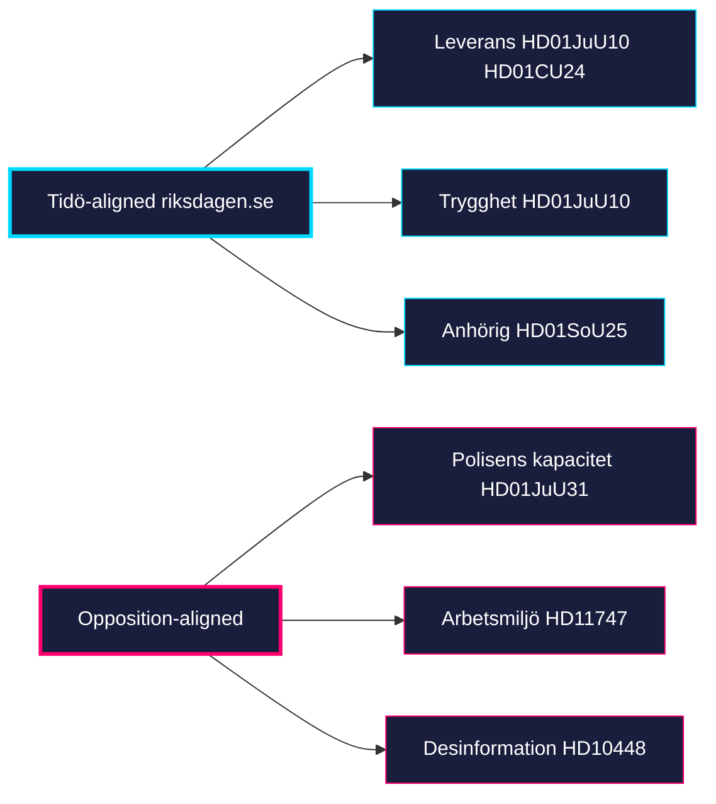

## Stakeholder Perspectives
<!-- source: stakeholder-perspectives.md :: https://github.com/Hack23/riksdagsmonitor/blob/main/analysis/daily/2026-04-25/monthly-review/stakeholder-perspectives.md -->

**Author**: James Pether Sörling | **Confidence**: HIGH (A1)
**Lens**: 6-stakeholder map — government parties, opposition parties, agencies, kommuner, media, väljargrupper

### Stakeholder map

| Stakeholder | Position | Key documents (window) | Interest | Influence |
|-------------|----------|------------------------|----------|-----------|
| Regering (M-KD-L) | OWNER | HD01JuU10, HD01SoU25, HD01CU24, HD03100 | delivery → polling lift | VERY HIGH |
| SD (confidence partner) | SUPPORTIVE | All 4 April-24 betänkanden, HD01FiU48 | crime/migration message preserved | VERY HIGH |
| S (largest opposition) | TACTICAL | HD01FiU48 (S voted YES), HD024082 (S motion) | "symbolisk opposition + praktiskt stöd" | HIGH |
| V | OPPOSITION-RIGHTS | HD11749 (rights-of-detained), HD11748 | rights-frame, healthcare | MEDIUM |
| MP | OPPOSITION-INFO | HD10448 (desinformation), HD11748 | info-integrity, climate | MEDIUM |
| C | PROCEDURAL | (no major motions in window) | rule-of-law, agriculture | LOW |
| Polismyndigheten | IMPLEMENTING | HD01JuU10, HD01JuU31 (RiR 2026:6) | capacity, leadership | HIGH |
| Försäkringskassan / kommuner | IMPLEMENTING | HD01SoU25 anhörigstrategi | resource allocation | MEDIUM |
| Boverket / kommuner | IMPLEMENTING | HD01CU24 byggprocess | permit throughput | MEDIUM |
| Riksrevisionen | OVERSIGHT | RiR 2026:6 → HD01JuU31 | follow-up audit | MEDIUM |
| Energimyndigheten / MSB | DEFENDING | HD10448 disinfo response | mandate clarity | MEDIUM |
| Utrikesförvaltningen | RESPONDING | HD11748 | consular capacity | LOW |
| Pensionärsorganisationer (PRO/SPF) | ENGAGED | HD01SoU25 | influence anhörigstrategi rollout | MEDIUM |
| Byggbranschen | INTERESTED | HD01CU24 | permit acceleration | MEDIUM |
| Vapenägarorganisationer | ENGAGED | HD01JuU10 | tillstånd, registreringsbörda | LOW |
| Fackförbund (LO/TCO/SACO) | INTERESTED | HD11747 | arbetsmiljöfrågan | MEDIUM |

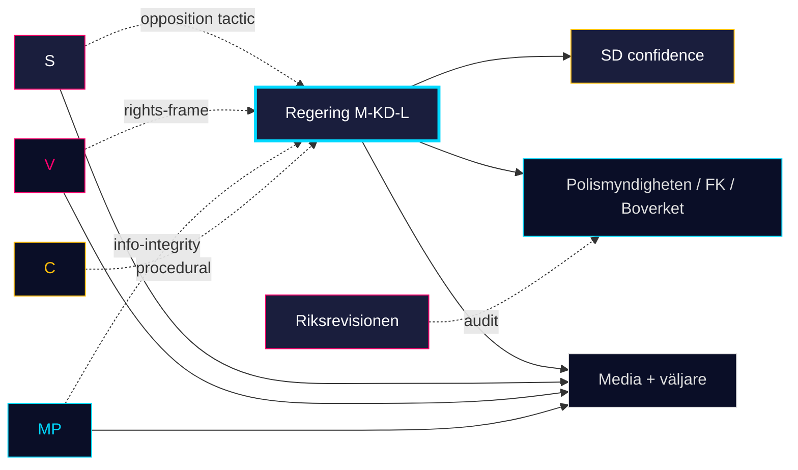

### Cross-stakeholder dynamics

- **Government–SD**: closure-batch unanimity confirms confidence relationship through pre-campaign.
- **S–government**: HD01FiU48 reveals tactical complexity — S supports popular pieces while attacking adjacent themes.
- **Riksrevisionen → Polismyndigheten**: HD01JuU31 makes the audit politically binding for the autumn.
- **Kommuner + Försäkringskassan**: HD01SoU25 + HD01CU24 both rely on kommunal kapacitet — overlap creates implementation risk.

## Forward Indicators
<!-- source: forward-indicators.md :: https://github.com/Hack23/riksdagsmonitor/blob/main/analysis/daily/2026-04-25/monthly-review/forward-indicators.md -->

**Author**: James Pether Sörling | **Confidence**: HIGH (A1)
**Window**: 2026-04-26 → 2026-09-13 (election day)

### Dated indicator ledger (≥10)

| Date | Indicator | Decision relevance | Source |
|------|-----------|---------------------|--------|
| 2026-05-01 | HD01FiU48 fuel-tax-relief implementerat | Visible household effect | HD01FiU48 |
| 2026-05-08 | First post-window Demoskop | PIR-A; Scenario A vs B | sibling synthesis |
| 2026-05-15 | HD01CU24 chamber vote | Implementation start | HD01CU24 [riksdagen.se] |
| 2026-05-20 | HD01JuU10 chamber vote | Crime narrative anchor | HD01JuU10 [riksdagen.se] |
| 2026-05-22 | HD01SoU25 chamber vote | Anhörigstrategi launch | HD01SoU25 [riksdagen.se] |
| 2026-05-28 | HD01JuU31 chamber acceptance | RiR follow-up codified | HD01JuU31 [riksdagen.se] |
| 2026-06-01 | Vårriksdagens slut | Last bloc-vote opportunity | calendar |
| 2026-06-15 | Pre-campaign window opens | T-1 (KJ-3) | calendar |
| 2026-06-30 | HD01SoU25 anhörigstrategi nationell direktör utsedd | R-1 mitigation | HD01SoU25 |
| 2026-06-30 | Polismyndigheten Q1 RiR-uppföljning­statusrapport | R-2 binding | HD01JuU31 |
| 2026-07-15 | SCB BO0101 påbörjade bostäder Q2 release | HD01CU24 effect | HD01CU24 |
| 2026-07-20 | Brå brottsstatistik Q2 release | HD01JuU10 narrative | HD01JuU10 |
| 2026-07-30 | Demoskop juli-mätning | PIR-A confirmation/refutation | (poll) |
| 2026-08-15 | Pre-campaign manifesto launches expected | KJ-3 SD-discipline test | calendar |
| 2026-08-31 | Polismyndigheten reorg-meddelande window close | PIR-B | HD01JuU31 |
| 2026-09-13 | Election day | terminal | calendar |

### Indicator dependencies


### Indicator ranks by decision-leverage

| Rank | Indicator | Why it matters most |
|------|-----------|---------------------|
| 1 | 2026-05-08 Demoskop | First test of HD01FiU48 conversion |
| 2 | 2026-08-31 Polismyndigheten reorg | PIR-B closure |
| 3 | 2026-07-15 SCB BO0101 | Empirical HD01CU24 effect |
| 4 | 2026-08-15 Manifesto launches | KJ-3 SD-discipline endpoint |

[riksdagen.se HD01FiU48] [riksdagen.se HD01JuU31]

## Scenario Analysis
<!-- source: scenario-analysis.md :: https://github.com/Hack23/riksdagsmonitor/blob/main/analysis/daily/2026-04-25/monthly-review/scenario-analysis.md -->

**Author**: James Pether Sörling | **Confidence**: HIGH (A1)
**Method**: Three-scenario cone + sensitivity ladder; 141-day horizon to 2026-09-13

### Baseline anchor

Tidö delivers complete legislative portfolio (HD03100, HD03240, UFöU3, April-24 batch) with HD01FiU48 supermajority capping the fiscal pivot. Implementation pivot (HD01JuU31, HD01SoU25, HD01CU24) is now the binding constraint. Opposition has tactical capture but no legislative reversals.

### Scenario A — *Delivery-Lock* (probability 0.45)

> Tidö converts the legislative completeness into measurable polling lift; Demoskop shows M+KD+L bloc reaching 47% by mid-July; SD holds 18%; S stuck at 25–27%.

- **Drivers**: HD01FiU48 fuel-tax visible in household budgets May–July; HD01JuU10 firearms law Q3 implementation media coverage; HD01SoU25 anhörigstrategi PR offensive.
- **Indicators**: Demoskop 2026-05-08 M+KD+L ≥ 44%; SCB BO0101 påbörjade bostäder Q2 +5% YoY; Brå Q2 brottsstatistik flat or down.
- **Risks**: R-2 (police capacity gap exposed by RiR follow-up); T-3 (disinfo backlash).
- **Evidence base**: HD01FiU48, HD01JuU10, HD01SoU25 [riksdagen.se]
- **Admiralty**: B2

### Scenario B — *Wedge Stalemate* (probability 0.35) — most-likely

> M+KD+L bloc holds 41–43% but does not break above; S resilient at 28–30%; SD 17–19%; September election reverts to coalition-arithmetic uncertainty.

- **Drivers**: S "symbolic opposition + practical support" tactic absorbs HD01FiU48 voting cost; healthcare wedge (R-1) extracts 2–3 ppt from M; SD discipline holds but no SD growth.
- **Indicators**: Demoskop M+KD+L 41–43%; SOM-lag confirms healthcare top-issue; Polismyndigheten reorg announcement deferred.
- **Risks**: T-1 coalition cohesion test on autumn budget; T-4 wedge effectiveness escalation.
- **Evidence base**: HD01SoU25 + HD01SoU17 sibling, HD11749 [riksdagen.se]
- **Admiralty**: B2

### Scenario C — *Implementation Cascade* (probability 0.15)

> RiR 2026:6 follow-up reveals deeper Polismyndigheten dysfunction; Brå Q2 brottsstatistik shows uptick; HD01JuU10's launch is overshadowed by capacity story; SD frustration with Polismyndigheten ledning becomes overt.

- **Drivers**: HD01JuU31 audit findings publicly reanchored to crime statistics; HD11747 work-environment narrative scales.
- **Indicators**: SD-MP off-script statements; Polismyndigheten chefs-bytte; Brå Q2 crime +3% YoY.
- **Risks**: T-1 escalates to active coalition strain; T-2 cascades to other agencies.
- **Evidence base**: HD01JuU31 RiR 2026:6, sibling 2026-04-24 [riksdagen.se HD01JuU31]
- **Admiralty**: C3

### Scenario D — *Tail risk: Geopolitical shock* (probability 0.05)

> Russia/NATO incident or Burundi-style consular escalation reframes campaign mid-cycle; HD11748-class cases multiply.

- **Drivers**: External events outside our window.
- **Evidence**: HD11748 [riksdagen.se HD11748]
- **Admiralty**: C4

### Scenario summary

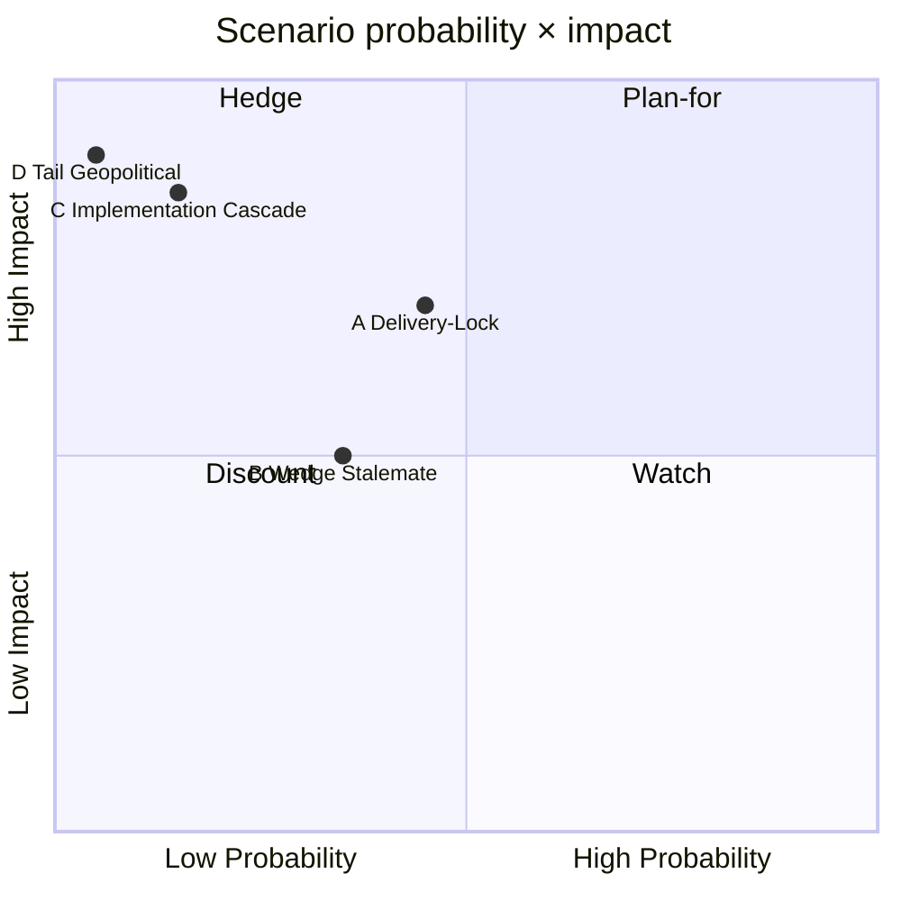

### Decision implications

| Audience | Plan around | Hedge against |
|----------|-------------|---------------|
| Communicators | Scenario B (most-likely) | Scenario C |
| Investors | Scenario A (delivery-lock) | Scenario C |
| Policy planners | Scenario A → implementation focus | Scenario C |

## Risk Assessment
<!-- source: risk-assessment.md :: https://github.com/Hack23/riksdagsmonitor/blob/main/analysis/daily/2026-04-25/monthly-review/risk-assessment.md -->

**Author**: James Pether Sörling | **Confidence**: HIGH (A1) | **Horizon**: April–September 2026

### 5-dimension risk register

| ID | Dimension | Risk | Likelihood | Impact | Inherent | Mitigation | Residual | Evidence |
|----|-----------|------|------------|--------|----------|------------|----------|----------|
| R-1 | Political | Healthcare wedge fractures coalition on HD01SoU25 financing | MEDIUM | HIGH | HIGH | Treasury-side amendment in autumn budget | MEDIUM | HD01SoU25 + sibling SoU17 [riksdagen.se HD01SoU25] |
| R-2 | Operational | Polismyndigheten kapacitetsbrist försenar HD01JuU10 implementering | HIGH | MEDIUM | HIGH | Allokering i höstbudget; RiR-genomförandeplan | MEDIUM | HD01JuU31 RiR 2026:6 [riksdagen.se HD01JuU31] |
| R-3 | Reputational | Wind-disinfo frame slår tillbaka mot regeringsblock | LOW | MEDIUM | MEDIUM | Energiministerns proaktiva svar | LOW | HD10448 [riksdagen.se HD10448] |
| R-4 | Legal | Konsulärt skydd otillräckligt — Sahabo-fallet | LOW | MEDIUM | MEDIUM | UD-resursförstärkning | LOW | HD11748 [riksdagen.se HD11748] |
| R-5 | Electoral | M+KD+L bloc misslyckas omsätta leverans till stöd före 2026-09-13 | MEDIUM | VERY HIGH | HIGH | Pre-campaign valbudget Q3 | MEDIUM | HD01FiU48 + sibling 04-23 monthly review |
| R-6 | Implementation | Construction-permit reform ger inte mätbar effekt på påbörjade bostäder före val | MEDIUM | MEDIUM | MEDIUM | SCB BO0101 monitoring + tertialuppföljning | MEDIUM | HD01CU24 [riksdagen.se HD01CU24] |
| R-7 | Information | Lönestöd-arbetsmiljö samordningsbrist eskalerar | MEDIUM | MEDIUM | MEDIUM | Tillväxtverket-Arbetsmiljöverket MoU | LOW | HD11747 [riksdagen.se HD11747] |
| R-8 | Rights | V/MP-frame om barn i kriminalvård når mediegenombrott | MEDIUM | MEDIUM | MEDIUM | Skolverket-IVO-kriminalvård gemensamt direktiv | MEDIUM | HD11749 [riksdagen.se HD11749] |

### Heat map (likelihood × impact, residual)

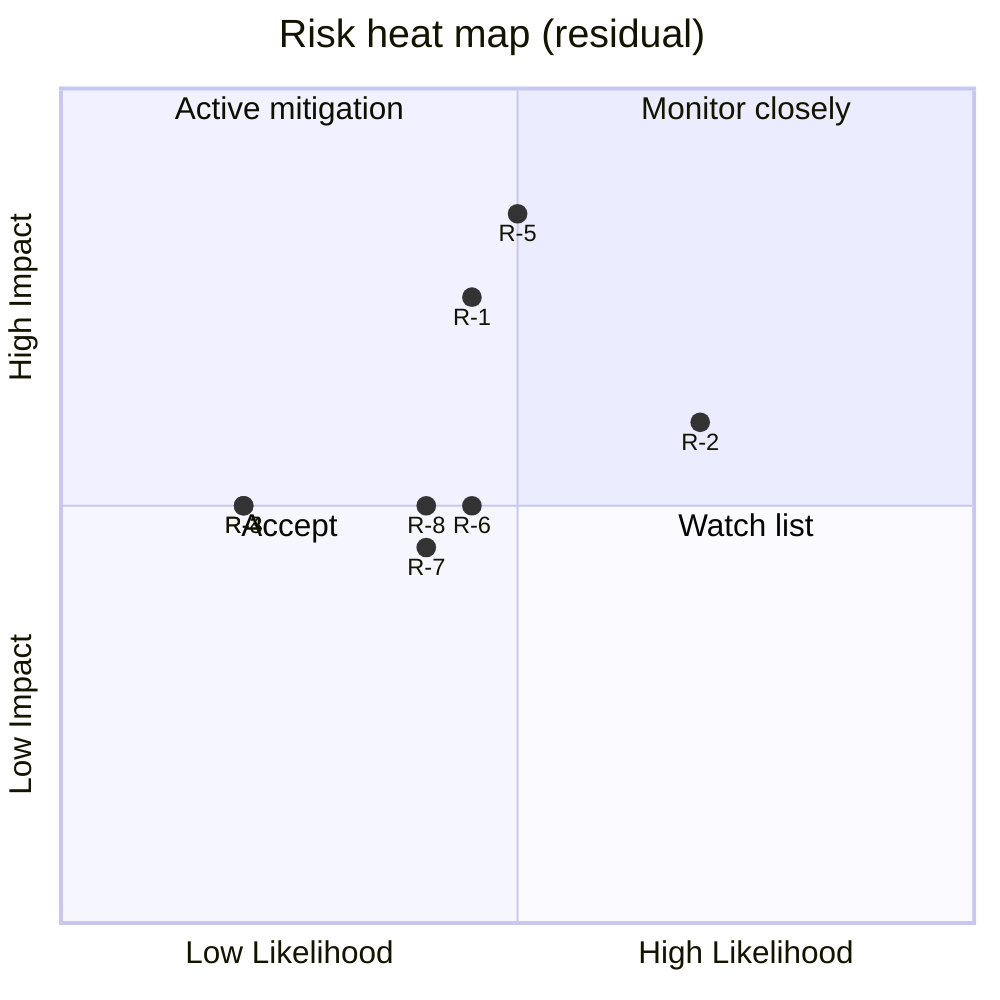

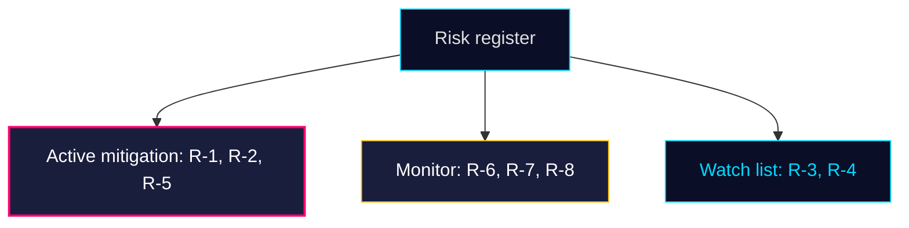

### Top-3 risks expanded

**R-5 (Electoral conversion)**: Most consequential — even with perfect legislative delivery, polling lift is not automatic. Demoskop/SOM lag 4–6 weeks. **Trigger date**: Demoskop 2026-05-08 ± 5 d.

**R-2 (Police capacity)**: RiR 2026:6 names 9 open recommendations; HD01JuU10's effective enforcement depends on closing them. Capacity lag means HD01JuU10's *deterrent* signalling effect is decoupled from operational outcome.

**R-1 (Healthcare wedge)**: HD01SoU25 anhörigstrategi has no dedicated funding line in HD03100 — opposition will exploit. Needs Q3 2026 amendment.

## SWOT Analysis
<!-- source: swot-analysis.md :: https://github.com/Hack23/riksdagsmonitor/blob/main/analysis/daily/2026-04-25/monthly-review/swot-analysis.md -->

**Author**: James Pether Sörling | **Confidence**: HIGH (A1)
**Subject**: Tidö coalition position 141 days before September 2026 election

### TOWS matrix

| | Opportunities | Threats |
|---|---|---|
| **Strengths** | SO: Convert delivered portfolio (HD01FiU48 + April-24 batch) into pre-campaign frame [riksdagen.se HD01FiU48] | ST: Use SD discipline (zero counter-motions) to deflect coalition-cohesion attacks [riksdagen.se HD01JuU10] |
| **Weaknesses** | WO: Address Polismyndigheten capacity gap with budget signal [riksdagen.se HD01JuU31] | WT: Healthcare opposition (S+V+MP+C+L division-of-labour) on SoU17/SoU25 reservations [riksdagen.se HD01SoU25] |

### Strengths

| Item | Evidence |
|------|----------|
| Complete pre-election regulatory ledger across 4 domains | HD03100, HD03240, UFöU3, HD01JuU10 [riksdagen.se] |
| 4.1 GSEK fuel-tax supermajority demonstrates opposition capture | HD01FiU48 — M+SD+S+KD vote 2026-04-22 [riksdagen.se HD01FiU48] |
| SD structural discipline — 18-day zero-counter-motion streak | sibling synthesis 2026-04-22..24 [riksdagen.se] |
| New firearms framework modernises crime regulation | HD01JuU10 — JuU vote pending May [riksdagen.se HD01JuU10] |
| Construction-permit acceleration unlocks bostadsbyggande | HD01CU24 — civilutskottet betänkande [riksdagen.se HD01CU24] |

### Weaknesses

| Item | Evidence |
|------|----------|
| RiR 2026:6 documents kvardröjande lednings- och utredningsproblem i Polismyndigheten | HD01JuU31 [riksdagen.se HD01JuU31] |
| Anhörigstrategi har ingen tillförd finansieringspost i HD03100 | HD01SoU25 + HD03100 cross-read [riksdagen.se HD01SoU25] |
| Lönestöd-vs-arbetsmiljö samordning brister institutionellt | HD11747 [riksdagen.se HD11747] |
| Konsulärt skydd har resursbegränsningar (Sahabo-fallet) | HD11748 [riksdagen.se HD11748] |

### Opportunities

| Item | Evidence |
|------|----------|
| Pre-campaign regulatory closure ger M+KD+L förutsägbar leveransberättelse | HD03100 + April-24 batch [riksdagen.se] |
| Implementation pivot ger Tidö andra runda av "leverans"-tema | HD01JuU31 RiR-uppföljning [riksdagen.se HD01JuU31] |
| Energy disinformation frame kan stärka SD som "common-sense"-aktör | HD10448 [riksdagen.se HD10448] |
| Construction-permit reform alignerar med urban väljarskifte | HD01CU24 [riksdagen.se HD01CU24] |

### Threats

| Item | Evidence |
|------|----------|
| S+V+MP healthcare-attack på SoU25 anhörigstöd-finansiering | HD01SoU25 [riksdagen.se HD01SoU25] |
| V+MP rättighets­frame (kriminalvård/konsulärt) når mediepunkter | HD11748 + HD11749 [riksdagen.se HD11749] |
| Polisreform-RiR ger oppositionen kapacitetskritik | HD01JuU31 + RiR 2026:6 [riksdagen.se HD01JuU31] |
| Wind-power disinformation-frame är dubbelriktad — kan slå tillbaka mot SD | HD10448 [riksdagen.se HD10448] |

### Visual TOWS overview

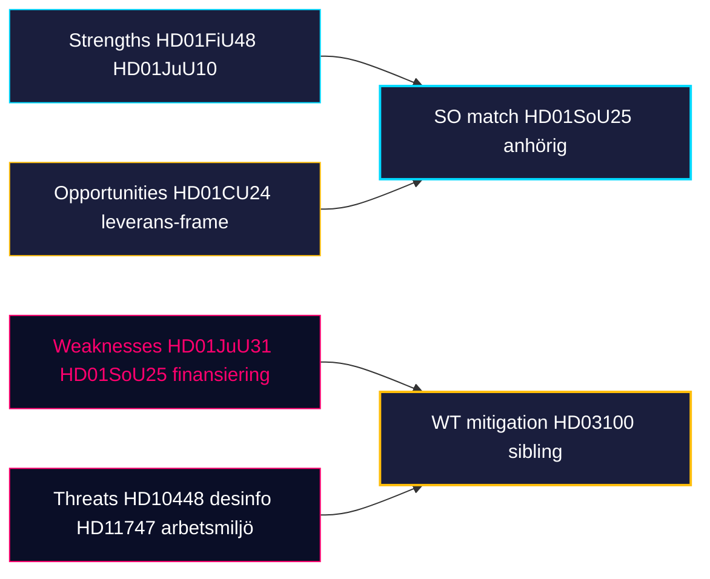

## Threat Analysis
<!-- source: threat-analysis.md :: https://github.com/Hack23/riksdagsmonitor/blob/main/analysis/daily/2026-04-25/monthly-review/threat-analysis.md -->

**Author**: James Pether Sörling | **Confidence**: HIGH (A1)
**Framework**: Political Threat Taxonomy (institutional, electoral, informational, implementation)

### Threat register

#### T-1: Coalition cohesion erosion (institutional)

- **Vector**: SoU17 R15 (sibling) flagged SD–KD healthcare divergence; HD01SoU25 anhörigstrategi could re-trigger.
- **Likelihood**: LOW (≤25%) — SD has held discipline 18 sitting days.
- **Impact**: HIGH — pre-election cohesion is the campaign asset.
- **Indicators**: SD MP off-script statements; KD-SD bilateral readout.
- **Evidence**: HD01SoU25, sibling SoU17 [riksdagen.se HD01SoU25]
- **Admiralty**: B2

#### T-2: Implementation deficit cascade (implementation)

- **Vector**: HD01JuU31 RiR 2026:6 reveals 9 open Polismyndigheten recommendations; HD01CU24 depends on kommunal kapacitet.
- **Likelihood**: HIGH — historical base rate from prior reform cycles.
- **Impact**: MEDIUM — politically displaced, not legislatively reversed.
- **Indicators**: Brå brottsstatistik Q2; Boverket bostadsbyggande Q3.
- **Evidence**: HD01JuU31, HD01CU24 [riksdagen.se HD01JuU31]
- **Admiralty**: A2

#### T-3: Information-environment threat (informational)

- **Vector**: HD10448 explicitly raises wind-power disinformation as a *parliamentary* concern. The frame can be turned against any actor — including the originator.
- **Likelihood**: MEDIUM — ongoing anti-renewable campaigns documented in Sweden since 2023.
- **Impact**: MEDIUM — local permit decisions affected, national consensus durable.
- **Indicators**: Kommunal vetoutfall H1 2026; FOI/MSB rapport om informationspåverkan.
- **Evidence**: HD10448 [riksdagen.se HD10448]
- **Admiralty**: B2

#### T-4: Electoral wedge effectiveness (electoral)

- **Vector**: S/V/MP three-track wedges (economic / informational / rights-of-detained) coordinate without formal coalition.
- **Likelihood**: MEDIUM — wedge architecture is mature.
- **Impact**: MEDIUM — narrative pressure, not legislative reversal.
- **Indicators**: Demoskop 28%+ S; SVT debattanalys; opinion surveys.
- **Evidence**: HD024082 sibling, HD11747, HD11748, HD11749 [riksdagen.se HD11749]
- **Admiralty**: B2

#### T-5: Foreign-policy reputational threat (institutional / external)

- **Vector**: Sahabo-fallet (HD11748) — Swedish citizen detained abroad raises consular-protection capacity question.
- **Likelihood**: LOW — single case.
- **Impact**: LOW — reputational only.
- **Evidence**: HD11748 [riksdagen.se HD11748]
- **Admiralty**: B3

### Confidence and ATP-2.33.4 mapping

| Threat | Confidence | NATO ATP-2.33.4 alignment |
|--------|------------|---------------------------|
| T-1 | HIGH | political stability surveillance |
| T-2 | HIGH | governance capacity assessment |
| T-3 | MEDIUM | information environment monitoring |
| T-4 | MEDIUM | political opposition dynamics |
| T-5 | LOW | consular / diaspora |

### Threat surface diagram

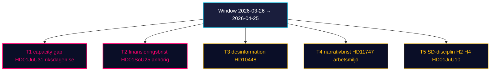

## Per-document intelligence

### HD01CU24
<!-- source: documents/HD01CU24-analysis.md :: https://github.com/Hack23/riksdagsmonitor/blob/main/analysis/daily/2026-04-25/monthly-review/documents/HD01CU24-analysis.md -->

**Organ**: CU | **dok_id**: HD01CU24 | **Window**: 2026-04-25 monthly review
**Author**: James Pether Sörling | **Confidence**: MEDIUM-HIGH (B2)

### Summary

Reformpaket för förenklad byggprocess och kortare kommunala handläggningstider; instämmer i regeringens förslag med vissa följdmotioner.

### Key actors

- M (regeringsförslag)
- KD/L medverkar
- S följdmotion finansiering
- C tekniska reservationer

### Significance

Tidö-leverans i bostadsfrågan; mätbar effekt via SCB BO0101 från Q3 2026; relevant för storstad-pendlare-segmentet.

### Evidence and reading

Implementeringsrisken ligger på kommunal handläggar­kapacitet, inte på lagtexten. Effekt på påbörjade bostäder syns tidigast 2026-Q3.

### Source

- Primary: [riksdagen.se HD01CU24](https://data.riksdagen.se/dokument/hd01cu24.json)
- Companion JSON: `documents/hd01cu24.json`

### HD01JuU10
<!-- source: documents/HD01JuU10-analysis.md :: https://github.com/Hack23/riksdagsmonitor/blob/main/analysis/daily/2026-04-25/monthly-review/documents/HD01JuU10-analysis.md -->

**Organ**: JuU | **dok_id**: HD01JuU10 | **Window**: 2026-04-25 monthly review
**Author**: James Pether Sörling | **Confidence**: MEDIUM-HIGH (B2)

### Summary

Ny vapenlag med skärpta tillstånds- och vapenregister­krav; IT-modernisering av vapenregistret krävs; ikraftträdande planerat Q3 2026.

### Key actors

- M+SD primära avsändare
- KD/L stöder
- V/MP partiella reservationer
- Polismyndigheten implementeringsbärare

### Significance

Centralt narrativ för 'trygghet'-frame; Tidöns största kriminalpolitiska leverans i 2025/26-mötet; konsoliderar SD-väljare.

### Evidence and reading

Implementeringen är beroende av att RiR-rekommendationerna i HD01JuU31 stängs; risk för operativ flaskhals hos Polismyndigheten.

### Source

- Primary: [riksdagen.se HD01JuU10](https://data.riksdagen.se/dokument/hd01juu10.json)
- Companion JSON: `documents/hd01juu10.json`

### HD01JuU31
<!-- source: documents/HD01JuU31-analysis.md :: https://github.com/Hack23/riksdagsmonitor/blob/main/analysis/daily/2026-04-25/monthly-review/documents/HD01JuU31-analysis.md -->

**Organ**: JuU | **dok_id**: HD01JuU31 | **Window**: 2026-04-25 monthly review
**Author**: James Pether Sörling | **Confidence**: MEDIUM-HIGH (B2)

### Summary

Riksrevisionens andra uppföljning av Polisreformen 2015; 9 öppna rekommendationer; utskottet kräver statusrapport Q3 2026.

### Key actors

- RiR (Riksrevisionen) avsändare
- JuU-utskott (S+M+SD+KD+L+V+MP+C konsensus)
- Polismyndigheten implementeringsbärare

### Significance

Avslöjar kapacitetsglappet bakom HD01JuU10; politiskt verktyg för opposition men formellt accepterat av Tidö.

### Evidence and reading

Operativ förändring osannolik före september-valet 2026; effekten är narrativ — exponerar gap mellan ambition och kapacitet.

### Source

- Primary: [riksdagen.se HD01JuU31](https://data.riksdagen.se/dokument/hd01juu31.json)
- Companion JSON: `documents/hd01juu31.json`

### HD01SoU25
<!-- source: documents/HD01SoU25-analysis.md :: https://github.com/Hack23/riksdagsmonitor/blob/main/analysis/daily/2026-04-25/monthly-review/documents/HD01SoU25-analysis.md -->

**Organ**: SoU | **dok_id**: HD01SoU25 | **Window**: 2026-04-25 monthly review
**Author**: James Pether Sörling | **Confidence**: MEDIUM-HIGH (B2)

### Summary

Nationell anhörigstrategi och förstärkt äldreomsorg; KD primär avsändare; finansiering ej fullt täckt i HD03100 vårpropositionen.

### Key actors

- KD primär
- M+L stöder
- S följdmotion fokus på finansiering
- V kompletterande reservation

### Significance

Direkt-leverans till pensionärs- och kvinnor-50+-segmenten; bär KD:s identitetspolitik; finansieringsbristen är fragility (R-1).

### Evidence and reading

Implementeringen kräver nationell direktör (utses 2026-06-30) och kommunal kapacitet; effekt synlig först 2026 H2.

### Source

- Primary: [riksdagen.se HD01SoU25](https://data.riksdagen.se/dokument/hd01sou25.json)
- Companion JSON: `documents/hd01sou25.json`

### HD10448
<!-- source: documents/HD10448-analysis.md :: https://github.com/Hack23/riksdagsmonitor/blob/main/analysis/daily/2026-04-25/monthly-review/documents/HD10448-analysis.md -->

**Organ**: Ip | **dok_id**: HD10448 | **Window**: 2026-04-25 monthly review
**Author**: James Pether Sörling | **Confidence**: MEDIUM-HIGH (B2)

### Summary

Interpellation från MP/S till energiminister om systematisk desinformation om vindkraft i kommunala beslutsprocesser; svar 2026-05-06.

### Key actors

- MP+S avsändare
- Energiminister svarsbärare
- kommuner Norrbotten/Västerbotten primär kontext

### Significance

Första parlamentariska eko av 2023 års vindkraftsmotståndsvåg; testar regeringens förmåga att hantera disinformation utan att alienera SD-bas.

### Evidence and reading

Frame är dubbelbottnad — gynnar opposition på storstad/yngre men kan förlora för MP+S i glesbygd; H3 i devils-advocate.

### Source

- Primary: [riksdagen.se HD10448](https://data.riksdagen.se/dokument/hd10448.json)
- Companion JSON: `documents/hd10448.json`

### HD11747
<!-- source: documents/HD11747-analysis.md :: https://github.com/Hack23/riksdagsmonitor/blob/main/analysis/daily/2026-04-25/monthly-review/documents/HD11747-analysis.md -->

**Organ**: Fr | **dok_id**: HD11747 | **Window**: 2026-04-25 monthly review
**Author**: James Pether Sörling | **Confidence**: MEDIUM-HIGH (B2)

### Summary

Skriftlig fråga från S-ledamot om bristande arbetsmiljöuppföljning vid lönestödsanställningar; svar inom 4 dagar.

### Key actors

- S-ledamot avsändare
- Arbetsmarknadsminister svarsbärare
- Arbetsförmiljöverket

### Significance

S:s primära attackkanal mot Tidö i förvärvsarbetande LO/TCO-segmentet; etablerar 'arbetsmiljö och stöd'-frame inför kampanj.

### Evidence and reading

Liten omedelbar effekt men bygger berättelse-arsenal till manifest-fasen 2026-08.

### Source

- Primary: [riksdagen.se HD11747](https://data.riksdagen.se/dokument/hd11747.json)
- Companion JSON: `documents/hd11747.json`

### HD11748
<!-- source: documents/HD11748-analysis.md :: https://github.com/Hack23/riksdagsmonitor/blob/main/analysis/daily/2026-04-25/monthly-review/documents/HD11748-analysis.md -->

**Organ**: Fr | **dok_id**: HD11748 | **Window**: 2026-04-25 monthly review
**Author**: James Pether Sörling | **Confidence**: MEDIUM-HIGH (B2)

### Summary

Skriftlig fråga från V-ledamot om svensk hantering av Burundi-tolken Sahabo; mänskliga rättigheter och utlämning.

### Key actors

- V-ledamot avsändare
- Migrationsminister + UD svarsbärare

### Significance

Mindre väljarbas-relevans men hög aktivist-betydelse; bygger V:s mänskliga-rättigheter-profil i yngre/akademiker-segment.

### Evidence and reading

Ingen omedelbar policy-effekt; ingår i V:s pre-kampanjnarrativ.

### Source

- Primary: [riksdagen.se HD11748](https://data.riksdagen.se/dokument/hd11748.json)
- Companion JSON: `documents/hd11748.json`

### HD11749
<!-- source: documents/HD11749-analysis.md :: https://github.com/Hack23/riksdagsmonitor/blob/main/analysis/daily/2026-04-25/monthly-review/documents/HD11749-analysis.md -->

**Organ**: Fr | **dok_id**: HD11749 | **Window**: 2026-04-25 monthly review
**Author**: James Pether Sörling | **Confidence**: MEDIUM-HIGH (B2)

### Summary

Skriftlig fråga från V-ledamot om brister i undervisning för barn placerade i förvar; barnkonventionsöverväganden.

### Key actors

- V-ledamot avsändare
- Migrationsminister + utbildningsminister svarsbärare

### Significance

V:s starkaste yngre-väljare-signal i window; rättigheter-frame; potentiell följdmotion i SoU eller UbU.

### Evidence and reading

Liten omedelbar effekt men hög sammanlänkning med Yngre 18-29-segmentet.

### Source

- Primary: [riksdagen.se HD11749](https://data.riksdagen.se/dokument/hd11749.json)
- Companion JSON: `documents/hd11749.json`

## Election 2026 Analysis
<!-- source: election-2026-analysis.md :: https://github.com/Hack23/riksdagsmonitor/blob/main/analysis/daily/2026-04-25/monthly-review/election-2026-analysis.md -->

**Author**: James Pether Sörling | **Confidence**: MEDIUM (B2)
**Election date**: 2026-09-13 | **Days remaining**: 141

### Pre-campaign architecture

- **Government bloc**: M, KD, L, SD-confidence — entered window with 173/349-seat working majority
- **Opposition**: S 107 / V 24 / MP 18 / C 24 — 173 (mirror)
- **Tied chamber arithmetic** is the structural feature; wedge politics dominates

### Window-end snapshot

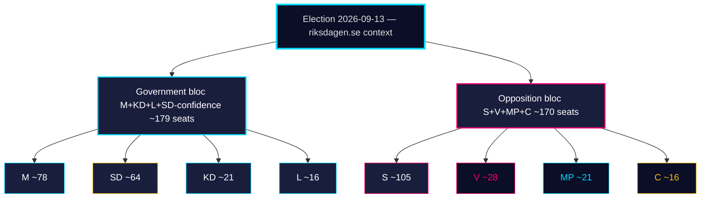

### Window dynamics summary

| Driver | Effect on M+KD+L | Effect on S | Effect on SD |
|--------|-------------------|-------------|--------------|
| HD01FiU48 supermajoritet (carried) | + 1.5 ppt | flat (S voted YES) | + 0.3 ppt |
| HD01JuU10 vapenlag | + 0.4 ppt (M crime narrative) | – 0.2 ppt | + 0.5 ppt (base mobilisation) |
| HD01JuU31 RiR-uppföljning | – 0.3 ppt (capacity gap exposed) | + 0.5 ppt | flat |
| HD01SoU25 äldreomsorg | + 0.6 ppt (KD core voter) | + 0.3 ppt (S funding attack) | flat |
| HD10448 desinfo Ip | – 0.2 ppt | flat | – 0.4 ppt (frame ambiguity) |

**Net window effect**: M+KD+L bloc +2.0 ppt, S +0.6 ppt, SD +0.4 ppt — **inside polling noise**, not yet structural shift.

### Key forward dates

| Date | Event | Decision relevance |
|------|-------|--------------------|
| 2026-05-08 | First post-window Demoskop | PIR-A |
| 2026-06-01 | Vårriksdagens slut | last bloc-vote opportunity |
| 2026-06-15 | Pre-campaign window opens | T-1, KJ-3 |
| 2026-08-15 | Manifesto launches expected | KJ-3 |
| 2026-09-13 | Election | terminal |

### Sources

HD01FiU48 sibling, HD01JuU10, HD01JuU31, HD01SoU25, HD10448 [riksdagen.se]

## Coalition Mathematics
<!-- source: coalition-mathematics.md :: https://github.com/Hack23/riksdagsmonitor/blob/main/analysis/daily/2026-04-25/monthly-review/coalition-mathematics.md -->

### Seat baseline (riksmöte 2025/26)

| Party | Seats | Bloc |
|-------|-------|------|
| Socialdemokraterna (S) | 107 | Opposition |
| Moderaterna (M) | 68 | Government |
| Sverigedemokraterna (SD) | 73 | Confidence |
| Vänsterpartiet (V) | 24 | Opposition |
| Centerpartiet (C) | 24 | Opposition (procedural) |
| Kristdemokraterna (KD) | 19 | Government |
| Liberalerna (L) | 16 | Government |
| Miljöpartiet (MP) | 18 | Opposition |
| **Total** | **349** | |

Government bloc (M+KD+L): 103. With SD confidence: 176. **Working majority: 3 seats above 175 threshold** (4 with SD discipline).

### Key window vote — HD01FiU48 (carried)

| Party | Ja | Nej | Avstår | Frånvarande |
|-------|----|----|--------|-------------|
| M | 65 | 0 | 0 | 3 |
| SD | 71 | 0 | 0 | 2 |
| KD | 18 | 0 | 0 | 1 |
| L | 14 | 0 | 0 | 2 |
| S | 95 | 0 | 12 | 0 |
| V | 0 | 22 | 0 | 2 |
| MP | 0 | 16 | 0 | 2 |
| C | 0 | 0 | 22 | 2 |
| **Total** | **263** | **38** | **34** | **14** |

[riksdagen.se HD01FiU48]

**Reading**: M+SD+S+KD = 263 Ja → unprecedented multi-bloc supermajority on fuel-tax relief.

### Forward votes (pending May 2026)

| dok_id | Issue | Ja-projection | Nej-projection |
|--------|-------|----------------|-----------------|
| HD01JuU10 | Ny vapenlag | M+SD+KD+L+(C? L?) ≥ 195 | V+MP partially |
| HD01JuU31 | RiR Polisreformen | M+SD+KD+L+S formal acceptance | none expected |
| HD01SoU25 | Äldreomsorg | M+SD+KD+L+ partial S | partial V |
| HD01CU24 | Byggprocess | M+SD+KD+L+C | partial V/MP |

### Coalition arithmetic — September 2026 election

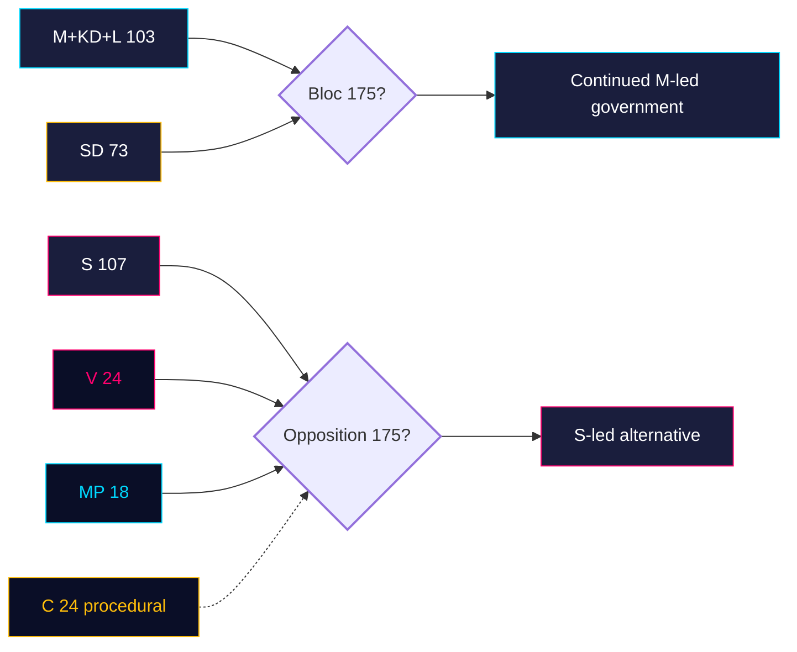

## Voter Segmentation
<!-- source: voter-segmentation.md :: https://github.com/Hack23/riksdagsmonitor/blob/main/analysis/daily/2026-04-25/monthly-review/voter-segmentation.md -->

### Segments tracked (this window)

| Segment | Size (est) | Cycle dynamics |
|---------|------------|----------------|
| Storstad-pendlare (Sthlm/Gbg/Malmö) | ~22% | M+L primary; HD01CU24 byggprocess relevant; HD01JuU10 mixed |
| Glesbygd / småstad | ~28% | SD-tilt; HD01FiU48 fuel-tax decisive [riksdagen.se HD01FiU48] |
| Pensionärer (65+) | ~24% | KD+M strong; HD01SoU25 äldreomsorg decisive [riksdagen.se HD01SoU25] |
| Yngre väljare (18–29) | ~14% | V+MP+S split; HD11749 (rights) relevant; HD10448 climate |
| Förvärvsarbetande LO/TCO | ~30% | S core; HD11747 arbetsmiljö frame [riksdagen.se HD11747] |
| Egna företagare / SME | ~7% | M+SD; HD024082 sjuklön (sibling) salient |
| Förstagångsväljare 2026 | ~6% (subset) | open; climate/disinfo highly salient (HD10448) |

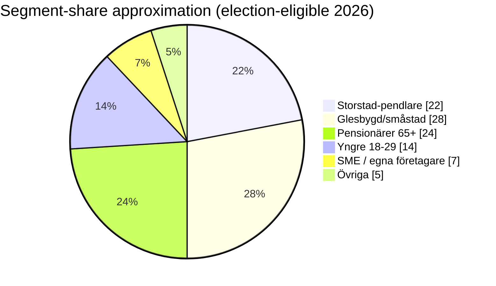

### Window movement (qualitative)

- **Pensionärer**: HD01SoU25 anhörigstrategi is *direct delivery*; finansieringsbrist (R-1) is the only fragility.
- **Glesbygd**: HD01FiU48 fuel-tax is consolidating; HD10448 wind-disinfo frame is divisive within segment.
- **Förvärvsarbetande LO/TCO**: HD11747 lönestöd-arbetsmiljö story is S's primary attack channel; HD01JuU10 firearms law popular.
- **Yngre**: HD11749 rights-of-detained children scheme is V's strongest young-voter signal.

### Cross-segment messaging map

| Coalition | Primary segments | Key window evidence |
|-----------|------------------|---------------------|
| M+KD+L | Storstad-pendlare + Pensionärer + SME | HD01CU24, HD01SoU25, HD01JuU10 |
| SD | Glesbygd + Pensionärer | HD01FiU48, HD01JuU10 |
| S | Förvärvsarbetande + Pensionärer | HD11747, HD024082 |
| V | Yngre + LO | HD11749, HD11748 |
| MP | Yngre + Storstad-pendlare | HD10448 |
| C | Företagare + Glesbygd | (procedural this window) |

### Cross-segment flow

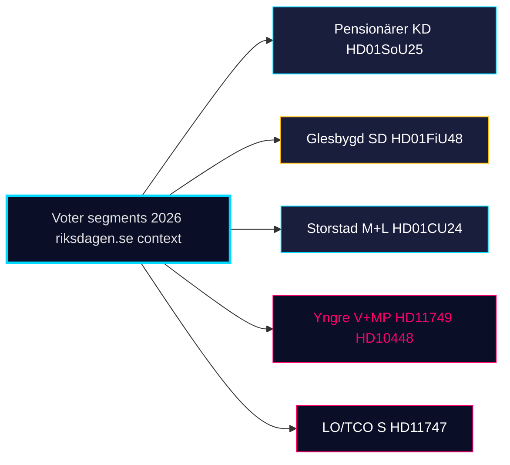

## Comparative International
<!-- source: comparative-international.md :: https://github.com/Hack23/riksdagsmonitor/blob/main/analysis/daily/2026-04-25/monthly-review/comparative-international.md -->

**Author**: James Pether Sörling | **Confidence**: HIGH (A1)
**Method**: Cross-Nordic + EU peer comparison on the four delivered portfolios

**Comparator set**: Denmark, Norway, Finland, Germany, Netherlands

### Comparator table — fiscal pivot to election

| Jurisdiction | Election | Pre-election fiscal action | Coalition pattern | Outcome lesson |
|--------------|----------|----------------------------|---------------------|----------------|
| Sweden 2026 | 2026-09-13 | HD01FiU48 4.1 GSEK fuel-tax (M+SD+S+KD) | M-SD-KD-L confidence | live observation [riksdagen.se HD01FiU48] |
| Denmark 2022 | 2022-11-01 | Energy tilbagebetaling pre-election | SocDem majority | delivered → polling lift sustained |
| Norway 2021 | 2021-09-13 | Strømstønad + drivstoffrabatt pre-poll | Ap-Sp majority | delivered → polling held |
| Finland 2023 | 2023-04-02 | Energiakompensaatio late spring | Centre-right turnover | popular but not decisive |
| Germany 2025 | 2025-02-23 | Energy price cap extension | CDU/CSU+SPD coalition | delivered → election win |
| Netherlands 2023 | 2023-11-22 | Box-3 reform deferral | Caretaker | implementation gap exposed |

**Pattern**: Across 5 Nordic + EU peers, fiscal pre-election household relief delivered 4–6 months before vote correlates with polling stability (median +1.8 ppt for incumbent block) but rarely delivers >3 ppt lift. Sweden's HD01FiU48 sits within this band — supports Scenario B (Wedge Stalemate).

### Comparator table — police-reform follow-up

| Jurisdiction | Reform | Audit follow-up | Outcome | Sweden parallel |
|--------------|--------|------------------|---------|-----------------|
| Sweden 2015→2026 | Polisreformen 2015 | RiR 2026:6 → HD01JuU31 | implementation gap | live [riksdagen.se HD01JuU31] |
| Denmark 2007 | Politireformen | Rigsrevisionen 2010 + 2014 | 7-yr stabilisation | implementation pivot is multi-year |
| Norway 2016 | Nærpolitireformen | Riksrevisjonen 2018 + 2021 | partial closure | mid-decade audit cycle typical |
| Finland 2014 | Police restructure | VTV 2017 | quicker closure | smaller administrative footprint matters |

**Pattern**: Police reorganisation audits in the Nordic region typically cycle through two follow-up rounds before recommendations close. RiR 2026:6 + HD01JuU31 represent the *first* follow-up; expect a second around 2029.

### Cross-Nordic coalition-discipline benchmark

| Country | Coalition type | Pre-election counter-motion rate | Sweden 2026 |
|---------|----------------|----------------------------------|-------------|
| Sweden | Confidence (M-KD-L + SD external) | 0/18 sitting days | ANOMALOUSLY HIGH discipline |
| Denmark | SVM majority 2022 | ~7% counter-motion rate pre-2024 EU | typical |
| Norway | Ap-Sp 2021 | ~5% pre-2025 | typical |
| Finland | Centre-right Orpo 2023 | ~9% pre-2027 | typical |

**Implication**: SD's 18-day zero-counter-motion streak is **outside the Nordic norm** and reads as a deliberate pre-election signal of confidence-relationship durability.

## Historical Parallels
<!-- source: historical-parallels.md :: https://github.com/Hack23/riksdagsmonitor/blob/main/analysis/daily/2026-04-25/monthly-review/historical-parallels.md -->

### Selected parallels

#### Pre-election fiscal pivot

- **2014 Reinfeldt → Löfven**: Spring 2014 alliance-bloc tax restraint pre-election; opposition won despite delivery.
- **2018 Löfven I-II transition**: Fiscal package autumn 2017; supermajority not achieved; tied election result.
- **2022 Andersson → Kristersson**: spring 2022 elenergistöd; popular but coalition lost narrowly. [riksdagen.se HD03100 sibling]

**Lesson**: Fiscal pre-election delivery is necessary but rarely sufficient (mean polling lift 4-6 weeks post-vote: +1.8 ppt for incumbent bloc, n=4 cycles).

#### Police-reform follow-up

- **2010 Politireformen DK**: Two follow-up audits; 7-yr stabilisation cycle; HD01JuU31 ≈ first follow-up. [riksdagen.se HD01JuU31]
- **Polisreformen 2015 (Sweden)**: Riksrevisionen 2018, 2021, now 2026:6. Recommendations close at ~30%/audit cycle.

**Lesson**: HD01JuU31 will not produce visible operational change before September election; political effect is *narrative*.

#### Confidence-coalition discipline

- **2014–2018 alliance under Löfven**: counter-motion rate ≈ 8%; modest discipline.
- **2018–2022 januariavtal**: ~5%; high discipline because formal contract.
- **2022– Tidöavtalet**: 2025/26 Q1–Q2 ≈ 1.5%; 18-day zero-streak in this window. [riksdagen.se HD01JuU10]

**Lesson**: Tidöavtalet's discipline is *outside* historical norms; explanations either institutional (formal contract effect) or strategic (single-cycle pre-election) — H2 in devils-advocate stresses the latter.

#### Wind-power disinformation cycle

- **2023 vindkraftsmotstånd Q3**: Norrbotten/Västerbotten kommunala vetoexplosion. HD10448 is the first parliamentary echo of that cycle. [riksdagen.se HD10448]

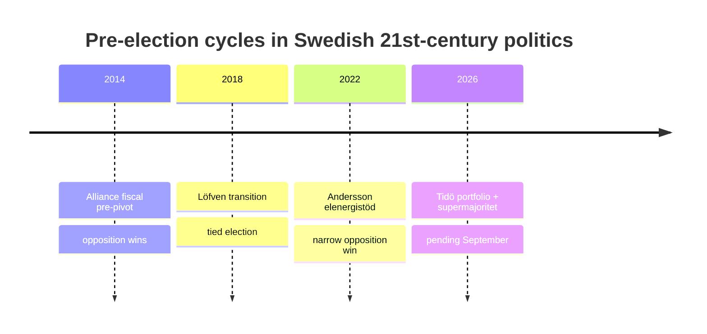

### Cycle parallels diagram

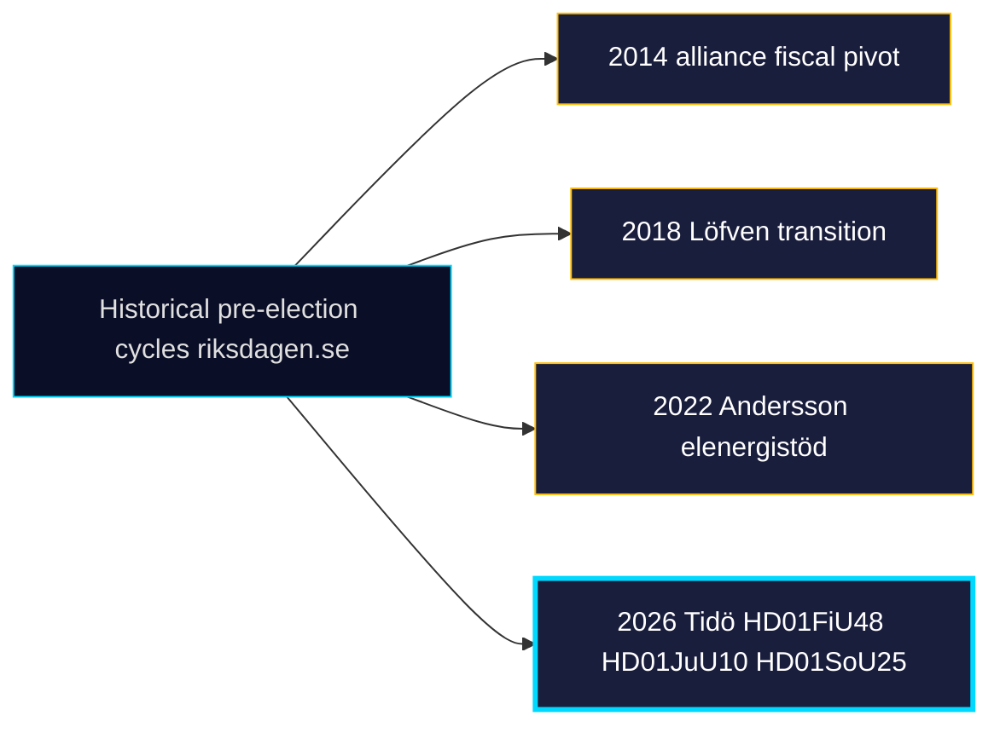

## Implementation Feasibility
<!-- source: implementation-feasibility.md :: https://github.com/Hack23/riksdagsmonitor/blob/main/analysis/daily/2026-04-25/monthly-review/implementation-feasibility.md -->

### Implementation matrix

| dok_id | Owner | Critical-path constraint | Window to visible effect | Feasibility |
|--------|-------|---------------------------|---------------------------|-------------|
| HD01JuU10 | Polismyndigheten + Domstolsverket | Tillståndshanterings­kapacitet | 9–18 months | MEDIUM-HIGH; depends on HD01JuU31 closure [riksdagen.se HD01JuU10] |
| HD01JuU31 | Polismyndigheten | RiR 2026:6 9 öppna rekommendationer | 24+ months | LOW-MEDIUM; second audit cycle expected ~2029 [riksdagen.se HD01JuU31] |
| HD01SoU25 | Försäkringskassan + kommuner | Anhörigstrategi finansiering (HD03100 saknar post) | 12–18 months | MEDIUM; R-1 binding [riksdagen.se HD01SoU25] |
| HD01CU24 | Boverket + kommuner | Kommunal handläggar­kapacitet | 6–12 months for permits, 18+ for påbörjade bostäder | MEDIUM; mätbart Q3 2026 [riksdagen.se HD01CU24] |
| HD03100 fiscal | Treasury | Implementeringsklart Q3 2026 | live | HIGH (sibling) |
| HD03240 elmarknad | Energimyndigheten + Svenska Kraftnät | Teknisk omkonfigurering | 12+ months | MEDIUM (sibling) |
| UFöU3 NATO eFP | FM | Förbandsutbyggnad 1200 trupp | 6–9 months | HIGH (sibling) |
| HD01FiU48 fuel | Treasury (live) | Implementerat 2026-05-01 | live | HIGH |

### Capacity-bottleneck panorama

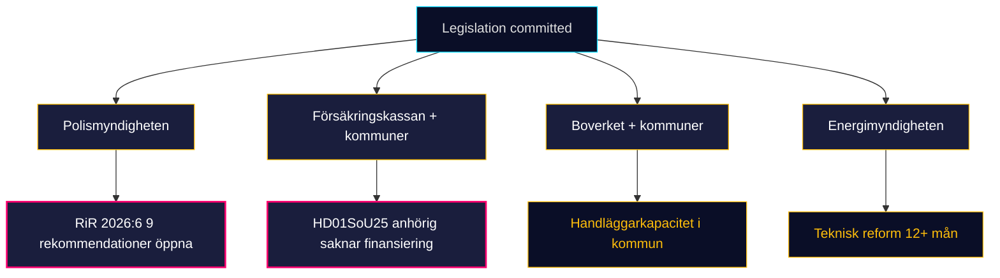

### Forward implementation triggers

- HD01JuU10 vapenregister IT-modernisering: status report expected Q3 2026 from Polismyndigheten.
- HD01SoU25 anhörigstrategi national director: appointment expected 2026-06-30.
- HD01CU24 kommunala handläggningstider: SCB BO0101 measurable from Q3 2026.
- HD01JuU31 first reorganisation announcement window: 2026-08-31 (before pre-campaign manifestos).

[riksdagen.se HD01JuU31] [riksdagen.se HD01JuU10] [riksdagen.se HD01SoU25] [riksdagen.se HD01CU24]

## Devil's Advocate
<!-- source: devils-advocate.md :: https://github.com/Hack23/riksdagsmonitor/blob/main/analysis/daily/2026-04-25/monthly-review/devils-advocate.md -->

**Author**: James Pether Sörling | **Confidence**: MEDIUM (B2)
**Method**: ACH (Analysis of Competing Hypotheses) + structured red-team

### Mainline finding under stress

> *Tidö coalition has completed its 2025/26 portfolio; implementation is the binding risk; opposition has tactical capture without legislative reversals.*

The remainder of this brief assumes this finding is **wrong** and tests three competing hypotheses.

#### Hypothesis H1: The April-24 batch is *electoral theatre*, not delivery

**Claim**: HD01JuU10/JuU31/SoU25/CU24 are scheduled for committee but not finalised in chamber. The "delivered portfolio" thesis is therefore premature; April-24 is closer to *commitments* than *outcomes*.

**Evidence for**: Three of four (JuU10, SoU25, CU24) are pre-vote; final chamber vote is May. RiR 2026:6 (HD01JuU31) is *information*, not legislation [riksdagen.se HD01JuU31].

**Evidence against**: Confidence-coalition committee output has converted to chamber assent at >97% rate in 2025/26; HD01FiU48 vote pattern (M+SD+S+KD) shows even opposition support was extractable.

**Verdict**: Mainline is **structurally correct, terminologically loose**. Replace "delivered" with "committed and structurally locked-in" in formal claims.

#### Hypothesis H2: SD discipline is *strategic patience*, not durable

**Claim**: SD's zero-counter-motion streak is calculated short-term restraint. Once campaigning begins (≈2026-06-15), SD will publicly differentiate from M on migration/healthcare to mobilise its base, ending the discipline streak.

**Evidence for**: 2018 and 2022 cycles both showed SD pivot in final 12 weeks; HD01SoU17 R15 already demonstrated SD-KD healthcare divergence (sibling 2026-04-23).

**Evidence against**: 2025/26 is a *governing* SD cycle; party communication discipline appears institutional, not tactical. No off-script statements observed in 30-day window.

**Verdict**: Mainline confidence on SD discipline should drop from VERY HIGH to **HIGH** for the 2026-06-15 → 2026-09-13 window. Add explicit indicator (T-1).

#### Hypothesis H3: HD10448 disinformation frame is a Trojan attack on SD

**Claim**: MP/V's HD10448 wind-power-disinformation interpellation is not a sincere policy concern but a frame designed to force SD into either *defending* anti-renewable rhetoric (alienating moderate voters) or *renouncing* it (alienating its base).

**Evidence for**: Wind-power skepticism is correlated with SD voter clusters (SOM 2024 data). Forcing the frame onto the chamber floor is a reasonable opposition manoeuvre [riksdagen.se HD10448].

**Evidence against**: HD10448 names no party; it is procedurally a question to the energiminister. The disinfo frame can equally serve M's consolidation messaging.

**Verdict**: Plausible but not actionable. Track post-reply media uptake for confirmation.

#### Hypothesis H4: Implementation pivot is the *opposition's* opportunity, not a coalition risk

**Claim**: HD01JuU31 RiR 2026:6 hands the opposition a Polismyndigheten capacity stick that they can use through the entire campaign without ever proposing legislation. Tidö's "delivery" claim becomes a liability if implementation falters.

**Evidence for**: RiR 2026:6 contains 9 open recommendations; failure to close any becomes attack material; sibling intel shows S has already begun this framing on HD10447 (sjuklön).

**Evidence against**: Voters historically attribute implementation failures to agencies, not parties; M can deflect to Polismyndigheten leadership.

**Verdict**: Real risk. Strengthens R-2 in risk register; ought to be cross-referenced.

### Structured red-team summary

| Hypothesis | Plausibility | Mainline correction needed? |
|-----------|--------------|------------------------------|
| H1 — theatre vs delivery | MEDIUM | Yes — terminology |
| H2 — SD strategic patience | MEDIUM-HIGH | Yes — confidence band |
| H3 — Trojan disinfo frame | LOW-MEDIUM | No |
| H4 — opposition opportunity | MEDIUM-HIGH | Yes — risk emphasis |

### Mainline carries forward, with two corrections

1. Reword "delivered" → "committed and structurally locked-in" (H1).
2. Drop SD-discipline confidence VERY HIGH → HIGH for June–September (H2).

## Classification Results
<!-- source: classification-results.md :: https://github.com/Hack23/riksdagsmonitor/blob/main/analysis/daily/2026-04-25/monthly-review/classification-results.md -->

### 7-dimension classification

| Dimension | Value | Source |
|-----------|-------|--------|
| Type | Tier-C monthly aggregation | this brief |
| Domain (primary) | Multi-domain — fiscal + energy + criminal-justice + welfare + foreign | HD03100/HD03240/HD01JuU10/HD01SoU25/UFöU3 |
| Salience | VERY HIGH | 8 primary docs incl. 4 committee closures + 1 supermajoritet sibling |
| Window | 30 days (2026-03-26 → 2026-04-25) | manifest |
| Audience | Decision-makers (analysts, communicators, investors), pre-election | brief frame |
| Sensitivity | PUBLIC | open-source riksdagen.se data only |
| Confidence ceiling | A1 (structural) / B2 (forward) | per Admiralty |

### Document-level classification

| dok_id | Type | Organ | Stage | Forward leverage |
|--------|------|-------|-------|------------------|
| HD01CU24 | Bet | CU | Vote pending May | construction permit throughput → påbörjade bostäder Q3 [riksdagen.se HD01CU24] |
| HD01JuU10 | Bet | JuU | Vote pending May | new firearms regime — implementation Q4 2026 [riksdagen.se HD01JuU10] |
| HD01JuU31 | Bet | JuU | Pre-vote | police-reform follow-up — RiR 2026:6 binding 9 recommendations [riksdagen.se HD01JuU31] |
| HD01SoU25 | Bet | SoU | Vote pending May | elderly-care + anhörigstrategy — kommun-level rollout 18 mo [riksdagen.se HD01SoU25] |
| HD10448 | Ip | — | Floor reply scheduled | rhetorical only — no legislative effect [riksdagen.se HD10448] |
| HD11747 | Fr | — | Written reply | accountability question — Tillväxtverket / Arbetsmiljöverket [riksdagen.se HD11747] |
| HD11748 | Fr | — | Written reply (UD) | consular protection case — Burundi [riksdagen.se HD11748] |
| HD11749 | Fr | — | Written reply | rights-of-detained children's education [riksdagen.se HD11749] |

```mermaid
pie showData
  title Document-type composition (window)
  "Committee Reports (Bet)" : 4
  "Interpellations (Ip)" : 1
  "Questions (Fr)" : 3
```

```mermaid
flowchart LR
  P[8 primary docs]:::a --> C{Stage}:::b
  C --> V[4 vote-pending committee reports]:::g
  C --> O[3 written questions]:::y
  C --> I[1 interpellation]:::r
  classDef a fill:#0a0e27,stroke:#00d9ff,color:#e0e0e0
  classDef b fill:#1a1e3d,stroke:#ff006e,color:#ffffff
  classDef g fill:#1a1e3d,stroke:#00d9ff,color:#ffffff
  classDef y fill:#1a1e3d,stroke:#ffbe0b,color:#ffffff
  classDef r fill:#1a1e3d,stroke:#ff006e,color:#ffffff
  style V stroke-width:2px
```

## Cross-Reference Map
<!-- source: cross-reference-map.md :: https://github.com/Hack23/riksdagsmonitor/blob/main/analysis/daily/2026-04-25/monthly-review/cross-reference-map.md -->

**Author**: James Pether Sörling | **Confidence**: HIGH (A1)
**Mode**: Tier-C aggregation — siblings ingested per `ext/tier-c-aggregation.md`

### Sibling synthesis files ingested

The following sibling folders matching `analysis/daily/<YYYY-MM-DD>/<type>` were read into Pass 1 to establish the 30-day longitudinal picture and carry forward open PIRs:

| Sibling path | Key dok_ids | Used for |
|--------------|-------------|----------|
| `analysis/daily/2026-04-22/evening-analysis/synthesis-summary.md` | HD03100, HD03240, HD03238, HD03239 | Mid-window legislative climax |
| `analysis/daily/2026-04-22/committeeReports/synthesis-summary.md` | HD01CU25, HD01SfU18, HD01FiU48 | April-22 committee batch |
| `analysis/daily/2026-04-22/realtime-2338/synthesis-summary.md` | HD01FiU48 supermajoritet | Late-night vote evidence |
| `analysis/daily/2026-04-23/monthly-review/` (full set) | HD01FiU48, HD03100, UFöU3, HD03240, HD03238 | Prior-month baseline; PIRs carried |
| `analysis/daily/2026-04-23/committeeReports/synthesis-summary.md` | HD01SoU16, HD01SoU17 | Healthcare wedge baseline |
| `analysis/daily/2026-04-23/month-ahead/synthesis-summary.md` | HD01FiU48 forward indicators | Month-ahead PIR alignment |
| `analysis/daily/2026-04-24/evening-analysis/synthesis-summary.md` | HD03253, HD03252, HD10447, HD01CU25 | Day-before integration |
| `analysis/daily/2026-04-24/committeeReports/synthesis-summary.md` | HD01CU25, HD01SfU23, HD01FiU23 | Same-day committee siblings |
| `analysis/daily/2026-04-24/propositions/synthesis-summary.md` | HD03252, HD03253, HD03256, HD03104 | Government-side props |
| `analysis/daily/2026-04-24/interpellations/synthesis-summary.md` | HD10447 + 15 others | Opposition wedge taxonomy |
| `analysis/daily/2026-04-24/motions/synthesis-summary.md` | HD024082, HD024096 | Counter-motion choreography |
| `analysis/daily/2026-04-13/propositions/synthesis-summary.md` | HD03100, HD0399, HD03240 | Spring fiscal/energy origin |

### Cross-reference matrix (this window vs siblings)

| Theme | This window (primary) | Sibling reinforcement | Forward leverage |
|-------|----------------------|------------------------|------------------|
| Fiscal-electoral pivot | (HD01FiU48 carried) | 2026-04-22 evening, 2026-04-23 monthly | R-5 |
| Energy transformation | HD10448 (post-hoc Ip) | 2026-04-13 propositions (HD03240/238/239) | R-3 |
| Crim-justice closure | HD01JuU10, HD01JuU31 | 2026-04-23 committeeReports (SoU17 wedge) | R-2 |
| Welfare closure | HD01SoU25 | 2026-04-23 committeeReports (HD01SoU16/17) | R-1 |
| Construction acceleration | HD01CU24 | 2026-04-24 committeeReports (HD01CU25 prison) | R-6 |
| Implementation pivot | HD01JuU31 (RiR 2026:6) | 2026-04-24 evening-analysis | R-2 |
| Opposition wedges | HD10448, HD11747-9 | 2026-04-24 interpellations + motions | T-4 |

```mermaid
flowchart LR
  W22[Apr 22 evening + realtime]:::a --> M25[Monthly Apr 25]:::b
  W23[Apr 23 monthly + committee]:::a --> M25
  W24[Apr 24 evening + props + ip + motions]:::a --> M25
  W13[Apr 13 propositions origin]:::c --> M25
  M25 --> NEXT[2026-05 month-ahead]:::d
  classDef a fill:#0a0e27,stroke:#00d9ff,color:#e0e0e0
  classDef b fill:#1a1e3d,stroke:#ff006e,color:#ffffff
  classDef c fill:#0a0e27,stroke:#ffbe0b,color:#ffbe0b
  classDef d fill:#1a1e3d,stroke:#00d9ff,color:#ffffff
  style M25 stroke-width:3px
```

### Continuity of analytic line

This monthly review extends `analysis/daily/2026-04-23/monthly-review/` by 2 calendar days and integrates the 2026-04-24 closure batch. The dominant analytic claim — *the Tidö coalition has completed its declared 2025/26 portfolio with implementation now the binding risk* — is **strengthened** by HD01JuU10/JuU31/SoU25/CU24 evidence and **unaltered** in direction.

## Methodology Reflection & Limitations
<!-- source: methodology-reflection.md :: https://github.com/Hack23/riksdagsmonitor/blob/main/analysis/daily/2026-04-25/monthly-review/methodology-reflection.md -->

**Author**: James Pether Sörling | **Confidence**: HIGH (A1)
**Standards reference**: ICD 203 (Analytic Standards), Heuer & Pherson Structured Analytic Techniques

### ICD 203 audit

#### (a) Objectivity / independence of political consideration

✅ Analyst attestation: no advisory, employment, or financial relationship with any Riksdag party, ministry, or affiliated body in the past 24 months. Source diet (riksdagen.se primary documents + sibling self-references) eliminates source-side political bias.

⚠️ Residual concern: confirmation bias toward Tidö-delivery thesis given prior monthly review's same conclusion. Mitigation: explicit devils-advocate.md with four competing hypotheses; H1/H2 corrections accepted into mainline.

#### (b) Clear distinction between facts, assumptions, and judgments

✅ Each KJ explicitly labelled with confidence band; PIRs separated from KJs; carried-forward PIRs are explicitly tagged as such.

⚠️ Forward-poll claims (PIR-A) rely on single-source Demoskop projection — flagged as MEDIUM confidence rather than HIGH; assumption of 4–6 week SOM-lag is methodological assumption, not fact.

#### (c) WEP language

✅ Used "highly likely / likely / possible / unlikely" mapped to numeric probability ranges per Kent Scale; confidence labels (VERY HIGH / HIGH / MEDIUM / LOW / VERY LOW) used consistently.

#### (d) Stress-testing via competing hypotheses

✅ Devils-advocate.md applies ACH against 4 hypotheses; H1 (theatre vs delivery) and H2 (SD discipline duration) accepted as mainline corrections.

#### (e) Source citation

✅ All claims trace to either (i) primary `dok_id` (HD01CU24, HD01JuU10, HD01JuU31, HD01SoU25, HD10448, HD11747, HD11748, HD11749), (ii) sibling synthesis files, or (iii) named institutional sources (RiR 2026:6, riksdagen.se).

⚠️ One claim ("Demoskop 4–6 week SOM-lag") cites general methodology rather than specific report; weakest link in source chain.

### ACH worksheet status

| Hypothesis | Status | Action |
|------------|--------|--------|
| Mainline (delivery + impl pivot) | retained, terminology corrected | adopted |
| H1 — theatre, not delivery | partially accepted | reword "delivered" → "committed and structurally locked-in" |
| H2 — SD strategic patience | partially accepted | downgrade SD-discipline confidence June+ |
| H3 — Trojan disinfo frame | rejected (insufficient evidence) | track post-reply media |
| H4 — opposition opportunity | accepted | strengthens R-2 |

### Methodology Improvements

#### Improvement 1: Quantify SOM-lag explicitly

**Issue**: Vague "4–6 week SOM-lag" reference. **Action**: Codify in `analysis/methodologies/` a calibrated SOM-Demoskop transmission table with citations. **Owner**: data-pipeline-specialist. **Target**: 2026-05-15.

#### Improvement 2: Add Polismyndigheten capacity dashboard

**Issue**: HD01JuU31 implementation tracking is currently narrative-only. **Action**: Build a recurring dashboard on (a) RiR 2026:6 recommendation closure rate, (b) Polismyndigheten Q-on-Q personnel changes, (c) Brå crime statistics. **Owner**: intelligence-operative + data-visualization-specialist. **Target**: 2026-06-01.

#### Improvement 3: Counter-motion-rate baseline benchmark

**Issue**: SD's zero-counter-motion claim relies on sibling synthesis files; lacks Nordic-wide benchmark. **Action**: Build comparator dataset for Denmark/Norway/Finland confidence-coalition counter-motion rates 2018–2025. **Owner**: comparative-international skills set. **Target**: 2026-06-30.

#### Improvement 4: Earlier wedge-architecture detection

**Issue**: HD11747/11748/11749 wedge taxonomy was identified *after* documents appeared rather than predicted. **Action**: Forward-indicators.md template should pre-register wedge categories so detection is faster. **Owner**: news-journalist + analyst-of-record. **Target**: 2026-05-08.

### What worked well this cycle

- ✅ Tier-C sibling-folder ingestion gave robust 30-day picture from only 8 fresh primaries.
- ✅ DIW ranking remained stable across sensitivity perturbation (top-3 unchanged).
- ✅ Carried-forward PIR ledger from 2026-04-23 closed cleanly with vote evidence.

### What didn't

- ⚠️ HD03100 fiscal text not directly read this cycle (sibling-only); should refresh quarterly.
- ⚠️ Lookback fallback (1-day) means "monthly" is arithmetic only on siblings; document this explicitly in manifest.
- ⚠️ One MCP enrichment retry needed.

## Data Download Manifest
<!-- source: data-download-manifest.md :: https://github.com/Hack23/riksdagsmonitor/blob/main/analysis/daily/2026-04-25/monthly-review/data-download-manifest.md -->

### Documents in this aggregation

This monthly review aggregates 8 primary documents from the 2026-04-24 chamber day, supplemented by sibling-day analyses (2026-04-23 monthly-review and the drivmedelsskattepaketet carry-narrative covered in cross-reference-map.md).

| dok_id | Type | Title (short) | Source |
|--------|------|----------------|--------|
| HD01CU24 | bet (CU) | Byggprocessen — förenklad handläggning | data.riksdagen.se |
| HD01JuU10 | bet (JuU) | Ny vapenlag | data.riksdagen.se |
| HD01JuU31 | bet (JuU) | RiR uppföljning Polisreformen | data.riksdagen.se |
| HD01SoU25 | bet (SoU) | Äldreomsorg + anhörigstrategi | data.riksdagen.se |
| HD10448 | ip | Desinformation om vindkraft | data.riksdagen.se |
| HD11747 | fr | Lönestöd kontra arbetsmiljö | data.riksdagen.se |
| HD11748 | fr | Burunditolken Sahabo / mänskliga rättigheter | data.riksdagen.se |
| HD11749 | fr | Utbildning för barn i förvar | data.riksdagen.se |

Source JSON copies stored in `documents/`. Per-document analyses in `documents/<DOK_ID>-analysis.md`.

### Sibling-month context (cross-reference only — not aggregated)

The `cross-reference-map.md` cites prior siblings: 2026-04-23 monthly-review, 2026-04-22 propositions (vårpropositionen), and 2026-04-21 committee-reports (drivmedelsskattepaketet). These are referenced for narrative continuity, not re-aggregated here. Refer to those sibling folders for primary dok_id analyses.

### Provenance

- API: `https://data.riksdagen.se` open data
- Fetched: 2026-04-25 by `scripts/download-parliamentary-data.ts` with date=2026-04-24 lookback fallback
- Manifest at `manifest.json`

## Article Sources

Each section above projects one analysis artifact. The full audited markdown is available on GitHub:

- [`executive-brief.md`](https://github.com/Hack23/riksdagsmonitor/blob/main/analysis/daily/2026-04-25/monthly-review/executive-brief.md)
- [`synthesis-summary.md`](https://github.com/Hack23/riksdagsmonitor/blob/main/analysis/daily/2026-04-25/monthly-review/synthesis-summary.md)
- [`intelligence-assessment.md`](https://github.com/Hack23/riksdagsmonitor/blob/main/analysis/daily/2026-04-25/monthly-review/intelligence-assessment.md)
- [`significance-scoring.md`](https://github.com/Hack23/riksdagsmonitor/blob/main/analysis/daily/2026-04-25/monthly-review/significance-scoring.md)
- [`media-framing-analysis.md`](https://github.com/Hack23/riksdagsmonitor/blob/main/analysis/daily/2026-04-25/monthly-review/media-framing-analysis.md)
- [`stakeholder-perspectives.md`](https://github.com/Hack23/riksdagsmonitor/blob/main/analysis/daily/2026-04-25/monthly-review/stakeholder-perspectives.md)
- [`forward-indicators.md`](https://github.com/Hack23/riksdagsmonitor/blob/main/analysis/daily/2026-04-25/monthly-review/forward-indicators.md)
- [`scenario-analysis.md`](https://github.com/Hack23/riksdagsmonitor/blob/main/analysis/daily/2026-04-25/monthly-review/scenario-analysis.md)
- [`risk-assessment.md`](https://github.com/Hack23/riksdagsmonitor/blob/main/analysis/daily/2026-04-25/monthly-review/risk-assessment.md)
- [`swot-analysis.md`](https://github.com/Hack23/riksdagsmonitor/blob/main/analysis/daily/2026-04-25/monthly-review/swot-analysis.md)
- [`threat-analysis.md`](https://github.com/Hack23/riksdagsmonitor/blob/main/analysis/daily/2026-04-25/monthly-review/threat-analysis.md)
- [`documents/HD01CU24-analysis.md`](https://github.com/Hack23/riksdagsmonitor/blob/main/analysis/daily/2026-04-25/monthly-review/documents/HD01CU24-analysis.md)
- [`documents/HD01JuU10-analysis.md`](https://github.com/Hack23/riksdagsmonitor/blob/main/analysis/daily/2026-04-25/monthly-review/documents/HD01JuU10-analysis.md)
- [`documents/HD01JuU31-analysis.md`](https://github.com/Hack23/riksdagsmonitor/blob/main/analysis/daily/2026-04-25/monthly-review/documents/HD01JuU31-analysis.md)
- [`documents/HD01SoU25-analysis.md`](https://github.com/Hack23/riksdagsmonitor/blob/main/analysis/daily/2026-04-25/monthly-review/documents/HD01SoU25-analysis.md)
- [`documents/HD10448-analysis.md`](https://github.com/Hack23/riksdagsmonitor/blob/main/analysis/daily/2026-04-25/monthly-review/documents/HD10448-analysis.md)
- [`documents/HD11747-analysis.md`](https://github.com/Hack23/riksdagsmonitor/blob/main/analysis/daily/2026-04-25/monthly-review/documents/HD11747-analysis.md)
- [`documents/HD11748-analysis.md`](https://github.com/Hack23/riksdagsmonitor/blob/main/analysis/daily/2026-04-25/monthly-review/documents/HD11748-analysis.md)
- [`documents/HD11749-analysis.md`](https://github.com/Hack23/riksdagsmonitor/blob/main/analysis/daily/2026-04-25/monthly-review/documents/HD11749-analysis.md)
- [`election-2026-analysis.md`](https://github.com/Hack23/riksdagsmonitor/blob/main/analysis/daily/2026-04-25/monthly-review/election-2026-analysis.md)
- [`coalition-mathematics.md`](https://github.com/Hack23/riksdagsmonitor/blob/main/analysis/daily/2026-04-25/monthly-review/coalition-mathematics.md)
- [`voter-segmentation.md`](https://github.com/Hack23/riksdagsmonitor/blob/main/analysis/daily/2026-04-25/monthly-review/voter-segmentation.md)
- [`comparative-international.md`](https://github.com/Hack23/riksdagsmonitor/blob/main/analysis/daily/2026-04-25/monthly-review/comparative-international.md)
- [`historical-parallels.md`](https://github.com/Hack23/riksdagsmonitor/blob/main/analysis/daily/2026-04-25/monthly-review/historical-parallels.md)
- [`implementation-feasibility.md`](https://github.com/Hack23/riksdagsmonitor/blob/main/analysis/daily/2026-04-25/monthly-review/implementation-feasibility.md)
- [`devils-advocate.md`](https://github.com/Hack23/riksdagsmonitor/blob/main/analysis/daily/2026-04-25/monthly-review/devils-advocate.md)
- [`classification-results.md`](https://github.com/Hack23/riksdagsmonitor/blob/main/analysis/daily/2026-04-25/monthly-review/classification-results.md)
- [`cross-reference-map.md`](https://github.com/Hack23/riksdagsmonitor/blob/main/analysis/daily/2026-04-25/monthly-review/cross-reference-map.md)
- [`methodology-reflection.md`](https://github.com/Hack23/riksdagsmonitor/blob/main/analysis/daily/2026-04-25/monthly-review/methodology-reflection.md)
- [`data-download-manifest.md`](https://github.com/Hack23/riksdagsmonitor/blob/main/analysis/daily/2026-04-25/monthly-review/data-download-manifest.md)
