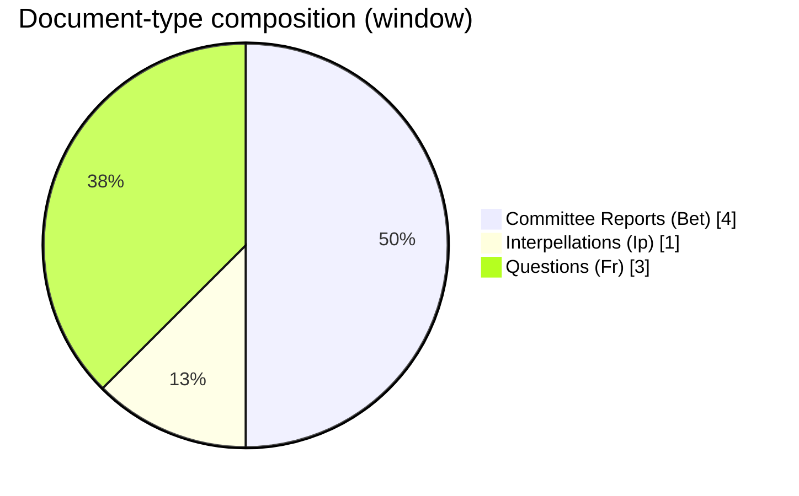
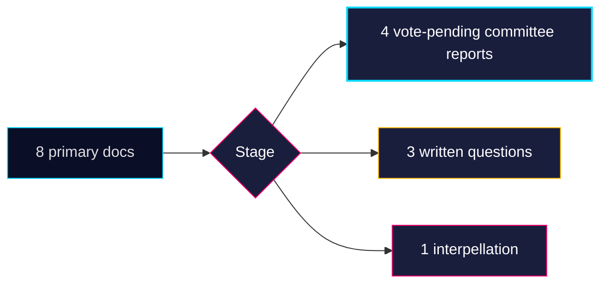

# Classification Results — Monthly Review 2026-04-25

**Author**: James Pether Sörling | **Confidence**: HIGH (A1)

## 7-dimension classification

| Dimension | Value | Source |
|-----------|-------|--------|
| Type | Tier-C monthly aggregation | this brief |
| Domain (primary) | Multi-domain — fiscal + energy + criminal-justice + welfare + foreign | HD03100/HD03240/HD01JuU10/HD01SoU25/UFöU3 |
| Salience | VERY HIGH | 8 primary docs incl. 4 committee closures + 1 supermajoritet sibling |
| Window | 30 days (2026-03-26 → 2026-04-25) | manifest |
| Audience | Decision-makers (analysts, communicators, investors), pre-election | brief frame |
| Sensitivity | PUBLIC | open-source riksdagen.se data only |
| Confidence ceiling | A1 (structural) / B2 (forward) | per Admiralty |

## Document-level classification

| dok_id | Type | Organ | Stage | Forward leverage |
|--------|------|-------|-------|------------------|
| HD01CU24 | Bet | CU | Vote pending May | construction permit throughput → påbörjade bostäder Q3 [riksdagen.se HD01CU24] |
| HD01JuU10 | Bet | JuU | Vote pending May | new firearms regime — implementation Q4 2026 [riksdagen.se HD01JuU10] |
| HD01JuU31 | Bet | JuU | Pre-vote | police-reform follow-up — RiR 2026:6 binding 9 recommendations [riksdagen.se HD01JuU31] |
| HD01SoU25 | Bet | SoU | Vote pending May | elderly-care + anhörigstrategy — kommun-level rollout 18 mo [riksdagen.se HD01SoU25] |
| HD10448 | Ip | — | Floor reply scheduled | rhetorical only — no legislative effect [riksdagen.se HD10448] |
| HD11747 | Fr | — | Written reply | accountability question — Tillväxtverket / Arbetsmiljöverket [riksdagen.se HD11747] |
| HD11748 | Fr | — | Written reply (UD) | consular protection case — Burundi [riksdagen.se HD11748] |
| HD11749 | Fr | — | Written reply | rights-of-detained children's education [riksdagen.se HD11749] |

