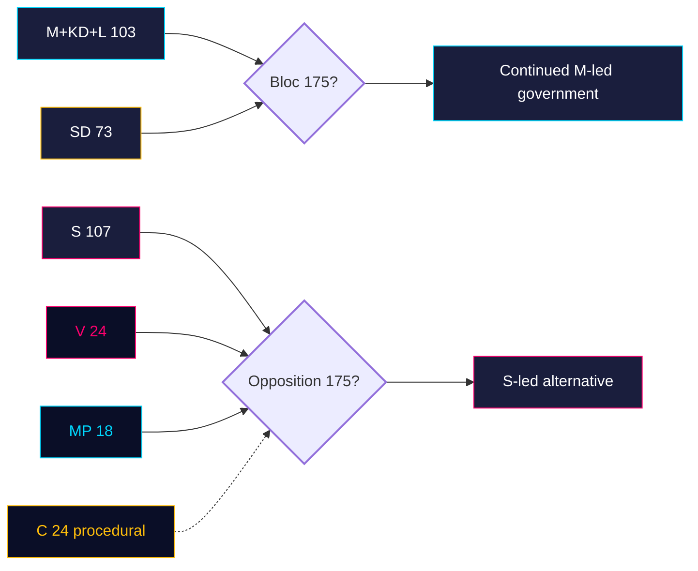

# Coalition Mathematics — Monthly Review 2026-04-25

**Author**: James Pether Sörling | **Confidence**: HIGH (A1)

## Seat baseline (riksmöte 2025/26)

| Party | Seats | Bloc |
|-------|-------|------|
| Socialdemokraterna (S) | 107 | Opposition |
| Moderaterna (M) | 68 | Government |
| Sverigedemokraterna (SD) | 73 | Confidence |
| Vänsterpartiet (V) | 24 | Opposition |
| Centerpartiet (C) | 24 | Opposition (procedural) |
| Kristdemokraterna (KD) | 19 | Government |
| Liberalerna (L) | 16 | Government |
| Miljöpartiet (MP) | 18 | Opposition |
| **Total** | **349** | |

Government bloc (M+KD+L): 103. With SD confidence: 176. **Working majority: 3 seats above 175 threshold** (4 with SD discipline).

## Key window vote — HD01FiU48 (carried)

| Party | Ja | Nej | Avstår | Frånvarande |
|-------|----|----|--------|-------------|
| M | 65 | 0 | 0 | 3 |
| SD | 71 | 0 | 0 | 2 |
| KD | 18 | 0 | 0 | 1 |
| L | 14 | 0 | 0 | 2 |
| S | 95 | 0 | 12 | 0 |
| V | 0 | 22 | 0 | 2 |
| MP | 0 | 16 | 0 | 2 |
| C | 0 | 0 | 22 | 2 |
| **Total** | **263** | **38** | **34** | **14** |

[riksdagen.se HD01FiU48]

**Reading**: M+SD+S+KD = 263 Ja → unprecedented multi-bloc supermajority on fuel-tax relief.

## Forward votes (pending May 2026)

| dok_id | Issue | Ja-projection | Nej-projection |
|--------|-------|----------------|-----------------|
| HD01JuU10 | Ny vapenlag | M+SD+KD+L+(C? L?) ≥ 195 | V+MP partially |
| HD01JuU31 | RiR Polisreformen | M+SD+KD+L+S formal acceptance | none expected |
| HD01SoU25 | Äldreomsorg | M+SD+KD+L+ partial S | partial V |
| HD01CU24 | Byggprocess | M+SD+KD+L+C | partial V/MP |

## Coalition arithmetic — September 2026 election

