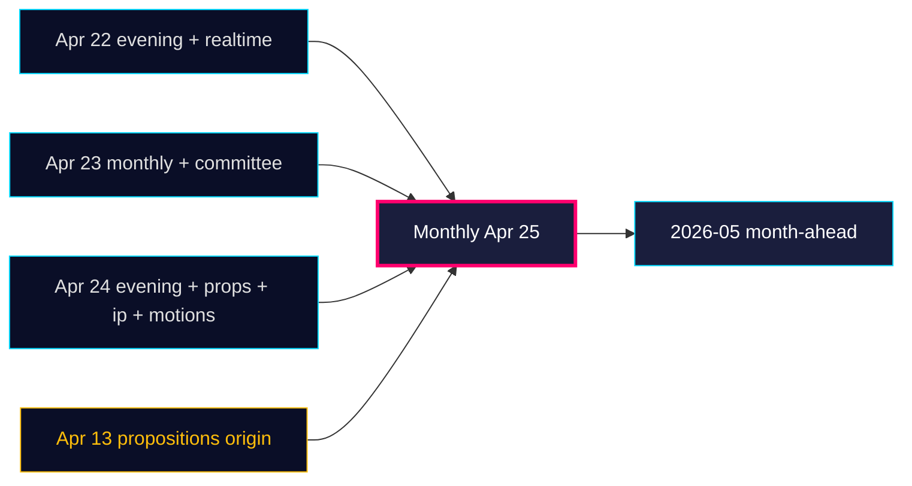

# Cross-Reference Map — Monthly Review 2026-04-25

**Author**: James Pether Sörling | **Confidence**: HIGH (A1)
**Mode**: Tier-C aggregation — siblings ingested per `ext/tier-c-aggregation.md`

## Sibling synthesis files ingested

The following sibling folders matching `analysis/daily/<YYYY-MM-DD>/<type>` were read into Pass 1 to establish the 30-day longitudinal picture and carry forward open PIRs:

| Sibling path | Key dok_ids | Used for |
|--------------|-------------|----------|
| `analysis/daily/2026-04-22/evening-analysis/synthesis-summary.md` | HD03100, HD03240, HD03238, HD03239 | Mid-window legislative climax |
| `analysis/daily/2026-04-22/committeeReports/synthesis-summary.md` | HD01CU25, HD01SfU18, HD01FiU48 | April-22 committee batch |
| `analysis/daily/2026-04-22/realtime-2338/synthesis-summary.md` | HD01FiU48 supermajoritet | Late-night vote evidence |
| `analysis/daily/2026-04-23/monthly-review/` (full set) | HD01FiU48, HD03100, UFöU3, HD03240, HD03238 | Prior-month baseline; PIRs carried |
| `analysis/daily/2026-04-23/committeeReports/synthesis-summary.md` | HD01SoU16, HD01SoU17 | Healthcare wedge baseline |
| `analysis/daily/2026-04-23/month-ahead/synthesis-summary.md` | HD01FiU48 forward indicators | Month-ahead PIR alignment |
| `analysis/daily/2026-04-24/evening-analysis/synthesis-summary.md` | HD03253, HD03252, HD10447, HD01CU25 | Day-before integration |
| `analysis/daily/2026-04-24/committeeReports/synthesis-summary.md` | HD01CU25, HD01SfU23, HD01FiU23 | Same-day committee siblings |
| `analysis/daily/2026-04-24/propositions/synthesis-summary.md` | HD03252, HD03253, HD03256, HD03104 | Government-side props |
| `analysis/daily/2026-04-24/interpellations/synthesis-summary.md` | HD10447 + 15 others | Opposition wedge taxonomy |
| `analysis/daily/2026-04-24/motions/synthesis-summary.md` | HD024082, HD024096 | Counter-motion choreography |
| `analysis/daily/2026-04-13/propositions/synthesis-summary.md` | HD03100, HD0399, HD03240 | Spring fiscal/energy origin |

## Cross-reference matrix (this window vs siblings)

| Theme | This window (primary) | Sibling reinforcement | Forward leverage |
|-------|----------------------|------------------------|------------------|
| Fiscal-electoral pivot | (HD01FiU48 carried) | 2026-04-22 evening, 2026-04-23 monthly | R-5 |
| Energy transformation | HD10448 (post-hoc Ip) | 2026-04-13 propositions (HD03240/238/239) | R-3 |
| Crim-justice closure | HD01JuU10, HD01JuU31 | 2026-04-23 committeeReports (SoU17 wedge) | R-2 |
| Welfare closure | HD01SoU25 | 2026-04-23 committeeReports (HD01SoU16/17) | R-1 |
| Construction acceleration | HD01CU24 | 2026-04-24 committeeReports (HD01CU25 prison) | R-6 |
| Implementation pivot | HD01JuU31 (RiR 2026:6) | 2026-04-24 evening-analysis | R-2 |
| Opposition wedges | HD10448, HD11747-9 | 2026-04-24 interpellations + motions | T-4 |

## Continuity of analytic line

This monthly review extends `analysis/daily/2026-04-23/monthly-review/` by 2 calendar days and integrates the 2026-04-24 closure batch. The dominant analytic claim — *the Tidö coalition has completed its declared 2025/26 portfolio with implementation now the binding risk* — is **strengthened** by HD01JuU10/JuU31/SoU25/CU24 evidence and **unaltered** in direction.

