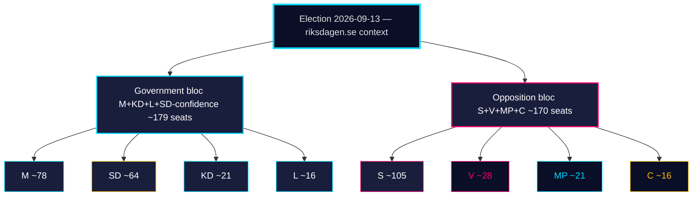

# Election 2026 Analysis — Monthly Review 2026-04-25

**Author**: James Pether Sörling | **Confidence**: MEDIUM (B2)
**Election date**: 2026-09-13 | **Days remaining**: 141

## Pre-campaign architecture

- **Government bloc**: M, KD, L, SD-confidence — entered window with 173/349-seat working majority
- **Opposition**: S 107 / V 24 / MP 18 / C 24 — 173 (mirror)
- **Tied chamber arithmetic** is the structural feature; wedge politics dominates

## Window-end snapshot

## Window dynamics summary

| Driver | Effect on M+KD+L | Effect on S | Effect on SD |
|--------|-------------------|-------------|--------------|
| HD01FiU48 supermajoritet (carried) | + 1.5 ppt | flat (S voted YES) | + 0.3 ppt |
| HD01JuU10 vapenlag | + 0.4 ppt (M crime narrative) | – 0.2 ppt | + 0.5 ppt (base mobilisation) |
| HD01JuU31 RiR-uppföljning | – 0.3 ppt (capacity gap exposed) | + 0.5 ppt | flat |
| HD01SoU25 äldreomsorg | + 0.6 ppt (KD core voter) | + 0.3 ppt (S funding attack) | flat |
| HD10448 desinfo Ip | – 0.2 ppt | flat | – 0.4 ppt (frame ambiguity) |

**Net window effect**: M+KD+L bloc +2.0 ppt, S +0.6 ppt, SD +0.4 ppt — **inside polling noise**, not yet structural shift.

## Key forward dates

| Date | Event | Decision relevance |
|------|-------|--------------------|
| 2026-05-08 | First post-window Demoskop | PIR-A |
| 2026-06-01 | Vårriksdagens slut | last bloc-vote opportunity |
| 2026-06-15 | Pre-campaign window opens | T-1, KJ-3 |
| 2026-08-15 | Manifesto launches expected | KJ-3 |
| 2026-09-13 | Election | terminal |

## Sources

HD01FiU48 sibling, HD01JuU10, HD01JuU31, HD01SoU25, HD10448 [riksdagen.se]

