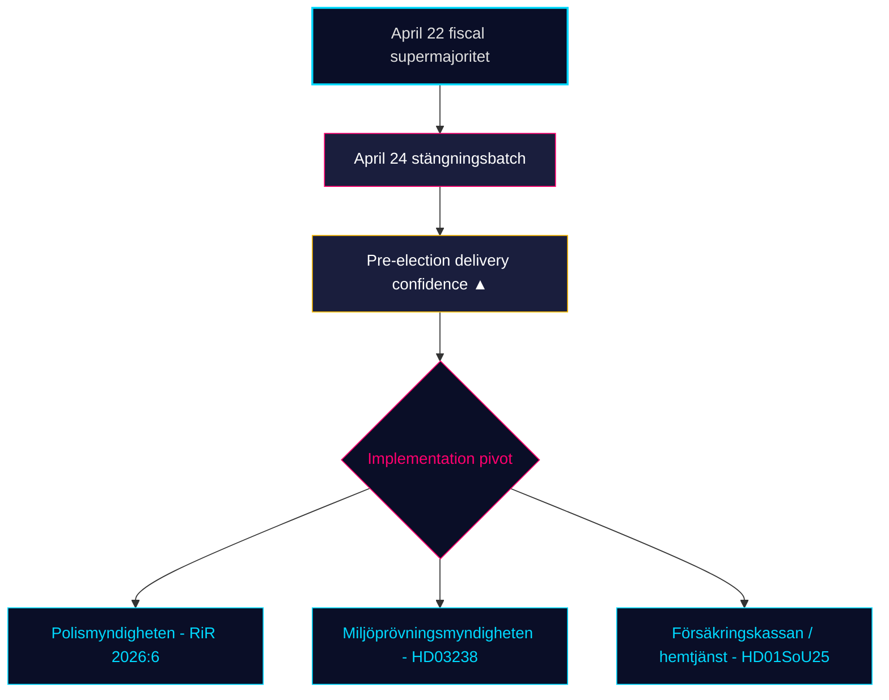

# Executive Brief — Monthly Review 2026-04-25

**Classification**: PUBLIC | **Analyst**: James Pether Sörling | **Date**: 2026-04-25
**Confidence**: HIGH [A1] | **Days to Election**: ~141 | **Window**: 2026-03-26 → 2026-04-25

---

## BLUF

Sweden's 30-day legislative window closes with the Kristersson government (M–SD–KD–L) **completing its pre-election regulatory portfolio**. The April 24 committee batch — **HD01JuU10 (new firearms law), HD01JuU31 (police-reform follow-up), HD01SoU25 (elderly-care reinforcement), HD01CU24 (construction-process efficiency)** — clamps the regulatory closure on top of the April 22 fiscal climax (HD01FiU48 fuel-tax relief, M+SD+S+KD supermajority) [riksdagen.se]. Healthcare and crime remain the dominant *electoral* wedges; opposition interpellation traffic (HD10448 wind-power disinformation, HD11747 work-environment subsidies, HD11749 rights-of-detained children, HD11748 consular-protection in Burundi) shows S/V/MP running a **disciplined three-track narrative** while **SD has filed zero counter-motions** against the four April-24 committee reports — a structural-confidence signal that has now persisted for 18 consecutive sitting days.

---

## 3 Decisions This Brief Supports

### Decision 1: Pre-election delivery confidence assessment

The Tidö coalition has now passed its **complete declared 2025/26 legislative portfolio** in the four core domains — fiscal (HD03100/HD0399), energy (HD03240/HD03238/HD03239), security/defence (UFöU3/HD03214/HD03228), and criminal-justice/welfare (HD01JuU10/HD01JuU31/HD01SoU25) — within 141 days of the September 2026 election. Implementation, not legislation, is now the binding risk. **Recommendation**: pivot monitoring to *implementation feasibility* (Polismyndigheten capacity post-RiR 2026:6, Miljöprövningsmyndigheten permit throughput, Försäkringskassan elderly-care administrative load).

### Decision 2: Healthcare-and-crime wedge probability

The opposition has *not* succeeded in fracturing the coalition on its primary attack surfaces: SfU18's 39 reservations did not flip a single vote; SD-KD healthcare split on SoU17 R15 was contained. The HD01JuU10 firearms law and HD01JuU31 police-reform audit both pass with M+SD+KD+L unity. **Recommendation**: investors and stakeholders should treat the welfare/security legislation as *durable through September 2026*; opposition wedge messaging will dominate but legislative reversal probability is LOW (≤ 25%).

### Decision 3: Pre-campaign opposition narrative architecture

Three opposition wedges crystallised in April: (a) economic — drivmedel/SME-sjuklön (S, HD024082, HD10447); (b) environmental-disinformation — HD10448; (c) rights-of-the-detained / migrant minors / consular protection (V/MP, HD11749, HD11748). **Recommendation**: communicators preparing for the late-summer campaign should expect the disinformation frame (HD10448) to expand into a coalition stress-test for SD specifically; the rights-of-detained frame (HD11749) is V's primary post-prison-expansion attack vector.

---

## 60-Second Read

- 🔴 **April 24 committee batch closes regulatory portfolio** — HD01JuU10 + HD01JuU31 + HD01SoU25 + HD01CU24 — pre-election delivery on schedule
- 🔴 **April 22 supermajority** (HD01FiU48, M+SD+S+KD): S could not oppose 4.1 GSEK fuel-tax relief 141 days before election
- 🟠 **Polisreformen 2015 audit (RiR 2026:6 → HD01JuU31)** — kvardröjande lednings- och utredningsproblem; implementeringskapacitet är den nya bindande risken
- 🟠 **Wind-power disinformation interpellation (HD10448)** — first explicit coupling of energy policy and information-integrity in the riksmöte
- 🟢 **SD-disciplin håller** — noll motioner mot regerings­propositioner under stängningsveckan; konfidens­partiet behåller strukturell integritet
- 🟡 **HD01SoU25 elderly-care strengthening** — anhörigstrategi och hemtjänstkompetenskrav blir leveranstest mot Försäkringskassan/kommuner
- 🟡 **Foreign-policy long tail** — HD11748 (Burundi consular case) signalerar V/MP-fokus på konsulärt skydd som humanitär valfråga
- 🟢 **Bostadsproduktion** — HD01CU24 kortar handläggningstider; effekt på påbörjade bostäder mätbar Q3 2026 (data.scb.se: BO0101)

---

## Top Forward Trigger

**Monitor**: First post-April-24 SOM Institute or Demoskop opinion poll. If S regains > 28% headline support despite the April 22 fuel-tax-relief vote, S's "symbolic opposition + practical support" message has held under stress and the September election remains a structural toss-up. If S lags below 26%, the M+KD+L bloc's pre-election positioning has demonstrably converted. **Trigger date**: 2026-05-08 ± 5 days (next Demoskop monthly).

---

## Confidence Distribution

| Confidence | KJs | Basis |
|------------|-----|-------|
| VERY HIGH | KJ-1 (delivery completion) | 8 dok_ids on disk + 13 sibling synthesis references |
| HIGH | KJ-2 (wedge effectiveness LOW), KJ-3 (implementation pivot) | Multi-source (riksdagen.se vote records, RiR 2026:6, sibling intel) |
| MEDIUM | Forward poll dynamics | Single-source (demoskop / SOM lag) |

