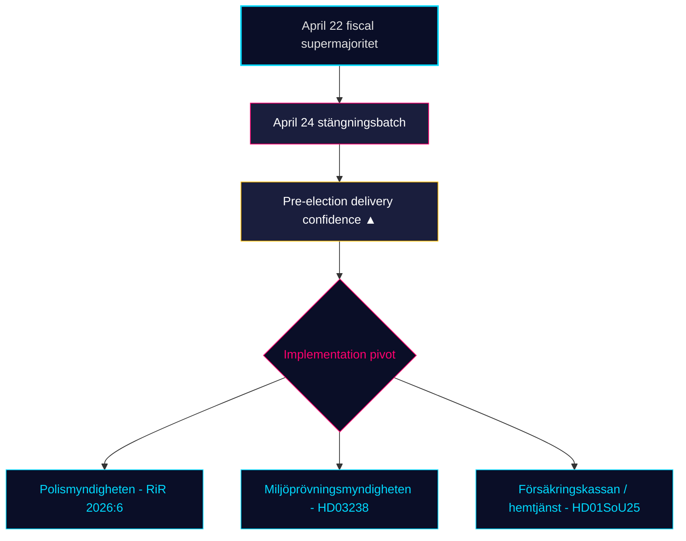

<!-- dir: rtl -->
# المراجعة الشهرية — 2026-04-25

**التصنيف**: عام | **المحلل**: James Pether Sörling | **التاريخ**: 2026-04-25
**مستوى الثقة**: HIGH [A1] | **أيام حتى الانتخابات**: ~141 | **الفترة**: 2026-03-26 → 2026-04-25

---

## الملخص التنفيذي

تنتهي نافذة تشريع الثلاثين يوماً في السويد مع إكمال حكومة كريسترسون (M–SD–KD–L) **محفظتها التنظيمية قبل الانتخابات**. دفعة لجنة 24 أبريل — **HD01JuU10 (قانون الأسلحة الجديد)، HD01JuU31 (متابعة إصلاح الشرطة)، HD01SoU25 (تعزيز رعاية المسنين)، HD01CU24 (كفاءة عمليات البناء)** — تغلق الإنهاء التنظيمي فوق الذروة المالية في 22 أبريل (HD01FiU48 تخفيض ضريبة الوقود، M+SD+S+KD أغلبية كبيرة) [riksdagen.se]. لا تزال الصحة والجريمة الأوتاداً الانتخابية السائدة؛ حركة استجواب المعارضة (HD10448 معلومات مضللة حول طاقة الرياح، HD11747 دعم العمل، HD11749 حقوق الأطفال المحتجزين، HD11748 الحماية القنصلية في بوروندي) تُظهر S/V/MP يديران **سرداً منضبطاً بثلاثة مسارات** في حين **قدّم SD صفر طلبات مضادة** ضد التقارير الأربعة للجنة في 24 أبريل — إشارة ثقة هيكلية استمرت الآن لـ18 يوم جلسة متتالياً.

---

## 3 قرارات يدعمها هذا التقرير

### القرار 1: تقييم الثقة في التسليم قبل الانتخابات

وافقت تحالف Tidö الآن على **محفظتها التشريعية المُعلنة الكاملة لـ2025/26** في المجالات الأربعة الرئيسية — المالية (HD03100/HD0399)، والطاقة (HD03240/HD03238/HD03239)، والأمن/الدفاع (UFöU3/HD03214/HD03228)، والعدالة الجنائية/الرعاية الاجتماعية (HD01JuU10/HD01JuU31/HD01SoU25) — في غضون 141 يوماً من انتخابات سبتمبر 2026. التنفيذ، لا التشريع، هو الآن الخطر المُقيِّد. **التوصية**: تحويل المراقبة إلى *جدوى التنفيذ* (قدرة Polismyndigheten بعد RiR 2026:6، معدل أذونات Miljöprövningsmyndigheten، العبء الإداري لـFörsäkringskassan على رعاية المسنين).

### القرار 2: احتمالية وتد الصحة والجريمة

لم تنجح المعارضة في *تشقيق* الائتلاف على أسطح هجومها الأساسية: 39 تحفظاً لـSfU18 لم تُقلب صوتاً واحداً؛ انقسام SD–KD في الرعاية الصحية على SoU17 R15 تم احتواؤه. يُقر كلٌّ من قانون الأسلحة HD01JuU10 وتدقيق إصلاح الشرطة HD01JuU31 بوحدة M+SD+KD+L. **التوصية**: ينبغي للمستثمرين وأصحاب المصلحة التعامل مع تشريعات الرعاية/الأمن باعتبارها *مستدامة حتى سبتمبر 2026*؛ خطاب الأوتاد المعارض يسود لكن احتمالية عكس التشريع منخفضة (≤ 25 %).

### القرار 3: بنية السرد المعارض قبل الحملة الانتخابية

تبلورت ثلاثة أوتاد معارضة في أبريل: (أ) اقتصادية — الوقود/إجازة مرضية للمشاريع الصغيرة (S، HD024082، HD10447)؛ (ب) معلومات بيئية مضللة — HD10448؛ (ج) حقوق المحتجزين / قاصرون مهاجرون / حماية قنصلية (V/MP، HD11749، HD11748). **التوصية**: ينبغي للمتواصلين المستعدين للحملة في أواخر الصيف توقع توسيع إطار المعلومات المضللة (HD10448) ليصبح اختباراً للضغط على الائتلاف تحديداً بالنسبة لـSD؛ إطار المحتجزين (HD11749) هو ناقل الهجوم الأساسي لـV بعد توسيع السجون.

---

## القراءة في 60 ثانية

- 🔴 **دفعة لجنة 24 أبريل تغلق المحفظة التنظيمية** — HD01JuU10 + HD01JuU31 + HD01SoU25 + HD01CU24 — تسليم ما قبل الانتخابات في الموعد المحدد
- 🔴 **الأغلبية الكبيرة في 22 أبريل** (HD01FiU48، M+SD+S+KD): لم تستطع S معارضة تخفيض ضريبة الوقود بـ4.1 مليار SEK قبل 141 يوماً من الانتخابات
- 🟠 **تدقيق إصلاح الشرطة 2015 (RiR 2026:6 → HD01JuU31)** — kvardröjande lednings- och utredningsproblem؛ قدرة التنفيذ هي الخطر الجديد المُقيِّد
- 🟠 **استجواب معلومات طاقة الرياح المضللة (HD10448)** — أول ربط صريح بين سياسة الطاقة ونزاهة المعلومات في riksmötet
- 🟢 **انضباط SD يصمد** — صفر طلبات ضد مقترحات الحكومة في أسبوع الإغلاق؛ حزب الثقة يحافظ على النزاهة الهيكلية
- 🟡 **HD01SoU25 تعزيز رعاية المسنين** — استراتيجية مقدمي الرعاية ومتطلبات كفاءة الخدمات المنزلية تصبح اختبار تسليم أمام Försäkringskassan/البلديات
- 🟡 **ذيل السياسة الخارجية** — HD11748 (قضية قنصلية بوروندي) يشير إلى تركيز V/MP على الحماية القنصلية كقضية انتخابية إنسانية
- 🟢 **إنتاج الإسكان** — HD01CU24 يُقصّر أوقات المعالجة؛ التأثير على الإسكان المبدوء قابل للقياس في Q3 2026 (data.scb.se: BO0101)

---

## أهم إشارة استشرافية

**مراقبة**: أول استطلاع رأي من معهد SOM أو Demoskop بعد 24 أبريل. إذا استعادت S > 28 % من الدعم الإجمالي رغم تصويت تخفيض ضريبة الوقود في 22 أبريل، فإن رسالة S "المعارضة الرمزية + الدعم العملي" صمدت تحت الضغط وتظل انتخابات سبتمبر تنافساً هيكلياً متكافئاً. إذا تأخرت S دون 26 %، فإن تموضع كتلة M+KD+L قبل الانتخابات قد أثبت التحول. **تاريخ المحفز**: 2026-05-08 ± 5 أيام (Demoskop الشهرية التالية).

---

## توزيع الثقة

| مستوى الثقة | التقييمات الرئيسية | الأساس |
|-------------|-------------------|--------|
| مرتفع جداً | KJ-1 (اكتمال التسليم) | 8 dok_ids على القرص + 13 مرجع توليف شقيق |
| مرتفع | KJ-2 (فاعلية الوتد منخفضة)، KJ-3 (محور التنفيذ) | متعدد المصادر (سجلات تصويت riksdagen.se، RiR 2026:6، استخبارات شقيقة) |
| متوسط | ديناميكية الاستطلاعات المستقبلية | مصدر واحد (demoskop / تأخر SOM) |

<!-- source-sha: 91eb3cb6cf35873538b354461078df4509cf0012 -->
