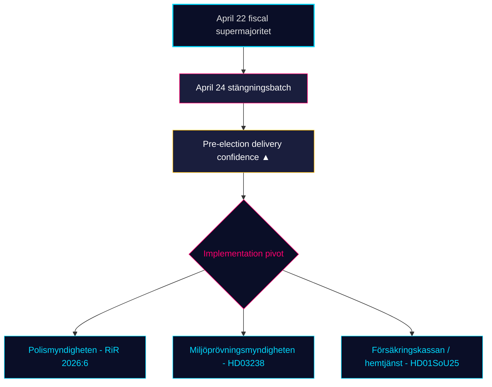

# Månedlig gennemgang — 2026-04-25

**Klassifikation**: PUBLIC | **Analytiker**: James Pether Sörling | **Dato**: 2026-04-25
**Konfidensniveau**: HIGH [A1] | **Dage til valg**: ~141 | **Vindue**: 2026-03-26 → 2026-04-25

---

## Konklusion

Sveriges 30-dages lovgivningsvindue lukker med Kristerssonregeringen (M–SD–KD–L) **der gennemfører sit pre-valgregulatoriske portfolio**. April 24-udvalgsgruppen — **HD01JuU10 (ny våbenlov), HD01JuU31 (opfølgning politireform), HD01SoU25 (styrket ældrepleje), HD01CU24 (effektivitet i byggeprocesser)** — lukker det regulatoriske afslutning oven på det finansielle klimaks den 22. april (HD01FiU48 brændstofafgiftsreduktion, M+SD+S+KD supermajoritet) [riksdagen.se]. Sundhed og kriminalitet er fortsat de dominerende *valgmæssige* kiler; oppositionens interpellationstrafik (HD10448 vindkraft-desinformation, HD11747 arbejdsmarkedsstøtte, HD11749 frihedsberøvede børns rettigheder, HD11748 konsulær beskyttelse i Burundi) viser S/V/MP køre et **disciplineret tre-spors narrativ** mens **SD har indsendt nul mod-motioner** mod de fire april 24-udvalgsrapporter — et strukturelt-tillidssignal der nu er vedvaret i 18 på hinanden følgende siddedage.

---

## 3 beslutninger dette briefing understøtter

### Beslutning 1: Pre-valgsleverings konfidensvurdering

Tidö-koalitionen har nu vedtaget sin **komplette erklærede 2025/26 lovgivningsportefølje** inden for de fire kernedomæner — finanspolitisk (HD03100/HD0399), energi (HD03240/HD03238/HD03239), sikkerhed/forsvar (UFöU3/HD03214/HD03228) og strafferetlig retfærdighed/velfærd (HD01JuU10/HD01JuU31/HD01SoU25) — inden for 141 dage fra september 2026-valget. Implementering, ikke lovgivning, er nu den bindende risiko. **Anbefaling**: skift overvågning til *implementeringsfeasibilitet* (Polismyndighedens kapacitet efter RiR 2026:6, Miljöprövningsmyndighedens tilladelsesgennemstrømning, Försäkringskassans administrative belastning for ældrepleje).

### Beslutning 2: Sundhed-og-kriminalitets kilesandsynlighed

Oppositionen har *ikke* lykkedes med at splitte koalitionen på sine primære angrebsflader: SfU18's 39 forbehold vendte ikke en eneste stemme; SD–KD sundhedssplit på SoU17 R15 blev begrænset. HD01JuU10 våbenlov og HD01JuU31 politireformsrevision vedtages begge med M+SD+KD+L-enighed. **Anbefaling**: investorer og interessenter bør behandle velfærds-/sikkerhedslovgivningen som *holdbar til september 2026*; oppositionens kilerhetorik dominerer men lovgivningsreverseringssandsynlighed er LAV (≤ 25 %).

### Beslutning 3: Pre-kampagne oppositionens narrativarkitektur

Tre oppositionskiler krystalliserede i april: (a) økonomisk — brændstof/SME-sygeløn (S, HD024082, HD10447); (b) miljø-desinformation — HD10448; (c) frihedsberøvedes rettigheder / migrantmindreårige / konsulær beskyttelse (V/MP, HD11749, HD11748). **Anbefaling**: kommunikatører der forbereder sig til sensommerkampagnen bør forvente at desinformationsrammen (HD10448) udvider sig til en koalitionsstresstest specifikt for SD; rammen om frihedsberøvede (HD11749) er V's primære angrebsvektor efter fængselsudvidelsen.

---

## 60-sekunders læsning

- 🔴 **April 24-udvalgsgruppen lukker regulatorisk portefølje** — HD01JuU10 + HD01JuU31 + HD01SoU25 + HD01CU24 — pre-valgslevering på skema
- 🔴 **Supermajoritet 22. april** (HD01FiU48, M+SD+S+KD): S kunne ikke modsætte sig 4,1 mia. SEK brændstofafgiftsreduktion 141 dage før valget
- 🟠 **Politireformen 2015-revision (RiR 2026:6 → HD01JuU31)** — kvardröjande lednings- og utredningsproblem; implementeringskapacitet er den nye bindende risiko
- 🟠 **Vindkraft-desinformations-interpellation (HD10448)** — første eksplicitte kobling af energipolitik og informationsintegritet i riksmötet
- 🟢 **SD-disciplin holder** — nul motioner mod regeringspropositioner i lukningsugen; tillidspartiet bevarer strukturel integritet
- 🟡 **HD01SoU25 styrket ældrepleje** — anhørigstrategi og hjemmehjælpskompetenskrav bliver leveringstest mod Försäkringskassan/kommuner
- 🟡 **Udenrigspolitisk hale** — HD11748 (Burundi-konsulær sag) signalerer V/MP-fokus på konsulær beskyttelse som humanitært valgspørgsmål
- 🟢 **Boligproduktion** — HD01CU24 forkorter sagsbehandlingstider; effekt på påbegyndte boliger målbar Q3 2026 (data.scb.se: BO0101)

---

## Vigtigste fremadrettede signal

**Overvåg**: Første post-24. april SOM-Institut eller Demoskop meningsmåling. Hvis S genvinder > 28 % i overskriftsstøtte på trods af 22. april brændstofafgiftsafstemningen, har S's "symbolsk opposition + praktisk støtte"-budskab holdt under pres, og september-valget forbliver et strukturelt toss-up. Hvis S halter under 26 %, har M+KD+L-blokens pre-valgspositionering demonstreret konvertering. **Udløserdato**: 2026-05-08 ± 5 dage (næste Demoskop månedlig).

---

## Konfidensfordeling

| Konfidensniveau | Nøglevurderinger | Grundlag |
|-----------------|------------------|----------|
| MEGET HØJ | KJ-1 (leveringsgennemførelse) | 8 dok_id'er på disk + 13 søskendesyntesereferencer |
| HØJ | KJ-2 (kileeffektivitet LAV), KJ-3 (implementeringsfokus) | Flerkildigt (riksdagen.se afstemningsprotokoller, RiR 2026:6, søskendeefterretning) |
| MEDIUM | Fremadrettet meningsmålingsdynamik | Enkeltkildet (demoskop / SOM-forsinkelse) |

<!-- source-sha: 91eb3cb6cf35873538b354461078df4509cf0012 -->
