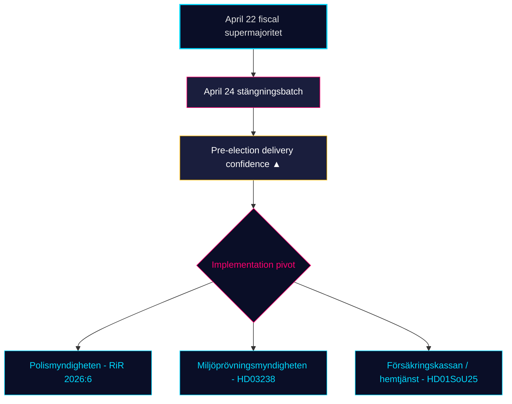

# Monatliche Überprüfung — 2026-04-25

**Klassifikation**: PUBLIC | **Analyst**: James Pether Sörling | **Datum**: 2026-04-25
**Konfidenzniveau**: HIGH [A1] | **Tage bis zur Wahl**: ~141 | **Zeitfenster**: 2026-03-26 → 2026-04-25

---

## Fazit

Schwedens 30-tägiges Gesetzgebungsfenster schließt, da die Kristersson-Regierung (M–SD–KD–L) ihr **regulatorisches Pre-Wahl-Portfolio abschließt**. Die Ausschussgruppe vom 24. April — **HD01JuU10 (neues Waffengesetz), HD01JuU31 (Polizeireform-Nachverfolgung), HD01SoU25 (Stärkung der Altenpflege), HD01CU24 (Effizienz der Bauprozesse)** — schließt den regulatorischen Abschluss oberhalb des finanziellen Höhepunkts vom 22. April (HD01FiU48 Kraftstoffsteuerreduktion, M+SD+S+KD Supermehrheit) [riksdagen.se]. Gesundheitswesen und Kriminalität sind weiterhin die dominierenden *wahlpolitischen* Keile; der Interpellationsverkehr der Opposition (HD10448 Windkraft-Desinformation, HD11747 Arbeitseingliederungszuschüsse, HD11749 Rechte inhaftierter Kinder, HD11748 konsularischer Schutz in Burundi) zeigt S/V/MP mit einem **disziplinierten Drei-Spur-Narrativ**, während **SD null Gegenmotionen** gegen die vier Ausschussberichte vom 24. April eingereicht hat — ein strukturelles Vertrauenssignal, das nun seit 18 aufeinanderfolgenden Sitzungstagen anhält.

---

## 3 Entscheidungen, die dieser Bericht unterstützt

### Entscheidung 1: Vertrauensbewertung der Pre-Wahl-Lieferung

Die Tidö-Koalition hat nun ihr **vollständiges deklariertes 2025/26 Gesetzgebungsportfolio** in den vier Kernbereichen verabschiedet — Finanzpolitik (HD03100/HD0399), Energie (HD03240/HD03238/HD03239), Sicherheit/Verteidigung (UFöU3/HD03214/HD03228) und Strafrecht/Wohlfahrt (HD01JuU10/HD01JuU31/HD01SoU25) — innerhalb von 141 Tagen bis zur Wahl im September 2026. Die Umsetzung, nicht die Gesetzgebung, ist nun das bindende Risiko. **Empfehlung**: Überwachung auf *Umsetzbarkeit* umschalten (Kapazität der Polismyndigheten nach RiR 2026:6, Genehmigungsdurchsatz der Miljöprövningsmyndigheten, administrative Belastung der Försäkringskassan für die Altenpflege).

### Entscheidung 2: Gesundheits-und-Kriminalitäts-Keil-Wahrscheinlichkeit

Die Opposition hat es *nicht* geschafft, die Koalition auf ihren primären Angriffsflächen zu spalten: Die 39 Vorbehalte von SfU18 haben keine einzige Stimme umgekehrt; die SD–KD Gesundheits-Spaltung bei SoU17 R15 wurde eingedämmt. Das HD01JuU10 Waffengesetz und das HD01JuU31 Polizeireform-Audit werden beide mit M+SD+KD+L-Einigkeit verabschiedet. **Empfehlung**: Investoren und Stakeholder sollten die Wohlfahrts-/Sicherheitsgesetzgebung als *dauerhaft bis September 2026* behandeln; die Keil-Rhetorik der Opposition dominiert, aber die Wahrscheinlichkeit einer Gesetzgebungsumkehr ist NIEDRIG (≤ 25 %).

### Entscheidung 3: Narrativarchitektur der Opposition vor dem Wahlkampf

Drei Oppositionskeile kristallisierten sich im April heraus: (a) wirtschaftlich — Kraftstoff/KMU-Krankengeld (S, HD024082, HD10447); (b) Umwelt-Desinformation — HD10448; (c) Rechte von Inhaftierten / Migrantenminderrährigen / konsularischer Schutz (V/MP, HD11749, HD11748). **Empfehlung**: Kommunikatoren, die sich auf den Spätsommer-Wahlkampf vorbereiten, sollten erwarten, dass der Desinformationsrahmen (HD10448) zu einem Koalitions-Stresstest speziell für SD eskaliert; der Rahmen der Inhaftierten (HD11749) ist Vs primärer Angriffsvektor nach der Gefängniserweiterung.

---

## 60-Sekunden-Nachrichtenüberblick

- 🔴 **Ausschussgruppe vom 24. April schließt regulatorisches Portfolio** — HD01JuU10 + HD01JuU31 + HD01SoU25 + HD01CU24 — Pre-Wahl-Lieferung im Zeitplan
- 🔴 **Supermehrheit am 22. April** (HD01FiU48, M+SD+S+KD): S konnte 4,1 Mrd. SEK Kraftstoffsteuerreduktion 141 Tage vor der Wahl nicht ablehnen
- 🟠 **Polizeireform 2015-Audit (RiR 2026:6 → HD01JuU31)** — kvardröjande lednings- och utredningsproblem; Implementierungskapazität ist das neue bindende Risiko
- 🟠 **Windkraft-Desinformations-Interpellation (HD10448)** — erste explizite Verknüpfung von Energiepolitik und Informationsintegrität im riksmötet
- 🟢 **SD-Disziplin hält** — null Motionen gegen Regierungsvorlagen in der Schlusswoche; Vertrauenspartei behält strukturelle Integrität
- 🟡 **HD01SoU25 gestärkte Altenpflege** — Angehörigenstrategie und Hauspflegekompetenzanforderungen werden zum Liefertest gegen Försäkringskassan/Kommunen
- 🟡 **Außenpolitischer langer Schwanz** — HD11748 (Burundi-Konsulatfall) signalisiert V/MP-Fokus auf konsularischen Schutz als humanitäres Wahlthema
- 🟢 **Wohnungsbau** — HD01CU24 kürzt Bearbeitungszeiten; Effekt auf begonnene Wohnungen messbar Q3 2026 (data.scb.se: BO0101)

---

## Wichtigstes vorwärtsgerichtetes Signal

**Überwachen**: Erste Post-24.-April SOM-Institut oder Demoskop Meinungsumfrage. Falls S > 28 % in der Schlagzeilenunterstützung trotz der Kraftstoffsteuerabstimmung vom 22. April zurückgewinnt, hat S's "symbolische Opposition + praktische Unterstützung"-Botschaft unter Druck standgehalten und die Septemberwahl bleibt ein strukturelles Toss-up. Falls S unter 26 % liegt, hat die Pre-Wahl-Positionierung des M+KD+L-Blocks nachweislich konvertiert. **Auslöserdatum**: 2026-05-08 ± 5 Tage (nächste monatliche Demoskop).

---

## Konfidenzverteilung

| Konfidenzniveau | Schlüsselbewertungen | Grundlage |
|-----------------|----------------------|-----------|
| SEHR HOCH | KJ-1 (Lieferungsabschluss) | 8 dok_ids auf Datenträger + 13 Geschwister-Synthese-Referenzen |
| HOCH | KJ-2 (Keil-Wirksamkeit NIEDRIG), KJ-3 (Implementierungsfokus) | Mehrkällig (riksdagen.se Abstimmungsprotokolle, RiR 2026:6, Geschwister-Nachrichtendienst) |
| MITTEL | Vorwärts gerichtete Umfragedynamik | Einzelquelle (demoskop / SOM-Verzögerung) |

<!-- source-sha: 91eb3cb6cf35873538b354461078df4509cf0012 -->
