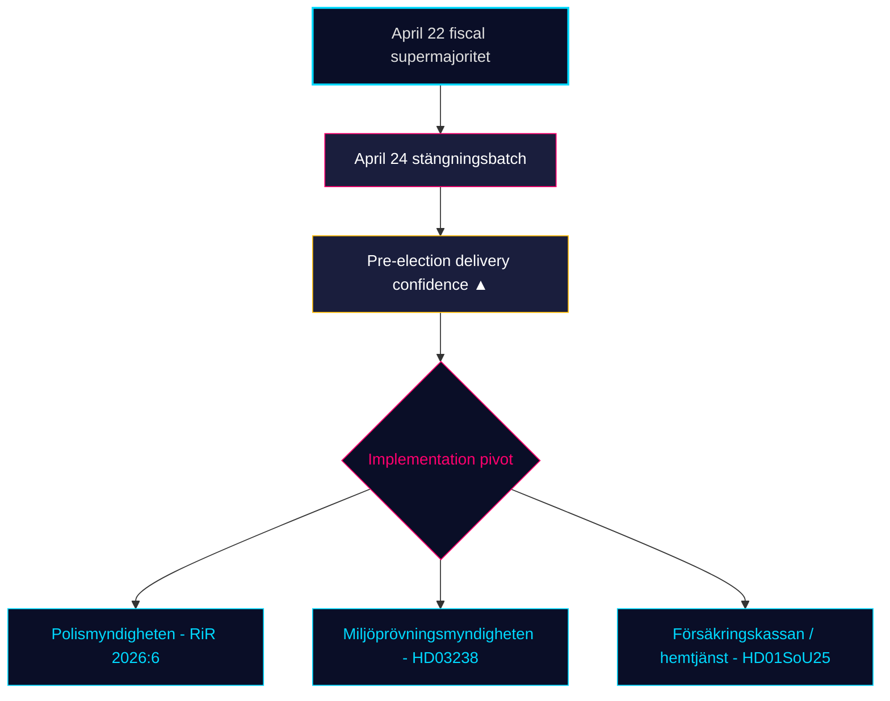

# Revisión mensual — 2026-04-25

**Clasificación**: PUBLIC | **Analista**: James Pether Sörling | **Fecha**: 2026-04-25
**Nivel de confianza**: HIGH [A1] | **Días hasta las elecciones**: ~141 | **Ventana**: 2026-03-26 → 2026-04-25

---

## BLUF

La ventana legislativa de 30 días de Suecia se cierra con el gobierno Kristersson (M–SD–KD–L) **completando su cartera regulatoria preelectoral**. El lote de comité del 24 de abril — **HD01JuU10 (nueva ley de armas), HD01JuU31 (seguimiento de reforma policial), HD01SoU25 (refuerzo de atención a mayores), HD01CU24 (eficiencia en procesos de construcción)** — cierra el cierre regulatorio encima del clímax fiscal del 22 de abril (HD01FiU48 reducción de impuesto sobre combustibles, M+SD+S+KD supermayoría) [riksdagen.se]. La sanidad y la criminalidad siguen siendo las cuñas *electorales* dominantes; el tráfico de interpelaciones de la oposición (HD10448 desinformación sobre energía eólica, HD11747 subsidios al trabajo, HD11749 derechos de menores detenidos, HD11748 protección consular en Burundi) muestra a S/V/MP operando una **narrativa disciplinada de tres pistas** mientras **SD ha presentado cero contramociones** contra los cuatro informes de comité del 24 de abril — una señal de confianza estructural que ya persiste durante 18 días de sesión consecutivos.

---

## 3 decisiones que apoya este informe

### Decisión 1: Evaluación de la confianza en la entrega preelectoral

La coalición Tidö ha aprobado ahora su **cartera legislativa declarada completa para 2025/26** en los cuatro dominios centrales — fiscal (HD03100/HD0399), energía (HD03240/HD03238/HD03239), seguridad/defensa (UFöU3/HD03214/HD03228) y justicia penal/bienestar (HD01JuU10/HD01JuU31/HD01SoU25) — dentro de 141 días antes de las elecciones de septiembre de 2026. La implementación, no la legislación, es ahora el riesgo vinculante. **Recomendación**: cambiar la monitorización hacia la *viabilidad de implementación* (capacidad de Polismyndigheten tras RiR 2026:6, rendimiento de permisos de Miljöprövningsmyndigheten, carga administrativa de Försäkringskassan para la atención a mayores).

### Decisión 2: Probabilidad de la cuña salud y criminalidad

La oposición *no* ha logrado fracturar la coalición en sus superficies de ataque primarias: las 39 reservas de SfU18 no cambiaron ni un solo voto; la división SD–KD en sanidad en SoU17 R15 fue contenida. La ley de armas HD01JuU10 y la auditoría de la reforma policial HD01JuU31 se aprueban ambas con la unidad M+SD+KD+L. **Recomendación**: los inversores y partes interesadas deben tratar la legislación de bienestar/seguridad como *duradera hasta septiembre de 2026*; la retórica de cuñas de la oposición domina pero la probabilidad de reversión legislativa es BAJA (≤ 25 %).

### Decisión 3: Arquitectura narrativa de la oposición antes de la campaña

Tres cuñas de la oposición se cristalizaron en abril: (a) económica — combustible/baja laboral de PYMES (S, HD024082, HD10447); (b) desinformación ambiental — HD10448; (c) derechos de detenidos / menores migrantes / protección consular (V/MP, HD11749, HD11748). **Recomendación**: los comunicadores que se preparan para la campaña de finales de verano deben esperar que el marco de desinformación (HD10448) se expanda en un test de estrés de la coalición específicamente para SD; el marco de los detenidos (HD11749) es el vector de ataque principal de V tras la expansión carcelaria.

---

## Lectura de 60 segundos

- 🔴 **El lote de comité del 24 de abril cierra la cartera regulatoria** — HD01JuU10 + HD01JuU31 + HD01SoU25 + HD01CU24 — entrega preelectoral en calendario
- 🔴 **Supermayoría del 22 de abril** (HD01FiU48, M+SD+S+KD): S no pudo oponerse a 4,1 mil millones SEK de reducción de impuesto sobre combustibles 141 días antes de las elecciones
- 🟠 **Auditoría de la reforma policial 2015 (RiR 2026:6 → HD01JuU31)** — kvardröjande lednings- och utredningsproblem; la capacidad de implementación es el nuevo riesgo vinculante
- 🟠 **Interpelación sobre desinformación eólica (HD10448)** — primera vinculación explícita de la política energética e integridad de la información en el riksmötet
- 🟢 **La disciplina del SD se mantiene** — cero mociones contra proposiciones del gobierno en la semana de cierre; el partido de confianza mantiene integridad estructural
- 🟡 **HD01SoU25 refuerzo de la atención a mayores** — la estrategia de cuidadores familiares y los requisitos de competencia en servicios domiciliarios se convierten en test de entrega frente a Försäkringskassan/municipios
- 🟡 **Cola de política exterior** — HD11748 (caso consular de Burundi) señala el enfoque de V/MP en la protección consular como cuestión electoral humanitaria
- 🟢 **Producción de viviendas** — HD01CU24 acorta los plazos de tramitación; efecto sobre viviendas iniciadas medible en Q3 2026 (data.scb.se: BO0101)

---

## Principal señal prospectiva

**Monitorizar**: Primer sondeo de opinión del Instituto SOM o Demoskop posterior al 24 de abril. Si S recupera > 28 % de apoyo en titulares a pesar de la votación de la reducción del impuesto sobre combustibles del 22 de abril, el mensaje de S de "oposición simbólica + apoyo práctico" ha resistido bajo presión y las elecciones de septiembre siguen siendo un empate estructural. Si S queda por debajo del 26 %, el posicionamiento preelectoral del bloque M+KD+L ha demostrado conversión. **Fecha desencadenante**: 2026-05-08 ± 5 días (próxima Demoskop mensual).

---

## Distribución de la confianza

| Nivel de confianza | Evaluaciones clave | Fundamento |
|--------------------|--------------------|------------|
| MUY ALTO | KJ-1 (finalización de entrega) | 8 dok_ids en disco + 13 referencias de síntesis hermana |
| ALTO | KJ-2 (eficacia de cuña BAJA), KJ-3 (pivote de implementación) | Multi-fuente (registros de votación riksdagen.se, RiR 2026:6, inteligencia hermana) |
| MEDIO | Dinámica de encuestas prospectivas | Fuente única (demoskop / retraso SOM) |

<!-- source-sha: 91eb3cb6cf35873538b354461078df4509cf0012 -->
