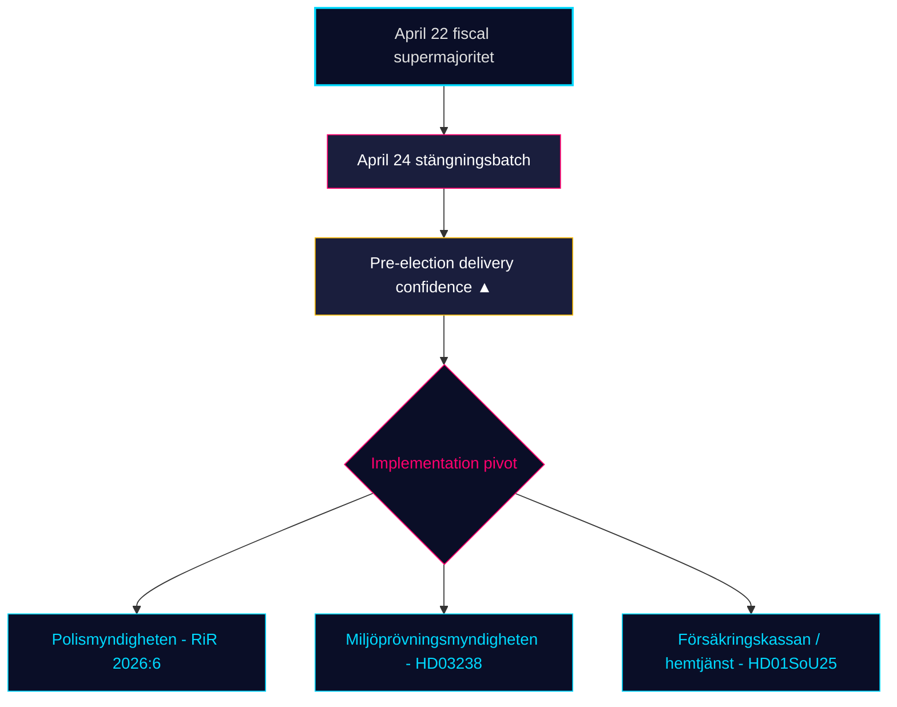

# Kuukausikatsaus — 2026-04-25

**Luokittelu**: PUBLIC | **Analyytikko**: James Pether Sörling | **Päiväys**: 2026-04-25
**Luottamustaso**: HIGH [A1] | **Päiviä vaaleihin**: ~141 | **Aikaikkuna**: 2026-03-26 → 2026-04-25

---

## Johtopäätös

Ruotsin 30 päivän lainsäädäntöikkuna sulkeutuu Kristerssonin hallituksen (M–SD–KD–L) **täyttäessä esivaalisääntelyportfolionsa**. 24. huhtikuuta valiokuntaerä — **HD01JuU10 (uusi asejaki), HD01JuU31 (poliisiuudistuksen jatkotoimet), HD01SoU25 (vanhustenhuollon vahvistaminen), HD01CU24 (rakentamisprosessien tehokkuus)** — lukitsee sääntelyyn liittyvän päätöksen 22. huhtikuuuta saavutetun finansiaalisen huipun päälle (HD01FiU48 polttoaineverovähennys, M+SD+S+KD supraenemmistö) [riksdagen.se]. Terveydenhuolto ja rikollisuus ovat edelleen hallitsevia *vaalikiiloja*; opposition interpellaatioliikenne (HD10448 tuulivoimadisinformaatio, HD11747 työvoimatukiohjelmat, HD11749 vapautensa menettäneiden lasten oikeudet, HD11748 konsulaarisuoja Burundissa) osoittaa S/V/MP:n ajavan **kurinalaistettu kolmiraiteinen narratiivi** samalla kun **SD ei ole jättänyt yhtään vastalausetta** neljää 24. huhtikuuuta laadittua valiokuntaraporttia vastaan — rakenteellinen luottamusmerkki, joka on nyt pysynyt voimassa 18 peräkkäisen istuntopäivän ajan.

---

## 3 päätöstä, joita tämä tiedote tukee

### Päätös 1: Esivaalitoimituksen luottamusarvio

Tidö-koalitio on nyt hyväksynyt **täydellisen ilmoitetun 2025/26 lainsäädäntöportfolionsa** neljällä ydinosaamisen alalla — finanssipolitiikka (HD03100/HD0399), energia (HD03240/HD03238/HD03239), turvallisuus/puolustus (UFöU3/HD03214/HD03228) ja rikosoikeus/hyvinvointi (HD01JuU10/HD01JuU31/HD01SoU25) — 141 päivän sisällä syyskuun 2026 vaaleista. Toimeenpano, ei lainsäädäntö, on nyt sitova riski. **Suositus**: siirrä seuranta *toimeenpanon toteuttamiskelpoisuuteen* (Polismyndighetenin kapasiteetti RiR 2026:6 jälkeen, Miljöprövningsmyndighetenin lupajuoksu, Försäkringskassanin hallinnollinen kuormitus vanhustenhuollolle).

### Päätös 2: Terveydenhuollon ja rikollisuuden kiilan todennäköisyys

Oppositio ei ole *onnistunut* repimään koalition pääsyä hyökkäyspinnallaan: SfU18:n 39 varausta eivät kääntäneet yhtäkään ääntä; SD–KD terveydenhuollon jako SoU17 R15:ssä rajoitettiin. HD01JuU10 asejaki ja HD01JuU31 poliisiuudistuksen tarkistus hyväksytään molemmat M+SD+KD+L-yhtenäisyydellä. **Suositus**: sijoittajien ja sidosryhmien tulisi kohdella hyvinvointi-/turvallisuuslainsäädäntöä *kestävänä syyskuuhun 2026 asti*; opposition kiilaretorikka dominoi, mutta lainsäädännön kumoamisen todennäköisyys on MATALA (≤ 25 %).

### Päätös 3: Esivaalijakson opposition narratiivirakenne

Kolme opposition kiilaa kiteytyi huhtikuussa: (a) taloudellinen — polttoaine/PK-yritysten sairauspalkka (S, HD024082, HD10447); (b) ympäristödisinformaatio — HD10448; (c) vapautensa menettäneiden oikeudet / siirtolaisalaikäiset / konsulaarisuoja (V/MP, HD11749, HD11748). **Suositus**: myöhäiskesän kampanjaan valmistautuvien viestijöiden tulisi odottaa disinformaatiokehyksen (HD10448) laajentuvan koalition stressitestiksi erityisesti SD:lle; vapautensa menettäneiden kehys (HD11749) on V:n ensisijainen hyökkäysvektori vankilalaajennuksen jälkeen.

---

## 60 sekunnin tiedustelutiivistelmä

- 🔴 **24. huhtikuussa valiokuntaerä sulkee sääntelyportfolion** — HD01JuU10 + HD01JuU31 + HD01SoU25 + HD01CU24 — esivaalitoimitukset aikataulussa
- 🔴 **Supraenemmistö 22. huhtikuuta** (HD01FiU48, M+SD+S+KD): S ei voinut vastustaa 4,1 Mrd. SEK polttoainerovähennystä 141 päivää ennen vaaleja
- 🟠 **Poliisiuudistus 2015 -tarkistus (RiR 2026:6 → HD01JuU31)** — kvardröjande lednings- och utredningsproblem; toimeenpanokapasiteetti on uusi sitova riski
- 🟠 **Tuulivoimadisinformaation interpellaatio (HD10448)** — ensimmäinen nimenomainen energiapolitiikan ja tietointegriteetin yhdistäminen riksmötessä
- 🟢 **SD-kuri pitää** — nolla motioita hallituksen esityksiä vastaan sulkemisviikolla; luottamuspuolue säilyttää rakenteellisen eheyden
- 🟡 **HD01SoU25 vanhustenhuollon vahvistaminen** — omaisten hoitostrategia ja kotihoidon pätevyysvaatimukset ovat toimitustesti Försäkringskassania/kuntia vastaan
- 🟡 **Ulkopolitiikan pitkä häntä** — HD11748 (Burundi konsulaarisuoja) signaloi V/MP-fokuksen konsulaarisuojaan humanitaarisena vaaliaiheena
- 🟢 **Asuntotuotanto** — HD01CU24 lyhentää käsittelyaikoja; vaikutus aloitettuihin asuntoihin mitattavissa Q3 2026 (data.scb.se: BO0101)

---

## Tärkein eteenpäin suuntautuva signaali

**Seuraa**: Ensimmäinen 24. huhtikuuta jälkeinen SOM-instituutti tai Demoskop mielipidetutkimus. Jos S saa takaisin > 28 % kannatuksen polttoainerovähennysäänestyksen 22. huhtikuuta jälkeen, S:n "symbolinen oppositio + käytännön tuki" -viesti on kestänyt paineessa ja syyskuun vaalit säilyvät rakenteellisesti tasaisena kamppailuna. Jos S jää alle 26 %, M+KD+L-blokin esivaaliasemointi on selkeästi muuntautunut. **Laukaisupäivämäärä**: 2026-05-08 ± 5 päivää (seuraava Demoskop kuukausittainen).

---

## Luottamusjakauma

| Luottamustaso | Avainhavainnot | Perusta |
|---------------|----------------|---------|
| HYVIN KORKEA | KJ-1 (toimitusten toteutus) | 8 dok_id:tä levyllä + 13 sisarussynteesin viittausta |
| KORKEA | KJ-2 (kiilatehokkuus MATALA), KJ-3 (toimeenpanofokus) | Monilähteinen (riksdagen.se äänestysprotokollat, RiR 2026:6, sisarusten tiedustelu) |
| KOHTALAINEN | Eteenpäin katsova kyselydynamiikka | Yksillähteinen (demoskop / SOM-viive) |

<!-- source-sha: 91eb3cb6cf35873538b354461078df4509cf0012 -->
