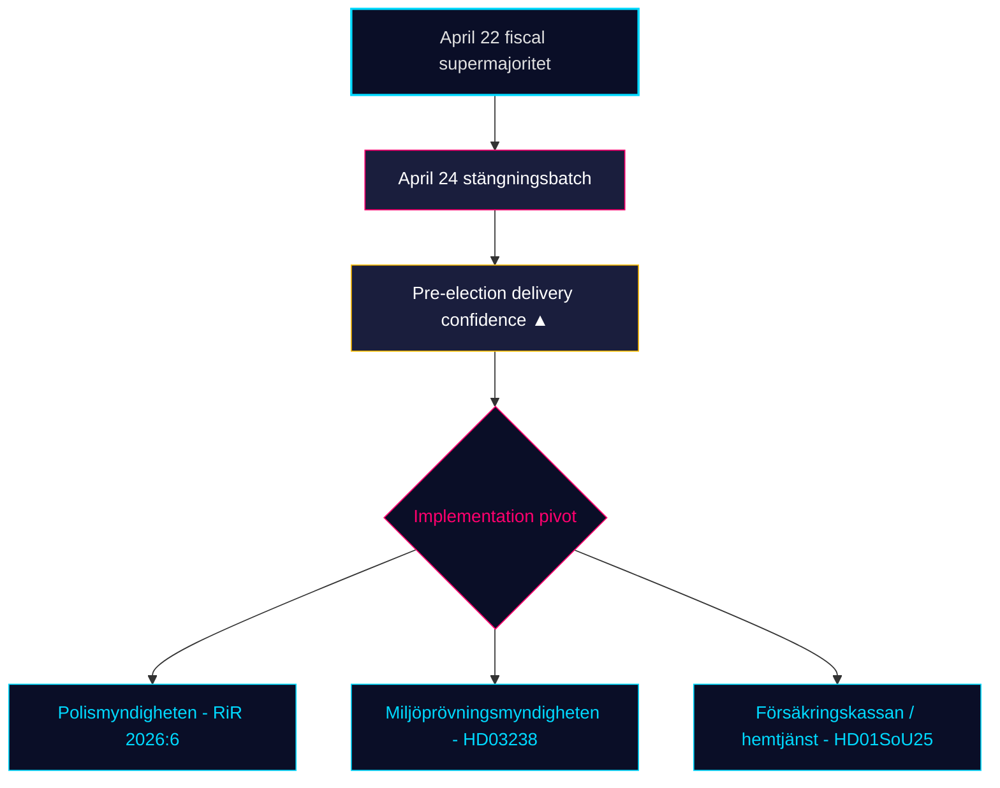

# Revue mensuelle — 2026-04-25

**Classification** : PUBLIC | **Analyste** : James Pether Sörling | **Date** : 2026-04-25
**Niveau de confiance** : HIGH [A1] | **Jours avant l'élection** : ~141 | **Fenêtre** : 2026-03-26 → 2026-04-25

---

## BLUF

La fenêtre législative de 30 jours de la Suède se ferme avec le gouvernement Kristersson (M–SD–KD–L) **complétant son portefeuille réglementaire pré-électoral**. Le lot de commission du 24 avril — **HD01JuU10 (nouvelle loi sur les armes), HD01JuU31 (suivi de la réforme policière), HD01SoU25 (renforcement des soins aux personnes âgées), HD01CU24 (efficacité des processus de construction)** — verrouille la clôture réglementaire au-dessus du climax financier du 22 avril (HD01FiU48 réduction de la taxe sur les carburants, M+SD+S+KD supermajorité) [riksdagen.se]. La santé et la criminalité restent les clivages *électoraux* dominants ; le trafic d'interpellations de l'opposition (HD10448 désinformation sur l'éolien, HD11747 subventions au travail, HD11749 droits des enfants détenus, HD11748 protection consulaire au Burundi) montre S/V/MP opérant un **narratif discipliné à trois pistes** tandis que **SD n'a déposé zéro contre-motion** contre les quatre rapports de commission du 24 avril — un signal de confiance structurelle qui persiste désormais depuis 18 jours de séance consécutifs.

---

## 3 décisions que ce briefing soutient

### Décision 1 : Évaluation de la confiance dans la livraison pré-électorale

La coalition Tidö a maintenant adopté son **portfolio législatif déclaré complet pour 2025/26** dans les quatre domaines clés — fiscal (HD03100/HD0399), énergie (HD03240/HD03238/HD03239), sécurité/défense (UFöU3/HD03214/HD03228) et justice pénale/bien-être (HD01JuU10/HD01JuU31/HD01SoU25) — dans les 141 jours précédant l'élection de septembre 2026. La mise en œuvre, et non la législation, est maintenant le risque contraignant. **Recommandation** : faire pivoter la surveillance vers la *faisabilité de la mise en œuvre* (capacité de Polismyndigheten après RiR 2026:6, débit de permis de Miljöprövningsmyndigheten, charge administrative de Försäkringskassan pour les soins aux personnes âgées).

### Décision 2 : Probabilité de clivage santé et criminalité

L'opposition n'a *pas* réussi à fracturer la coalition sur ses principales surfaces d'attaque : les 39 réserves de SfU18 n'ont pas retourné une seule voix ; la division SD–KD sur les soins de santé sur SoU17 R15 a été contenue. La loi sur les armes HD01JuU10 et l'audit de la réforme policière HD01JuU31 sont tous deux adoptés avec l'unité M+SD+KD+L. **Recommandation** : les investisseurs et les parties prenantes devraient traiter la législation sur la protection sociale/sécurité comme *durable jusqu'en septembre 2026* ; la rhétorique de clivage de l'opposition domine mais la probabilité d'inversion législative est FAIBLE (≤ 25 %).

### Décision 3 : Architecture narrative de l'opposition avant la campagne

Trois clivages de l'opposition se sont cristallisés en avril : (a) économique — carburant/maladie-PME (S, HD024082, HD10447) ; (b) désinformation environnementale — HD10448 ; (c) droits des détenus / mineurs migrants / protection consulaire (V/MP, HD11749, HD11748). **Recommandation** : les communicants se préparant à la campagne de fin d'été devraient s'attendre à ce que le cadre de désinformation (HD10448) s'étende en un test de stress de la coalition spécifiquement pour le SD ; le cadre des détenus (HD11749) est le principal vecteur d'attaque de V après l'expansion carcérale.

---

## Lecture en 60 secondes

- 🔴 **Le lot de commission du 24 avril ferme le portefeuille réglementaire** — HD01JuU10 + HD01JuU31 + HD01SoU25 + HD01CU24 — livraison pré-électorale dans les délais
- 🔴 **Supermajorité du 22 avril** (HD01FiU48, M+SD+S+KD) : S ne pouvait pas s'opposer à 4,1 milliards SEK de réduction de taxe sur les carburants 141 jours avant l'élection
- 🟠 **Audit de la réforme policière 2015 (RiR 2026:6 → HD01JuU31)** — kvardröjande lednings- och utredningsproblem ; la capacité de mise en œuvre est le nouveau risque contraignant
- 🟠 **Interpellation sur la désinformation éolienne (HD10448)** — premier couplage explicite entre politique énergétique et intégrité de l'information au riksmötet
- 🟢 **Discipline du SD tient** — zéro motion contre les propositions gouvernementales lors de la semaine de clôture ; le parti de confiance maintient l'intégrité structurelle
- 🟡 **HD01SoU25 renforcement des soins aux personnes âgées** — stratégie de proche aidant et exigences de compétence des services à domicile deviennent un test de livraison contre Försäkringskassan/communes
- 🟡 **Queue de politique étrangère** — HD11748 (affaire consulaire du Burundi) signale l'accent de V/MP sur la protection consulaire comme enjeu électoral humanitaire
- 🟢 **Production de logements** — HD01CU24 raccourcit les délais de traitement ; effet sur les logements commencés mesurable au T3 2026 (data.scb.se : BO0101)

---

## Principal signal prospectif

**Surveiller** : Premier sondage d'opinion de l'Institut SOM ou de Demoskop post-24 avril. Si S regagne > 28 % de soutien en titres malgré le vote de réduction de taxe sur les carburants du 22 avril, le message de S de « opposition symbolique + soutien pratique » a résisté sous pression et l'élection de septembre reste structurellement incertaine. Si S est en deçà de 26 %, le positionnement pré-électoral du bloc M+KD+L a démontrablement converti. **Date déclencheur** : 2026-05-08 ± 5 jours (prochaine Demoskop mensuelle).

---

## Distribution de la confiance

| Niveau de confiance | Évaluations clés | Fondement |
|---------------------|------------------|-----------|
| TRÈS ÉLEVÉ | KJ-1 (achèvement de la livraison) | 8 dok_ids sur disque + 13 références de synthèse fraternelle |
| ÉLEVÉ | KJ-2 (efficacité du clivage FAIBLE), KJ-3 (pivot d'implémentation) | Multi-source (registres de vote riksdagen.se, RiR 2026:6, renseignement fraternel) |
| MOYEN | Dynamique des sondages prospectifs | Source unique (demoskop / délai SOM) |

<!-- source-sha: 91eb3cb6cf35873538b354461078df4509cf0012 -->
