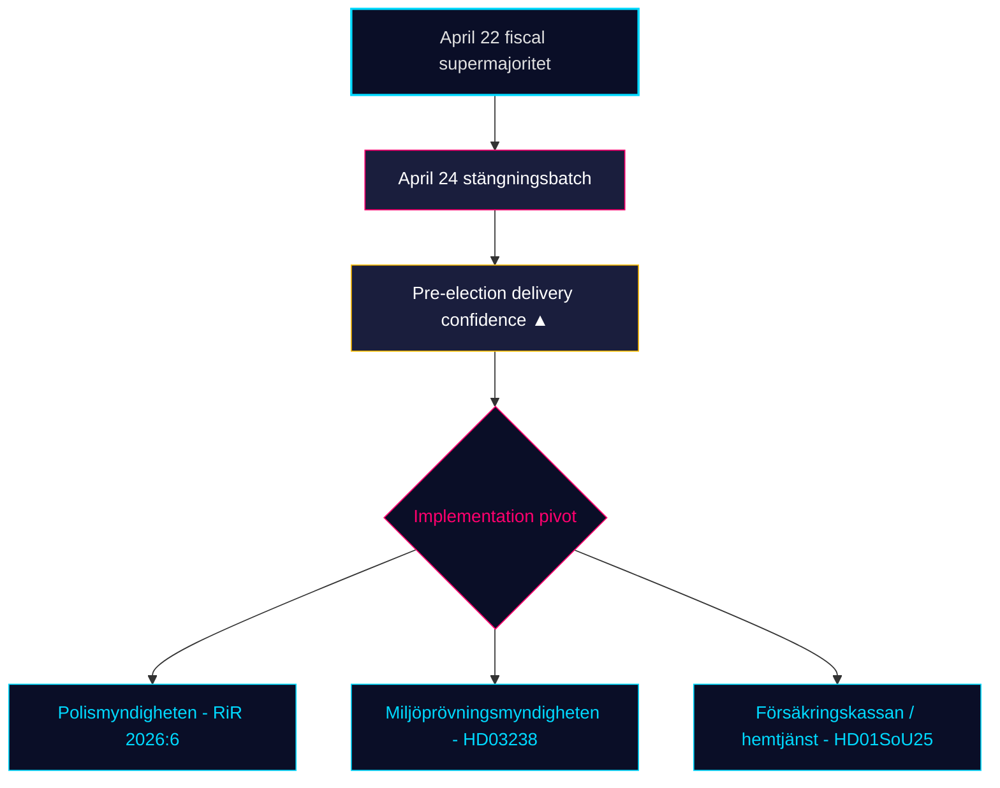

<!-- dir: rtl -->
# סקירה חודשית — 2026-04-25

**סיווג**: ציבורי | **אנליסט**: James Pether Sörling | **תאריך**: 2026-04-25
**רמת ביטחון**: HIGH [A1] | **ימים לבחירות**: ~141 | **חלון**: 2026-03-26 → 2026-04-25

---

## מסקנה מרכזית

חלון החקיקה של 30 הימים של שוודיה נסגר כשממשלת קריסטרסון (M–SD–KD–L) **משלימה את תיק הרגולציה שלה לפני הבחירות**. אצוות הוועדה של 24 באפריל — **HD01JuU10 (חוק נשק חדש), HD01JuU31 (מעקב אחר רפורמת המשטרה), HD01SoU25 (חיזוק שירותי קשישים), HD01CU24 (יעילות תהליכי בנייה)** — נועלת את הסיום הרגולטורי מעל לשיא הפיסקלי של 22 באפריל (HD01FiU48 הפחתת מס דלק, M+SD+S+KD רוב גדול) [riksdagen.se]. בריאות ופשיעה נותרות הטריזים הבחירותיים *הדומיננטיים*; תנועת ביניים האופוזיציה (HD10448 דיסאינפורמציה על אנרגיית רוח, HD11747 סבסוד עבודה, HD11749 זכויות ילדים עצורים, HD11748 הגנה קונסולרית בבורונדי) מראה S/V/MP מפעילים **נרטיב מוסדר בשלושה מסלולים** בעוד **SD הגיש אפס נגד-הצעות** כנגד ארבעת דוחות הוועדה מ-24 באפריל — אות ביטחון מבני שנמשך כעת 18 ימי ישיבה רצופים.

---

## 3 החלטות שבריף זה תומך בהן

### החלטה 1: הערכת ביטחון מסירה לפני הבחירות

קואליציית Tidö אישרה כעת את **תיק החקיקה המוצהר המלא שלה לשנים 2025/26** בארבעת התחומים המרכזיים — פיסקלי (HD03100/HD0399), אנרגיה (HD03240/HD03238/HD03239), ביטחון/הגנה (UFöU3/HD03214/HD03228) ומשפט פלילי/רווחה (HD01JuU10/HD01JuU31/HD01SoU25) — בתוך 141 ימים מבחירות ספטמבר 2026. יישום, לא חקיקה, הוא כעת הסיכון המחייב. **המלצה**: הסב ניטור ל*היתכנות יישום* (קיבולת Polismyndigheten לאחר RiR 2026:6, תפוקת רישיונות Miljöprövningsmyndigheten, עומס מנהלי Försäkringskassan לשירותי קשישים).

### החלטה 2: הסתברות טריז הבריאות והפשיעה

האופוזיציה *לא* הצליחה לפוצץ את הקואליציה על פני ההתקפה העיקריים: 39 ההסתייגויות של SfU18 לא הפכו ולו קול אחד; פיצול SD–KD על בריאות ב-SoU17 R15 רוסן. חוק הנשק HD01JuU10 ותדיקת רפורמת המשטרה HD01JuU31 עוברים שניהם עם אחדות M+SD+KD+L. **המלצה**: משקיעים ובעלי עניין צריכים להתייחס לחקיקת הרווחה/ביטחון כ*בת-קיימא עד ספטמבר 2026*; רטוריקת הטריזים של האופוזיציה שולטת אך הסתברות היפוך חקיקתי היא נמוכה (≤ 25%).

### החלטה 3: ארכיטקטורת נרטיב האופוזיציה לפני הקמפיין

שלושה טריזי אופוזיציה התגבשו באפריל: (א) כלכלי — דלק/דמי מחלה לעסקים קטנים (S, HD024082, HD10447); (ב) דיסאינפורמציה סביבתית — HD10448; (ג) זכויות עצורים / קטינים מהגרים / הגנה קונסולרית (V/MP, HD11749, HD11748). **המלצה**: מתקשרים המתכוננים לקמפיין סוף הקיץ צריכים לצפות שמסגרת הדיסאינפורמציה (HD10448) תתרחב לבחינת עמידות הקואליציה במיוחד לגבי SD; מסגרת העצורים (HD11749) היא וקטור ההתקפה העיקרי של V לאחר הרחבת בתי הסוהר.

---

## קריאת מודיעין של 60 שניות

- 🔴 **אצוות ועדת 24 באפריל סוגרת תיק רגולטורי** — HD01JuU10 + HD01JuU31 + HD01SoU25 + HD01CU24 — מסירה לפני הבחירות בלוח הזמנים
- 🔴 **רוב גדול ב-22 באפריל** (HD01FiU48, M+SD+S+KD): S לא יכלה להתנגד להפחתת מס דלק של 4.1 מיליארד SEK 141 ימים לפני הבחירות
- 🟠 **ביקורת רפורמת המשטרה 2015 (RiR 2026:6 → HD01JuU31)** — kvardröjande lednings- och utredningsproblem; קיבולת יישום היא הסיכון המחייב החדש
- 🟠 **ביניים דיסאינפורמציה אנרגיית רוח (HD10448)** — הצימוד הראשון המפורש של מדיניות אנרגיה ושלמות מידע ב-riksmötet
- 🟢 **משמעת SD מחזיקה** — אפס הצעות כנגד הצעות הממשלה בשבוע הסגירה; מפלגת הביטחון שומרת על שלמות מבנית
- 🟡 **HD01SoU25 חיזוק שירותי קשישים** — אסטרטגיית מטפלים משפחתיים ודרישות כשירות שירותי בית הופכים לבחינת מסירה מול Försäkringskassan/עיריות
- 🟡 **זנב מדיניות חוץ** — HD11748 (מקרה קונסולרי בורונדי) מאותת על מיקוד V/MP בהגנה קונסולרית כנושא בחירות הומניטרי
- 🟢 **ייצור דיור** — HD01CU24 מקצר זמני טיפול; השפעה על דיור שהחל ניתנת למדידה Q3 2026 (data.scb.se: BO0101)

---

## אות מרכזי מבט-קדימה

**ניטור**: סקר דעת ראשון של מכון SOM או Demoskop לאחר 24 באפריל. אם S מחזירה > 28% תמיכה בכותרות למרות הצבעת הפחתת מס הדלק של 22 באפריל, הודעת S "אופוזיציה סמלית + תמיכה מעשית" עמדה תחת לחץ והבחירות בספטמבר נשארות תחרות מבנית שקולה. אם S מפגרת מתחת ל-26%, מיצוב M+KD+L לפני הבחירות הוכיח המרה. **תאריך טריגר**: 2026-05-08 ± 5 ימים (Demoskop חודשי הבא).

---

## התפלגות ביטחון

| רמת ביטחון | הערכות מפתח | בסיס |
|------------|-------------|------|
| גבוה מאוד | KJ-1 (השלמת מסירה) | 8 dok_ids על הדיסק + 13 הפניות לסינתזה אחות |
| גבוה | KJ-2 (אפקטיביות טריז נמוכה), KJ-3 (ציר יישום) | ריבוי מקורות (רשומות הצבעה riksdagen.se, RiR 2026:6, מודיעין אחות) |
| בינוני | דינמיקת סקרים מבטאי-קדימה | מקור יחיד (demoskop / עיכוב SOM) |

<!-- source-sha: 91eb3cb6cf35873538b354461078df4509cf0012 -->
