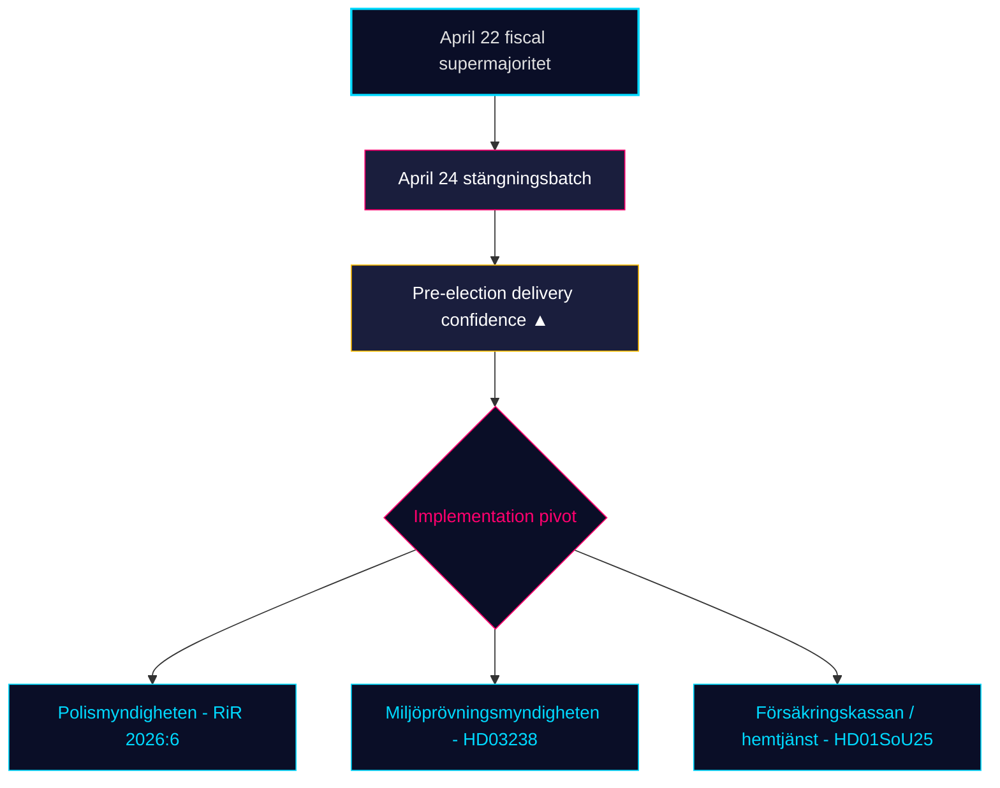

# 月次レビュー — 2026-04-25

**分類**: 公開 | **アナリスト**: James Pether Sörling | **日付**: 2026-04-25
**信頼レベル**: HIGH [A1] | **選挙まで**: ~141日 | **期間**: 2026-03-26 → 2026-04-25

---

## 要旨

スウェーデンの30日間の立法ウィンドウが閉じる。クリステルソン政権（M–SD–KD–L）は**選挙前の規制ポートフォリオを完成**させた。4月24日の委員会バッチ — **HD01JuU10（新銃器法）、HD01JuU31（警察改革フォローアップ）、HD01SoU25（高齢者ケア強化）、HD01CU24（建設プロセス効率化）** — は4月22日の財政的クライマックス（HD01FiU48燃料税減税、M+SD+S+KD超多数）の上に規制的終結を固めた [riksdagen.se]。医療と犯罪は引き続き支配的な*選挙上の*くさびであり、野党の質問活動（HD10448 風力デマ情報、HD11747 就労補助金、HD11749 拘禁児童の権利、HD11748 ブルンジでの領事保護）はS/V/MPが**規律ある三線ナラティブ**を展開していることを示す。一方**SDは4月24日の4つの委員会報告書に対して対抗動議を一件も提出せず** — 18連続議会日続いている構造的信頼シグナルだ。

---

## このブリーフィングが支持する3つの判断

### 判断1：選挙前納品信頼度評価

Tidö連立は4つのコア領域 — 財政（HD03100/HD0399）、エネルギー（HD03240/HD03238/HD03239）、安全保障/防衛（UFöU3/HD03214/HD03228）、刑事司法/福祉（HD01JuU10/HD01JuU31/HD01SoU25）— において**完全な2025/26宣言立法ポートフォリオ**を2026年9月選挙の141日以内に可決した。立法ではなく実施が今や拘束リスクだ。**勧告**: 監視を*実施可能性*（RiR 2026:6後のPolismyndigheten能力、Miljöprövningsmyndighetenの許可スループット、Försäkringskassanの高齢者ケア行政負荷）に転換せよ。

### 判断2：医療・犯罪くさび確率

野党は主要攻撃面で連立を*割ることに成功していない*：SfU18の39留保は一票も動かさなかった；SoU17 R15でのSD–KD医療分裂は封じ込められた。HD01JuU10銃器法とHD01JuU31警察改革監査はともにM+SD+KD+L一致で可決。**勧告**: 投資家や利害関係者は福祉/安全保障立法を*2026年9月まで継続*として扱うべきだ；野党のくさびレトリックは支配的だが立法反転確率は低い（≤ 25%）。

### 判断3：キャンペーン前の野党ナラティブ構造

4月に3つの野党くさびが結晶化した：（a）経済 — 燃料/中小企業病欠賃金（S、HD024082、HD10447）；（b）環境デマ情報 — HD10448；（c）拘禁者の権利 / 移民未成年者 / 領事保護（V/MP、HD11749、HD11748）。**勧告**: 夏後半のキャンペーンに備えるコミュニケーターはデマ情報フレーム（HD10448）がSD特有の連立ストレステストに拡大することを期待すべきだ；拘禁者フレーム（HD11749）は刑務所拡大後のVの主要攻撃ベクターだ。

---

## 60秒インテリジェンス読解

- 🔴 **4月24日委員会バッチが規制ポートフォリオを完結** — HD01JuU10 + HD01JuU31 + HD01SoU25 + HD01CU24 — 選挙前納品スケジュール通り
- 🔴 **4月22日の超多数** (HD01FiU48, M+SD+S+KD): 選挙141日前にSは41億SEKの燃料税減税に反対できなかった
- 🟠 **2015年警察改革監査 (RiR 2026:6 → HD01JuU31)** — kvardröjande lednings- och utredningsproblem；実施能力が新たな拘束リスク
- 🟠 **風力デマ情報質問 (HD10448)** — riksmötetにおけるエネルギー政策と情報整合性の初の明示的連結
- 🟢 **SDの規律が維持** — 閉会週に政府提案への動議ゼロ；信頼政党が構造的整合性を保持
- 🟡 **HD01SoU25 高齢者ケア強化** — 家族介護者戦略と在宅サービス能力要件がFörsäkringskassan/自治体に対する納品テストとなる
- 🟡 **外交政策の長い尾** — HD11748（ブルンジ領事事案）がV/MPの領事保護への焦点を人道的選挙争点としてシグナル
- 🟢 **住宅生産** — HD01CU24が処理時間を短縮；着工住宅数への効果はQ3 2026に測定可能（data.scb.se: BO0101）

---

## 最重要前向きシグナル

**監視**: 4月24日以降初のSOM研究所またはDemoskop世論調査。Sが4月22日の燃料税減税投票にもかかわらず見出し支持で28%超を回復すれば、Sの「象徴的反対 + 実践的支持」メッセージが圧力下で持ちこたえ、9月選挙は依然として構造的拮抗状態だ。Sが26%を下回れば、M+KD+Lブロックの選挙前ポジショニングが実証的に転換したことになる。**トリガー日**: 2026-05-08 ± 5日（次回Demoskop月次）。

---

## 信頼度分布

| 信頼レベル | 主要評価 | 根拠 |
|-----------|----------|------|
| 非常に高い | KJ-1（納品完了） | 8 dok_idsオンディスク + 13兄弟合成参照 |
| 高い | KJ-2（くさび有効性LOW）、KJ-3（実施ピボット） | 複数情報源（riksdagen.se投票記録、RiR 2026:6、兄弟インテリジェンス） |
| 中程度 | 前向き世論調査ダイナミクス | 単一情報源（demoskop / SOMラグ） |

<!-- source-sha: 91eb3cb6cf35873538b354461078df4509cf0012 -->
