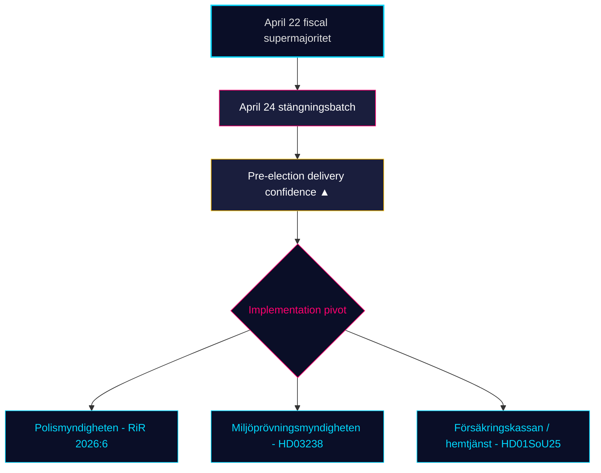

# 월간 리뷰 — 2026-04-25

**분류**: 공개 | **분석가**: James Pether Sörling | **날짜**: 2026-04-25
**신뢰 수준**: HIGH [A1] | **선거까지 일수**: ~141 | **기간**: 2026-03-26 → 2026-04-25

---

## 핵심 결론

스웨덴의 30일 입법 창이 닫히는 가운데 크리스터손 정부(M–SD–KD–L)가 **선거 전 규제 포트폴리오를 완성**하고 있다. 4월 24일 위원회 배치 — **HD01JuU10 (새 총기법), HD01JuU31 (경찰 개혁 후속 조치), HD01SoU25 (노인 돌봄 강화), HD01CU24 (건설 프로세스 효율화)** — 가 4월 22일의 재정적 절정(HD01FiU48 연료세 감면, M+SD+S+KD 초다수) 위에 규제적 마무리를 고정시켰다 [riksdagen.se]. 의료와 범죄는 여전히 지배적인 *선거적* 쐐기이며; 야당의 보충질문 흐름 (HD10448 풍력 허위정보, HD11747 고용 보조금, HD11749 구금 아동의 권리, HD11748 부룬디 영사 보호)은 S/V/MP가 **규율 있는 3중 트랙 서사**를 운영하고 있음을 보여준다. 반면 **SD는 4월 24일 4개 위원회 보고서에 대해 반대 발의를 한 건도 제출하지 않았다** — 18회 연속 의회일 동안 지속된 구조적 신뢰 신호다.

---

## 이 브리핑이 지원하는 3가지 결정

### 결정 1: 선거 전 납품 신뢰도 평가

Tidö 연립은 이제 4개 핵심 영역 — 재정(HD03100/HD0399), 에너지(HD03240/HD03238/HD03239), 안보/국방(UFöU3/HD03214/HD03228), 형사 사법/복지(HD01JuU10/HD01JuU31/HD01SoU25) — 에서 **완전한 2025/26 선언 입법 포트폴리오**를 2026년 9월 선거 141일 내에 통과시켰다. 입법이 아닌 이행이 이제 구속적 위험이다. **권고**: 모니터링을 *이행 실현 가능성* (RiR 2026:6 이후 Polismyndigheten 역량, Miljöprövningsmyndigheten 허가 처리량, Försäkringskassan의 노인 돌봄 행정 부하)으로 전환하라.

### 결정 2: 의료-범죄 쐐기 확률

야당은 주요 공격 면에서 연립을 *분열시키는 데 성공하지 못했다*: SfU18의 39개 유보는 단 한 표도 뒤집지 못했다; SoU17 R15의 SD–KD 의료 분열은 봉쇄됐다. HD01JuU10 총기법과 HD01JuU31 경찰 개혁 감사는 모두 M+SD+KD+L 단일성으로 통과됐다. **권고**: 투자자와 이해관계자들은 복지/안보 입법을 *2026년 9월까지 지속적*으로 처리해야 한다; 야당의 쐐기 수사는 지배적이지만 입법 역전 확률은 낮다 (≤ 25%).

### 결정 3: 캠페인 전 야당 서사 구조

4월에 세 가지 야당 쐐기가 결정화됐다: (a) 경제 — 연료/SME 병가급여 (S, HD024082, HD10447); (b) 환경 허위정보 — HD10448; (c) 구금자의 권리 / 이민 미성년자 / 영사 보호 (V/MP, HD11749, HD11748). **권고**: 늦여름 캠페인을 준비하는 커뮤니케이터들은 허위정보 프레임 (HD10448)이 특히 SD에 대한 연립 스트레스 테스트로 확대될 것을 예상해야 한다; 구금자 프레임 (HD11749)은 교도소 확장 이후 V의 주요 공격 벡터다.

---

## 60초 정보 브리핑

- 🔴 **4월 24일 위원회 배치가 규제 포트폴리오를 완결** — HD01JuU10 + HD01JuU31 + HD01SoU25 + HD01CU24 — 선거 전 납품 일정대로
- 🔴 **4월 22일 초다수** (HD01FiU48, M+SD+S+KD): S는 선거 141일 전에 41억 SEK 연료세 감면에 반대할 수 없었다
- 🟠 **2015년 경찰 개혁 감사 (RiR 2026:6 → HD01JuU31)** — kvardröjande lednings- och utredningsproblem; 이행 역량이 새로운 구속 위험
- 🟠 **풍력 허위정보 보충질문 (HD10448)** — riksmötet에서 에너지 정책과 정보 무결성의 첫 명시적 연결
- 🟢 **SD 규율 유지** — 마감 주간 정부 제안에 대한 발의 제로; 신뢰 정당이 구조적 무결성 유지
- 🟡 **HD01SoU25 노인 돌봄 강화** — 가족 돌봄 전략 및 가정 서비스 역량 요건이 Försäkringskassan/지자체 대상 납품 테스트가 됨
- 🟡 **외교 정책 긴 꼬리** — HD11748 (부룬디 영사 사례)는 V/MP의 영사 보호에 대한 초점을 인도주의적 선거 이슈로 신호
- 🟢 **주택 생산** — HD01CU24가 처리 시간 단축; 착공 주택에 대한 효과는 Q3 2026에 측정 가능 (data.scb.se: BO0101)

---

## 주요 전망 신호

**모니터링**: 4월 24일 이후 첫 SOM 연구소 또는 Demoskop 여론 조사. S가 4월 22일 연료세 감면 투표에도 불구하고 헤드라인 지지에서 28% 이상을 회복하면, S의 "상징적 반대 + 실질적 지지" 메시지가 압박 아래 유지된 것이며 9월 선거는 여전히 구조적 박빙이다. S가 26%에 미치지 못하면 M+KD+L 블록의 선거 전 포지셔닝이 실증적으로 전환됐다. **트리거 날짜**: 2026-05-08 ± 5일 (다음 월간 Demoskop).

---

## 신뢰도 분포

| 신뢰 수준 | 핵심 평가 | 근거 |
|-----------|-----------|------|
| 매우 높음 | KJ-1 (납품 완료) | 8 dok_ids 디스크 + 13 자매 합성 참조 |
| 높음 | KJ-2 (쐐기 효과 낮음), KJ-3 (이행 피벗) | 다중 소스 (riksdagen.se 투표 기록, RiR 2026:6, 자매 정보) |
| 중간 | 전향적 여론 조사 다이내믹스 | 단일 소스 (demoskop / SOM 지연) |

<!-- source-sha: 91eb3cb6cf35873538b354461078df4509cf0012 -->
