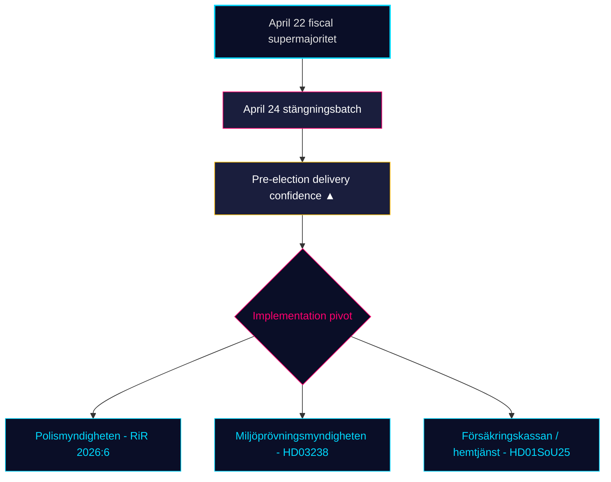

# Maandelijkse beoordeling — 2026-04-25

**Classificatie**: PUBLIC | **Analist**: James Pether Sörling | **Datum**: 2026-04-25
**Betrouwbaarheidsniveau**: HIGH [A1] | **Dagen tot verkiezingen**: ~141 | **Venster**: 2026-03-26 → 2026-04-25

---

## BLUF

Het 30-daagse wetgevingsvenster van Zweden sluit terwijl de regering-Kristersson (M–SD–KD–L) haar **pre-verkiezingsregulatorische portefeuille voltooit**. Het comitébatch van 24 april — **HD01JuU10 (nieuwe vuurwapenwet), HD01JuU31 (follow-up politiereform), HD01SoU25 (versterking ouderenzorg), HD01CU24 (efficiëntie bouwprocessen)** — sluit de regulatoire afsluiting bovenop het financiële hoogtepunt van 22 april (HD01FiU48 brandstofbelastingverlichting, M+SD+S+KD supermeerderheid) [riksdagen.se]. Gezondheidszorg en criminaliteit blijven de dominerende *electorale* wiggen; het interpellatie-verkeer van de oppositie (HD10448 windkracht-desinformatie, HD11747 arbeidsmarktsubsidies, HD11749 rechten van gedetineerde kinderen, HD11748 consulaire bescherming in Burundi) toont S/V/MP met een **gedisciplineerd drie-sporen narratief** terwijl **SD nul tegenmotions** heeft ingediend tegen de vier commissierapporten van 24 april — een structureel vertrouwenssignaal dat nu al 18 opeenvolgende vergaderdagen standhoudt.

---

## 3 beslissingen die dit briefing ondersteunt

### Beslissing 1: Beoordelingsvertrouwen pre-verkiezingsleveringen

De Tidö-coalitie heeft nu haar **volledig verklaarde 2025/26 wetgevingsportefeuille** goedgekeurd in de vier kerndomeinen — fiscaal (HD03100/HD0399), energie (HD03240/HD03238/HD03239), veiligheid/defensie (UFöU3/HD03214/HD03228) en strafrecht/welzijn (HD01JuU10/HD01JuU31/HD01SoU25) — binnen 141 dagen vóór de verkiezingen van september 2026. Implementatie, niet wetgeving, is nu het bindende risico. **Aanbeveling**: verschuif monitoring naar *implementatie-haalbaarheid* (capaciteit Polismyndigheten na RiR 2026:6, vergunningsdoorvoer Miljöprövningsmyndigheten, administratieve belasting Försäkringskassan voor ouderenzorg).

### Beslissing 2: Gezondheidszorg-en-criminaliteit wigkansen

De oppositie heeft er *niet* in geslaagd de coalitie te splijten op haar primaire aanvalsvlakken: de 39 voorbehouden van SfU18 keerden geen enkele stem om; de SD–KD gezondheidszorgsplitsing op SoU17 R15 werd ingedamd. De vuurwapenwet HD01JuU10 en de politiereformaudit HD01JuU31 worden beiden aangenomen met M+SD+KD+L-eenheid. **Aanbeveling**: investeerders en stakeholders moeten de welzijns-/veiligheidswetgeving behandelen als *duurzaam tot september 2026*; de wigretoriek van de oppositie domineert maar de kans op wetgevingsomkering is LAAG (≤ 25 %).

### Beslissing 3: Narratiefarchitectuur oppositie voor campagne

Drie oppositiewiggen kristalliseerden in april: (a) economisch — brandstof/MKB-ziektegeld (S, HD024082, HD10447); (b) milieu-desinformatie — HD10448; (c) rechten van gedetineerden / migrantenminderjarigen / consulaire bescherming (V/MP, HD11749, HD11748). **Aanbeveling**: communicatoren die zich voorbereiden op de zomercampagne moeten verwachten dat het desinformatieskader (HD10448) uitbreidt tot een coalitie-stresstest specifiek voor SD; het kader van de gedetineerden (HD11749) is V's primaire aanvalsvector na de gevangenisuitbreiding.

---

## 60-seconden overzicht

- 🔴 **Comitébatch van 24 april sluit regulatoire portefeuille** — HD01JuU10 + HD01JuU31 + HD01SoU25 + HD01CU24 — pre-verkiezingsleveringen op schema
- 🔴 **Supermeerderheid van 22 april** (HD01FiU48, M+SD+S+KD): S kon 4,1 miljard SEK brandstofbelastingverlichting 141 dagen voor de verkiezingen niet afwijzen
- 🟠 **Politiereform 2015-audit (RiR 2026:6 → HD01JuU31)** — kvardröjande lednings- och utredningsproblem; implementatiecapaciteit is het nieuwe bindende risico
- 🟠 **Windkracht-desinformatie-interpellatie (HD10448)** — eerste expliciete koppeling van energiebeleid en informatie-integriteit in het riksmötet
- 🟢 **SD-discipline houdt stand** — nul motions tegen regeringsproposities in de sluitingsweek; vertrouwenspartij behoudt structurele integriteit
- 🟡 **HD01SoU25 versterking ouderenzorg** — mantelzorgstrategie en thuis zorg-competentievereisten worden leveringstest tegen Försäkringskassan/gemeenten
- 🟡 **Buitenlands beleid lange staart** — HD11748 (Burundi consulaire zaak) signaleert V/MP-focus op consulaire bescherming als humanitaire verkiezingskwestie
- 🟢 **Woningbouw** — HD01CU24 verkort behandelingstijden; effect op begonnen woningen meetbaar Q3 2026 (data.scb.se: BO0101)

---

## Belangrijkste vooruitzichtssignaal

**Monitoren**: Eerste post-24 april SOM-Instituut of Demoskop opiniepeiling. Als S > 28 % van de steun in headlines terugwint ondanks de brandstofbelastingstemming van 22 april, heeft S's boodschap "symbolische oppositie + praktische steun" stand gehouden onder druk en blijven de septemberverkiezingen een structurele toss-up. Als S onder 26 % ligt, heeft de pre-verkiezingspositionering van het M+KD+L-blok aanwijsbaar geconverteerd. **Triggerdatum**: 2026-05-08 ± 5 dagen (volgende maandelijkse Demoskop).

---

## Betrouwbaarheidsverdeling

| Betrouwbaarheidsniveau | Sleutelevaluaties | Grondslag |
|------------------------|-------------------|-----------|
| ZEER HOOG | KJ-1 (leveringsafronding) | 8 dok_ids op schijf + 13 zuster-synthese-referenties |
| HOOG | KJ-2 (wigeffectiviteit LAAG), KJ-3 (implementatiepivot) | Multibron (riksdagen.se stemprotocollen, RiR 2026:6, zuster-inlichtingen) |
| MEDIUM | Toekomstgerichte peilingsdynamiek | Enkelbron (demoskop / SOM-vertraging) |

<!-- source-sha: 91eb3cb6cf35873538b354461078df4509cf0012 -->
