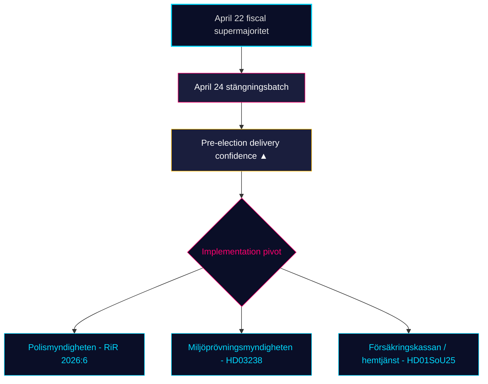

# Månedlig gjennomgang — 2026-04-25

**Klassifisering**: PUBLIC | **Analytiker**: James Pether Sörling | **Dato**: 2026-04-25
**Konfidensnivå**: HIGH [A1] | **Dager til valg**: ~141 | **Vindu**: 2026-03-26 → 2026-04-25

---

## Konklusjon

Sveriges 30-dagers lovgivningsvindu lukker med at Kristerssonregjeringen (M–SD–KD–L) **fullfører sitt pre-valgregulatoriske portefølje**. April 24-utvalgsbatchen — **HD01JuU10 (ny våpenlov), HD01JuU31 (politireformoppfølging), HD01SoU25 (styrket eldretjeneste), HD01CU24 (effektivitet i byggeprosesser)** — lukker det regulatoriske avslutningen oppå det finansielle klimakset 22. april (HD01FiU48 drivstoffavgiftsreduktion, M+SD+S+KD supermajoritet) [riksdagen.se]. Helse og kriminalitet er fortsatt de dominerende *valgmessige* kilene; opposisjonens interpellasjonstrafikk (HD10448 vindkraft-desinformasjon, HD11747 arbeidsmiljøstønad, HD11749 frihetsberøvede barns rettigheter, HD11748 konsulær beskyttelse i Burundi) viser S/V/MP kjøre et **disiplinert tre-spors narrativ** mens **SD har innlevert null mot-motioner** mot de fire april 24-utvalgsrapportene — et strukturelt tillitssignal som nå har vedvart i 18 påfølgende sitdager.

---

## 3 beslutninger dette briefingen støtter

### Beslutning 1: Pre-valgs leveringstillit vurdering

Tidö-koalisjonen har nå vedtatt sin **fullstendige erklærte 2025/26 lovgivningsportefølje** innen de fire kjerneområdene — finanspolitisk (HD03100/HD0399), energi (HD03240/HD03238/HD03239), sikkerhet/forsvar (UFöU3/HD03214/HD03228) og strafferettslig rettferdighet/velferd (HD01JuU10/HD01JuU31/HD01SoU25) — innen 141 dager fra september 2026-valget. Implementering, ikke lovgivning, er nå den bindende risikoen. **Anbefaling**: flytt overvåkning til *implementeringsgjenomførbarhet* (Polismyndighetens kapasitet etter RiR 2026:6, Miljöprövningsmyndighetens tillatelsesgjennomstrøm, Försäkringskassans administrative belastning for eldretjeneste).

### Beslutning 2: Helse-og-kriminalitets kilesannsynlighet

Opposisjonen har *ikke* lykkes med å splitte koalisjonen på sine primære angrepsflatene: SfU18s 39 reservasjoner snudde ikke en eneste stemme; SD–KD helsesplit på SoU17 R15 ble begrenset. HD01JuU10 våpenlov og HD01JuU31 politireformsrevisjonen vedtas begge med M+SD+KD+L-enighet. **Anbefaling**: investorer og interessenter bør behandle velferd/sikkerhetslovgivningen som *holdbar frem til september 2026*; opposisjonens kilerettorikk dominerer men lovgivningsreverseringssannsynlighet er LAV (≤ 25 %).

### Beslutning 3: Pre-kampanje opposisjonens narrativarkitektur

Tre opposisjonskilene krystalliserte i april: (a) økonomisk — drivstoff/SME-sykepenger (S, HD024082, HD10447); (b) miljø-desinformasjon — HD10448; (c) frihetsberøvedes rettigheter / migrantmindreårige / konsulær beskyttelse (V/MP, HD11749, HD11748). **Anbefaling**: kommunikatører som forbereder seg til sensommerkampanjen bør forvente at desinformasjonsrammen (HD10448) utvides til en koalisjonstest spesifikt for SD; rammen om frihetsberøvede (HD11749) er Vs primære angrepsvektori etter fengselsutvidelsen.

---

## 60-sekunders lesing

- 🔴 **April 24-utvalgsbatchen lukker regulatorisk portefølje** — HD01JuU10 + HD01JuU31 + HD01SoU25 + HD01CU24 — pre-valgslevering i rute
- 🔴 **Supermajoritet 22. april** (HD01FiU48, M+SD+S+KD): S kunne ikke motsette seg 4,1 mrd. SEK drivstoffavgiftsreduktion 141 dager før valget
- 🟠 **Politireformen 2015-revisjon (RiR 2026:6 → HD01JuU31)** — kvardröjande lednings- og utredningsproblem; implementeringskapasitet er den nye bindende risikoen
- 🟠 **Vindkraft-desinformasjonsinterpellasjon (HD10448)** — første eksplisitte kobling av energipolitikk og informasjonsintegritet i riksmötet
- 🟢 **SD-disiplin holder** — null motioner mot regjeringsproposisjoner i lukkeuken; tillitspartiet beholder strukturell integritet
- 🟡 **HD01SoU25 styrket eldretjeneste** — anhørigstrategi og hjemmetjenestekompetansekrav blir leveringstest mot Försäkringskassan/kommuner
- 🟡 **Utenrikspolitisk hale** — HD11748 (Burundi-konsulærsaken) signalerer V/MP-fokus på konsulær beskyttelse som humanitært valgtema
- 🟢 **Boligproduksjon** — HD01CU24 forkorter saksbehandlingstider; effekt på påbegynte boliger målbar Q3 2026 (data.scb.se: BO0101)

---

## Viktigste fremoverpekende signal

**Overvåk**: Første post-24. april SOM-institutet eller Demoskop meningsmåling. Hvis S gjenvinner > 28 % i overskriftsstøtte til tross for drivstoffavgiftsavstemningen 22. april, har S's "symbolsk opposisjon + praktisk støtte"-budskap holdt under press, og septembervalget forblir et strukturelt kastkast. Hvis S halter under 26 %, har M+KD+L-blokkens pre-valgsposisjonering demonstrert konvertering. **Utløserdato**: 2026-05-08 ± 5 dager (neste Demoskop månedlig).

---

## Konfidensdistribusjon

| Konfidensnivå | Nøkkelvurderinger | Grunnlag |
|---------------|-------------------|---------|
| SVÆRT HØY | KJ-1 (leveringsfullføring) | 8 dok_id-er på disk + 13 søskensyntesereferanser |
| HØY | KJ-2 (kileeffektivitet LAV), KJ-3 (implementeringsfokus) | Flerkildigt (riksdagen.se stemmeprotokoller, RiR 2026:6, søskenetterretning) |
| MIDDELS | Fremoverblikkende meningsmålingsdynamikk | Enkeltkildet (demoskop / SOM-forsinkelse) |

<!-- source-sha: 91eb3cb6cf35873538b354461078df4509cf0012 -->
