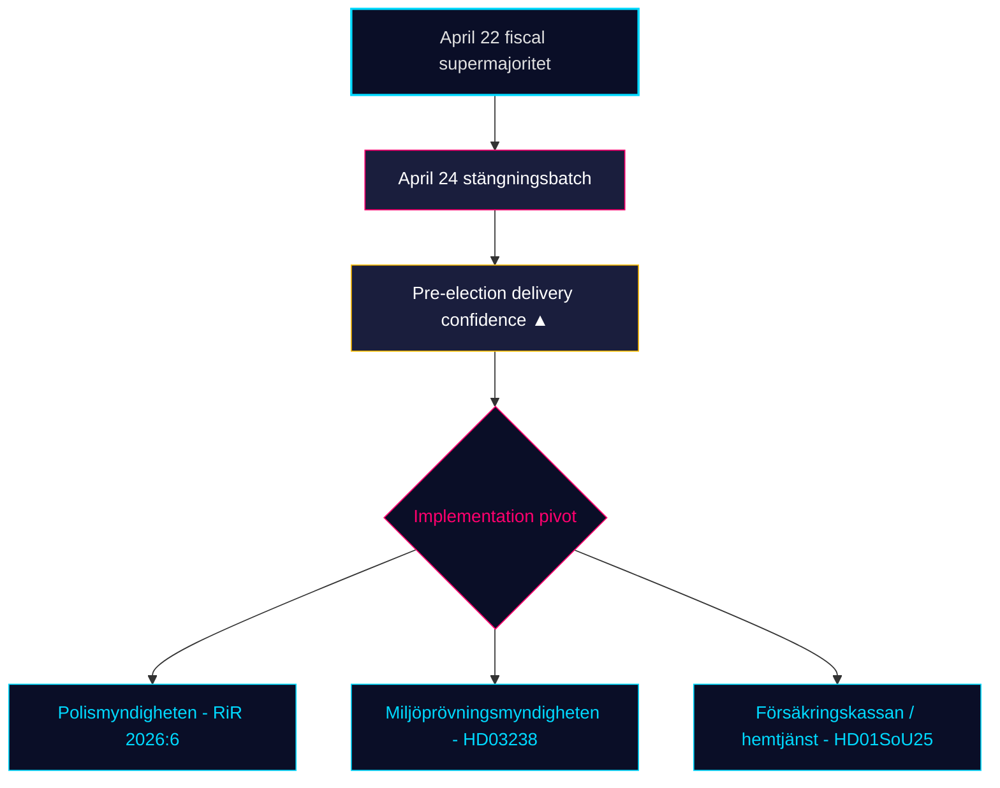

# Verksamhetsöversikt — Månadsrapport 2026-04-25

**Klassificering**: PUBLIC | **Analytiker**: James Pether Sörling | **Datum**: 2026-04-25
**Konfidensgrad**: HIGH [A1] | **Dagar till val**: ~141 | **Period**: 2026-03-26 → 2026-04-25

---

## Slutsats

Sveriges 30-dagarsfönster för lagstiftning avslutas med att Kristerssonregeringen (M–SD–KD–L) **fullföljer sitt regulatoriska pre-valportfölio**. April 24-utskottsgruppen — **HD01JuU10 (ny vapenlags), HD01JuU31 (uppföljning polisreform), HD01SoU25 (stärkt äldreomsorg), HD01CU24 (effektivare byggprocesser)** — låser det regulatoriska avslutningen ovanpå det finansiella klimaxet 22 april (HD01FiU48 drivmedelsskattereduktion, M+SD+S+KD supermajoritet) [riksdagen.se]. Hälso- och sjukvård och brottslighet är fortfarande de dominerande *valrörelsefrågorna*; oppositionens interpellationstrafik (HD10448 vindkraftdesinformation, HD11747 arbetsmarknadsstöd, HD11749 frihetsberövade barns rättigheter, HD11748 konsulärt skydd i Burundi) visar att S/V/MP driver ett **disciplinerat tredubbelt narrativ** medan **SD inte har lämnat in noll motmotioner** mot de fyra utskottsrapporterna från 24 april — ett strukturellt förtroendesignal som nu har hållit i 18 på varandra följande sittningsdagar.

---

## 3 beslut som detta underlag stöder

### Beslut 1: Bedömning av pre-valsliveransen

Tidökoalitionen har nu antagit sin **fullständiga deklarerade 2025/26 lagstiftningsportfölj** inom de fyra kärndimensionerna — finansiell (HD03100/HD0399), energi (HD03240/HD03238/HD03239), säkerhet/försvar (UFöU3/HD03214/HD03228) och brottslig rättvisa/välfärd (HD01JuU10/HD01JuU31/HD01SoU25) — inom 141 dagar från valet i september 2026. Implementering, inte lagstiftning, är nu den bindande risken. **Rekommendation**: flytta övervakning till *implementeringsgenomförbarhet* (Polismyndighetens kapacitet efter RiR 2026:6, Miljöprövningsmyndighetens tillståndsgenomflöde, Försäkringskassans administrativa belastning för äldreomsorg).

### Beslut 2: Sannolikhet för hälso- och brottspolitiska kilar

Oppositionen har *inte* lyckats spräcka koalitionen på dess primära attackytor: SfU18:s 39 reservationer vände inte en enda röst; SD–KD hälso- och sjukvårdssplit på SoU17 R15 begränsades. HD01JuU10 vapenlags och HD01JuU31 polisreformsrevision godkänns båda med M+SD+KD+L-enighet. **Rekommendation**: investerare och intressenter bör behandla välfärds-/säkerhetslagstiftningen som *varaktig till september 2026*; oppositionens kilrhetorik dominerar men sannolikheten för lagstiftningsomvändning är LÅG (≤ 25 %).

### Beslut 3: Oppositionens narrativarkitektur inför valkampanjen

Tre oppositionskilar kristalliserades i april: (a) ekonomisk — drivmedel/SME-sjuklön (S, HD024082, HD10447); (b) miljödesinformation — HD10448; (c) frihetsberövades rättigheter / migrantminderåriga / konsulärt skydd (V/MP, HD11749, HD11748). **Rekommendation**: kommunikatörer som förbereder sig för den sensommarliga kampanjen bör förvänta sig att desinformationsramverket (HD10448) expanderar till ett koalitionsstresstest specifikt för SD; frihetsberövaderamverket (HD11749) är V:s primära angreppsvektor efter fängelseutvidgningen.

---

## 60-sekunders läsning

- 🔴 **April 24-utskottgruppen stänger regulatorisk portfölj** — HD01JuU10 + HD01JuU31 + HD01SoU25 + HD01CU24 — pre-valsleverans enligt schema
- 🔴 **Supermajoritet 22 april** (HD01FiU48, M+SD+S+KD): S kunde inte motsätta sig 4,1 Mdr SEK drivmedelsskattereduktion 141 dagar före valet
- 🟠 **Polisreformen 2015-revision (RiR 2026:6 → HD01JuU31)** — kvardröjande lednings- och utredningsproblem; implementeringskapacitet är den nya bindande risken
- 🟠 **Vindkraftdesinformationsinterpellation (HD10448)** — första explicita kopplingen av energipolitik och informationsintegritet i riksmötet
- 🟢 **SD-disciplin håller** — noll motioner mot regeringspropositioner under stängningsveckan; konfidenspartiet behåller strukturell integritet
- 🟡 **HD01SoU25 stärkt äldreomsorg** — anhörigstrategi och hemtjänstkompetenskrav blir leveranstest mot Försäkringskassan/kommuner
- 🟡 **Utrikespolitisk svans** — HD11748 (Burundikonsulärt fall) signalerar V/MP-fokus på konsulärt skydd som humanitär valfråga
- 🟢 **Bostadsproduktion** — HD01CU24 kortar handläggningstider; effekt på påbörjade bostäder mätbar Q3 2026 (data.scb.se: BO0101)

---

## Viktigaste framåtsignal

**Bevaka**: Första post-24 april SOM-institutet eller Demoskops opinionsundersökning. Om S återtar > 28 % i stödmätning trots omröstningen om drivmedelsskattereduktionen 22 april, har S:s "symbolisk opposition + praktisk support"-budskap hållit under stress och valet i september förblir ett strukturellt kasst-upp. Om S hamnar under 26 %, har M+KD+L-blockets pre-valpositionering demonstrerat konvertering. **Utlösardatum**: 2026-05-08 ± 5 dagar (nästa Demoskop månadsvis).

---

## Konfidensfördelning

| Konfidensgrad | Nyckelbedömningar | Underlag |
|---------------|-------------------|----------|
| MYCKET HÖG | KJ-1 (leveransgenomförande) | 8 dok_id:n på disk + 13 syskonsyntesreferenser |
| HÖG | KJ-2 (kileffektivitet LÅG), KJ-3 (implementeringsfokus) | Flerakälliga (riksdagen.se röstprotokoll, RiR 2026:6, syskonintelligens) |
| MEDEL | Framåtblickande undersökningsdynamik | Enkälliga (demoskop / SOM-fördröjning) |

<!-- source-sha: 91eb3cb6cf35873538b354461078df4509cf0012 -->
