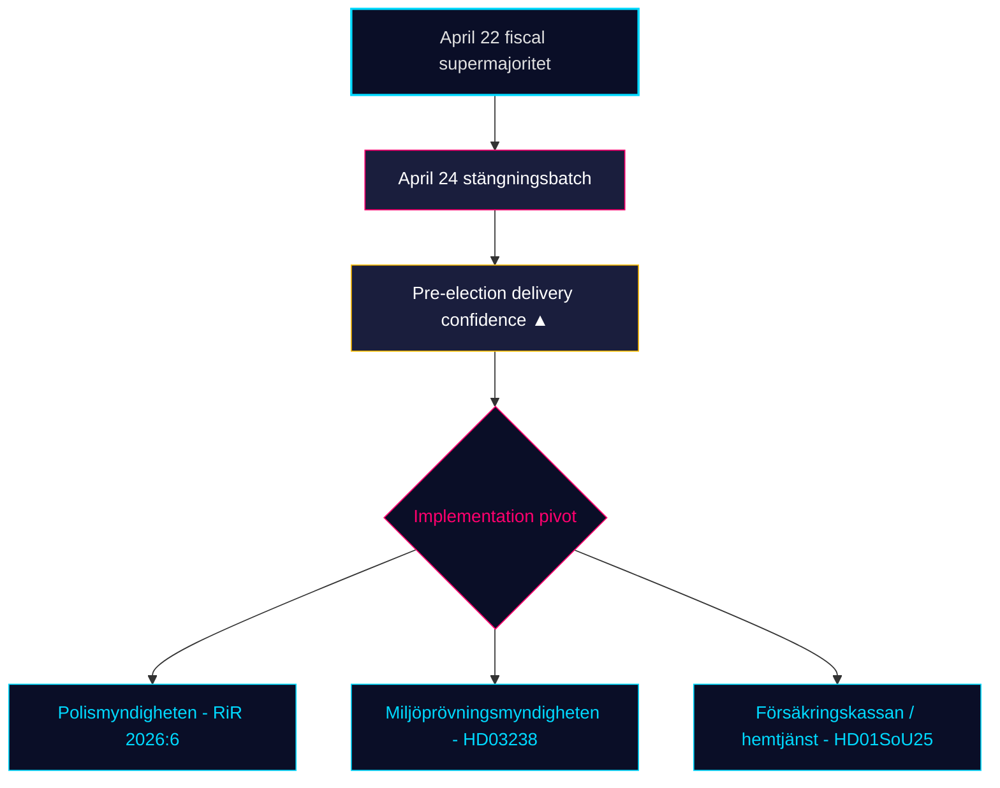

# 月度回顾 — 2026-04-25

**分类**: 公开 | **分析师**: James Pether Sörling | **日期**: 2026-04-25
**置信度**: HIGH [A1] | **距选举天数**: ~141 | **报告期**: 2026-03-26 → 2026-04-25

---

## 核心结论

在瑞典30天立法窗口即将关闭之际，克里斯特松政府（M–SD–KD–L）正在完成**选前监管组合**的收尾工作。4月24日委员会批次——**HD01JuU10（新枪支法）、HD01JuU31（警察改革后续）、HD01SoU25（老年照护强化）、HD01CU24（建设流程简化）**——在4月22日财政高潮（HD01FiU48燃油税减免，M+SD+S+KD超级多数）之上叠加了监管性收官 [riksdagen.se]。医疗与犯罪仍是主要的*选举楔形议题*；反对党的跟进质询流（HD10448风电虚假信息、HD11747就业补贴、HD11749被拘留儿童权利、HD11748布隆迪领事保护）表明S/V/MP正在推进**有纪律的三轨叙事**。与此同时，**SD在4月24日四份委员会报告中零反对动议**——这一结构性信任信号已持续18个连续议会日。

---

## 本简报支持的三项决策

### 决策1：选前交付可信度评估

蒂道联合政府现已在四个核心领域——财政（HD03100/HD0399）、能源（HD03240/HD03238/HD03239）、安全/国防（UFöU3/HD03214/HD03228）、刑事司法/福利（HD01JuU10/HD01JuU31/HD01SoU25）——在2026年9月选举前141天内通过了**完整的2025/26年宣言立法组合**。执行而非立法现在是约束性风险。**建议**：将监测重心转向*执行可行性*（RiR 2026:6后警察局能力、环境审查局许可处理量、Försäkringskassan的老年照护行政负荷）。

### 决策2：医疗-犯罪楔形概率

反对党在核心攻击面上未能*分裂*联合政府：SfU18的39项保留意见未能翻转任何一票；SoU17 R15的SD–KD医疗分歧被封堵。HD01JuU10枪支法和HD01JuU31警察改革审计均以M+SD+KD+L一致性通过。**建议**：投资者和利益相关方应*持续*处理福利/安全立法至2026年9月；反对党楔形叙事占主导，但立法逆转概率较低（≤ 25%）。

### 决策3：竞选前反对党叙事结构

四月间三个反对党楔形逐渐成形：(a)经济——燃油/中小企业病假补贴（S，HD024082，HD10447）；(b)环境虚假信息——HD10448；(c)被拘留者权利/移民未成年人/领事保护（V/MP，HD11749，HD11748）。**建议**：为晚夏竞选备战的传播者应预判虚假信息框架（HD10448）会被扩大为对SD的联合政府压力测试；被拘留者框架（HD11749）在监狱扩建后是V的主要攻击向量。

---

## 60秒情报简报

- 🔴 **4月24日委员会批次完成监管组合** — HD01JuU10 + HD01JuU31 + HD01SoU25 + HD01CU24 — 按选前交付时间表执行
- 🔴 **4月22日超级多数**（HD01FiU48，M+SD+S+KD）：S在距选举141天时无法反对410亿SEK燃油税减免
- 🟠 **2015年警察改革审计（RiR 2026:6 → HD01JuU31）** — 残存的领导和调查问题；执行能力是新的约束性风险
- 🟠 **风电虚假信息跟进质询（HD10448）** — riksmötet中能源政策与信息完整性的首次明确关联
- 🟢 **SD纪律维持** — 截止周对政府提案零动议；信任政党保持结构性完整
- 🟡 **HD01SoU25老年照护强化** — 家庭照护战略和家政服务能力要求成为Försäkringskassan/市政交付测试
- 🟡 **外交政策长尾** — HD11748（布隆迪领事案）将V/MP对领事保护的关注定为人道主义选举议题
- 🟢 **住房生产** — HD01CU24缩短处理时间；对新开工住房的效果可在Q3 2026测量（data.scb.se：BO0101）

---

## 主要前瞻信号

**监测指标**：4月24日后首次SOM研究所或Demoskop民调。若S在4月22日燃油税减免投票后仍能在头条支持率中维持28%以上，则S的"象征性反对+实质支持"信息在压力下得以维持，9月选举仍是结构性胶着。若S跌至26%以下，则M+KD+L选举前定位发生了实证性转变。**触发日期**：2026-05-08 ± 5天（下一次月度Demoskop）。

---

## 置信度分布

| 置信度 | 核心判断 | 依据 |
|--------|----------|------|
| 非常高 | KJ-1（交付完成） | 8个dok_id落盘 + 13个姊妹综合参考 |
| 高 | KJ-2（楔形效果低）、KJ-3（执行转向） | 多源（riksdagen.se投票记录、RiR 2026:6、姊妹情报） |
| 中 | 前瞻性民调动态 | 单一来源（Demoskop/SOM时滞） |

<!-- source-sha: 91eb3cb6cf35873538b354461078df4509cf0012 -->
