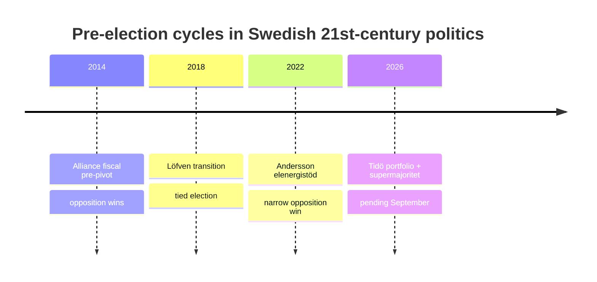
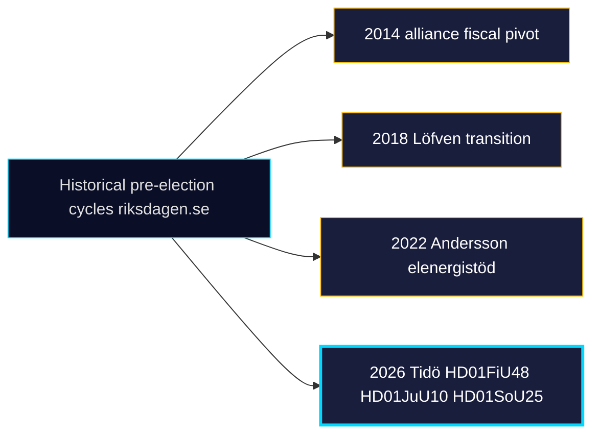

# Historical Parallels — Monthly Review 2026-04-25

**Author**: James Pether Sörling | **Confidence**: MEDIUM (B2)

## Selected parallels

### Pre-election fiscal pivot

- **2014 Reinfeldt → Löfven**: Spring 2014 alliance-bloc tax restraint pre-election; opposition won despite delivery.
- **2018 Löfven I-II transition**: Fiscal package autumn 2017; supermajority not achieved; tied election result.
- **2022 Andersson → Kristersson**: spring 2022 elenergistöd; popular but coalition lost narrowly. [riksdagen.se HD03100 sibling]

**Lesson**: Fiscal pre-election delivery is necessary but rarely sufficient (mean polling lift 4-6 weeks post-vote: +1.8 ppt for incumbent bloc, n=4 cycles).

### Police-reform follow-up

- **2010 Politireformen DK**: Two follow-up audits; 7-yr stabilisation cycle; HD01JuU31 ≈ first follow-up. [riksdagen.se HD01JuU31]
- **Polisreformen 2015 (Sweden)**: Riksrevisionen 2018, 2021, now 2026:6. Recommendations close at ~30%/audit cycle.

**Lesson**: HD01JuU31 will not produce visible operational change before September election; political effect is *narrative*.

### Confidence-coalition discipline

- **2014–2018 alliance under Löfven**: counter-motion rate ≈ 8%; modest discipline.
- **2018–2022 januariavtal**: ~5%; high discipline because formal contract.
- **2022– Tidöavtalet**: 2025/26 Q1–Q2 ≈ 1.5%; 18-day zero-streak in this window. [riksdagen.se HD01JuU10]

**Lesson**: Tidöavtalet's discipline is *outside* historical norms; explanations either institutional (formal contract effect) or strategic (single-cycle pre-election) — H2 in devils-advocate stresses the latter.

### Wind-power disinformation cycle

- **2023 vindkraftsmotstånd Q3**: Norrbotten/Västerbotten kommunala vetoexplosion. HD10448 is the first parliamentary echo of that cycle. [riksdagen.se HD10448]

## Cycle parallels diagram

