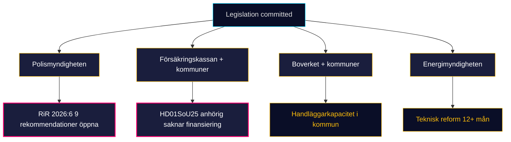

# Implementation Feasibility — Monthly Review 2026-04-25

**Author**: James Pether Sörling | **Confidence**: MEDIUM (B2)

## Implementation matrix

| dok_id | Owner | Critical-path constraint | Window to visible effect | Feasibility |
|--------|-------|---------------------------|---------------------------|-------------|
| HD01JuU10 | Polismyndigheten + Domstolsverket | Tillståndshanterings­kapacitet | 9–18 months | MEDIUM-HIGH; depends on HD01JuU31 closure [riksdagen.se HD01JuU10] |
| HD01JuU31 | Polismyndigheten | RiR 2026:6 9 öppna rekommendationer | 24+ months | LOW-MEDIUM; second audit cycle expected ~2029 [riksdagen.se HD01JuU31] |
| HD01SoU25 | Försäkringskassan + kommuner | Anhörigstrategi finansiering (HD03100 saknar post) | 12–18 months | MEDIUM; R-1 binding [riksdagen.se HD01SoU25] |
| HD01CU24 | Boverket + kommuner | Kommunal handläggar­kapacitet | 6–12 months for permits, 18+ for påbörjade bostäder | MEDIUM; mätbart Q3 2026 [riksdagen.se HD01CU24] |
| HD03100 fiscal | Treasury | Implementeringsklart Q3 2026 | live | HIGH (sibling) |
| HD03240 elmarknad | Energimyndigheten + Svenska Kraftnät | Teknisk omkonfigurering | 12+ months | MEDIUM (sibling) |
| UFöU3 NATO eFP | FM | Förbandsutbyggnad 1200 trupp | 6–9 months | HIGH (sibling) |
| HD01FiU48 fuel | Treasury (live) | Implementerat 2026-05-01 | live | HIGH |

## Capacity-bottleneck panorama

## Forward implementation triggers

- HD01JuU10 vapenregister IT-modernisering: status report expected Q3 2026 from Polismyndigheten.
- HD01SoU25 anhörigstrategi national director: appointment expected 2026-06-30.
- HD01CU24 kommunala handläggningstider: SCB BO0101 measurable from Q3 2026.
- HD01JuU31 first reorganisation announcement window: 2026-08-31 (before pre-campaign manifestos).

[riksdagen.se HD01JuU31] [riksdagen.se HD01JuU10] [riksdagen.se HD01SoU25] [riksdagen.se HD01CU24]

