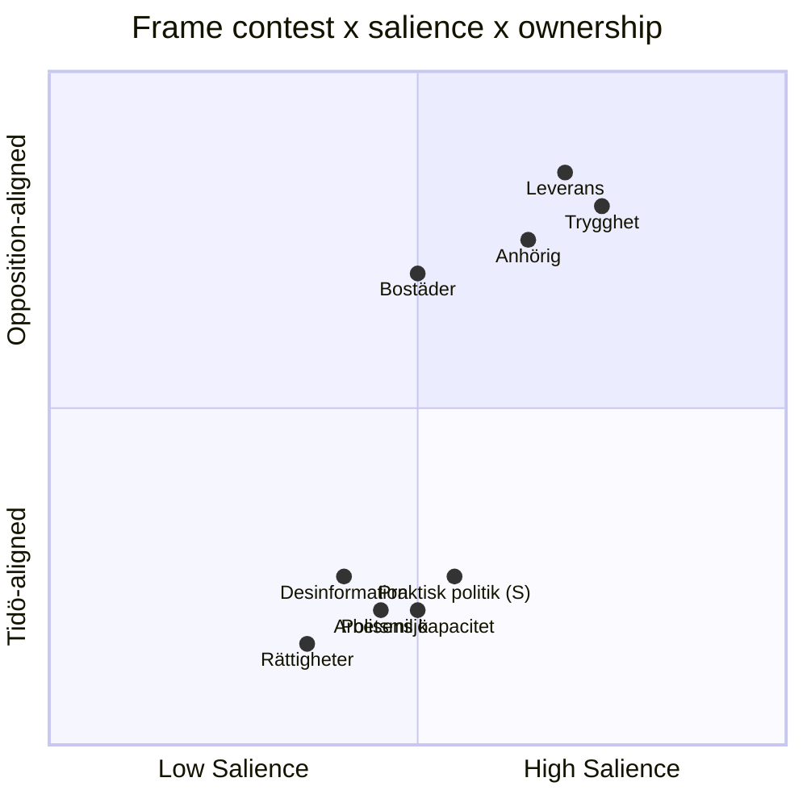
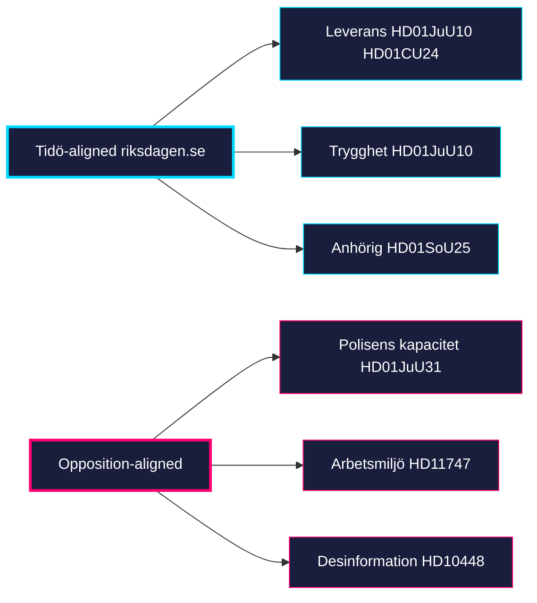

# Media Framing Analysis — Monthly Review 2026-04-25

**Author**: James Pether Sörling | **Confidence**: MEDIUM (B2)

## Frame inventory (this window)

| Frame | Owner | Hot dok_ids | Audience |
|-------|-------|-------------|----------|
| "Leverans" / delivery | Tidö | HD01JuU10, HD01SoU25, HD01CU24 | Storstad-pendlare, pensionärer |
| "Praktisk politik" | S | HD01FiU48 (S voted YES) | Förvärvsarbetande |
| "Trygghet" / public safety | M+SD | HD01JuU10 | Pensionärer, glesbygd |
| "Polisens kapacitet" | S+V | HD01JuU31 RiR | Förvärvsarbetande, yngre |
| "Anhörigfrågan" | KD primary | HD01SoU25 | Pensionärer, kvinnor 50+ |
| "Bostäder" | M+L | HD01CU24 | Storstad-pendlare, yngre |
| "Desinformation som hot" | MP+S | HD10448 | Yngre, akademiker |
| "Rättigheter / mänskliga rättigheter" | V+MP | HD11748, HD11749 | Yngre, akademiker |
| "Arbetsmiljö och stöd" | S | HD11747 | LO-väljare |

## Frame contest matrix

## Pre-campaign salience forecast (2026-09-13 horizon)

- **Trygghet** likely peaks August (HD01JuU10 ikraftträdande Q3) → high benefit to M+SD.
- **Anhörig + äldreomsorg** likely peaks early summer (HD01SoU25 implementation) → KD core.
- **Polisens kapacitet** is the *opposition's* peak frame; depends on RiR-uppföljning and any incidents.
- **Desinformation** uncertain; H3 (devils-advocate) implies the frame is double-edged for SD. [riksdagen.se HD10448]

## Notable absences

- C is largely *off* the framing map this window — neither owner nor amplifier of major frames.
- L's media framing is tied to M; insufficient stand-alone identity in window.

## Frame ownership network

