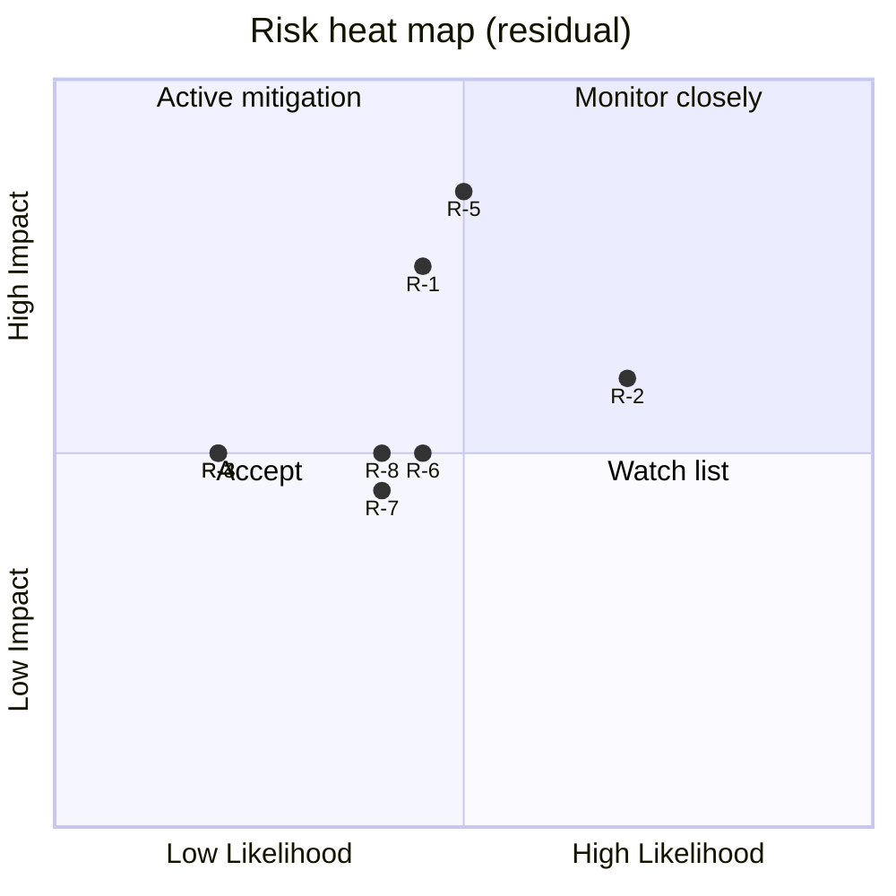
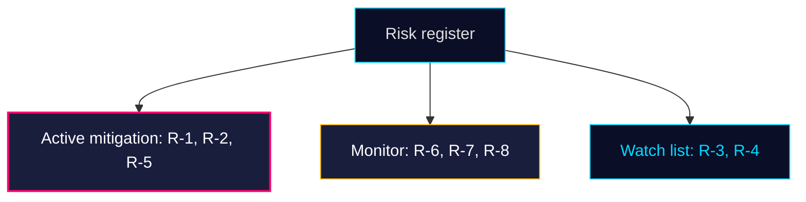

# Risk Assessment — Monthly Review 2026-04-25

**Author**: James Pether Sörling | **Confidence**: HIGH (A1) | **Horizon**: April–September 2026

## 5-dimension risk register

| ID | Dimension | Risk | Likelihood | Impact | Inherent | Mitigation | Residual | Evidence |
|----|-----------|------|------------|--------|----------|------------|----------|----------|
| R-1 | Political | Healthcare wedge fractures coalition on HD01SoU25 financing | MEDIUM | HIGH | HIGH | Treasury-side amendment in autumn budget | MEDIUM | HD01SoU25 + sibling SoU17 [riksdagen.se HD01SoU25] |
| R-2 | Operational | Polismyndigheten kapacitetsbrist försenar HD01JuU10 implementering | HIGH | MEDIUM | HIGH | Allokering i höstbudget; RiR-genomförandeplan | MEDIUM | HD01JuU31 RiR 2026:6 [riksdagen.se HD01JuU31] |
| R-3 | Reputational | Wind-disinfo frame slår tillbaka mot regeringsblock | LOW | MEDIUM | MEDIUM | Energiministerns proaktiva svar | LOW | HD10448 [riksdagen.se HD10448] |
| R-4 | Legal | Konsulärt skydd otillräckligt — Sahabo-fallet | LOW | MEDIUM | MEDIUM | UD-resursförstärkning | LOW | HD11748 [riksdagen.se HD11748] |
| R-5 | Electoral | M+KD+L bloc misslyckas omsätta leverans till stöd före 2026-09-13 | MEDIUM | VERY HIGH | HIGH | Pre-campaign valbudget Q3 | MEDIUM | HD01FiU48 + sibling 04-23 monthly review |
| R-6 | Implementation | Construction-permit reform ger inte mätbar effekt på påbörjade bostäder före val | MEDIUM | MEDIUM | MEDIUM | SCB BO0101 monitoring + tertialuppföljning | MEDIUM | HD01CU24 [riksdagen.se HD01CU24] |
| R-7 | Information | Lönestöd-arbetsmiljö samordningsbrist eskalerar | MEDIUM | MEDIUM | MEDIUM | Tillväxtverket-Arbetsmiljöverket MoU | LOW | HD11747 [riksdagen.se HD11747] |
| R-8 | Rights | V/MP-frame om barn i kriminalvård når mediegenombrott | MEDIUM | MEDIUM | MEDIUM | Skolverket-IVO-kriminalvård gemensamt direktiv | MEDIUM | HD11749 [riksdagen.se HD11749] |

## Heat map (likelihood × impact, residual)

## Top-3 risks expanded

**R-5 (Electoral conversion)**: Most consequential — even with perfect legislative delivery, polling lift is not automatic. Demoskop/SOM lag 4–6 weeks. **Trigger date**: Demoskop 2026-05-08 ± 5 d.

**R-2 (Police capacity)**: RiR 2026:6 names 9 open recommendations; HD01JuU10's effective enforcement depends on closing them. Capacity lag means HD01JuU10's *deterrent* signalling effect is decoupled from operational outcome.

**R-1 (Healthcare wedge)**: HD01SoU25 anhörigstrategi has no dedicated funding line in HD03100 — opposition will exploit. Needs Q3 2026 amendment.

