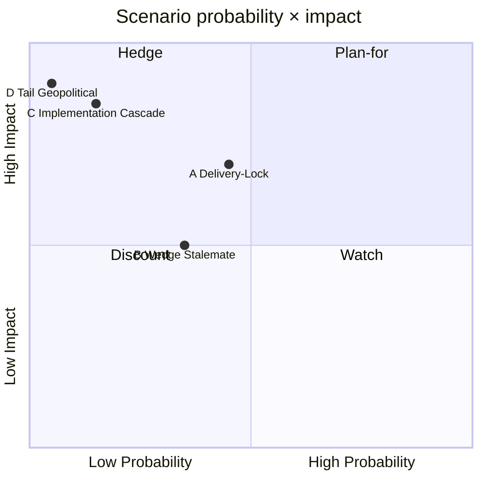

# Scenario Analysis — Monthly Review 2026-04-25

**Author**: James Pether Sörling | **Confidence**: HIGH (A1)
**Method**: Three-scenario cone + sensitivity ladder; 141-day horizon to 2026-09-13

## Baseline anchor

Tidö delivers complete legislative portfolio (HD03100, HD03240, UFöU3, April-24 batch) with HD01FiU48 supermajority capping the fiscal pivot. Implementation pivot (HD01JuU31, HD01SoU25, HD01CU24) is now the binding constraint. Opposition has tactical capture but no legislative reversals.

## Scenario A — *Delivery-Lock* (probability 0.45)

> Tidö converts the legislative completeness into measurable polling lift; Demoskop shows M+KD+L bloc reaching 47% by mid-July; SD holds 18%; S stuck at 25–27%.

- **Drivers**: HD01FiU48 fuel-tax visible in household budgets May–July; HD01JuU10 firearms law Q3 implementation media coverage; HD01SoU25 anhörigstrategi PR offensive.
- **Indicators**: Demoskop 2026-05-08 M+KD+L ≥ 44%; SCB BO0101 påbörjade bostäder Q2 +5% YoY; Brå Q2 brottsstatistik flat or down.
- **Risks**: R-2 (police capacity gap exposed by RiR follow-up); T-3 (disinfo backlash).
- **Evidence base**: HD01FiU48, HD01JuU10, HD01SoU25 [riksdagen.se]
- **Admiralty**: B2

## Scenario B — *Wedge Stalemate* (probability 0.35) — most-likely

> M+KD+L bloc holds 41–43% but does not break above; S resilient at 28–30%; SD 17–19%; September election reverts to coalition-arithmetic uncertainty.

- **Drivers**: S "symbolic opposition + practical support" tactic absorbs HD01FiU48 voting cost; healthcare wedge (R-1) extracts 2–3 ppt from M; SD discipline holds but no SD growth.
- **Indicators**: Demoskop M+KD+L 41–43%; SOM-lag confirms healthcare top-issue; Polismyndigheten reorg announcement deferred.
- **Risks**: T-1 coalition cohesion test on autumn budget; T-4 wedge effectiveness escalation.
- **Evidence base**: HD01SoU25 + HD01SoU17 sibling, HD11749 [riksdagen.se]
- **Admiralty**: B2

## Scenario C — *Implementation Cascade* (probability 0.15)

> RiR 2026:6 follow-up reveals deeper Polismyndigheten dysfunction; Brå Q2 brottsstatistik shows uptick; HD01JuU10's launch is overshadowed by capacity story; SD frustration with Polismyndigheten ledning becomes overt.

- **Drivers**: HD01JuU31 audit findings publicly reanchored to crime statistics; HD11747 work-environment narrative scales.
- **Indicators**: SD-MP off-script statements; Polismyndigheten chefs-bytte; Brå Q2 crime +3% YoY.
- **Risks**: T-1 escalates to active coalition strain; T-2 cascades to other agencies.
- **Evidence base**: HD01JuU31 RiR 2026:6, sibling 2026-04-24 [riksdagen.se HD01JuU31]
- **Admiralty**: C3

## Scenario D — *Tail risk: Geopolitical shock* (probability 0.05)

> Russia/NATO incident or Burundi-style consular escalation reframes campaign mid-cycle; HD11748-class cases multiply.

- **Drivers**: External events outside our window.
- **Evidence**: HD11748 [riksdagen.se HD11748]
- **Admiralty**: C4

## Scenario summary

## Decision implications

| Audience | Plan around | Hedge against |
|----------|-------------|---------------|
| Communicators | Scenario B (most-likely) | Scenario C |
| Investors | Scenario A (delivery-lock) | Scenario C |
| Policy planners | Scenario A → implementation focus | Scenario C |

