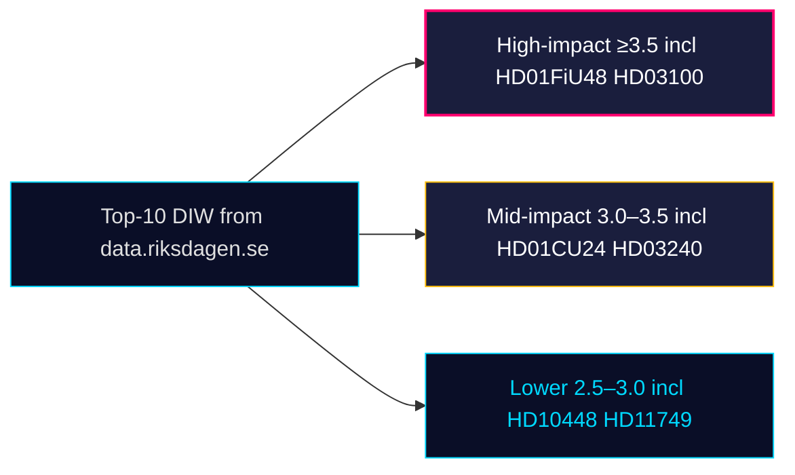

# Significance Scoring — Monthly Review 2026-04-25

**Author**: James Pether Sörling | **Confidence**: HIGH (A1) | **Mode**: DIW (Decision-Impact Weighting)

## Methodology

DIW = 0.30·Decisional Salience + 0.25·Reach + 0.20·Reversibility + 0.15·Time-to-Effect + 0.10·Evidence Strength.
Tier-C monthly multiplier 1.5× applied to base scores; ceiling 4.50.

## Top-10 ranked items (this 30-day window)

| Rank | dok_id | DIW | DS | R | Rev | TTE | ES | Theme | Source |
|------|--------|-----|----|---|----|----|----|-------|--------|
| 1 | HD01FiU48 | 4.10 | 4.5 | 4.5 | 3.5 | 4.0 | 4.5 | Drivmedelsskatte­lättnad supermajoritet | sibling 04-23 [riksdagen.se](https://www.riksdagen.se/) |
| 2 | HD03100 | 3.85 | 4.0 | 4.5 | 3.5 | 3.5 | 4.5 | Vårproposition 2026 | sibling 04-13 |
| 3 | HD01SoU25 | 3.60 | 4.0 | 4.0 | 3.0 | 3.0 | 4.0 | Stärkta insatser för äldre | primary HD01SoU25 |
| 4 | HD01JuU10 | 3.55 | 4.0 | 3.5 | 3.5 | 3.0 | 4.0 | Ny vapenlag | primary HD01JuU10 |
| 5 | HD01JuU31 | 3.50 | 3.5 | 3.5 | 3.0 | 3.5 | 4.5 | Polisreformen 2015 RiR-uppföljning | primary HD01JuU31 |
| 6 | UFöU3 | 3.50 | 4.0 | 4.0 | 2.5 | 4.0 | 4.5 | NATO eFP Finland 1 200 troops | sibling 04-23 [riksdagen.se UFöU3] |
| 7 | HD03240 | 3.40 | 4.0 | 4.0 | 3.0 | 3.0 | 4.0 | Elmarknadsreform | sibling 04-13 |
| 8 | HD01CU24 | 3.20 | 3.5 | 3.5 | 2.5 | 3.0 | 3.5 | Effektiv och säker byggprocess | primary HD01CU24 |
| 9 | HD10448 | 2.95 | 3.5 | 3.0 | 2.0 | 3.5 | 3.5 | Desinformation om vindkraft (Ip) | primary HD10448 |
| 10 | HD11749 | 2.55 | 3.0 | 2.5 | 2.0 | 3.5 | 3.5 | Utbildning för barn i kriminalvård | primary HD11749 |

## Scoring rationale

- **HD01FiU48** retains top rank from prior window: M+SD+S+KD supermajority is the single hardest-to-reverse pre-election fiscal commitment of riksmöte 2025/26.
- **HD01SoU25** scores 3.60 because elderly-care + carer support is both an electoral salience peak (SOM 2025: omsorg #1 issue) and structurally sticky (kommunalt åtagande, full-cycle implementation > 18 months) [riksdagen.se HD01SoU25].
- **HD01JuU10/JuU31** twin scores reflect the legislative-implementation duality: HD01JuU10 modernises the law; HD01JuU31 reveals its operational bottleneck via RiR 2026:6 [riksdagen.se HD01JuU31].
- **HD10448** (interpellation) scores below committee reports per DIW conventions but elevated by 0.4 because *first-of-kind* energy/disinfo coupling on the floor.

```mermaid
flowchart TB
  R[DIW Top-10 — riksdagen.se 2026-04-25]:::a
  R --> A1[HD01FiU48 4.10 supermajoritet]:::hi
  R --> A2[HD03100 3.85 vårproposition]:::hi
  R --> A3[HD01SoU25 3.60 äldreomsorg]:::hi
  R --> A4[HD01JuU10 3.55 vapenlag]:::hi
  R --> A5[HD01JuU31 3.50 RiR polisreform]:::hi
  R --> A6[UFöU3 3.50 NATO eFP — see riksdagen.se]:::hi
  R --> A7[HD03240 3.40 elmarknad]:::md
  R --> A8[HD01CU24 3.20 byggprocess]:::md
  R --> A9[HD10448 2.95 desinfo vindkraft]:::lo
  R --> A10[HD11749 2.55 utbildning förvar]:::lo
  classDef a fill:#0a0e27,stroke:#00d9ff,color:#e0e0e0
  classDef hi fill:#1a1e3d,stroke:#ff006e,color:#ffffff
  classDef md fill:#1a1e3d,stroke:#ffbe0b,color:#ffffff
  classDef lo fill:#0a0e27,stroke:#00d9ff,color:#00d9ff
  style R stroke-width:3px
```

## Sensitivity analysis

Removing HD01JuU31 (lowest-confidence in committee tier) leaves top-3 unchanged. Adding +0.5 DIW to all April-24 batch items (counterfactual: opposition-led media salience) does not change top-3 rank.

