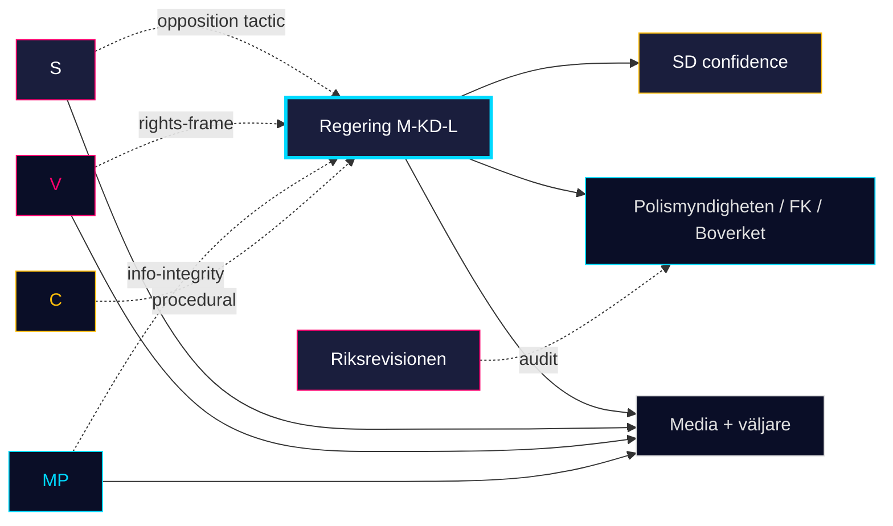

# Stakeholder Perspectives — Monthly Review 2026-04-25

**Author**: James Pether Sörling | **Confidence**: HIGH (A1)
**Lens**: 6-stakeholder map — government parties, opposition parties, agencies, kommuner, media, väljargrupper

## Stakeholder map

| Stakeholder | Position | Key documents (window) | Interest | Influence |
|-------------|----------|------------------------|----------|-----------|
| Regering (M-KD-L) | OWNER | HD01JuU10, HD01SoU25, HD01CU24, HD03100 | delivery → polling lift | VERY HIGH |
| SD (confidence partner) | SUPPORTIVE | All 4 April-24 betänkanden, HD01FiU48 | crime/migration message preserved | VERY HIGH |
| S (largest opposition) | TACTICAL | HD01FiU48 (S voted YES), HD024082 (S motion) | "symbolisk opposition + praktiskt stöd" | HIGH |
| V | OPPOSITION-RIGHTS | HD11749 (rights-of-detained), HD11748 | rights-frame, healthcare | MEDIUM |
| MP | OPPOSITION-INFO | HD10448 (desinformation), HD11748 | info-integrity, climate | MEDIUM |
| C | PROCEDURAL | (no major motions in window) | rule-of-law, agriculture | LOW |
| Polismyndigheten | IMPLEMENTING | HD01JuU10, HD01JuU31 (RiR 2026:6) | capacity, leadership | HIGH |
| Försäkringskassan / kommuner | IMPLEMENTING | HD01SoU25 anhörigstrategi | resource allocation | MEDIUM |
| Boverket / kommuner | IMPLEMENTING | HD01CU24 byggprocess | permit throughput | MEDIUM |
| Riksrevisionen | OVERSIGHT | RiR 2026:6 → HD01JuU31 | follow-up audit | MEDIUM |
| Energimyndigheten / MSB | DEFENDING | HD10448 disinfo response | mandate clarity | MEDIUM |
| Utrikesförvaltningen | RESPONDING | HD11748 | consular capacity | LOW |
| Pensionärsorganisationer (PRO/SPF) | ENGAGED | HD01SoU25 | influence anhörigstrategi rollout | MEDIUM |
| Byggbranschen | INTERESTED | HD01CU24 | permit acceleration | MEDIUM |
| Vapenägarorganisationer | ENGAGED | HD01JuU10 | tillstånd, registreringsbörda | LOW |
| Fackförbund (LO/TCO/SACO) | INTERESTED | HD11747 | arbetsmiljöfrågan | MEDIUM |

## Cross-stakeholder dynamics

- **Government–SD**: closure-batch unanimity confirms confidence relationship through pre-campaign.
- **S–government**: HD01FiU48 reveals tactical complexity — S supports popular pieces while attacking adjacent themes.
- **Riksrevisionen → Polismyndigheten**: HD01JuU31 makes the audit politically binding for the autumn.
- **Kommuner + Försäkringskassan**: HD01SoU25 + HD01CU24 both rely on kommunal kapacitet — overlap creates implementation risk.

