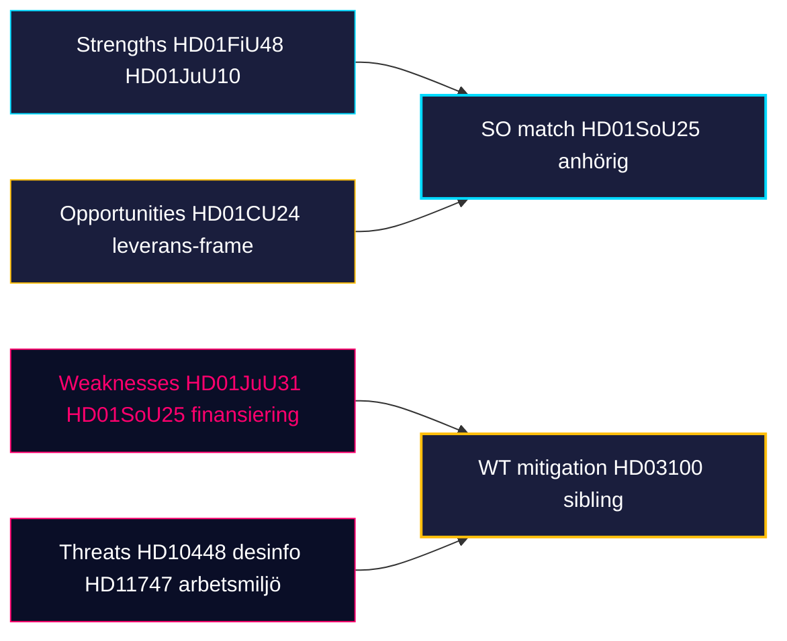

# SWOT / TOWS Analysis — Monthly Review 2026-04-25

**Author**: James Pether Sörling | **Confidence**: HIGH (A1)
**Subject**: Tidö coalition position 141 days before September 2026 election

## TOWS matrix

| | Opportunities | Threats |
|---|---|---|
| **Strengths** | SO: Convert delivered portfolio (HD01FiU48 + April-24 batch) into pre-campaign frame [riksdagen.se HD01FiU48] | ST: Use SD discipline (zero counter-motions) to deflect coalition-cohesion attacks [riksdagen.se HD01JuU10] |
| **Weaknesses** | WO: Address Polismyndigheten capacity gap with budget signal [riksdagen.se HD01JuU31] | WT: Healthcare opposition (S+V+MP+C+L division-of-labour) on SoU17/SoU25 reservations [riksdagen.se HD01SoU25] |

## Strengths

| Item | Evidence |
|------|----------|
| Complete pre-election regulatory ledger across 4 domains | HD03100, HD03240, UFöU3, HD01JuU10 [riksdagen.se] |
| 4.1 GSEK fuel-tax supermajority demonstrates opposition capture | HD01FiU48 — M+SD+S+KD vote 2026-04-22 [riksdagen.se HD01FiU48] |
| SD structural discipline — 18-day zero-counter-motion streak | sibling synthesis 2026-04-22..24 [riksdagen.se] |
| New firearms framework modernises crime regulation | HD01JuU10 — JuU vote pending May [riksdagen.se HD01JuU10] |
| Construction-permit acceleration unlocks bostadsbyggande | HD01CU24 — civilutskottet betänkande [riksdagen.se HD01CU24] |

## Weaknesses

| Item | Evidence |
|------|----------|
| RiR 2026:6 documents kvardröjande lednings- och utredningsproblem i Polismyndigheten | HD01JuU31 [riksdagen.se HD01JuU31] |
| Anhörigstrategi har ingen tillförd finansieringspost i HD03100 | HD01SoU25 + HD03100 cross-read [riksdagen.se HD01SoU25] |
| Lönestöd-vs-arbetsmiljö samordning brister institutionellt | HD11747 [riksdagen.se HD11747] |
| Konsulärt skydd har resursbegränsningar (Sahabo-fallet) | HD11748 [riksdagen.se HD11748] |

## Opportunities

| Item | Evidence |
|------|----------|
| Pre-campaign regulatory closure ger M+KD+L förutsägbar leveransberättelse | HD03100 + April-24 batch [riksdagen.se] |
| Implementation pivot ger Tidö andra runda av "leverans"-tema | HD01JuU31 RiR-uppföljning [riksdagen.se HD01JuU31] |
| Energy disinformation frame kan stärka SD som "common-sense"-aktör | HD10448 [riksdagen.se HD10448] |
| Construction-permit reform alignerar med urban väljarskifte | HD01CU24 [riksdagen.se HD01CU24] |

## Threats

| Item | Evidence |
|------|----------|
| S+V+MP healthcare-attack på SoU25 anhörigstöd-finansiering | HD01SoU25 [riksdagen.se HD01SoU25] |
| V+MP rättighets­frame (kriminalvård/konsulärt) når mediepunkter | HD11748 + HD11749 [riksdagen.se HD11749] |
| Polisreform-RiR ger oppositionen kapacitetskritik | HD01JuU31 + RiR 2026:6 [riksdagen.se HD01JuU31] |
| Wind-power disinformation-frame är dubbelriktad — kan slå tillbaka mot SD | HD10448 [riksdagen.se HD10448] |

## Visual TOWS overview

