# Synthesis Summary — Monthly Review 2026-04-25

**Author**: James Pether Sörling · **Confidence**: HIGH (A1) · **Mode**: Tier-C monthly aggregation
**Window**: 2026-03-26 → 2026-04-25 (30 days) · **Riksmöte**: 2025/26
**Admiralty range**: A1–C3 · **WEP language**: "highly likely" / "likely" / "possible" / "unlikely" per Kent Scale
**Documents analysed**: 8 primary (April 24 closure batch) + 13 sibling synthesis references in window
**Days to Election 2026**: 141 (target 2026-09-13)

## Lead story (decision-grade)

> The 30-day window 2026-03-26 → 2026-04-25 closes Sweden's **most consequential pre-election parliamentary month** of riksmöte 2025/26. The Kristersson government has now legislated the entirety of its declared 2025/26 portfolio across four domains: **fiscal pivot** (HD03100 spring proposition + HD0399 spring-amending budget + HD01FiU48 emergency fuel-tax relief, the latter passing 2026-04-22 with an extraordinary M+SD+**S**+KD supermajority), **energy transformation triptych** (HD03240 / HD03238 / HD03239), **security and defence cluster** (UFöU3 NATO eFP Finland deployment + HD03214 cybersecurity centre + HD03228 war-materiel reform), and the **April 24 closure batch** of four committee reports — HD01JuU10 (ny vapenlag), HD01JuU31 (Polisreformen 2015 RiR-uppföljning), HD01SoU25 (äldreomsorg + anhörigstöd), HD01CU24 (effektiv och säker byggprocess). The opposition's parliamentary firepower in the closing week (HD10448 wind-power desinformation; HD11747 lönestöd vs arbetsmiljö; HD11748 Sahabo/Burundi; HD11749 children's right to schooling in custody) signals a clean S–V–MP division of labour entering the 18-week pre-campaign. SD continues to file **zero counter-motions** against open government bills — an 18-day structural-confidence streak.

## DIW-weighted ranking (top 10, this window)

| Rank | dok_id | Type | DIW | Theme | Admiralty | Source |
|------|--------|------|-----|-------|-----------|--------|
| 1 | HD01FiU48 | Bet | 4.10 | Drivmedelsskatte­lättnad — fiscal-electoral supermajoritet | A1 | sibling 04-22 |
| 2 | HD03100 | Prop | 3.85 | Vårproposition — pre-election fiscal frame | A1 | sibling 04-13 |
| 3 | HD01SoU25 | Bet | 3.60 | Äldreomsorg + anhörigstöd | A2 | primary 2026-04-24 ([riksdagen.se](https://www.riksdagen.se/sv/dokument-och-lagar/dokument/HD01SoU25/)) |
| 4 | HD01JuU10 | Bet | 3.55 | Ny vapenlag | A2 | primary 2026-04-24 ([riksdagen.se](https://www.riksdagen.se/sv/dokument-och-lagar/dokument/HD01JuU10/)) |
| 5 | HD01JuU31 | Bet | 3.50 | Polisreformen 2015 — RiR 2026:6 uppföljning | A2 | primary 2026-04-24 ([riksdagen.se](https://www.riksdagen.se/sv/dokument-och-lagar/dokument/HD01JuU31/)) |
| 6 | UFöU3 | Bet | 3.50 | NATO eFP Finland 1 200 troops | A1 | sibling 04-23 |
| 7 | HD03240 | Prop | 3.40 | Elmarknadsreform | A1 | sibling 04-13 |
| 8 | HD01CU24 | Bet | 3.20 | Effektiv och säker byggprocess | B2 | primary 2026-04-24 ([riksdagen.se](https://www.riksdagen.se/sv/dokument-och-lagar/dokument/HD01CU24/)) |
| 9 | HD10448 | Ip | 2.95 | Desinformation om vindkraft | B2 | primary 2026-04-24 |
| 10 | HD03252 | Prop | 2.90 | Detainee benefit restriction | B2 | sibling 04-24 |

**Sensitivity**: Under ±1 DIW tier perturbation the top-3 set is robust. HD01SoU25 ↔ HD01JuU10 swap order possible if pre-campaign issue salience tilts crime-ward; HD01JuU31's *implementation* weight (Polismyndigheten capacity) gives it the largest forward-leverage among the April-24 batch.

## Integrated intelligence picture

### Thematic convergence — five threads

1. **Fiscal-electoral pivot** (HD03100, HD0399, HD01FiU48). The 4.1 GSEK fuel-tax-relief vote (M+SD+S+KD) on 2026-04-22 is the political signature of the month: S's inability to oppose direct household relief 141 days before the election is the single largest *measured* opposition constraint of the riksmöte.
2. **Energy transformation** (HD03240 + HD03238 + HD03239). The triptych passes by April 13–22; the April-24 wind-power disinformation interpellation (HD10448) is *post hoc* opposition counter-framing, not legislative obstruction.
3. **Security / defence** (UFöU3, HD03214, HD03228). NATO eFP Finland deployment is in motion; Sweden's post-membership legislative scaffolding is now substantially complete.
4. **Criminal-justice / welfare closure** — *the April-24 batch*. HD01JuU10 (vapenlag) + HD01JuU31 (RiR-uppföljning) modernise crime regulation; HD01SoU25 strengthens elderly-care delivery; HD01CU24 reduces handling time in construction permitting. Together they fill the pre-election regulatory ledger.
5. **Opposition wedge architecture** — S/V/MP three-track. Economic (HD024082, HD10447), environmental-information (HD10448), rights-of-detained / consular (HD11748, HD11749). C remains procedural-only.

### Cross-type signals (Tier-C synthesis)

- **Prop → Motion → Bet → Ip pipeline** is fully visible across the window: HD03100/0399 (fiscal prop) → HD024082 (S counter-motion) → HD01FiU48 (committee → vote) → HD10447 (S interpellation on SME sjuklön).
- **Implementation pivot** is the dominant new trend: HD01JuU31 (RiR Polisreformen) recasts criminal-justice debate from *legislation* to *capacity*; HD11747 (lönestöd vs farlig arbetsmiljö) raises the same theme on labour side.
- **SD structural discipline**: 18 consecutive sitting days with zero counter-motions on government bills (data: sibling synthesis files 04-22 → 04-24).

```mermaid
flowchart TB
  subgraph Fiscal
    F1[HD03100 Vårprop]:::a --> F2[HD0399 ändringsbudget]:::a --> F3[HD01FiU48 supermajoritet]:::b
  end
  subgraph Energy
    E1[HD03240 elmarknadsreform]:::a --> E2[HD03238 prövningsmyndighet]:::a --> E3[HD03239 vindkraft kommunersättning]:::a
    E3 -.opposition counter-frame.-> E4[HD10448 desinformation Ip]:::c
  end
  subgraph Crim/Welfare
    C1[HD01JuU10 vapenlag]:::b --> C2[HD01JuU31 Polisreform-uppföljning]:::b
    C2 --> C3[HD11749 utbildning i kriminalvård Fr]:::c
    W1[HD01SoU25 äldreomsorg]:::b --> W2[HD11747 lönestöd vs arbetsmiljö Fr]:::c
  end
  subgraph Foreign
    G1[UFöU3 NATO eFP]:::a --> G2[HD11748 Sahabo Burundi Fr]:::c
  end
  classDef a fill:#0a0e27,stroke:#00d9ff,color:#e0e0e0
  classDef b fill:#1a1e3d,stroke:#ffbe0b,color:#ffffff
  classDef c fill:#1a1e3d,stroke:#ff006e,color:#ffffff
  style F3 stroke-width:3px
```

## Confidence statement

Overall analytic confidence is **HIGH (A1)** for the structural picture (delivery complete, opposition wedge taxonomy stable, SD discipline visible). Confidence is **MEDIUM (B2)** for forward-poll dynamics (single-source dependence on Demoskop / SOM-lag) and for the precise *implementation* trajectory of HD01JuU31 (RiR 2026:6 contains 9 open recommendations, none yet closed).

## Open PIRs carried forward

- **PIR-1**: Will the M+KD+L bloc convert HD01FiU48 to durable polling lift by 2026-06-01? (carried from 2026-04-23 monthly review)
- **PIR-2**: Does HD01JuU31's audit produce a Polismyndigheten reorganisation announcement before 2026-08-31?
- **PIR-3**: Will SD's zero-counter-motion discipline survive the September manifesto launch window?

