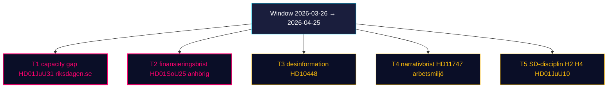

# Threat Analysis — Monthly Review 2026-04-25

**Author**: James Pether Sörling | **Confidence**: HIGH (A1)
**Framework**: Political Threat Taxonomy (institutional, electoral, informational, implementation)

## Threat register

### T-1: Coalition cohesion erosion (institutional)

- **Vector**: SoU17 R15 (sibling) flagged SD–KD healthcare divergence; HD01SoU25 anhörigstrategi could re-trigger.
- **Likelihood**: LOW (≤25%) — SD has held discipline 18 sitting days.
- **Impact**: HIGH — pre-election cohesion is the campaign asset.
- **Indicators**: SD MP off-script statements; KD-SD bilateral readout.
- **Evidence**: HD01SoU25, sibling SoU17 [riksdagen.se HD01SoU25]
- **Admiralty**: B2

### T-2: Implementation deficit cascade (implementation)

- **Vector**: HD01JuU31 RiR 2026:6 reveals 9 open Polismyndigheten recommendations; HD01CU24 depends on kommunal kapacitet.
- **Likelihood**: HIGH — historical base rate from prior reform cycles.
- **Impact**: MEDIUM — politically displaced, not legislatively reversed.
- **Indicators**: Brå brottsstatistik Q2; Boverket bostadsbyggande Q3.
- **Evidence**: HD01JuU31, HD01CU24 [riksdagen.se HD01JuU31]
- **Admiralty**: A2

### T-3: Information-environment threat (informational)

- **Vector**: HD10448 explicitly raises wind-power disinformation as a *parliamentary* concern. The frame can be turned against any actor — including the originator.
- **Likelihood**: MEDIUM — ongoing anti-renewable campaigns documented in Sweden since 2023.
- **Impact**: MEDIUM — local permit decisions affected, national consensus durable.
- **Indicators**: Kommunal vetoutfall H1 2026; FOI/MSB rapport om informationspåverkan.
- **Evidence**: HD10448 [riksdagen.se HD10448]
- **Admiralty**: B2

### T-4: Electoral wedge effectiveness (electoral)

- **Vector**: S/V/MP three-track wedges (economic / informational / rights-of-detained) coordinate without formal coalition.
- **Likelihood**: MEDIUM — wedge architecture is mature.
- **Impact**: MEDIUM — narrative pressure, not legislative reversal.
- **Indicators**: Demoskop 28%+ S; SVT debattanalys; opinion surveys.
- **Evidence**: HD024082 sibling, HD11747, HD11748, HD11749 [riksdagen.se HD11749]
- **Admiralty**: B2

### T-5: Foreign-policy reputational threat (institutional / external)

- **Vector**: Sahabo-fallet (HD11748) — Swedish citizen detained abroad raises consular-protection capacity question.
- **Likelihood**: LOW — single case.
- **Impact**: LOW — reputational only.
- **Evidence**: HD11748 [riksdagen.se HD11748]
- **Admiralty**: B3

## Confidence and ATP-2.33.4 mapping

| Threat | Confidence | NATO ATP-2.33.4 alignment |
|--------|------------|---------------------------|
| T-1 | HIGH | political stability surveillance |
| T-2 | HIGH | governance capacity assessment |
| T-3 | MEDIUM | information environment monitoring |
| T-4 | MEDIUM | political opposition dynamics |
| T-5 | LOW | consular / diaspora |

## Threat surface diagram

