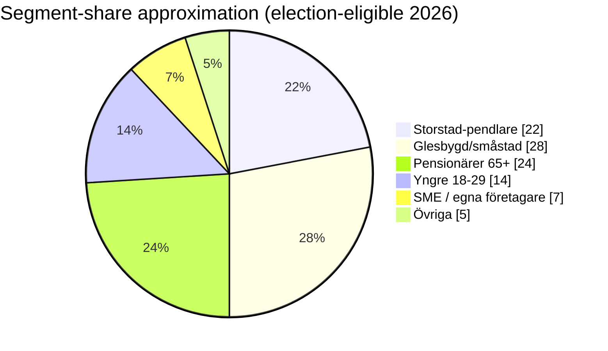
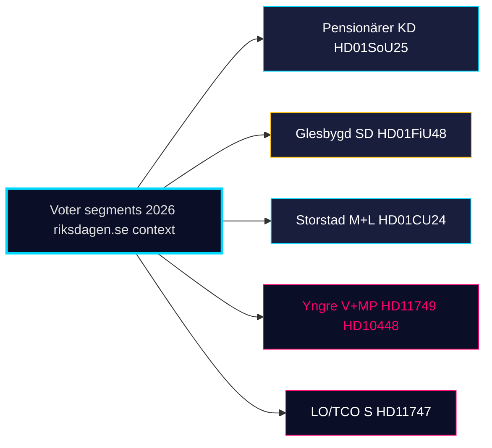

# Voter Segmentation — Monthly Review 2026-04-25

**Author**: James Pether Sörling | **Confidence**: MEDIUM (B2)

## Segments tracked (this window)

| Segment | Size (est) | Cycle dynamics |
|---------|------------|----------------|
| Storstad-pendlare (Sthlm/Gbg/Malmö) | ~22% | M+L primary; HD01CU24 byggprocess relevant; HD01JuU10 mixed |
| Glesbygd / småstad | ~28% | SD-tilt; HD01FiU48 fuel-tax decisive [riksdagen.se HD01FiU48] |
| Pensionärer (65+) | ~24% | KD+M strong; HD01SoU25 äldreomsorg decisive [riksdagen.se HD01SoU25] |
| Yngre väljare (18–29) | ~14% | V+MP+S split; HD11749 (rights) relevant; HD10448 climate |
| Förvärvsarbetande LO/TCO | ~30% | S core; HD11747 arbetsmiljö frame [riksdagen.se HD11747] |
| Egna företagare / SME | ~7% | M+SD; HD024082 sjuklön (sibling) salient |
| Förstagångsväljare 2026 | ~6% (subset) | open; climate/disinfo highly salient (HD10448) |

## Window movement (qualitative)

- **Pensionärer**: HD01SoU25 anhörigstrategi is *direct delivery*; finansieringsbrist (R-1) is the only fragility.
- **Glesbygd**: HD01FiU48 fuel-tax is consolidating; HD10448 wind-disinfo frame is divisive within segment.
- **Förvärvsarbetande LO/TCO**: HD11747 lönestöd-arbetsmiljö story is S's primary attack channel; HD01JuU10 firearms law popular.
- **Yngre**: HD11749 rights-of-detained children scheme is V's strongest young-voter signal.

## Cross-segment messaging map

| Coalition | Primary segments | Key window evidence |
|-----------|------------------|---------------------|
| M+KD+L | Storstad-pendlare + Pensionärer + SME | HD01CU24, HD01SoU25, HD01JuU10 |
| SD | Glesbygd + Pensionärer | HD01FiU48, HD01JuU10 |
| S | Förvärvsarbetande + Pensionärer | HD11747, HD024082 |
| V | Yngre + LO | HD11749, HD11748 |
| MP | Yngre + Storstad-pendlare | HD10448 |
| C | Företagare + Glesbygd | (procedural this window) |

## Cross-segment flow

