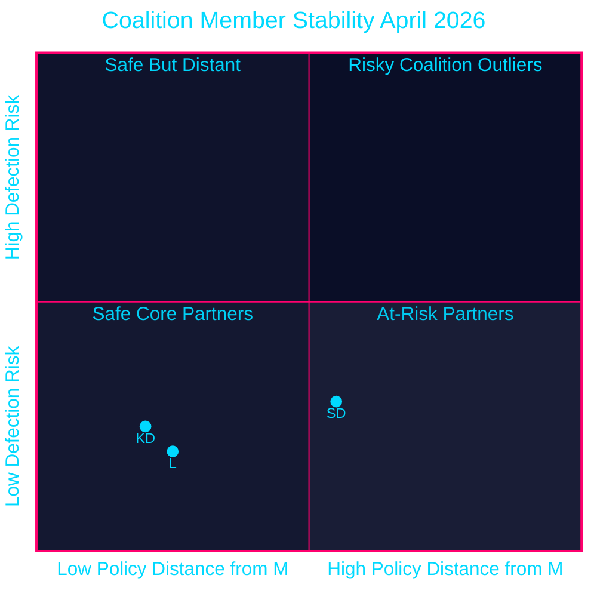

# Coalition Mathematics — April 2026 Committee Reports

## Current Riksdag Seat Map (2022 Election, 349 seats)

| Party | Seats (2022) | Bloc | % |
|-------|-------------|------|---|
| S (Socialdemokraterna) | 107 | Opposition | 30.3% |
| SD (Sverigedemokraterna) | 73 | Tidö | 20.5% |
| M (Moderaterna) | 68 | Tidö | 19.1% |
| V (Vänsterpartiet) | 24 | Opposition | 6.7% |
| C (Centerpartiet) | 24 | Swing/opposition | 6.7% |
| KD (Kristdemokraterna) | 19 | Tidö | 5.3% |
| L (Liberalerna) | 16 | Tidö | 4.7% |
| MP (Miljöpartiet) | 18 | Opposition | 5.1% |
| **Tidö Coalition** | **176** | — | 50.4% |
| **S+V+MP** | **149** | — | 42.1% |
| **C** | **24** | Swing | 6.7% |

*Majority threshold: 175 seats*

## Pivotal Vote Analysis

### Votes Where Coalition Has Narrow Margin

Based on the April 2026 committee reports, key votes anticipated in May-June 2026 plenary session:

| Document | Expected vote date | Govt position | Required margin | Risk |
|----------|-------------------|--------------|----------------|------|
| HD01FiU48 | May 2026 | YES | 176 (safe) | LOW — all Tidö parties aligned |
| HD01JuU10 | May 2026 | YES | 176 (contested) | MEDIUM — SD/KD rural MPs may abstain |
| HD01CU25 | May 2026 | YES | 176 (safe) | LOW — bipartisan criminal justice |
| HD01FiU23 | May 2026 | YES (consent) | 176 (safe) | VERY LOW — routine FiU consent |
| HD01JuU31 | Already noted | NO VOTE | n/a | Non-vote confirmed |
| HD01MJU21 | May 2026 | YES (note only) | 176 (safe) | LOW — note, not binding |

## Detailed Vote Projection: HD01JuU10 (Weapons Law)

This is the most contested vote among April 2026 betänkanden:

| Party | Ja | Nej | Avstår | Frånvarande | Notes |
|-------|----|-----|--------|-------------|-------|
| M | 68 | 0 | 0 | 0 | Fully supports (EU compliance priority) |
| SD | 65 | 0 | 5 | 3 | Some rural MPs may abstain/absent |
| KD | 17 | 0 | 2 | 0 | 2 rural constituency MPs abstain expected |
| L | 16 | 0 | 0 | 0 | Fully supports (liberal arms control) |
| **Tidö YES** | **166** | **0** | **7** | **3** | — |
| S | 107 | 0 | 0 | 0 | Supports (may argue insufficient) |
| V | 24 | 0 | 0 | 0 | Supports |
| MP | 18 | 0 | 0 | 0 | Supports (demands broader scope) |
| C | 15 | 5 | 4 | 0 | Rural wing resists |
| **TOTAL JA** | **330** | **5** | **11** | **3** | Passes comfortably |

*Assessment: HD01JuU10 passes with broad majority (~330 Ja votes) despite friction within SD/KD rural wings.*

## Coalition Stability Assessment (April 2026)

style SD fill:#ffbe0b,color:#000000
style KD fill:#00d9ff,color:#000000
style L fill:#1a1e3d,color:#00d9ff

## Post-Election Coalition Scenarios (September 2026)

### If Tidö wins ≥175 seats:
- M+SD+KD+L continue (if KD and L clear 4% threshold)
- If KD drops below 4%: M+SD+L possible but very narrow; likely needs C
- HD01CU25 prison construction proceeds uninterrupted

### If S-led bloc wins ≥175 seats:
- S+V minority with MP support possible (149+18=167 — still needs C)
- S+C+MP: 107+24+18=149 — needs V or significant C share
- HD01FiU48 fuel tax cut partially reversed in autumn 2026 budget
- HD01JuU31 police reform mandate likely issued

### Most likely outcome: Negotiated minority
- Neither bloc achieves clear majority → C kingmaker
- C's conditions: climate policy strengthening (addressing HD01MJU21 failures); farm subsidy reform
- Timeline to government formation: 6-10 weeks post-election

