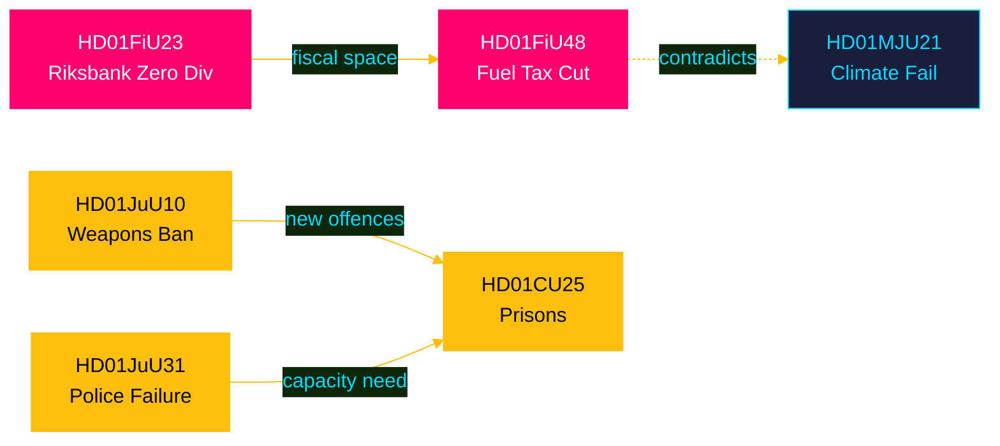

# Cross-Reference Map — April 2026 Committee Reports

## Policy Clusters

### Cluster 1: Security-Infrastructure Complex
- **HD01JuU10** → weapons ban feeds into **HD01CU25** (prison capacity must absorb new offences)
- **HD01CU25** → direct capacity response to **HD01JuU31** (police reform failure means prosecution pipeline needs carceral space)
- **HD01JuU31** → institutional failure documented by Riksrevisionen; feeds into electoral narrative linking all three

```
HD01JuU10 (weapons) → HD01CU25 (prisons) ← HD01JuU31 (police failure)
                              ↑
                        Security narrative cluster
```

### Cluster 2: Fiscal Policy Stack
- **HD01FiU48** (extra budget, 4.1B SEK) → macroeconomic context set by **HD01FiU23** (Riksbank profit retained, 5.3B SEK)
- FiU48 spending offset partially by FiU23 retained profit (zero state dividend = FiU48 fiscal space)
- Both documents processed by Finansutskottet; same budget cycle

```
HD01FiU23 (Riksbank zero dividend) → fiscal headroom → HD01FiU48 (4.1B SEK emergency budget)
```

### Cluster 3: Climate-Energy Contradiction
- **HD01FiU48** (fuel tax cut) directly contradicts **HD01MJU21** (agricultural climate steering ineffective)
- Both reveal same structural tension: short-term cost-of-living relief vs long-term climate commitments
- Electoral dimension: government chose cost-of-living in election year

```
HD01MJU21 (climate failure) ←CONTRADICTION→ HD01FiU48 (fuel tax cut)
```

### Cluster 4: Labour and Social Reforms
- **HD01SoU25** (elder care) + **HD01AU15** (ILO violence convention) + **HD01SfU23** (researcher visas)
- Cross-cutting theme: labour rights and welfare state maintenance
- All three are moderate incremental reforms with bipartisan support

## Legislative Chain Analysis

### Fast-Track Chain (High Priority, Short Timeline)
1. HD01FiU48 → Royal Assent → May 2026 (fuel relief effective June 2026)
2. HD01JuU10 → Royal Assent → Semi-auto ban effective June 2026
3. HD01CU29 → Building permits for EV charging → ongoing

### Medium-Term Chain (2026-2027)
1. HD01CU25 → Prison construction begins 2027 → capacity 2028-2030
2. HD01SfU23 → New researcher visa framework operational
3. HD01SoU25 → Elder care implementation via municipalities

### Long-Term Structural Chain
1. HD01MJU21 → Requires new government steering strategy (not yet commenced)
2. HD01JuU31 → Requires police reform Stage 2 (government has not announced)

## Cross-Committee References

| Source Committee | Target Committee | Issue |
|-----------------|-----------------|-------|
| FiU (HD01FiU48) | JuU | Emergency budget includes justice funding |
| JuU (HD01CU25) | FiU | Prison construction fiscal implications |
| MJU (HD01MJU21) | FiU | CAP subsidy reform fiscal implications |
| JuU (HD01JuU10) | EU/FiU | Firearms Directive compliance costs |

## Mermaid Cross-Reference Overview



